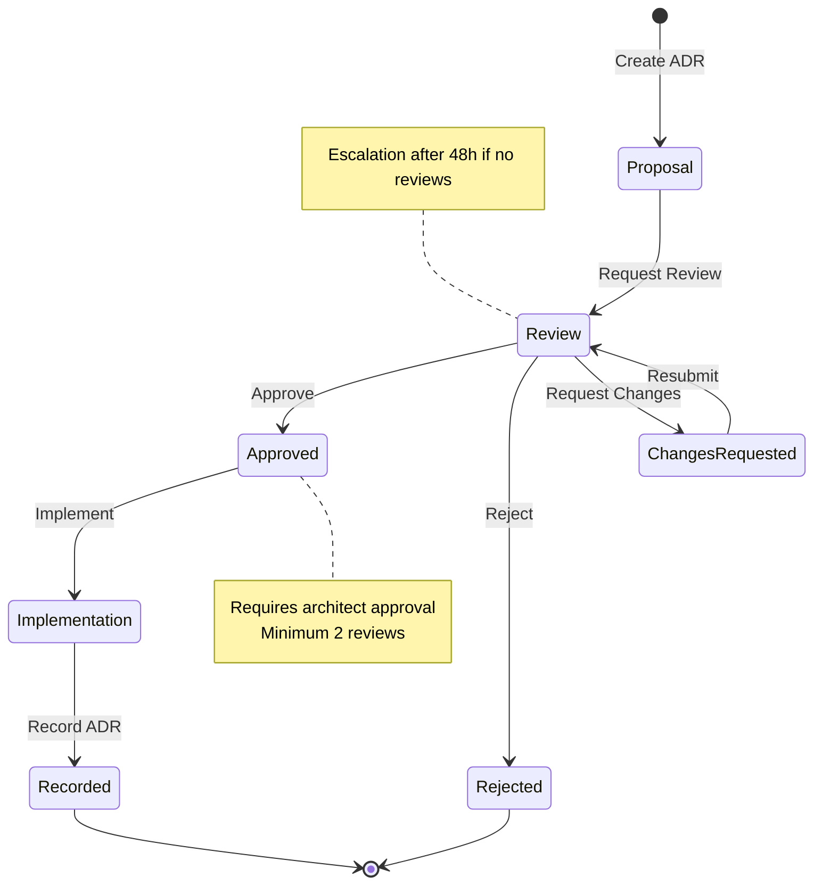
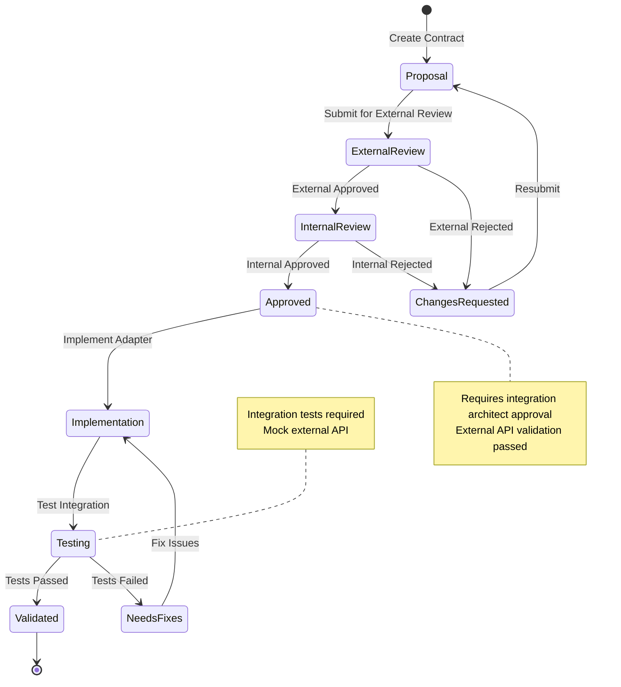
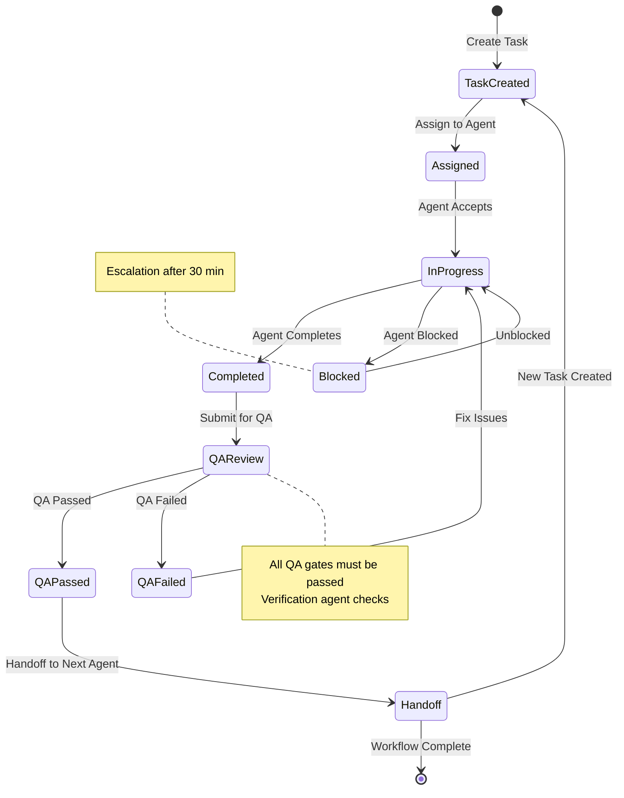
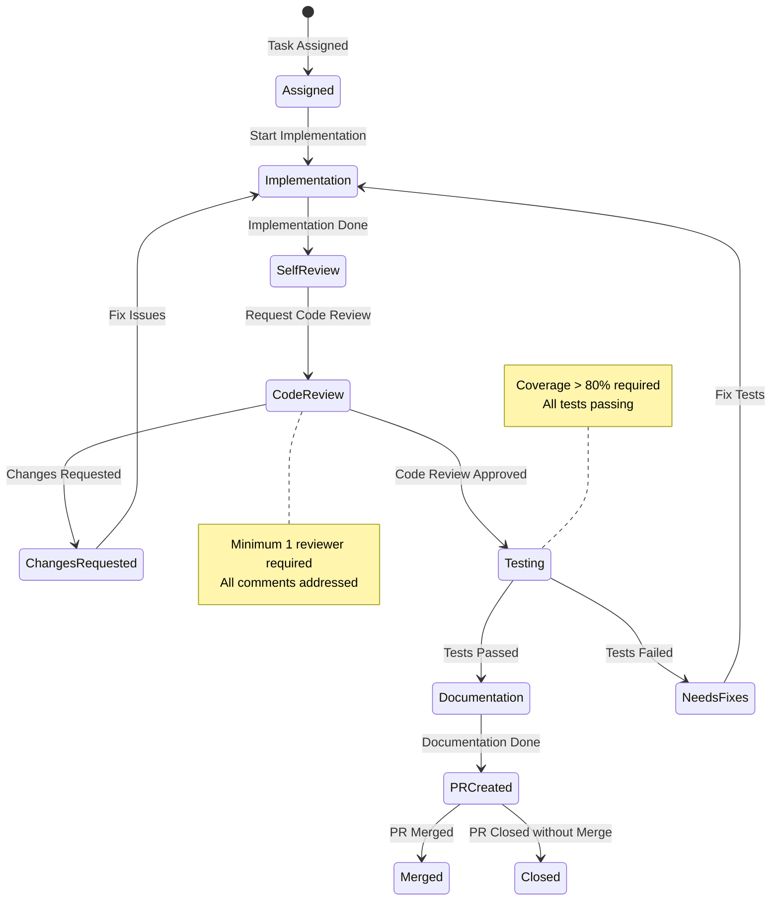

# Workflow Architect - Handoff контракты

## Обзор

Handoff контракты определяют правила передачи workflow specifications между workflow-architect и другими агентами, включая входные требования, ожидаемые результаты, триггеры передачи и критерии отклонения.

## Общие принципы handoff

### Правила передачи
1. Все state machine diagrams созданы
2. Все состояния и переходы определены
3. Handoff contracts созданы
4. Escalation paths определены
5. Approval gates спроектированы
6. Документация полная и понятная

### Формат передачи
Стандартный формат handoff:

```markdown
## Handoff: [Название workflow]

**От**: workflow-architect
**Кому**: [имя агента]

**Что было спроектировано**:
- [ ] State machine diagram
- [ ] Описание состояний
- [ ] Описание переходов
- [ ] Handoff contracts
- [ ] Escalation paths
- [ ] Approval gates

**Артефакты**:
- [ ] Workflow specification: [ссылка или содержание]
- [ ] Mermaid diagrams: [ссылка или содержание]
- [ ] Handoff contracts: [ссылка или содержание]
- [ ] Escalation paths: [ссылка или содержание]

**Контекст**:
- Связанные workflows: [названия]
- Зависимости: [описание]
- Важные решения: [краткое описание]

**Следующие шаги**:
1. [Шаг 1]
2. [Шаг 2]

**QA Gate**: [Что нужно проверить]
**Дедлайн**: [Дата]
```

## Workflow Architect → Platform Architect

### Входные требования для Workflow Architect от Platform Architect

**Что получает workflow-architect**:
- Требования к архитектуре системы
- Описания архитектурных компонентов
- ADR (Architecture Decision Records)
- Требования к процессам архитектуры

**Пример**:
```markdown
## Задача для Workflow Architect

**Тип**: Проектирование workflow для архитектуры
**Описание**: Спроектировать workflow для архитектурных решений

**Требования**:
- Workflow должен покрывать весь lifecycle ADR
- Учет всех этапов: proposal, review, approval, implementation
- Multi-level approval для critical решений
- Escalation paths для конфликтов

**ADR Process**:
- Proposal: Любой может предложить ADR
- Review: Minimum 2 reviewers
- Approval: Architect approval required
- Implementation: После approval
- Record: Запись в docs/adr/

**Контекст**:
- Связанные документы: docs/adr/template.md
- Существующие workflows: PR workflow
- Участники: architects, developers, reviewers
```

### Ожидаемые выходные данные от Workflow Architect для Platform Architect

**Что должен создать workflow-architect**:
- State machine diagram для ADR process
- Описание состояний ADR (proposal, review, approved, rejected, implemented)
- Описание переходов между состояниями
- Handoff contracts между этапами ADR process
- Escalation paths для конфликтов архитекторов
- Approval gates для critical ADRs

**Пример**:
```markdown
## Результат проектирования

**State Machine Diagram**:


**Состояния**:
- Proposal: ADR предложен, ожидает review
- Review: ADR на review, reviewers assigned
- Approved: ADR approved, готов к implementation
- Rejected: ADR отклонен
- ChangesRequested: Требуются изменения
- Implementation: ADR реализуется
- Recorded: ADR записан в docs/adr/

**Переходы**:
- Proposal → Review: Request Review
- Review → Approved: Approve (min 2 approvals)
- Review → Rejected: Reject (critical issues)
- Review → ChangesRequested: Request Changes
- ChangesRequested → Review: Resubmit
- Approved → Implementation: Implement
- Implementation → Recorded: Record ADR

**Escalation Paths**:
- No reviews > 48h: Escalate to lead architect
- Conflict between reviewers: Escalate to architect council
- Implementation blocked > 72h: Escalate to architect

**Approval Gates**:
- Gate 1 (Review): Minimum 2 reviewers assigned
- Gate 2 (Approved): Architect approval required
- Gate 3 (Critical ADR): Architect council approval
```

### Триггеры передачи от Workflow Architect к Platform Architect

Когда workflow-architect передает workflow:
- State machine diagram создан
- Все состояния определены
- Все переходы определены
- Handoff contracts созданы
- Escalation paths спроектированы
- Approval gates определены

### Критерии отклонения от Workflow Architect к Platform Architect

Platform Architect отклоняет workflow если:
- State machine diagram не создан или некорректен
- Не все состояния определены
- Не все переходы определены
- Handoff contracts отсутствуют
- Escalation paths не спроектированы
- Approval gates не определены
- Workflow не соответствует ADR process requirements

## Workflow Architect → Integration Architect

### Входные требования для Workflow Architect от Integration Architect

**Что получает workflow-architect**:
- Требования к процессам интеграции
- Описания контрактов интеграции
- Требования к API design process
- Требования к testing process для интеграций

**Пример**:
```markdown
## Задача для Workflow Architect

**Тип**: Проектирование workflow для интеграции
**Описание**: Спроектировать workflow для контрактов интеграции

**Требования**:
- Workflow для разработки контрактов интеграции
- Multi-stage review process
- Approval от integration architect
- Validation против внешних API docs

**Integration Process**:
- Proposal: Предложение контракта
- External Review: Проверка против external API
- Internal Review: Внутренний review
- Approval: Approval от integration architect
- Implementation: Реализация адаптера
- Testing: Testing интеграции

**Контекст**:
- Связанные документы: docs/integration/contracts.md
- External APIs: [ссылки на документацию]
- Участники: integration architects, developers, QA
```

### Ожидаемые выходные данные от Workflow Architect для Integration Architect

**Что должен создать workflow-architect**:
- State machine diagram для integration contract process
- Описание состояний (proposal, external_review, internal_review, approved, implemented, tested)
- Описание переходов между состояниями
- Handoff contracts между этапами integration process
- Escalation paths для проблем с external APIs
- Approval gates для integration contracts

**Пример**:
```markdown
## Результат проектирования

**State Machine Diagram**:


**Состояния**:
- Proposal: Контракт предложен
- ExternalReview: Проверка против external API
- InternalReview: Внутренний review контракта
- Approved: Контракт approved
- ChangesRequested: Требуются изменения
- Implementation: Реализация адаптера
- Testing: Testing интеграции
- Validated: Интеграция протестирована
- NeedsFixes: Требуются исправления

**Переходы**:
- Proposal → ExternalReview: Submit for External Review
- ExternalReview → InternalReview: External Approved
- ExternalReview → ChangesRequested: External Rejected
- InternalReview → Approved: Internal Approved
- InternalReview → ChangesRequested: Internal Rejected
- ChangesRequested → Proposal: Resubmit
- Approved → Implementation: Implement Adapter
- Implementation → Testing: Test Integration
- Testing → Validated: Tests Passed
- Testing → NeedsFixes: Tests Failed
- NeedsFixes → Implementation: Fix Issues

**Escalation Paths**:
- External API changes unexpectedly: Escalate to product manager
- External API docs unclear: Escalate to integration architect
- Integration tests failing > 48h: Escalate to QA lead

**Approval Gates**:
- Gate 1 (ExternalReview): External API validation passed
- Gate 2 (InternalReview): Minimum 2 reviews
- Gate 3 (Approved): Integration architect approval
- Gate 4 (Validated): Integration tests passed
```

### Триггеры передачи от Workflow Architect к Integration Architect

Когда workflow-architect передает workflow:
- State machine diagram создан
- Все состояния определены
- Все переходы определены
- Handoff contracts созданы
- Escalation paths спроектированы
- Approval gates определены

### Критерии отклонения от Workflow Architect к Integration Architect

Integration Architect отклоняет workflow если:
- State machine diagram не создан или некорректен
- Не все состояния определены
- Не все переходы определены
- Handoff contracts отсутствуют
- Escalation paths не спроектированы
- Approval gates не определены
- Workflow не соответствует integration process requirements

## Workflow Architect → Build Orchestrator

### Входные требования для Workflow Architect от Build Orchestrator

**Что получает workflow-architect**:
- Описание общего build process
- Требования к координации агентов
- Список агентов и их ролей
- Требования к task management

**Пример**:
```markdown
## Задача для Workflow Architect

**Тип**: Проектирование основного workflow build team
**Описание**: Спроектировать workflow для координации build team

**Требования**:
- Workflow для координации всех агентов
- Task creation and assignment process
- Handoff process между агентами
- QA gates enforcement
- Escalation paths для проблем

**Agents**:
- platform-architect: Архитектура платформы
- agent-runtime-architect: Архитектура runtime
- integration-architect: Интеграции
- implementation-engineer: Реализация кода
- test-engineer: Тестирование
- verification-agent: Верификация

**Контекст**:
- Связанные документы: BUILD_PROCESS.md
- Существующие workflows: PR workflow
- Участники: build-orchestrator, все архитекторы и инженеры
```

### Ожидаемые выходные данные от Workflow Architect для Build Orchestrator

**Что должен создать workflow-architect**:
- Master state machine diagram для build process
- Описание всех состояний в build process
- Описание всех переходов между агентами
- Handoff contracts между всеми агентами
- Escalation paths для всех проблемных ситуаций
- Approval gates для всех QA gates
- Полная спецификация workflow

**Пример**:
```markdown
## Результат проектирования

**Master State Machine Diagram**:


**Состояния**:
- TaskCreated: Задача создана build-orchestrator
- Assigned: Задача назначена агенту
- InProgress: Задача в процессе выполнения
- Blocked: Задача заблокирована
- Completed: Задача выполнена агентом
- QAReview: QA review verification-agent
- QAPassed: QA passed
- QAFailed: QA failed
- Handoff: Handoff следующему агенту

**Переходы**:
- TaskCreated → Assigned: Assign to Agent
- Assigned → InProgress: Agent Accepts
- InProgress → Completed: Agent Completes
- InProgress → Blocked: Agent Blocked
- Blocked → InProgress: Unblocked
- Completed → QAReview: Submit for QA
- QAReview → QAPassed: QA Passed
- QAReview → QAFailed: QA Failed
- QAFailed → InProgress: Fix Issues
- QAPassed → Handoff: Handoff to Next Agent
- Handoff → TaskCreated: New Task Created
- Handoff → [*]: Workflow Complete

**Escalation Paths**:
- Blocked > 30 min: Escalate to build-orchestrator
- QA failed > 3 times: Escalate to architect
- Task not assigned > 15 min: Escalate to build-orchestrator
- Conflict between agents: Escalate to architect

**Approval Gates**:
- Gate 1 (Assigned): Agent accepted task
- Gate 2 (Completed): Agent completed task
- Gate 3 (QAPassed): All QA gates passed
- Gate 4 (Handoff): Handoff accepted by next agent
```

### Триггеры передачи от Workflow Architect к Build Orchestrator

Когда workflow-architect передает workflow:
- Master state machine diagram создан
- Все состояния определены
- Все переходы определены
- Handoff contracts между всеми агентами созданы
- Escalation paths спроектированы
- Approval gates определены
- Полная спецификация создана

### Критерии отклонения от Workflow Architect к Build Orchestrator

Build Orchestrator отклоняет workflow если:
- Master state machine diagram не создан или некорректен
- Не все состояния определены
- Не все переходы определены
- Handoff contracts отсутствуют или неполные
- Escalation paths не спроектированы
- Approval gates не определены
- Workflow не соответствует build process requirements
- Спецификация неполная или неясная

## Workflow Architect → Implementation Engineer

### Входные требования для Workflow Architect от Implementation Engineer

**Что получает workflow-architect**:
- Требования к process реализации
- Описания типовых task workflows
- Требования к code review process
- Требования к testing process

**Пример**:
```markdown
## Задача для Workflow Architect

**Тип**: Проектирование workflow для реализации задач
**Описание**: Спроектировать workflow для задач реализации

**Требования**:
- Workflow для реализации задач
- Code review process
- Testing workflow
- Documentation workflow

**Implementation Process**:
- Task Assignment: Получение задачи от build-orchestrator
- Implementation: Реализация кода
- Self-Review: Self-review кода
- Code Review: Code review от reviewer
- Testing: Написание тестов
- Documentation: Создание документации
- PR Creation: Создание PR

**Контекст**:
- Связанные документы: docs/implementation/workflow.md
- Code standards: docs/coding-standards.md
- Участники: implementation-engineer, code reviewers, test-engineer
```

### Ожидаемые выходные данные от Workflow Architect для Implementation Engineer

**Что должен создать workflow-architect**:
- State machine diagram для implementation workflow
- Описание состояний (assigned, implementation, self_review, code_review, testing, documentation, pr_created, approved, merged)
- Описание переходов между состояниями
- Handoff contracts между этапами implementation process
- Escalation paths для проблем с code review
- Approval gates для code review и testing

**Пример**:
```markdown
## Результат проектирования

**State Machine Diagram**:


**Состояния**:
- Assigned: Задача назначена
- Implementation: Реализация кода
- SelfReview: Self-review кода
- CodeReview: Code review от reviewer
- ChangesRequested: Требуются изменения
- Testing: Написание тестов
- Documentation: Создание документации
- PRCreated: PR создан
- Merged: PR merged
- Closed: PR закрыт без merge

**Переходы**:
- Assigned → Implementation: Start Implementation
- Implementation → SelfReview: Implementation Done
- SelfReview → CodeReview: Request Code Review
- CodeReview → ChangesRequested: Changes Requested
- CodeReview → Testing: Code Review Approved
- ChangesRequested → Implementation: Fix Issues
- Testing → Documentation: Tests Passed
- Testing → NeedsFixes: Tests Failed
- NeedsFixes → Implementation: Fix Tests
- Documentation → PRCreated: Documentation Done
- PRCreated → Merged: PR Merged
- PRCreated → Closed: PR Closed without Merge

**Escalation Paths**:
- Code review not started > 24h: Escalate to build-orchestrator
- Code review not completed > 48h: Escalate to tech lead
- Tests failing > 72h: Escalate to test-engineer

**Approval Gates**:
- Gate 1 (SelfReview): Self-review completed
- Gate 2 (CodeReview): Code review approved
- Gate 3 (Testing): Coverage > 80%, all tests passing
- Gate 4 (Documentation): Documentation complete
- Gate 5 (PRCreated): PR ready for merge
```

### Триггеры передачи от Workflow Architect к Implementation Engineer

Когда workflow-architect передает workflow:
- State machine diagram создан
- Все состояния определены
- Все переходы определены
- Handoff contracts созданы
- Escalation paths спроектированы
- Approval gates определены

### Критерии отклонения от Workflow Architect к Implementation Engineer

Implementation Engineer отклоняет workflow если:
- State machine diagram не создан или некорректен
- Не все состояния определены
- Не все переходы определены
- Handoff contracts отсутствуют
- Escalation paths не спроектированы
- Approval gates не определены
- Workflow не соответствует implementation process requirements

## Обработка отклоненных handoffs

### Процесс при отклонении

1. **Workflow Architect получает отклонение**
   - Анализирует причину отклонения
   - Определяет, что нужно исправить

2. **Исправление workflow**
   - Вносит исправления в workflow
   - Обновляет state machine diagram
   - Обновляет handoff contracts
   - Обновляет escalation paths
   - Обновляет approval gates

3. **Повторная передача**
   - Повторяет handoff после исправлений
   - Уточняет изменения
   - Запрашивает feedback

### Формат отклонения

```markdown
## ❌ Handoff отклонен

**От**: [Имя агента]
**Кому**: workflow-architect
**Workflow**: [Название workflow]

**Причины отклонения**:
- [ ] Причина 1: [подробности]
- [ ] Причина 2: [подробности]

**Требуемые исправления**:
- [ ] Исправление 1
- [ ] Исправление 2

**Дедлайн**: [Дата]
```