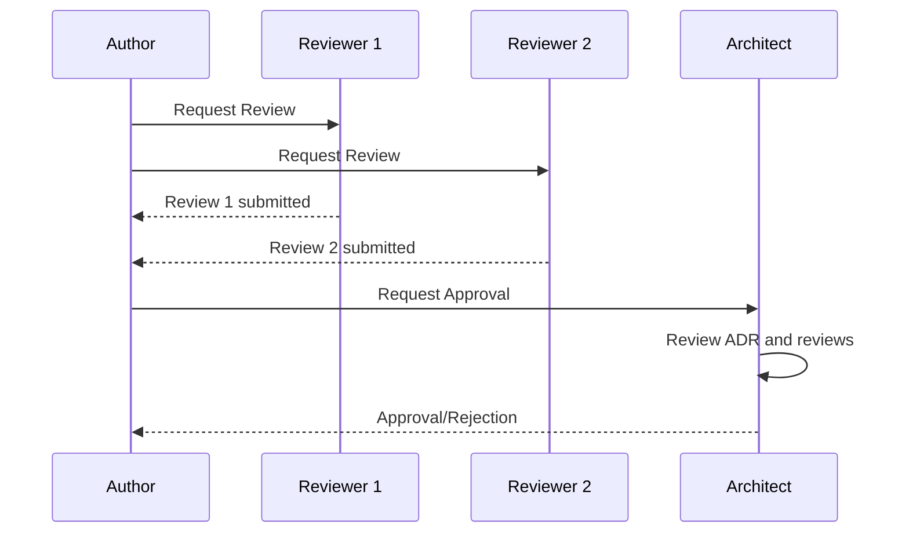
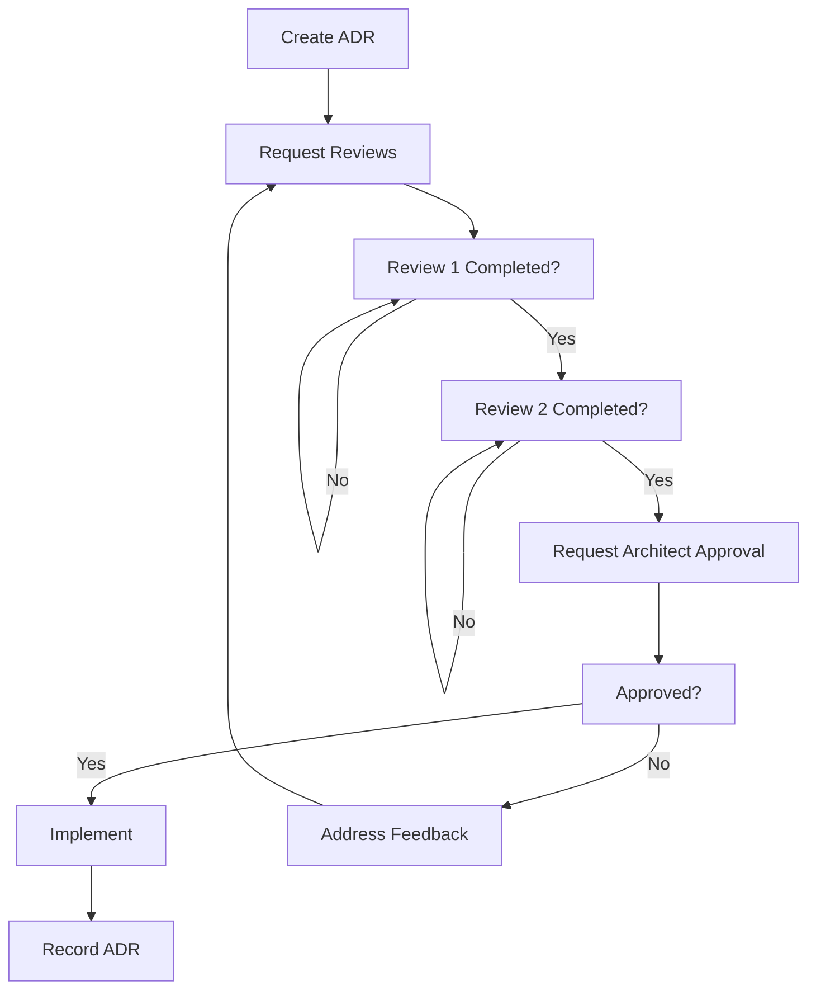

# Workflow Architect - Навыки (Skills)

## Обзор

Workflow Architect использует следующие навыки для эффективного проектирования workflows, state machines и процессов координации между агентами.

## Навык: State Machine Design

### Описание
Способность проектировать state machines для бизнес-процессов, определяя состояния, переходы, guard conditions и actions.

### Компоненты навыка

#### 1. Идентификация состояний
- Определение начального состояния (initial state)
- Определение конечных состояний (terminal states)
- Определение промежуточных состояний
- Определение error states

#### 2. Определение переходов
- Идентификация всех возможных переходов
- Определение триггеров переходов (events, timers, conditions)
- Определение guard conditions для переходов
- Определение entry/exit actions

#### 3. Валидация state machine
- Проверка на completeness (все необходимые переходы определены)
- Проверка на consistency (нет противоречий)
- Проверка на deadlock (нет тупиковых ситуаций)
- Проверка на reachability (из каждого состояния достижимо terminal state)

#### 4. Создание диаграмм
- Создание Mermaid state diagrams
- Добавление labels для переходов
- Добавление notes для сложных ситуаций
- Оптимизация читаемости диаграмм

### Примеры использования

```
## State Machine для PR Workflow

**Состояния**:
- draft: PR создан, но не готов к review
- review_requested: PR отправлен на review
- in_review: PR находится на review
- approved: PR approved
- changes_requested: Требуются изменения
- merged: PR merged
- closed: PR закрыт без merge

**Переходы**:
- draft → review_requested: Request Review (author action)
- review_requested → in_review: Review started (reviewer action)
- in_review → approved: Approve (reviewer action)
- in_review → changes_requested: Request Changes (reviewer action)
- changes_requested → in_review: Submit Changes (author action)
- approved → merged: Merge (maintainer action)
- any → closed: Close without merge (anyone)

**Guard Conditions**:
- draft → review_requested: Minimum description length = 50 chars
- approved → merged: Minimum 2 approvals
- in_review → approved: All review comments addressed

**Entry Actions**:
- review_requested: Notify reviewers
- approved: Update PR status to "Ready for merge"
- merged: Update issue tracker

**Exit Actions**:
- in_review: Log review duration
- changes_requested: Send notification to author

**Validation**:
- ✓ Completeness: Все необходимые переходы определены
- ✓ Consistency: Нет противоречий
- ✓ Deadlock: Нет тупиковых ситуаций
- ✓ Reachability: Из каждого состояния достижимо terminal state (merged/closed)
```

## Навык: Workflow Design

### Описание
Способность проектировать полные workflows, включая этапы, handoffs, approval gates и escalation paths.

### Компоненты навыка

#### 1. Декомпозиция процесса
- Разбивка сложного процесса на этапы
- Определение dependencies между этапами
- Идентификация параллельных путей
- Определение точек принятия решений

#### 2. Проектирование handoffs
- Определение точек передачи между участниками
- Определение данных для передачи
- Определение acceptance criteria
- Определение rejection criteria

#### 3. Проектирование approval gates
- Определение точек approval
- Определение approvers
- Определение критериев approval
- Определение критериев отклонения

#### 4. Проектирование escalation paths
- Идентификация проблемных ситуаций
- Определение уровней эскалации
- Определение маршрутов эскалации
- Определение fallback путей

### Примеры использования

```
## Workflow для ADR Process

**Этапы**:
1. Proposal: Любой может предложить ADR
2. Review: Minimum 2 reviewers
3. Approval: Architect approval
4. Implementation: Реализация решения
5. Record: Запись в docs/adr/

**Handoffs**:
- Proposal → Review: ADR document submitted
- Review → Approval: Review summary submitted
- Approval → Implementation: Approval notification
- Implementation → Record: Implementation completed

**Approval Gates**:
- Gate 1 (Review): Minimum 2 reviewers assigned
- Gate 2 (Approval): Architect approval required
- Gate 3 (Critical ADR): Architect council approval

**Escalation Paths**:
- No reviews > 48h: Escalate to lead architect
- Conflict between reviewers: Escalate to architect council
- Implementation blocked > 72h: Escalate to architect

**Decision Points**:
- After Review: Approved vs Rejected vs Changes Requested
- After Changes Requested: Resubmit vs Abandon
```

## Навык: Process Modeling

### Описание
Способность моделировать бизнес-процессы, используя различные нотации и техники моделирования.

### Компоненты навыка

#### 1. Выбор нотации
- State diagrams для state machines
- Sequence diagrams для handoffs
- Activity diagrams для сложных workflows
- Flowcharts для decision points

#### 2. Моделирование процессов
- Определение participants
- Определение messages между participants
- Определение sequence действий
- Определение conditions и loops

#### 3. Оптимизация процессов
- Идентификация избыточных этапов
- Определение возможностей для параллелизации
- Оптимизация времени выполнения
- Уменьшение complexity

#### 4. Документирование процессов
- Создание clear и explicit описаний
- Добавление примеров использования
- Создание FAQ
- Обновление документации при изменениях

### Примеры использования

```
## Process Modeling для ADR Review

**Participants**:
- Author: Автор ADR
- Reviewer 1: Первый reviewer
- Reviewer 2: Второй reviewer
- Architect: Architect для approval

**Sequence Diagram**:


**Activity Diagram**:


**Optimization**:
- Parallel reviews: Reviewer 1 и Reviewer 2 review параллельно
- Reduce review time: Set 48h timeout for reviews
- Simplify approval: Single architect approval for non-critical ADRs
```

## Навык: Handoff Packaging

### Описание
Способность упаковывать информацию для передачи между агентами, обеспечивая полноту и ясность контекста.

### Компоненты навыка

#### 1. Сбор информации
- Сбор всех артефактов для передачи
- Определение критически важной информации
- Определение опциональной информации
- Структурирование информации

#### 2. Упаковка контекста
- Создание clear описания того, что было сделано
- Предоставление ссылок на все артефакты
- Описание dependencies
- Описание важных решений

#### 3. Формирование сообщений
- Использование стандартных шаблонов
- Структурирование информации
- Указание ожиданий
- Предоставление QA Gate criteria

#### 4. Обработка отклонений
- Анализ причин отклонения
- Исправление проблем
- Повторная передача

### Примеры использования

```
## Handoff Package для ADR Process

**From**: Workflow Architect
**To**: Build Orchestrator

**Package Contents**:
- State Machine Diagram:
  ```mermaid
  stateDiagram-v2
    [*] --> Proposal
    Proposal --> Review
    Review --> Approved
    Review --> Rejected
    Approved --> Implementation
    Implementation --> Recorded
    Rejected --> [*]
    Recorded --> [*]
  ```
- State Descriptions:
  - Proposal: ADR proposed, awaiting review
  - Review: ADR under review, minimum 2 reviewers
  - Approved: ADR approved, ready for implementation
  - Rejected: ADR rejected
  - Implementation: ADR being implemented
  - Recorded: ADR recorded in docs/adr/

- Transitions:
  - Proposal → Review: Request Review
  - Review → Approved: Approved (min 2 approvals)
  - Review → Rejected: Rejected
  - Approved → Implementation: Implement
  - Implementation → Recorded: Record

- Handoff Contracts:
  - Proposal → Review: ADR document, reviewers assigned
  - Review → Approved: Review summary, approval decision
  - Approved → Implementation: Approval notification, implementation requirements

- Escalation Paths:
  - No reviews > 48h: Escalate to lead architect
  - Conflict between reviewers: Escalate to architect council
  - Implementation blocked > 72h: Escalate to architect

- Approval Gates:
  - Gate 1 (Review): Minimum 2 reviewers assigned
  - Gate 2 (Approved): Architect approval required

**Context**:
- Related workflows: PR workflow, Task workflow
- Dependencies: None (independent process)
- Important decisions: Minimum 2 reviewers required, architect approval required

**Next Steps**:
1. Build Orchestrator integrates ADR workflow into master workflow
2. Test workflow with sample ADR
3. Iterate based on feedback

**QA Gate**: Workflow covers all ADR lifecycle stages (proposal, review, approval, implementation, record)
**Deadline**: 2024-04-15
```

## Комбинирование навыков

### Пример полного сценария

```
## Сценарий: Проектирование полного workflow для build team

### Шаг 1: State Machine Design
- Получить требования от build-orchestrator
- Идентифицировать все состояния (task creation, assignment, execution, review, completion)
- Определить переходы между состояниями
- Создать Mermaid state diagram
- Валидировать state machine

### Шаг 2: Workflow Design
- Декомпозировать процесс на этапы
- Определить handoffs между агентами
- Спроектировать approval gates
- Спроектировать escalation paths

### Шаг 3: Process Modeling
- Выбрать подходящую нотацию (state diagram + sequence diagram)
- Моделировать interactions между агентами
- Оптимизировать process для эффективности
- Создать activity diagram для сложных decision points

### Шаг 4: Handoff Packaging
- Упаковать все артефакты (state machine diagram, workflow specs, handoff contracts, escalation paths)
- Создать clear контекст для build-orchestrator
- Сформировать сообщение с использованием стандартного шаблона
- Передать пакет build-orchestrator

### И так далее для каждого workflow...
```

## Метрики эффективности

Для оценки эффективности Workflow Architect используются следующие метрики:

1. **Время проектирования workflow**: Время от получения требований до передачи спецификации
   - Цель: < 2 часа для простых workflows, < 1 день для сложных

2. **Полнота coverage**: Процент coverage всех edge cases
   - Цель: 100% coverage edge cases

3. **Количество итераций**: Сколько раз workflow возвращался на доработку
   - Цель: Минимум итераций (ideally 1)

4. **Количество обнаруженных проблем**: Сколько проблем обнаружено после интеграции workflow
   - Цель: Минимум проблем (ideally 0)

5. **Удовлетворенность stakeholders**: Субъективная оценка качества workflow
   - Цель: > 4/5

6. **Время выполнения workflow**: Время выполнения workflow в production
   - Цель: Время соответствует оценкам и требованиям