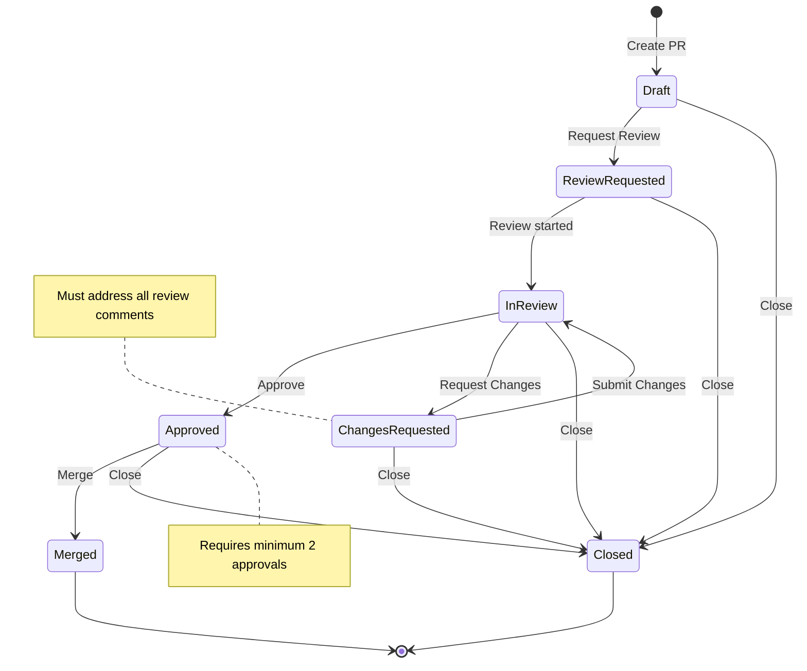

# Workflow Architect - Рабочий процесс

## Обзор процесса

Workflow Architect проектирует workflows для координации работы build team: от анализа требований до создания полной спецификации с state machine diagrams, handoff contracts, escalation paths и approval gates.

## Шаг 1: Понимание требований

### Анализ процесса requirements

**Цель**: Полно понять желаемый бизнес-процесс или workflow.

**Действия**:

1. **Сбор информации**
   - Получить описание желаемого процесса от stakeholder
   - Изучить существующие workflows (если есть)
   - Понять роли участников в процессе
   - Идентифицировать входные и выходные данные

2. **Уточнение требований**
   - Задать уточняющие вопросы о неясных моментах
   - Получить примеры использования (use cases)
   - Понять edge cases и error scenarios
   - Уточнить ограничения (временные, ресурсные, организационные)

3. **Валидация требований**
   - Проверить требования на полноту
   - Идентифицировать противоречия
   - Уточнить приоритеты (performance vs reliability vs simplicity)
   - Получить подтверждение понимания требований

**Формат документирования**:
```markdown
## Требования к workflow: [Название]

**Описание процесса**: [Краткое описание]

**Участники**:
- [ ] Участник 1: [роль и ответственность]
- [ ] Участник 2: [роль и ответственность]

**Входные данные**:
- [ ] Вход 1: [описание и формат]
- [ ] Вход 2: [описание и формат]

**Выходные данные**:
- [ ] Выход 1: [описание и формат]
- [ ] Выход 2: [описание и формат]

**Ограничения**:
- [ ] Ограничение 1: [описание]
- [ ] Ограничение 2: [описание]

**Edge Cases**:
- [ ] Case 1: [описание]
- [ ] Case 2: [описание]
```

## Шаг 2: Идентификация состояний и переходов

### Определение состояний

**Цель**: Определить все возможные состояния в workflow.

**Действия**:

1. **Идентификация состояний**
   - Определить начальное состояние (initial state)
   - Определить конечное состояние/состояния (terminal states)
   - Определить промежуточные состояния
   - Определить error states (если применимо)

2. **Описание состояний**
   - Для каждого состояния определить:
     - Что означает это состояние?
     - Кто отвечает за это состояние?
     - Какие данные доступны в этом состоянии?
     - Какие действия возможны в этом состоянии?

3. **Валидация состояний**
   - Проверить, что все состояния необходимы
   - Убедиться, что нет избыточных состояний
   - Проверить, что состояния четкие и не пересекаются

**Формат документирования**:
```markdown
## Состояния workflow

### [Название состояния 1]
- **Описание**: [Что означает это состояние]
- **Ответственный**: [Кто отвечает за это состояние]
- **Доступные данные**: [Какие данные доступны]
- **Возможные действия**: [Какие действия возможны]

### [Название состояния 2]
...
```

### Определение переходов

**Цель**: Определить все переходы между состояниями.

**Действия**:

1. **Идентификация переходов**
   - Определить все возможные переходы из каждого состояния
   - Определить условия для каждого перехода (guard conditions)
   - Определить триггеры переходов (events, timers, conditions)
   - Определить действия при переходах (entry/exit actions)

2. **Описание переходов**
   - Для каждого перехода определить:
     - From state: [исходное состояние]
     - To state: [целевое состояние]
     - Trigger: [что инициирует переход]
     - Guard condition: [условие, при котором переход возможен]
     - Action: [действие при переходе]

3. **Валидация переходов**
   - Проверить, что все необходимые переходы определены
   - Убедиться, что нет невозможных переходов
   - Проверить, что нет deadlock ситуаций
   - Убедиться, что из каждого состояния есть путь к terminal state

**Формат документирования**:
```markdown
## Переходы workflow

### [Переход 1]
- **From**: [исходное состояние]
- **To**: [целевое состояние]
- **Trigger**: [событие/таймер/условие]
- **Guard**: [условие перехода]
- **Action**: [действие при переходе]

### [Переход 2]
...
```

## Шаг 3: Проектирование state machine

### Создание state machine diagram

**Цель**: Создать визуальное представление state machine.

**Действия**:

1. **Выбор типа диаграммы**
   - State diagram: для простых state machines
   - State diagram with nesting: для иерархических state machines
   - Activity diagram: для сложных workflows с parallel paths

2. **Создание Mermaid diagram**
   - Использовать Mermaid syntax для state diagrams
   - Включить все состояния
   - Включить все переходы
   - Добавить labels для переходов
   - Добавить notes для сложных переходов

3. **Валидация диаграммы**
   - Проверить, что диаграмма соответствует описанию
   - Убедиться, что все состояния и переходы видны
   - Проверить читаемость диаграммы
   - Получить review от stakeholder

**Пример Mermaid diagram**:


## Шаг 4: Определение handoff contracts

### Создание контрактов передачи

**Цель**: Определить контракты передачи между агентами/участниками.

**Действия**:

1. **Идентификация точек передачи**
   - Определить, где происходят передачи между участниками
   - Определить, какие данные передаются
   - Определить, какие данные требуются на входе
   - Определить, какие данные expected на выходе

2. **Создание контрактов**
   - Для каждого handoff определить:
     - From: [кто передает]
     - To: [кому передает]
     - Input data: [требуемые входные данные]
     - Output data: [ожидаемые выходные данные]
     - Trigger: [триггер передачи]
     - Acceptance criteria: [критерии принятия]

3. **Валидация контрактов**
   - Проверить, что все данные определены
   - Убедиться, что нет неявных допущений
   - Проверить, что контракты полные и непротиворечивые
   - Получить confirmation от участников

**Формат документирования**:
```markdown
## Handoff Contracts

### [Handoff 1]
**From**: [участник/агент]
**To**: [участник/агент]

**Input Data**:
- [ ] Данные 1: [формат и описание]
- [ ] Данные 2: [формат и описание]

**Output Data**:
- [ ] Данные 1: [формат и описание]
- [ ] Данные 2: [формат и описание]

**Trigger**: [событие/условие]

**Acceptance Criteria**:
- [ ] Критерий 1
- [ ] Критерий 2

**Rejection Criteria**:
- [ ] Критерий 1
- [ ] Критерий 2
```

## Шаг 5: Добавление escalation paths

### Проектирование путей эскалации

**Цель**: Определить пути эскалации для проблемных ситуаций.

**Действия**:

1. **Идентификация ситуаций эскалации**
   - Определить типовые проблемные ситуации
   - Определить тайм-ауты для каждого этапа
   - Определить блокирующие ситуации
   - Определить конфликтные ситуации

2. **Создание путей эскалации**
   - Для каждой ситуации определить:
     - Тип эскалации (information, request, critical)
     - Уровень эскалации (level 1, level 2, level 3)
     - Триггер эскалации
     - Кому эскалировать
     - Ожидаемый результат
     - Fallback путь

3. **Валидация путей эскалации**
   - Проверить, что все проблемные ситуации покрыты
   - Убедиться, что нет deadlock в escalation
   - Проверить, что escalation paths заканчиваются разрешением
   - Получить confirmation от management

**Формат документирования**:
```markdown
## Escalation Paths

### [Ситуация 1]
**Тип**: [information/request/critical]
**Уровень**: [1/2/3]

**Триггер**:
- Условие: [описание условия]
- Тайм-аут: [если применимо]

**Кому эскалировать**: [роль/человек]

**Ожидаемый результат**: [что ожидается]

**Fallback**: [что делать, если эскалация не помогает]

### [Ситуация 2]
...
```

## Шаг 6: Создание approval gates

### Определение checkpoints approval

**Цель**: Определить approval gates в workflow.

**Действия**:

1. **Идентификация точек approval**
   - Определить, где требуются approvals
   - Определить уровни approval (developer, architect, manager)
   - Определить критерии approval
   - Определить критерии отклонения

2. **Создание gates**
   - Для каждого gate определить:
     - Название gate
     - Где в workflow находится gate
     - Кто может approve
     - Критерии approval
     - Критерии отклонения
     - Что происходит при отклонении

3. **Валидация gates**
   - Проверить, что все критические точки имеют gates
   - Убедиться, что критерии четкие и measurable
   - Проверить, что нет избыточных gates
   - Получить confirmation от approvers

**Формат документирования**:
```markdown
## Approval Gates

### [Gate 1]
**Название**: [название gate]
**Место в workflow**: [состояние/переход]

**Approvers**:
- [ ] Роль 1: [описание ответственности]
- [ ] Роль 2: [описание ответственности]

**Approval Criteria**:
- [ ] Критерий 1
- [ ] Критерий 2

**Rejection Criteria**:
- [ ] Критерий 1
- [ ] Критерий 2

**Action on Rejection**: [что происходит при отклонении]

### [Gate 2]
...
```

## Шаг 7: Документирование с Mermaid diagrams

### Создание полной документации

**Цель**: Создать полную документацию workflow с диаграммами.

**Действия**:

1. **Сбор всех артефактов**
   - State machine diagram
   - Описание состояний
   - Описание переходов
   - Handoff contracts
   - Escalation paths
   - Approval gates

2. **Создание master документа**
   - Объединить все артефакты в один документ
   - Добавить overview и summary
   - Добавить примеры использования
   - Добавить FAQ

3. **Валидация документации**
   - Проверить полноту документации
   - Убедиться, что документация понятна
   - Проверить, что диаграммы соответствуют тексту
   - Получить final approval

**Формат документирования**:
```markdown
# Workflow Specification: [Название]

## Overview
[Краткое описание workflow]

## State Machine Diagram
[Mermaid diagram]

## States
[Описание всех состояний]

## Transitions
[Описание всех переходов]

## Handoff Contracts
[Все контракты]

## Escalation Paths
[Все пути эскалации]

## Approval Gates
[Все gates]

## Examples
[Примеры использования]

## FAQ
[Часто задаваемые вопросы]
```

## Завершение процесса

### Успешное завершение

Когда все этапы завершены:
```markdown
✅ Workflow спроектирован: [Название]

**Артефакты**:
- [ ] State machine diagram
- [ ] Описание состояний
- [ ] Описание переходов
- [ ] Handoff contracts
- [ ] Escalation paths
- [ ] Approval gates
- [ ] Полная документация

**Следующие шаги**:
- [ ] Получить approval от build-orchestrator
- [ ] Передать спецификацию build-orchestrator
- [ ] Интегрировать в систему

**QA Gates**: Все пройдены ✅
```

### Финальная проверка

Перед завершением:
1. Проверить все артефакты
2. Убедиться, что все QA Gates пройдены
3. Проверить, что нет блокировок для других workflows
4. Обновить статус workflow
5. Передать спецификацию build-orchestrator