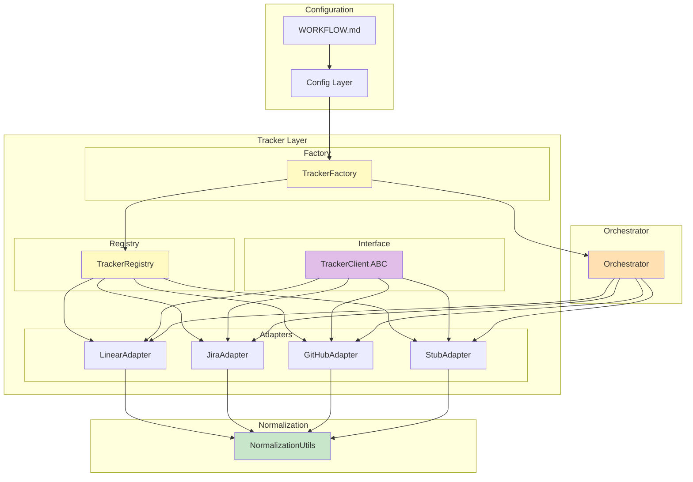

# Architecture Decision Record: Pluggable Issue Tracker Adapter Architecture

**Status**: Proposed | **Date**: 2026-04-12 | **Authors**: Platform Architect

---

## Table of Contents

1. [Context and Problem Statement](#context-and-problem-statement)
2. [Decision Drivers](#decision-drivers)
3. [Considered Alternatives](#considered-alternatives)
4. [Decision](#decision)
5. [Consequences](#consequences)
6. [Architecture Design](#architecture-design)
7. [Implementation Guidance](#implementation-guidance)
8. [Migration Strategy](#migration-strategy)
9. [References](#references)

---

## Context and Problem Statement

### Current State

The Symphony orchestrator is currently tightly coupled to Linear issue tracker:

**Existing Implementation:**
- `WORKFLOW.md` requires `tracker.kind: linear`
- Configuration includes Linear-specific fields (`tracker.project_slug`)
- Hardcoded Linear GraphQL endpoint (`https://api.linear.app/graphql`)
- Single tracker adapter implementation in `runtime/tracker/linear.py`
- Base interface (`runtime/tracker/base.py`) defines only 2 of 3 required operations

**Current Tracker Base Interface:**
```python
class TrackerClient(ABC):
    @abstractmethod
    def fetch_candidate_issues(self) -> List[Dict[str, Any]]:
        """Fetch active issues."""
        pass
    
    @abstractmethod
    def fetch_issue_states_by_ids(self, issue_ids: List[str]) -> Dict[str, str]:
        """Fetch current states for issues."""
        pass
    # Missing: fetch_issues_by_states()
```

### Problem

Multiple issues arise from this tight coupling:

1. **Limited Tracker Support**: Only Linear is supported, despite demand for Jira, GitHub Issues, Azure DevOps, GitLab, etc.
2. **API Unavailability**: Neither Linear nor Jira APIs are currently accessible for development/testing
3. **Inflexible Configuration**: Configuration schema is Linear-specific, making it difficult to add new trackers
4. **Maintenance Burden**: Adding new trackers requires core code changes
5. **Missing Required Method**: Base interface is incomplete (missing `fetch_issues_by_states()` per SPEC.md Section 11)

### SPEC.md Requirements

Section 11 defines the Issue Tracker Integration Contract:

**Required Operations (Section 11.1):**
1. `fetch_candidate_issues()` - Return issues in configured active states
2. `fetch_issues_by_states(state_names)` - Used for startup terminal cleanup
3. `fetch_issue_states_by_ids(issue_ids)` - Used for active-run reconciliation

**Normalization Rules (Section 11.3):**
- `labels` → lowercase strings
- `blocked_by` → derived from inverse relations (relation type: `blocks`)
- `priority` → integer only
- `created_at`, `updated_at` → ISO-8601 timestamps

**Important Note (Section 11.2):**
> "A non-Linear implementation may change transport details, but normalized outputs must match the domain model in Section 4."

---

## Decision Drivers

### Functional Requirements

1. **Pluggable Architecture**: Must support easy addition of new tracker adapters without modifying core code
2. **Multiple Tracker Support**: Must support Linear, Jira, and future trackers (GitHub, Azure DevOps, etc.)
3. **SPEC.md Compliance**: Must implement all 3 required operations from Section 11
4. **Normalization**: All adapters must normalize outputs to Issue Entity model
5. **Placeholder Adapters**: Must provide stub implementations for Linear and Jira (APIs unavailable)

### Non-Functional Requirements

1. **Backward Compatibility**: Existing Linear workflows must continue working without changes
2. **Type Safety**: Must use Python type hints for better IDE support and runtime checks
3. **Extensibility**: Easy to add new adapters via registration or configuration
4. **Maintainability**: Clear separation between core logic and tracker-specific code
5. **Testability**: Adapters must be easily mockable for testing

### Constraints

1. **Python 3.11+**: Must use modern Python features (dataclasses, typing, Protocol support)
2. **No External Dependencies**: Prefer standard library for registry pattern
3. **Minimal Code Changes**: Avoid major refactoring of existing orchestrator logic
4. **Linear API Unavailable**: Linear adapter must be a placeholder/stub
5. **Jira API Unavailable**: Jira adapter must be a placeholder/stub

---

## Considered Alternatives

### Alternative 1: Entry Points / Setuptools Plugins

**Description:** Use Python entry points for dynamic adapter discovery. Adapters would be installed as separate packages and discovered at runtime.

**Pros:**
- True pluggability via package installation
- Clean separation (adapters as independent packages)
- Automatic discovery via setuptools
- Supports third-party adapter distribution

**Cons:**
- Requires setuptools and entry points configuration
- Overkill for in-repo adapters
- Adds complexity to package installation
- Entry points discovery happens at import time (harder to control)
- Not suitable for development-time adapters

**Verdict:** ❌ Not suitable for current needs. Overly complex for simple in-repo adapters.

---

### Alternative 2: Dynamic Module Loading

**Description:** Dynamically import adapter modules based on `tracker.kind` configuration using `importlib.import_module()`.

**Pros:**
- Simple implementation
- No external dependencies
- Flexible (modules can be in any package)
- Easy to add new adapters (just add new file)

**Cons:**
- No centralized registry
- Adapters discovered at runtime only (no validation at startup)
- Harder to list available adapters
- No built-in adapter metadata
- Risk of import errors late in execution

**Verdict:** ⚠️ Viable but lacks structure and validation.

---

### Alternative 3: Configuration-Based Registry (MCP Pattern)

**Description:** Use a registry pattern similar to the MCP adapter specification. Adapters register themselves at module import time, and the registry provides validation and discovery.

**Pros:**
- Centralized adapter management
- Validation at startup (fail fast)
- Easy to list available adapters
- Follows established MCP pattern in codebase
- Supports adapter metadata
- Clear separation between registration and usage
- Easy to test and mock

**Cons:**
- Requires adapters to import themselves for registration
- Slight overhead of registry maintenance
- Need to manage global registry state

**Verdict:** ✅ **Recommended** - Best balance of structure, flexibility, and maintainability.

---

### Alternative 4: ABC with Protocol Mixin

**Description:** Use Python's `Protocol` class (structural typing) instead of `ABC` (nominal typing). Combine with simple factory function for adapter instantiation.

**Pros:**
- Structural typing (duck typing with type hints)
- More flexible than ABC
- Easier to create mock adapters for testing
- No inheritance required

**Cons:**
- Protocol validation happens at type check time, not runtime
- Less explicit than ABC (harder to see interface)
- No runtime enforcement of required methods
- Still needs registry/factory for instantiation

**Verdict:** ⚠️ Good for type safety, but ABC is better for explicit interface definition and runtime enforcement.

---

### Alternative 5: Abstract Base Class (ABC) + Factory Pattern

**Description:** Use Python's `ABC` to define explicit interface, combined with a simple factory pattern for adapter instantiation based on `tracker.kind`.

**Pros:**
- Explicit interface definition (clear contract)
- Runtime enforcement of required methods (`@abstractmethod`)
- Type-safe (inheritance-based)
- Standard Python pattern
- Easy to understand and maintain
- Factory pattern centralizes adapter creation logic

**Cons:**
- Adapters must inherit from base class
- Less flexible than Protocol for duck typing
- Factory can become complex with many adapters

**Verdict:** ✅ **Recommended** - Clear, explicit, and follows Python best practices.

---

## Decision

**Chosen Approach:** **ABC Interface + Configuration-Based Registry + Factory Pattern**

We will combine the best aspects of Alternatives 3 and 5:

1. **ABC Interface**: Use `ABC` with `@abstractmethod` for explicit interface definition
2. **Registry Pattern**: Centralized adapter registry with registration at module import
3. **Factory Pattern**: Factory function to create adapter instances based on configuration
4. **Normalization Layer**: Common normalization utilities across all adapters
5. **Configuration Extensibility**: Support both Linear-specific and generic tracker configuration

### Rationale

This approach provides:

- **Type Safety**: ABC ensures all adapters implement required methods at class definition time
- **Extensibility**: Registry pattern makes it easy to add new adapters
- **Validation**: Factory validates configuration before adapter instantiation
- **Maintainability**: Clear separation of concerns (interface, registry, factory, adapters)
- **Backward Compatibility**: Existing Linear workflows work without changes
- **Testability**: Easy to create mock adapters for testing

---

## Consequences

### Positive Consequences

✅ **Easier to Add New Trackers**: Just create new adapter file and import it
✅ **Type Safety**: ABC enforces interface compliance at class definition
✅ **Startup Validation**: Registry validates adapters and configuration at startup
✅ **Clear Separation**: Core logic decoupled from tracker-specific code
✅ **Testability**: Easy to mock adapters for unit testing
✅ **Backward Compatible**: Existing Linear workflows continue to work
✅ **Discovery**: Easy to list available adapters for debugging

### Negative Consequences

⚠️ **Initial Refactoring**: Requires updating existing `base.py` and `linear.py`
⚠️ **Global Registry**: Registry is a global singleton (need to manage carefully)
⚠️ **Import Order**: Adapters must be imported before use (can be solved with auto-import)
⚠️ **Slight Overhead**: Registry and factory add minimal runtime overhead

### Risks and Mitigations

| Risk | Impact | Mitigation |
|------|--------|------------|
| Import order issues | Medium | Auto-import all adapters at startup |
| Registry state corruption | Low | Make registry read-only after initial population |
| Configuration validation gaps | Medium | Comprehensive schema validation in factory |
| Incomplete normalization | High | Shared normalization utilities + tests |
| Breaking changes | High | Backward compatibility layer for Linear config |

---

## Architecture Design

### High-Level Architecture



### Component Responsibilities

#### 1. TrackerClient (ABC)

**Location**: `runtime/tracker/base.py`

**Responsibilities**:
- Define explicit interface for all tracker adapters
- Enforce implementation of 3 required methods
- Define common types and data structures

**Interface**:
```python
from abc import ABC, abstractmethod
from typing import List, Dict, Any, Optional
from datetime import datetime

class TrackerClient(ABC):
    """Abstract base class for issue tracker adapters."""
    
    @abstractmethod
    def fetch_candidate_issues(self) -> List[Dict[str, Any]]:
        """Fetch active issues from tracker.
        
        Returns:
            List of normalized issue entities (per SPEC.md Section 4.1.1).
        """
        pass
    
    @abstractmethod
    def fetch_issues_by_states(self, state_names: List[str]) -> List[Dict[str, Any]]:
        """Fetch issues in specific states (for startup cleanup).
        
        Args:
            state_names: List of state names to filter by.
            
        Returns:
            List of normalized issue entities.
        """
        pass
    
    @abstractmethod
    def fetch_issue_states_by_ids(self, issue_ids: List[str]) -> Dict[str, str]:
        """Fetch current states for specific issues (for reconciliation).
        
        Args:
            issue_ids: List of issue IDs to fetch states for.
            
        Returns:
            Mapping of issue_id -> state_name.
        """
        pass
    
    @property
    @abstractmethod
    def tracker_kind(self) -> str:
        """Return tracker kind identifier."""
        pass
```

---

#### 2. TrackerRegistry

**Location**: `runtime/tracker/registry.py`

**Responsibilities**:
- Maintain registry of available tracker adapters
- Register adapter classes at import time
- Provide adapter discovery and validation
- Support querying by tracker kind

**Implementation**:
```python
from typing import Dict, Type, Optional
from .base import TrackerClient

class TrackerRegistry:
    """Registry for tracker adapters."""
    
    _instance: Optional['TrackerRegistry'] = None
    _adapters: Dict[str, Type[TrackerClient]] = {}
    
    def __new__(cls) -> 'TrackerRegistry':
        if cls._instance is None:
            cls._instance = super().__new__(cls)
        return cls._instance
    
    def register(self, kind: str, adapter_class: Type[TrackerClient]) -> None:
        """Register a tracker adapter.
        
        Args:
            kind: Tracker kind identifier (e.g., 'linear', 'jira').
            adapter_class: Adapter class implementing TrackerClient.
        """
        if kind in self._adapters:
            raise ValueError(f"Tracker kind '{kind}' already registered")
        
        if not issubclass(adapter_class, TrackerClient):
            raise TypeError(f"Adapter class must inherit from TrackerClient")
        
        self._adapters[kind] = adapter_class
    
    def get_adapter(self, kind: str) -> Optional[Type[TrackerClient]]:
        """Get adapter class by kind.
        
        Args:
            kind: Tracker kind identifier.
            
        Returns:
            Adapter class or None if not found.
        """
        return self._adapters.get(kind)
    
    def list_adapters(self) -> List[str]:
        """List all registered adapter kinds."""
        return list(self._adapters.keys())
    
    def is_registered(self, kind: str) -> bool:
        """Check if adapter kind is registered."""
        return kind in self._adapters


# Global registry instance
_registry = TrackerRegistry()

def register_tracker(kind: str, adapter_class: Type[TrackerClient]) -> None:
    """Register a tracker adapter with global registry."""
    _registry.register(kind, adapter_class)

def get_tracker_registry() -> TrackerRegistry:
    """Get the global tracker registry."""
    return _registry
```

---

#### 3. TrackerFactory

**Location**: `runtime/tracker/factory.py`

**Responsibilities**:
- Create adapter instances based on configuration
- Validate configuration before instantiation
- Handle configuration fallbacks and defaults
- Provide clear error messages for invalid configuration

**Implementation**:
```python
from typing import Optional
from .base import TrackerClient
from .registry import get_tracker_registry
from .normalization import NormalizationUtils
from runtime.symphony.config import Config

class TrackerFactory:
    """Factory for creating tracker adapter instances."""
    
    @staticmethod
    def create(config: Config) -> TrackerClient:
        """Create a tracker adapter instance from configuration.
        
        Args:
            config: Runtime configuration object.
            
        Returns:
            Instantiated tracker adapter.
            
        Raises:
            ValueError: If tracker kind is not supported.
            ConfigurationError: If required configuration is missing.
        """
        registry = get_tracker_registry()
        kind = config.tracker_kind
        
        adapter_class = registry.get_adapter(kind)
        if adapter_class is None:
            available = ", ".join(registry.list_adapters())
            raise ValueError(
                f"Unsupported tracker kind: '{kind}'. "
                f"Available: {available}"
            )
        
        # Validate required configuration
        TrackerFactory._validate_config(kind, config)
        
        # Create adapter instance
        adapter = TrackerFactory._instantiate_adapter(
            adapter_class, config
        )
        
        return adapter
    
    @staticmethod
    def _validate_config(kind: str, config: Config) -> None:
        """Validate configuration for tracker kind."""
        if kind == "linear":
            if not config.tracker_api_key:
                raise ValueError("Linear adapter requires tracker.api_key")
            if not config.tracker_project_slug:
                raise ValueError("Linear adapter requires tracker.project_slug")
        elif kind == "jira":
            if not config.tracker_api_key:
                raise ValueError("Jira adapter requires tracker.api_key")
            if not config.tracker_endpoint:
                raise ValueError("Jira adapter requires tracker.endpoint")
        # Generic validation for other trackers can be added here
    
    @staticmethod
    def _instantiate_adapter(
        adapter_class: Type[TrackerClient], 
        config: Config
    ) -> TrackerClient:
        """Instantiate adapter with configuration."""
        kind = config.tracker_kind
        
        if kind == "linear":
            return adapter_class(
                api_key=config.tracker_api_key,
                project_slug=config.tracker_project_slug,
                endpoint=config.tracker_endpoint,
            )
        elif kind == "jira":
            return adapter_class(
                api_key=config.tracker_api_key,
                endpoint=config.tracker_endpoint,
                project_key=config.tracker_project_slug,  # Reuse field
                username=config.tracker_api_key,  # For basic auth
            )
        else:
            # Generic instantiation for future trackers
            return adapter_class(config=config)
```

---

#### 4. Normalization Utils

**Location**: `runtime/tracker/normalization.py`

**Responsibilities**:
- Provide common normalization functions
- Ensure consistency across all adapters
- Handle edge cases and data transformations

**Implementation**:
```python
from typing import List, Dict, Any, Optional
from datetime import datetime
import re

class NormalizationUtils:
    """Utility functions for normalizing tracker data."""
    
    @staticmethod
    def normalize_issue(raw_issue: Dict[str, Any]) -> Dict[str, Any]:
        """Normalize raw tracker issue to Issue Entity (SPEC.md Section 4.1.1).
        
        Args:
            raw_issue: Raw issue data from tracker API.
            
        Returns:
            Normalized issue entity.
        """
        return {
            "id": raw_issue.get("id"),
            "identifier": raw_issue.get("identifier"),
            "title": raw_issue.get("title"),
            "description": raw_issue.get("description"),
            "priority": NormalizationUtils._normalize_priority(
                raw_issue.get("priority")
            ),
            "state": raw_issue.get("state"),
            "branch_name": raw_issue.get("branch_name"),
            "url": raw_issue.get("url"),
            "labels": NormalizationUtils._normalize_labels(
                raw_issue.get("labels", [])
            ),
            "blocked_by": raw_issue.get("blocked_by", []),
            "created_at": NormalizationUtils._parse_timestamp(
                raw_issue.get("created_at")
            ),
            "updated_at": NormalizationUtils._parse_timestamp(
                raw_issue.get("updated_at")
            ),
        }
    
    @staticmethod
    def _normalize_labels(labels: List[str]) -> List[str]:
        """Normalize labels to lowercase."""
        return [label.lower() for label in labels if label]
    
    @staticmethod
    def _normalize_priority(priority: Any) -> Optional[int]:
        """Normalize priority to integer."""
        if isinstance(priority, int):
            return priority
        if isinstance(priority, str) and priority.isdigit():
            return int(priority)
        return None
    
    @staticmethod
    def _parse_timestamp(timestamp: Any) -> Optional[datetime]:
        """Parse ISO-8601 timestamp."""
        if isinstance(timestamp, datetime):
            return timestamp
        if isinstance(timestamp, str):
            try:
                return datetime.fromisoformat(timestamp.replace("Z", "+00:00"))
            except (ValueError, AttributeError):
                pass
        return None
    
    @staticmethod
    def normalize_state(state: str) -> str:
        """Normalize state name for comparison."""
        return state.lower() if state else ""
```

---

#### 5. Linear Adapter (Placeholder/Stub)

**Location**: `runtime/tracker/linear.py`

**Responsibilities**:
- Implement TrackerClient interface for Linear
- Provide stub implementation (Linear API unavailable)
- Simulate normal operations for testing

**Implementation**:
```python
from typing import List, Dict, Any
from .base import TrackerClient
from .normalization import NormalizationUtils

class LinearTracker(TrackerClient):
    """Linear issue tracker adapter (stub implementation)."""
    
    def __init__(self, api_key: str, project_slug: str, endpoint: str):
        self._api_key = api_key
        self._project_slug = project_slug
        self._endpoint = endpoint
    
    @property
    def tracker_kind(self) -> str:
        return "linear"
    
    def fetch_candidate_issues(self) -> List[Dict[str, Any]]:
        """Fetch active issues from Linear (stub)."""
        # TODO: Implement GraphQL query when Linear API is available
        # Current stub returns empty list
        return []
    
    def fetch_issues_by_states(self, state_names: List[str]) -> List[Dict[str, Any]]:
        """Fetch issues in specific states (stub)."""
        # TODO: Implement GraphQL query when Linear API is available
        return []
    
    def fetch_issue_states_by_ids(self, issue_ids: List[str]) -> Dict[str, str]:
        """Fetch states for specific issues (stub)."""
        # TODO: Implement GraphQL query when Linear API is available
        return {}
```

---

#### 6. Jira Adapter (Placeholder/Stub)

**Location**: `runtime/tracker/jira.py`

**Responsibilities**:
- Implement TrackerClient interface for Jira
- Provide stub implementation (Jira API unavailable)
- Follow Jira REST API v3 specification

**Implementation**:
```python
from typing import List, Dict, Any
from .base import TrackerClient
from .normalization import NormalizationUtils

class JiraTracker(TrackerClient):
    """Jira issue tracker adapter (stub implementation)."""
    
    def __init__(self, api_key: str, endpoint: str, project_key: str, username: str):
        self._api_key = api_key
        self._endpoint = endpoint
        self._project_key = project_key
        self._username = username
    
    @property
    def tracker_kind(self) -> str:
        return "jira"
    
    def fetch_candidate_issues(self) -> List[Dict[str, Any]]:
        """Fetch active issues from Jira (stub)."""
        # TODO: Implement REST API calls when Jira API is available
        # See integrations/jira-adapter-spec.md for details
        return []
    
    def fetch_issues_by_states(self, state_names: List[str]) -> List[Dict[str, Any]]:
        """Fetch issues in specific states (stub)."""
        # TODO: Implement REST API calls when Jira API is available
        return []
    
    def fetch_issue_states_by_ids(self, issue_ids: List[str]) -> Dict[str, str]:
        """Fetch states for specific issues (stub)."""
        # TODO: Implement REST API calls when Jira API is available
        return {}
```

---

### Configuration Model

#### Updated Config Schema

**Location**: `runtime/symphony/config.py`

**Changes**:
- Make `tracker_project_slug` optional (not required for non-Linear trackers)
- Add `tracker_username` for Jira basic auth
- Support generic tracker configuration

```python
@dataclass
class Config:
    """Typed configuration from workflow."""
    
    # Tracker
    tracker_kind: str
    tracker_endpoint: str
    tracker_api_key: Optional[str]
    tracker_project_slug: Optional[str]  # Optional for non-Linear trackers
    tracker_username: Optional[str]  # For Jira basic auth
    tracker_active_states: list[str]
    tracker_terminal_states: list[str]
    
    # ... other fields remain unchanged
```

**Configuration Resolution**:
```python
def load_config(workflow: Workflow) -> Config:
    """Load typed config from workflow, applying defaults and env resolution."""
    cfg = workflow.config
    
    # Tracker
    tracker_cfg = cfg.get("tracker", {})
    kind = get("tracker.kind", "linear")
    
    api_key = _resolve_env(tracker_cfg.get("api_key"))
    
    # Environment variable fallback based on tracker kind
    if not api_key:
        if kind == "linear":
            api_key = os.environ.get("LINEAR_API_KEY")
        elif kind == "jira":
            api_key = os.environ.get("JIRA_API_TOKEN")
    
    # ... rest of config loading
    
    return Config(
        tracker_kind=kind,
        tracker_endpoint=get(
            "tracker.endpoint",
            "https://api.linear.app/graphql" if kind == "linear" else ""
        ),
        tracker_api_key=api_key,
        tracker_project_slug=get("tracker.project_slug"),  # Optional
        tracker_username=get("tracker.username"),  # For Jira
        # ... other fields
    )
```

---

## Implementation Guidance

### Module Structure

```
runtime/tracker/
├── __init__.py              # Package init + auto-import adapters
├── base.py                  # TrackerClient ABC interface
├── registry.py              # TrackerRegistry implementation
├── factory.py               # TrackerFactory implementation
├── normalization.py         # NormalizationUtils implementation
├── linear.py                # Linear adapter (stub)
├── jira.py                  # Jira adapter (stub)
└── adapters/                # Future adapters
    ├── github.py            # GitHub Issues adapter (future)
    ├── azure_devops.py      # Azure DevOps adapter (future)
    └── gitlab.py            # GitLab adapter (future)
```

---

### Implementation Steps

#### Phase 1: Core Infrastructure (Priority: High)

**Step 1.1: Update base.py**
- Add `fetch_issues_by_states()` method to `TrackerClient`
- Add `tracker_kind` property
- Update type hints and docstrings

**Step 1.2: Implement registry.py**
- Create `TrackerRegistry` class
- Implement singleton pattern
- Add registration methods
- Implement adapter discovery

**Step 1.3: Implement factory.py**
- Create `TrackerFactory` class
- Implement `create()` method
- Add configuration validation
- Implement adapter instantiation logic

**Step 1.4: Implement normalization.py**
- Create `NormalizationUtils` class
- Implement `normalize_issue()` method
- Add helper methods for labels, priority, timestamps

**Estimated Time**: 2-3 hours

---

#### Phase 2: Adapter Implementation (Priority: High)

**Step 2.1: Update linear.py**
- Implement missing `fetch_issues_by_states()` method
- Add `tracker_kind` property
- Keep as stub (no GraphQL implementation yet)
- Add TODO comments for future implementation

**Step 2.2: Create jira.py**
- Implement `JiraTracker` class
- Add all 3 required methods (as stubs)
- Add `tracker_kind` property
- Add TODO comments for REST API implementation
- Follow `integrations/jira-adapter-spec.md`

**Step 2.3: Update __init__.py**
- Import all adapters at package load
- Auto-register adapters with registry
- Export key classes for external use

**Estimated Time**: 1-2 hours

---

#### Phase 3: Configuration Updates (Priority: High)

**Step 3.1: Update config.py**
- Make `tracker_project_slug` optional
- Add `tracker_username` field
- Update configuration resolution logic
- Add tracker-specific environment variable fallbacks

**Step 3.2: Update orchestrator.py**
- Replace direct Linear instantiation with factory
- Use `TrackerFactory.create(config)` instead
- Update error handling for unsupported trackers

**Estimated Time**: 1 hour

---

#### Phase 4: Testing (Priority: Medium)

**Step 4.1: Create unit tests**
- Test registry registration and lookup
- Test factory instantiation
- Test configuration validation
- Test normalization utilities
- Test stub adapters

**Step 4.2: Create integration tests**
- Test end-to-end with stub adapters
- Test backward compatibility with Linear config
- Test error handling for invalid configuration

**Estimated Time**: 2-3 hours

---

#### Phase 5: Documentation (Priority: Medium)

**Step 5.1: Update docs**
- Document adapter registration process
- Add guide for creating new adapters
- Document configuration options per tracker
- Update architecture diagrams

**Step 5.2: Create examples**
- Example WORKFLOW.md for Linear
- Example WORKFLOW.md for Jira
- Example adapter implementation

**Estimated Time**: 1-2 hours

---

### Total Estimated Time: 7-11 hours

---

## Migration Strategy

### Backward Compatibility

**Existing Linear Workflows:**
- No changes required to existing `WORKFLOW.md` files
- `tracker.kind: linear` continues to work
- `tracker.project_slug` continues to work
- Linear environment variable (`LINEAR_API_KEY`) continues to work

**Migration Path:**
1. Deploy new tracker infrastructure
2. Existing Linear workflows use `LinearTracker` (stub)
3. When Linear API becomes available, implement real GraphQL calls
4. No user action required for existing workflows

### Adding New Trackers

**For Jira:**
1. Implement real REST API calls in `jira.py`
2. Users update `WORKFLOW.md`:
   ```yaml
   tracker:
     kind: jira
     endpoint: https://company.atlassian.net
     api_key: $JIRA_API_TOKEN
     project_key: PROJ
     username: $JIRA_USERNAME
   ```
3. No code changes required in orchestrator

**For Future Trackers (GitHub, Azure DevOps, etc.):**
1. Create new adapter file in `runtime/tracker/adapters/`
2. Register adapter in `__init__.py`
3. Implement 3 required methods
4. Users update `WORKFLOW.md` with `tracker.kind: <new-tracker>`
5. No code changes required in orchestrator

---

## References

### Specification Documents

1. **SPEC.md** - Symphony Service Specification
   - Section 4.1.1: Issue Entity
   - Section 11: Issue Tracker Integration Contract
   - Section 11.1: Required Operations
   - Section 11.3: Normalization Rules

2. **integrations/jira-adapter-spec.md** - Jira Adapter Specification
   - REST API v3 details
   - Mapping table: Jira → Issue Entity
   - Authentication methods
   - Error handling categories

3. **integrations/mcp-adapter-spec.md** - MCP Adapter Specification
   - Pluggable architecture pattern
   - Registry pattern implementation
   - Tool registration/unregistration

### Code References

1. **runtime/tracker/base.py** - Current tracker base interface
2. **runtime/tracker/linear.py** - Current Linear adapter (stub)
3. **runtime/symphony/config.py** - Current configuration model
4. **elixir/WORKFLOW.md** - Example Linear workflow configuration

### Design Patterns

1. **Abstract Factory Pattern** - For adapter instantiation
2. **Registry Pattern** - For adapter discovery and management
3. **Strategy Pattern** - For different tracker implementations
4. **Singleton Pattern** - For global registry instance

### External References

1. **Python ABC Documentation** - https://docs.python.org/3/library/abc.html
2. **Python Type Hints** - https://docs.python.org/3/library/typing.html
3. **Dataclasses** - https://docs.python.org/3/library/dataclasses.html

---

## Appendix

### Example WORKFLOW.md (Linear)

```yaml
---
tracker:
  kind: linear
  endpoint: https://api.linear.app/graphql
  api_key: $LINEAR_API_KEY
  project_slug: symphony-project
  active_states: ["Todo", "In Progress"]
  terminal_states: ["Closed", "Done"]
polling:
  interval_ms: 30000
workspace:
  root: ~/symphony-workspaces
# ... rest of config
---
```

### Example WORKFLOW.md (Jira)

```yaml
---
tracker:
  kind: jira
  endpoint: https://company.atlassian.net
  api_key: $JIRA_API_TOKEN
  username: $JIRA_USERNAME
  project_key: PROJ
  active_states: ["To Do", "In Progress"]
  terminal_states: ["Done", "Closed"]
polling:
  interval_ms: 30000
workspace:
  root: ~/symphony-workspaces
# ... rest of config
---
```

### Example Adapter Implementation (GitHub)

```python
# runtime/tracker/adapters/github.py

from typing import List, Dict, Any
from ...base import TrackerClient
from ...normalization import NormalizationUtils

class GitHubTracker(TrackerClient):
    """GitHub Issues tracker adapter."""
    
    def __init__(self, api_key: str, repo_owner: str, repo_name: str):
        self._api_key = api_key
        self._repo_owner = repo_owner
        self._repo_name = repo_name
        self._endpoint = f"https://api.github.com/repos/{repo_owner}/{repo_name}"
    
    @property
    def tracker_kind(self) -> str:
        return "github"
    
    def fetch_candidate_issues(self) -> List[Dict[str, Any]]:
        """Fetch open issues from GitHub."""
        # Implementation using GitHub REST API
        pass
    
    def fetch_issues_by_states(self, state_names: List[str]) -> List[Dict[str, Any]]:
        """Fetch issues in specific states."""
        pass
    
    def fetch_issue_states_by_ids(self, issue_ids: List[str]) -> Dict[str, str]:
        """Fetch states for specific issues."""
        pass
```

---

**Document Version**: 1.0  
**Last Updated**: 2026-04-12  
**Status**: Proposed  
**Next Review**: After implementation completion