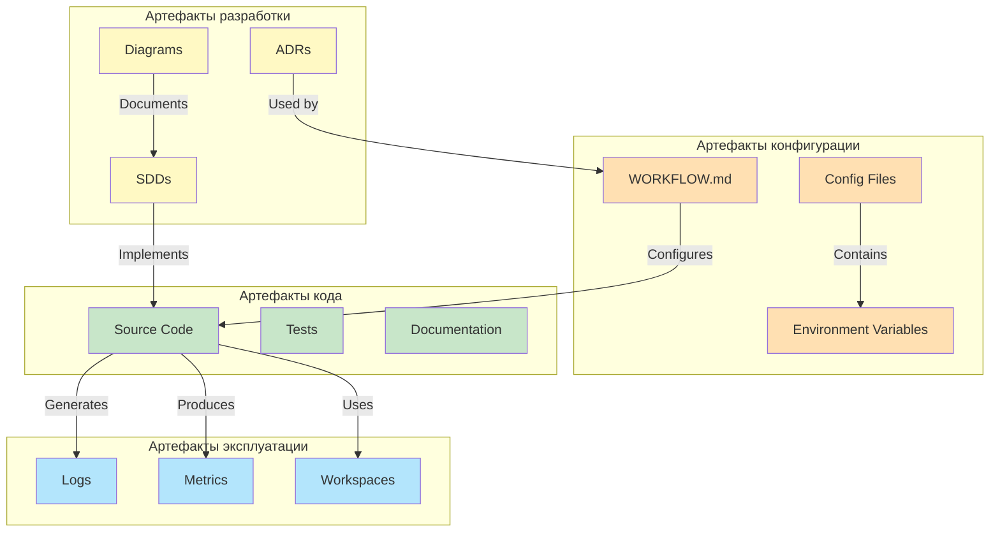
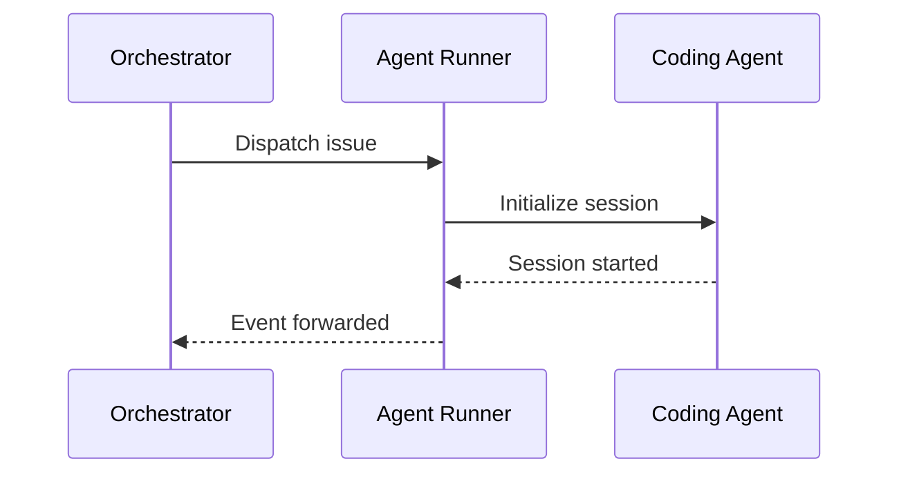
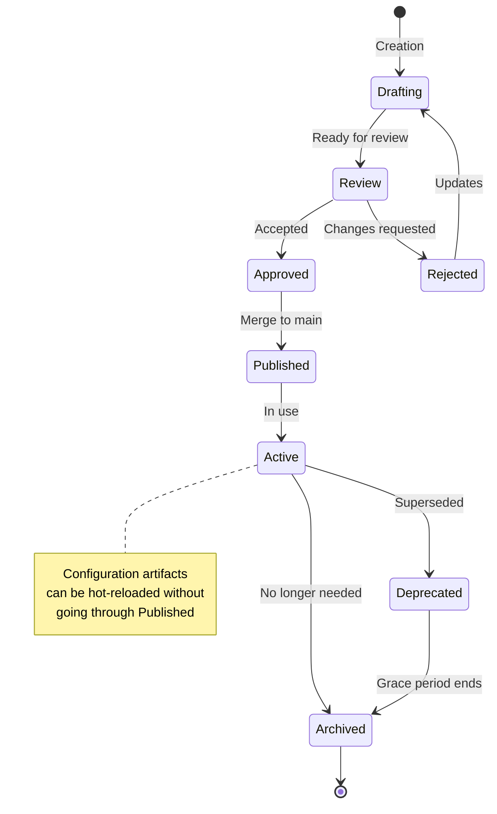
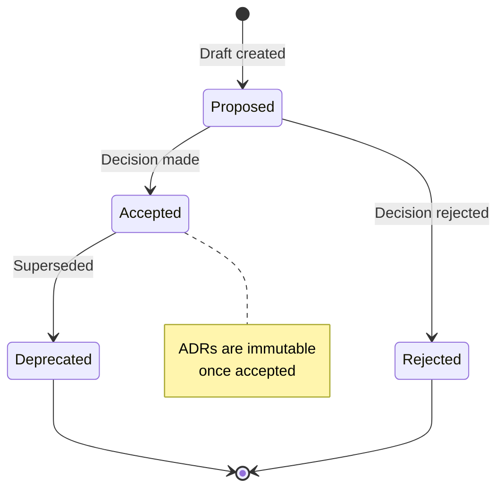
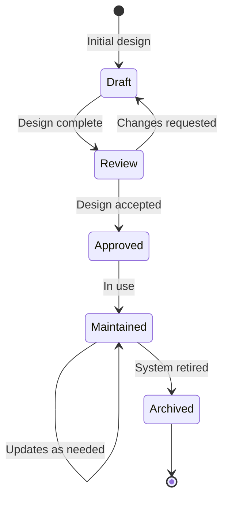
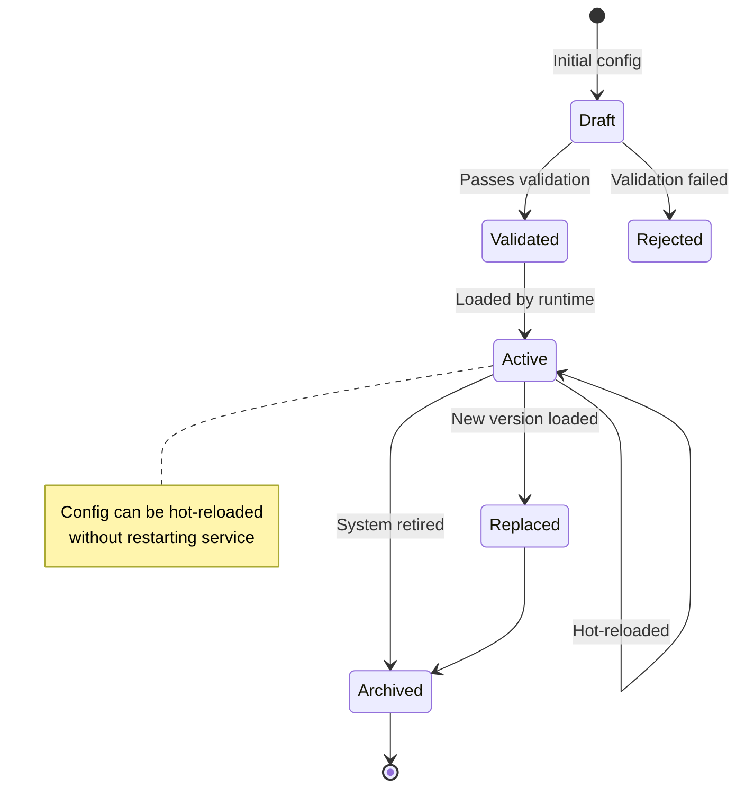
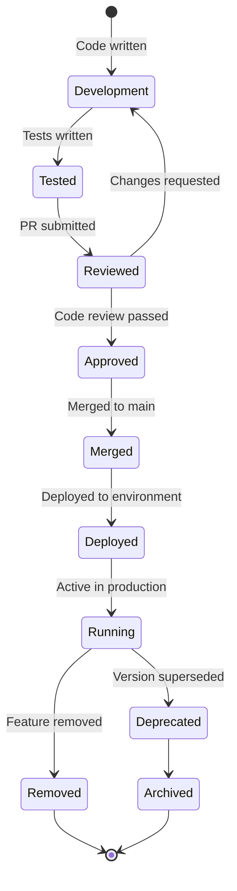
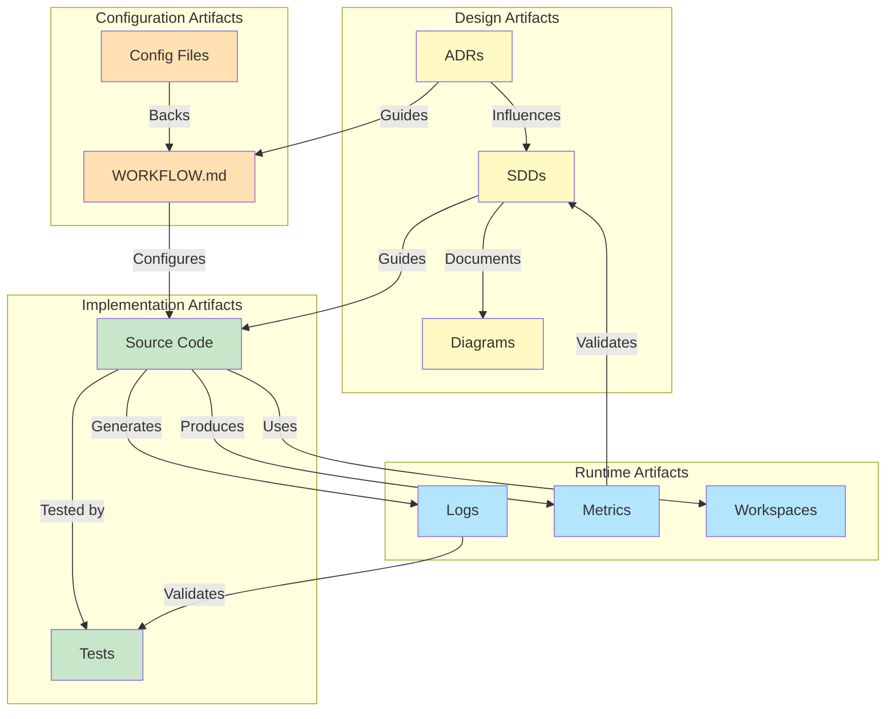
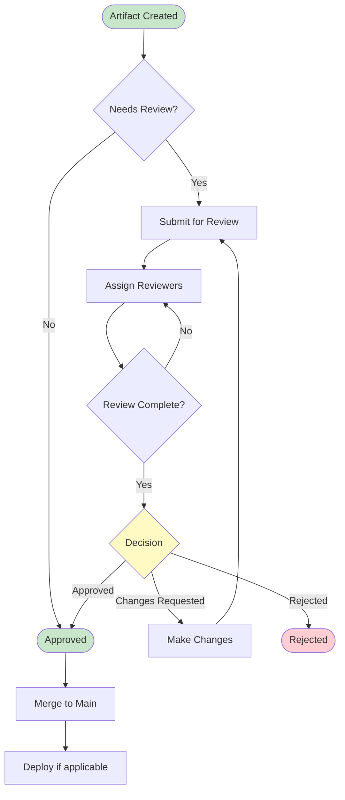

# Artifact Model

**Версия**: 1.0
**Статус**: Draft
**Последнее обновление**: 2026-04-11

---

## 1. Обзор артефактов процесса сборки

Artifact Model определяет типы артефактов, создаваемых в процессе разработки и эксплуатации Symphony, их жизненный цикл, стратегию хранения и взаимосвязи.

Артефакты - это любые сохраняемые outputs процесса разработки, deployment и эксплуатации системы.



---

## 2. Типы артефактов

### 2.1 Architecture Decision Records (ADRs)

**Назначение**: Формальная запись архитектурных решений

**Характеристики**:
- Формат: Markdown с structured header
- Локация: `docs/adr/`
- Нумерация: Sequential (e.g., `001-xxx.md`)
- Версионность: Immutable (never edited, only superseded)

**Структура ADR**:
```markdown
# ADR-XXX: [Title]

## Status
[Proposed | Accepted | Deprecated | Superseded]

## Context
[Background and problem statement]

## Decision
[The decision made]

## Consequences
[Positive and negative consequences]

## Alternatives Considered
[Other options explored]

## References
[Links to related ADRs, specs, discussions]
```

**Примеры**:
- Выбор issue tracker (Linear vs Jira)
- Стратегия workspace isolation
- Approvals policy (high-trust vs strict)
- Схема аутентификации

**См.**: [SPEC.md](../../SPEC.md), [SDD.md](SDD.md)

---

### 2.2 System Design Documents (SDDs)

**Назначение**: High-level описание системы и архитектуры

**Характеристики**:
- Формат: Markdown с Mermaid diagrams
- Локация: `docs/architecture/`
- Версионность: Evolving (updated as design matures)
- Ревизии: Git-based versioning

**Типы SDDs**:
- `SDD.md` - Main system design document
- `CONTEXT.md` - System context и границы
- `COMPONENTS.md` - Component breakdown
- `DOMAIN-MODEL.md` - Domain entities и relationships
- `INTEGRATIONS.md` - External system integrations
- `ARTIFACT-MODEL.md` - Этот документ
- `CONFIGURATION-MODEL.md` - Configuration management
- `OBSERVABILITY.md` - Observability strategy
- `SECURITY.md` - Security model
- `DEPLOYMENT.md` - Deployment strategy

**См.**: [docs/architecture/](../architecture/)

---

### 2.3 Diagrams

**Назначение**: Визуальное представление архитектуры и процессов

**Характеристики**:
- Формат: Mermaid diagrams embedded в Markdown
- Типы: sequence diagrams, state diagrams, flowcharts, ER diagrams, etc.
- Локация: Embedded в documentation files
- Версионность: Git-tracked

**Типы диаграмм**:
- **Sequence diagrams** - Interaction flows между components
- **State diagrams** - Entity lifecycles и state transitions
- **Flowcharts** - Control flows и algorithms
- **ER diagrams** - Entity relationships и data models
- **Component diagrams** - Component architecture и dependencies
- **Deployment diagrams** - Deployment topology

**Пример**:


**См.**: [COMPONENTS.md](COMPONENTS.md), [DOMAIN-MODEL.md](DOMAIN-MODEL.md)

---

### 2.4 Configurations

**Назначение**: Runtime конфигурация системы

**Характеристики**:
- Формат: YAML (front matter) + Markdown (prompt body)
- Локация: `WORKFLOW.md` в репозитории
- Environment variables: `$VAR_NAME` syntax
- Версионность: Git-tracked, hot-reloadable

**Основной config artifact**:
- `WORKFLOW.md` - Main workflow configuration file

**См.**: [SPEC.md, Section 5](../../SPEC.md#5-workflow-specification-repository-contract), [CONFIGURATION-MODEL.md](CONFIGURATION-MODEL.md)

---

### 2.5 Code Artifacts

**Назначение**: Implementable source code и tests

**Характеристики**:
- Формат: Python (основной), доп. языки для интеграций
- Локация: `runtime/`, `agents/`, `integrations/`, `tests/`
- Версионность: Git-tracked
- Dependencies: `requirements.txt`, `pyproject.toml`

**Типы code artifacts**:
- **Source code**: Implementation компонентов
- **Tests**: Unit tests, integration tests, end-to-end tests
- **Scripts**: Utility scripts, deployment scripts
- **Documentation**: Code documentation (docstrings, README.md)
- **Dependencies**: Requirements files, lock files

**См.**: [COMPONENTS.md](COMPONENTS.md)

---

## 3. Жизненный цикл артефактов

### 3.1 General Lifecycle



### 3.2 ADR Lifecycle



**Статусы ADR**:
- `Proposed` - Новый ADR на review
- `Accepted` - Решение принято и реализовано
- `Deprecated` - Решение устарело, заменено другим
- `Superseded` - Заменено другим ADR

### 3.3 SDD Lifecycle



**Статусы SDD**:
- `Draft` - Initial design document
- `Review` - Ready for review
- `Approved` - Design accepted for implementation
- `Maintained` - Active design, may evolve
- `Archived` - No longer relevant

### 3.4 Configuration Lifecycle



**Статусы Configuration**:
- `Draft` - New configuration being developed
- `Validated` - Passes all validation rules
- `Active` - Currently loaded and in use
- `Replaced` - Superseded by new version
- `Archived` - No longer needed

### 3.5 Code Artifact Lifecycle



**Статусы Code Artifact**:
- `Development` - Code being written
- `Tested` - Tests passing locally
- `Reviewed` - Under code review
- `Approved` - Ready to merge
- `Merged` - Merged to main branch
- `Deployed` - Deployed to environment
- `Running` - Active in production
- `Deprecated` - Superseded by new version
- `Removed` - Feature removed from codebase
- `Archived` - No longer in active use

---

## 4. Стратегия хранения артефактов

### 4.1 Version Control Strategy

**Основной репозиторий**: Git

**Структура репозитория**:
```
py-symphony/
├── docs/
│   ├── adr/                    # Architecture Decision Records
│   │   ├── 001-tracker-choice.md
│   │   └── 002-workspace-isolation.md
│   ├── architecture/           # System Design Documents
│   │   ├── SDD.md
│   │   ├── CONTEXT.md
│   │   ├── COMPONENTS.md
│   │   ├── DOMAIN-MODEL.md
│   │   ├── INTEGRATIONS.md
│   │   ├── ARTIFACT-MODEL.md   # Этот документ
│   │   ├── CONFIGURATION-MODEL.md
│   │   ├── OBSERVABILITY.md
│   │   ├── SECURITY.md
│   │   └── DEPLOYMENT.md
│   └── README.md
├── runtime/                    # Runtime implementation
├── agents/                      # Agent implementations
├── integrations/                # External integrations
├── tests/                       # Test suites
├── WORKFLOW.md                  # Workflow configuration
└── README.md
```

**Версионирование**:
- **ADRs**: Immutable, sequential numbering, never edited after acceptance
- **SDDs**: Evolving, updated as design matures
- **Code**: Git-based versioning, semantic versioning for releases
- **Config**: Git-tracked, hot-reloadable at runtime

### 4.2 Artifact Storage Locations

| Artifact Type | Location | Versioning | Hot-Reloadable |
|---------------|----------|------------|----------------|
| ADRs | `docs/adr/` | Immutable | No |
| SDDs | `docs/architecture/` | Git-tracked | No |
| Diagrams | Embedded in docs | Git-tracked | No |
| Configs | `WORKFLOW.md` (repo root) | Git-tracked | Yes |
| Code | `runtime/`, `agents/`, `integrations/` | Git-tracked | No |
| Tests | `tests/` | Git-tracked | No |
| Logs | `logs/` (filesystem) | Rotated | N/A |
| Workspaces | Configurable workspace root | Ephemeral | N/A |
| Metrics | Optional storage | Ephemeral | N/A |

### 4.3 Artifact Access Control

**Доступ для чтения**:
- Все разработчики: Полный доступ ко всем artifact types
- Operations: Доступ к configs, logs, metrics, workspaces
- Public: Доступ к public documentation (если применимо)

**Доступ для записи**:
- ADRs: Architects, tech leads
- SDDs: Architects, tech leads, senior developers
- Configs: Team leads, operations
- Code: All developers (with review)

**См.**: [SECURITY.md](SECURITY.md)

---

## 5. Взаимосвязи артефактов

### 5.1 Dependency Graph



### 5.2 Artifact Traceability

**ADRs → SDDs**:
- Каждое архитектурное решение реализовано в SDDs
- Ссылки на ADRs из SDDs для traceability

**SDDs → Code**:
- SDDs содержат architecture decisions
- Code реализует decisions из SDDs
- Code references SDDs в comments для traceability

**Config → Runtime**:
- `WORKFLOW.md` конфигурирует runtime behavior
- Config references SDDs для context
- Runtime validates config против schema

**Code → Tests**:
- Code покрывается tests для verification
- Tests validate behavior specified в SDDs

**Runtime → Logs/Metrics**:
- Runtime генерирует logs для observability
- Logs trace execution для debugging
- Metrics track performance для monitoring

**Logs/Metrics → Feedback**:
- Logs и metrics используются для improvement
- Insights из logs → новые ADRs или SDD updates

### 5.3 Artifact Relationships Matrix

| Artifact | Depends On | Produced By | Consumed By |
|----------|------------|-------------|-------------|
| ADR | Requirements, prior ADRs | Architects, tech leads | SDDs, configs, code |
| SDD | ADRs, requirements | Architects, tech leads | Code, tests, docs |
| Diagram | SDDs, code | Architects, developers | Documentation, reviews |
| Config | SDDs, ADRs | Team leads, ops | Runtime |
| Code | SDDs, ADRs, configs | Developers | Runtime, tests |
| Tests | SDDs, code | Developers, QA | CI/CD, verification |
| Logs | Runtime, code | Runtime | Ops, debugging |
| Metrics | Runtime, code | Runtime | Monitoring, ops |
| Workspaces | Config, code | Runtime | Agents |

---

## 6. Artifact Versioning Strategy

### 6.1 Semantic Versioning для Code

**Формат**: `MAJOR.MINOR.PATCH` (semver)

**Правила**:
- **MAJOR**: Breaking changes, incompatible API changes
- **MINOR**: New features, backward-compatible additions
- **PATCH**: Bug fixes, backward-compatible fixes

**Примеры**:
- `1.0.0` → `1.0.1` (bug fix)
- `1.0.0` → `1.1.0` (new feature)
- `1.0.0` → `2.0.0` (breaking change)

**См.**: [SPEC.md](../../SPEC.md)

### 6.2 Versioning для Configs

**Формат**: Git-based versioning

**Правила**:
- Configs versioned через Git commits
- Hot-reloadable при changes
- Validation на load time

**Примеры**:
- Commit hash: `abc1234`
- Tag: `v1.0.0-config`
- Branch: `config/feature-xyz`

### 6.3 Versioning для Documentation

**Формат**: Document version + Git-based versioning

**Правила**:
- Каждый документ имеет `Версия` field
- Изменения документируются в `Последнее обновление`
- Git history обеспечивает historical traceability

**Примеры**:
- Document version: `1.0`
- Last updated: `2026-04-11`
- Git hash: `def5678`

---

## 7. Artifact Retention and Cleanup

### 7.1 Retention Policies

| Artifact Type | Retention Policy | Cleanup Strategy |
|---------------|------------------|------------------|
| ADRs | Permanent (never deleted) | Archive superseded ADRs |
| SDDs | Permanent (never deleted) | Archive outdated SDDs |
| Diagrams | Permanent (never deleted) | Archive outdated diagrams |
| Configs | Git-tracked (permanent) | N/A |
| Code | Git-tracked (permanent) | N/A |
| Tests | Git-tracked (permanent) | N/A |
| Logs | Configurable retention (e.g., 30 days) | Rotated logs, archived logs |
| Metrics | Configurable retention (e.g., 90 days) | Archived metrics |
| Workspaces | Cleared for terminal issues | Startup cleanup, reconciliation |

### 7.2 Log Rotation

**Rotation Strategy**:
- **Size-based**: Rotate when log file reaches configured size (e.g., 100 MB)
- **Time-based**: Rotate at configured intervals (e.g., daily)
- **Compression**: Compress rotated logs (e.g., gzip)
- **Retention**: Keep configured number of rotated logs (e.g., 30 days)

**См.**: [OBSERVABILITY.md](OBSERVABILITY.md)

### 7.3 Workspace Cleanup

**Cleanup Triggers**:
- **Startup cleanup**: Remove workspaces для terminal-state issues
- **Reconciliation cleanup**: Remove workspaces для issues, ставших terminal
- **Manual cleanup**: Operator-triggered cleanup

**См.**: [SPEC.md, Section 8.6](../../SPEC.md#86-startup-terminal-workspace-cleanup)

---

## 8. Artifact Validation

### 8.1 Config Validation

**Validation Checks** ([SPEC.md, Section 6.3](../../SPEC.md#63-dispatch-preflight-validation)):
- Workflow file можно load и parse
- `tracker.kind` присутствует и supported
- `tracker.api_key` присутствует после `$` resolution
- `tracker.project_slug` присутствует когда required
- `codex.command` присутствует и non-empty

**См.**: [CONFIGURATION-MODEL.md](CONFIGURATION-MODEL.md)

### 8.2 Code Validation

**Validation Checks**:
- **Linting**: Code style checks (e.g., flake8, pylint)
- **Type checking**: Static type checking (e.g., mypy)
- **Tests**: Unit tests, integration tests, end-to-end tests
- **CI/CD**: Automated validation pipeline

### 8.3 Documentation Validation

**Validation Checks**:
- **Markdown linting**: Markdown syntax validation
- **Diagram rendering**: Mermaid diagrams render correctly
- **Link checking**: All links are valid
- **Spelling**: Spell checking for documentation

---

## 9. Artifact Governance

### 9.1 Review Process

**ADR Review**:
- Proposed → Review → Accepted/Rejected
- Reviewed by architects, tech leads
- Decision recorded в ADR status

**SDD Review**:
- Draft → Review → Approved
- Reviewed by architects, tech leads, senior developers
- Feedback incorporated до approval

**Code Review**:
- Development → PR → Review → Approved/Merged
- Reviewed by peers, tech leads
- Automated tests должны pass

**Config Review**:
- Changes reviewed для production configs
- Validation checks before deployment
- Rollback strategy planned

### 9.2 Approval Workflow



---

## 10. Связь с другими документами

- **[SDD.md](SDD.md)** - System Design Document, architectural decisions
- **[CONTEXT.md](CONTEXT.md)** - System context и границы
- **[COMPONENTS.md](COMPONENTS.md)** - Component breakdown
- **[DOMAIN-MODEL.md](DOMAIN-MODEL.md)** - Domain entities
- **[INTEGRATIONS.md](INTEGRATIONS.md)** - External integrations
- **[CONFIGURATION-MODEL.md](CONFIGURATION-MODEL.md)** - Configuration management
- **[OBSERVABILITY.md](OBSERVABILITY.md)** - Observability strategy
- **[SECURITY.md](SECURITY.md)** - Security model
- **[DEPLOYMENT.md](DEPLOYMENT.md)** - Deployment strategy
- **[SPEC.md](../../SPEC.md)** - Полная техническая спецификация

---

## 11. TODO

### 11.1 Artifact Versioning Strategy

- [ ] Определить detailed versioning strategy для всех artifact types
- [ ] Добавить migration strategy для breaking changes
- [ ] Описать backward compatibility policies
- [ ] Добавить deprecation process для artifacts

### 11.2 Artifact Tracking

- [ ] Добавить artifact metadata tracking (creator, timestamp, dependencies)
- [ ] Описать dependency management между artifacts
- [ ] Добавить impact analysis для artifact changes
- [ ] Описать traceability matrix для requirements → artifacts

### 11.3 Artifact Automation

- [ ] Добавить automated artifact generation (diagrams, docs)
- [ ] Описать automated validation pipeline для всех artifacts
- [ ] Добавить automated cleanup policies для ephemeral artifacts
- [ ] Описать automated retention enforcement

### 11.4 Artifact Security

- [ ] Описать security considerations для artifact storage
- [ ] Добавить access control policies для sensitive artifacts
- [ ] Описать encryption strategy для confidential artifacts
- [ ] Добавить audit logging для artifact access

### 11.5 Artifact Metrics

- [ ] Определить metrics для artifact quality
- [ ] Добавить KPIs для artifact lifecycle management
- [ ] Описать reporting strategy для artifact governance
- [ ] Добавить automated alerts для artifact violations
