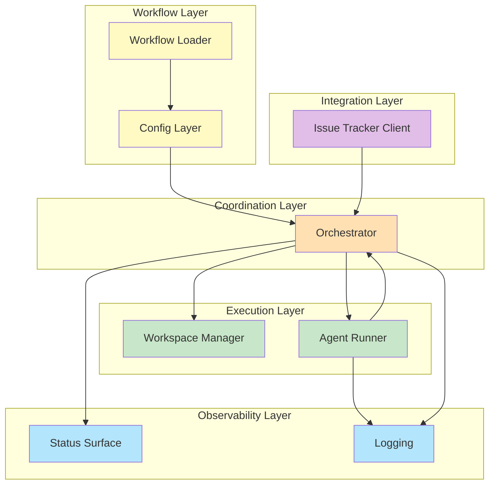
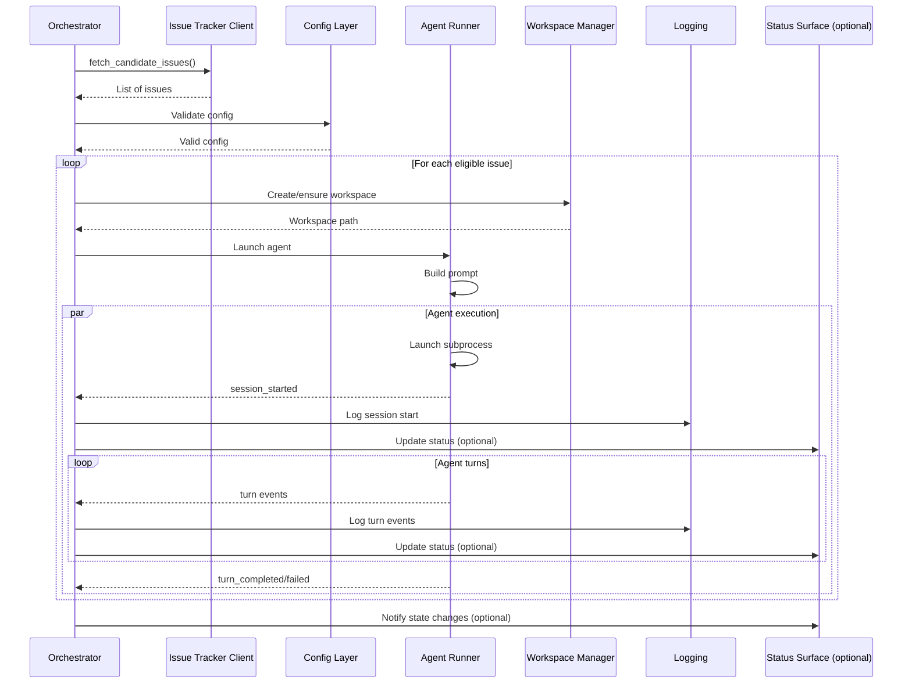
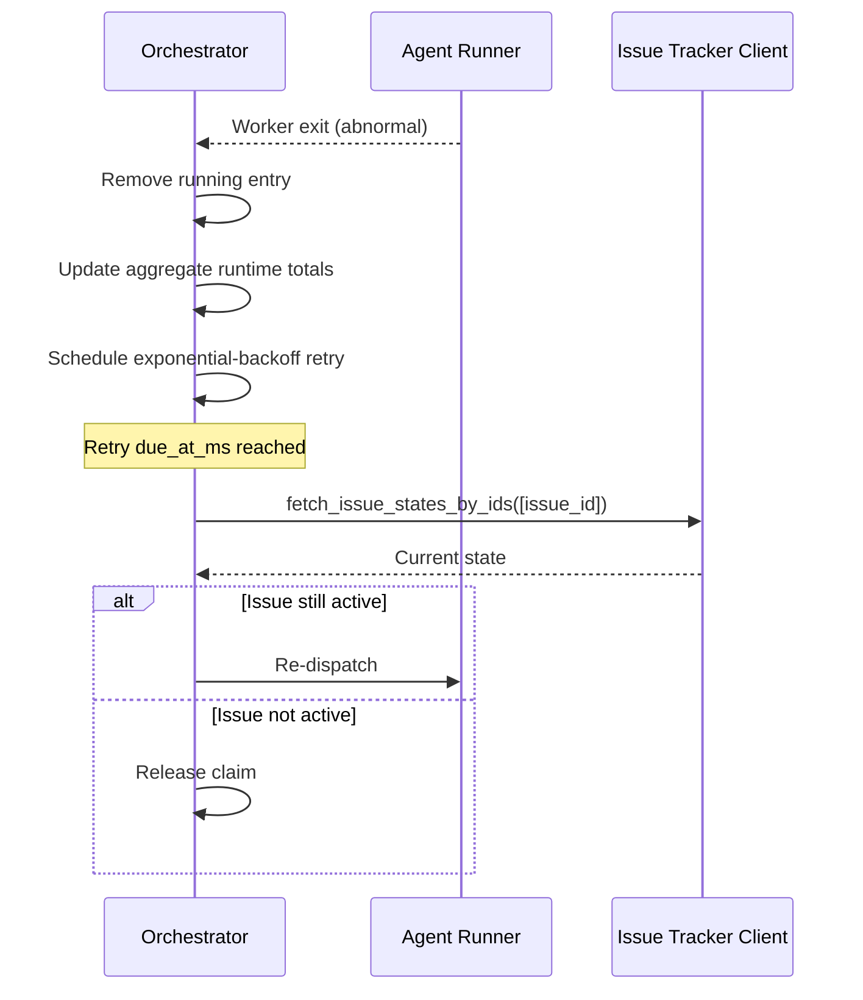
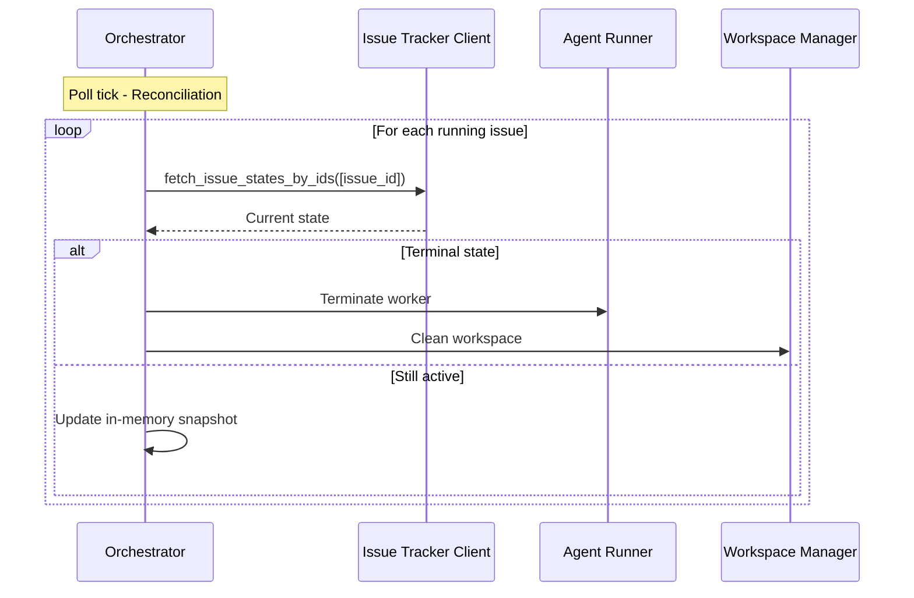

# Компоненты

**Версия**: 1.0
**Статус**: Draft
**Последнее обновление**: 2026-04-11

---

## 1. Обзор компонентов

Symphony состоит из 8 основных компонентов, определенных в [SPEC.md, Section 3.1](../../SPEC.md#31-main-components):



---

## 2. Workflow Layer

### 2.1 Workflow Loader

**Назначение**: Чтение и парсинг `WORKFLOW.md`

**Ответственности**:
- Чтение `WORKFLOW.md` из файловой системы
- Парсинг YAML front matter и prompt body
- Возврат `{config, prompt_template}`
- Обработка ошибок парсинга

**Входные данные**:
- Путь к `WORKFLOW.md` (по умолчанию: текущая директория)
- Markdown файл с опциональным YAML front matter

**Выходные данные**:
```python
{
    "config": dict,           # YAML front matter root object
    "prompt_template": str    # Trimmed markdown body
}
```

**Ошибки**:
- `missing_workflow_file` - Файл не найден
- `workflow_parse_error` - Ошибка парсинга
- `workflow_front_matter_not_a_map` - Front matter не является map

**См.**: [SPEC.md, Section 5](../../SPEC.md#5-workflow-specification-repository-contract)

---

### 2.2 Config Layer

**Назначение**: Типизированные getters для workflow config values

**Ответственности**:
- Предоставление типизированных getters для workflow config values
- Применение defaults и resolution environment variable indirection
- Валидация, используемая orchestrator перед dispatch
- Поддержка динамической перезагрузки

**Входные данные**:
- `WorkflowDefinition.config` из Workflow Loader
- Environment variables для `$VAR_NAME` resolution

**Выходные данные**:
Типизированные значения config:
- `tracker.kind`, `tracker.endpoint`, `tracker.api_key`, `tracker.project_slug`
- `tracker.active_states`, `tracker.terminal_states`
- `polling.interval_ms`
- `workspace.root`
- `agent.max_concurrent_agents`, `agent.max_retry_backoff_ms`, `agent.max_concurrent_agents_by_state`
- `codex.command`, `codex.approval_policy`, `codex.thread_sandbox`, `codex.turn_sandbox_policy`
- `codex.turn_timeout_ms`, `codex.read_timeout_ms`, `codex.stall_timeout_ms`
- `hooks.after_create`, `hooks.before_run`, `hooks.after_run`, `hooks.before_remove`
- `hooks.timeout_ms`

**Поведение**:
- Возвращает typed values с примененными defaults
- Разрешает `$VAR_NAME` environment variable indirection
- Expands `~` для home directory
- Валидирует конфигурацию перед dispatch

**См.**: [SPEC.md, Section 6](../../SPEC.md#6-configuration-specification)

---

## 3. Coordination Layer

### 3.1 Orchestrator

**Назначение**: Центральный координатор планирования и выполнения

**Ответственности**:
- Владение poll tick
- Владение in-memory runtime state (единственный source of truth)
- Принятие решений о dispatch, retry, stop, release
- Трекирование session metrics и retry queue state
- Конкурентная защита (serializes state mutations)
- Reconciliation running issues

**Входные данные**:
- Config из Config Layer
- Issues из Issue Tracker Client
- Events из Agent Runner
- Workflow из Workflow Loader

**Выходные данные**:
- Dispatch commands для Agent Runner
- Workspace commands для Workspace Manager
- Runtime state для Status Surface
- Structured logs для Logging

**Runtime State** ([SPEC.md, Section 4.1.8](../../SPEC.md#418-orchestrator-runtime-state)):
```python
{
    "poll_interval_ms": int,              # Current effective poll interval
    "max_concurrent_agents": int,         # Current effective global concurrency limit
    "running": dict,                      # issue_id -> running entry
    "claimed": set,                       # Set of issue IDs reserved/running/retrying
    "retry_attempts": dict,               # issue_id -> RetryEntry
    "completed": set,                     # Set of issue IDs (bookkeeping only)
    "codex_totals": dict,                 # Aggregate tokens + runtime seconds
    "codex_rate_limits": dict            # Latest rate-limit snapshot
}
```

**Поведение**:
1. **Poll tick**:
   - Reconcile active runs
   - Validate config
   - Fetch candidate issues
   - Sort by priority
   - Dispatch while slots available

2. **Dispatch eligibility**:
   - Issue имеет `id`, `identifier`, `title`, `state`
   - State в `active_states` и не в `terminal_states`
   - Issue не в `running` или `claimed`
   - Global concurrency slots доступны
   - Per-state concurrency slots доступны
   - Blocker rule для `Todo` state passes

3. **Retry scheduling**:
   - Normal continuation retries: 1000 ms fixed delay
   - Failure-driven retries: exponential backoff с cap
   - Formula: `min(10000 * 2^(attempt - 1), max_retry_backoff_ms)`

4. **Reconciliation**:
   - Stall detection: terminate если `elapsed_ms > stall_timeout_ms`
   - Tracker state refresh: fetch current states для running issues
   - Terminal state: terminate worker + clean workspace
   - Non-active state: terminate worker without workspace cleanup

**См.**: [SPEC.md, Section 7](../../SPEC.md#7-orchestration-state-machine), [SPEC.md, Section 8](../../SPEC.md#8-polling-scheduling-and-reconciliation)

---

## 4. Integration Layer

### 4.1 Issue Tracker Client

**Назначение**: Абстракция над issue tracker API (Linear)

**Ответственности**:
- Получение candidate issues в active states
- Получение текущих состояний для specific issue IDs (reconciliation)
- Получение terminal-state issues при startup cleanup
- Нормализация tracker payloads в стабильный issue model

**Входные данные**:
- Tracker config из Config Layer
- Query parameters (project slug, states, issue IDs)

**Выходные данные**:
- List of normalized `Issue` entities

**Операции**:
- `fetch_candidate_issues()` - Return issues в active states для проекта
- `fetch_issues_by_states(state_names)` - Используется для startup terminal cleanup
- `fetch_issue_states_by_ids(issue_ids)` - Используется для active-run reconciliation

**Нормализация** ([SPEC.md, Section 4.1.1](../../SPEC.md#411-issue)):
```python
{
    "id": str,                           # Stable tracker-internal ID
    "identifier": str,                   # Human-readable ticket key (e.g., "ABC-123")
    "title": str,
    "description": Optional[str],
    "priority": Optional[int],           # Lower numbers = higher priority
    "state": str,
    "branch_name": Optional[str],
    "url": Optional[str],
    "labels": List[str],                 # Normalized to lowercase
    "blocked_by": List[dict],            # Each: {id, identifier, state}
    "created_at": Optional[timestamp],
    "updated_at": Optional[timestamp]
}
```

**Ошибки**:
- `unsupported_tracker_kind`
- `missing_tracker_api_key`
- `missing_tracker_project_slug`
- `linear_api_request` (transport failures)
- `linear_api_status` (non-200 HTTP)
- `linear_graphql_errors`
- `linear_unknown_payload`
- `linear_missing_end_cursor` (pagination integrity error)

**См.**: [SPEC.md, Section 11](../../SPEC.md#11-issue-tracker-integration-contract-linear-compatible), [INTEGRATIONS.md](INTEGRATIONS.md#linear-integration)

---

## 5. Execution Layer

### 5.1 Workspace Manager

**Назначение**: Управление workspace lifecycle

**Ответственности**:
- Маппинг issue identifiers в workspace paths
- Обеспечение существования per-issue workspace directories
- Выполнение workspace lifecycle hooks
- Очистка workspaces для terminal issues

**Входные данные**:
- Issue identifier из Orchestrator
- Workspace root config из Config Layer
- Hooks config из Config Layer

**Выходные данные**:
- Workspace path
- Hook execution results

**Workspace Layout** ([SPEC.md, Section 9.1](../../SPEC.md#91-workspace-layout)):
```
<workspace.root>/<sanitized_issue_identifier>/
```

**Workspace Creation Algorithm**:
1. Sanitize identifier в `workspace_key` (замена non-alphanumeric на `_`)
2. Compute workspace path под workspace root
3. Ensure workspace path существует как directory
4. Mark `created_now=true` только если directory создан во время вызова
5. Если `created_now=true`, выполнить `after_create` hook

**Workspace Hooks** ([SPEC.md, Section 9.4](../../SPEC.md#94-workspace-hooks)):
- `after_create` - Runs только когда workspace directory newly created (fatal failure)
- `before_run` - Runs перед каждой agent attempt после workspace preparation (fatal failure)
- `after_run` - Runs после каждой agent attempt (logged, ignored on failure)
- `before_remove` - Runs перед workspace deletion (logged, ignored on failure)

**Hook execution**:
- Выполняется в shell context с workspace directory как `cwd`
- Timeout: `hooks.timeout_ms` (default: 60000 ms)
- POSIX systems: `sh -lc <script>` или `bash -lc <script>`

**Безопасность** ([SPEC.md, Section 9.5](../../SPEC.md#95-safety-invariants)):
- Инвариант 1: Run coding agent только в per-issue workspace path
- Инвариант 2: Workspace path должен находиться внутри workspace root
- Инвариант 3: Workspace key sanitized (только `[A-Za-z0-9._-]`)

**См.**: [SPEC.md, Section 9](../../SPEC.md#9-workspace-management-and-safety)

---

### 5.2 Agent Runner

**Назначение**: Обёртка для coding agent execution

**Ответственности**:
- Создание/reuse workspace для issue
- Построение prompt из workflow template
- Запуск coding agent subprocess (app-server mode)
- Стриминг agent updates к orchestrator
- Обработка timeouts и errors

**Входные данные**:
- Issue из Orchestrator
- Workflow config и prompt template из Workflow Loader
- Workspace path из Workspace Manager
- Codex config из Config Layer

**Выходные данные**:
- Agent events к orchestrator
- Session metrics

**Launch Contract** ([SPEC.md, Section 10.1](../../SPEC.md#101-launch-contract)):
- Command: `codex.command` (default: `codex app-server`)
- Invocation: `bash -lc <codex.command>`
- Working directory: workspace path
- Stdout/stderr: separate streams
- Framing: line-delimited JSON-RPC messages на stdout

**Session Startup Handshake** ([SPEC.md, Section 10.2](../../SPEC.md#102-session-startup-handshake)):
```json
{"id":1,"method":"initialize","params":{"clientInfo":{"name":"symphony","version":"1.0"},"capabilities":{}}}
{"method":"initialized","params":{}}
{"id":2,"method":"thread/start","params":{"approvalPolicy":"<impl>","sandbox":"<impl>","cwd":"/abs/workspace"}}
{"id":3,"method":"turn/start","params":{"threadId":"<thread-id>","input":[{"type":"text","text":"<prompt>"}],"cwd":"/abs/workspace","title":"ABC-123: Example","approvalPolicy":"<impl>","sandboxPolicy":{"type":"<impl>"}}}
```

**Streaming Turn Processing** ([SPEC.md, Section 10.3](../../SPEC.md#103-streaming-turn-processing)):
- Чтение line-delimited messages до turn termination
- Completion conditions: `turn/completed`, `turn/failed`, `turn/cancelled`, timeout, subprocess exit
- Continuation: если worker решает продолжить, issue другой `turn/start` на том же `threadId`

**Emitted Runtime Events** ([SPEC.md, Section 10.4](../../SPEC.md#104-emitted-runtime-events-upstream-to-orchestrator)):
- `session_started`, `startup_failed`
- `turn_completed`, `turn_failed`, `turn_cancelled`, `turn_ended_with_error`
- `turn_input_required`
- `approval_auto_approved`
- `unsupported_tool_call`
- `notification`, `other_message`, `malformed`

**Timeouts** ([SPEC.md, Section 10.6](../../SPEC.md#106-timeouts-and-error-mapping)):
- `read_timeout_ms`: request/response timeout (default: 5000 ms)
- `turn_timeout_ms`: total turn stream timeout (default: 3600000 ms / 1h)
- `stall_timeout_ms`: enforced by orchestrator (default: 300000 ms / 5m)

**См.**: [SPEC.md, Section 10](../../SPEC.md#10-agent-runner-protocol-coding-agent-integration)

---

## 6. Observability Layer

### 6.1 Status Surface (Optional)

**Назначение**: Представление runtime status для operators

**Ответственности**:
- Представление human-readable runtime status
- Демонстрация текущего состояния системы
- Optional: terminal output, dashboard, HTTP API

**Входные данные**:
- Runtime state из Orchestrator
- Agent events из Agent Runner

**Выходные данные**:
- Human-readable status (terminal, dashboard, etc.)
- JSON API responses (optional HTTP server)

**Dashboard Content** ([SPEC.md, Section 13.7.1](../../SPEC.md#1371-human-readable-dashboard-)):
- Active sessions
- Retry delays
- Token consumption
- Runtime totals
- Recent events
- Health/error indicators

**JSON REST API** ([SPEC.md, Section 13.7.2](../../SPEC.md#1372-json-rest-api-apiv1)):
- `GET /api/v1/state` - Runtime state summary

**Примечание**: Status surface is optional и не required для correctness

**См.**: [SPEC.md, Section 13.3](../../SPEC.md#133-runtime-snapshot-monitoring-interface-optional-but-recommended), [SPEC.md, Section 13.7](../../SPEC.md#137-optional-http-server-extension)

---

### 6.2 Logging

**Назначение**: Структурированное логирование runtime событий

**Ответственности**:
- Emission structured runtime logs к configured sinks
- Контекстual logging для issue-related operations
- Контекстual logging для coding-agent session lifecycle

**Входные данные**:
- Runtime events из всех компонентов
- Orchestrator state changes
- Agent events

**Выходные данные**:
- Structured logs к одному или нескольким sinks (stderr, files, remote)

**Required Context Fields** ([SPEC.md, Section 13.1](../../SPEC.md#131-logging-conventions)):
- Для issue-related logs: `issue_id`, `issue_identifier`
- Для session lifecycle logs: `session_id`

**Message Formatting Requirements**:
- Stable `key=value` phrasing
- Action outcome (`completed`, `failed`, `retrying`, etc.)
- Concise failure reason когда присутствует
- Избегать logging large raw payloads

**Outputs/Sinks**:
- Spec не предписывает где logs должны идти (stderr, file, remote sink, etc.)
- Operators должны видеть startup/validation/dispatch failures без debugger

**См.**: [SPEC.md, Section 13.1](../../SPEC.md#131-logging-conventions), [SPEC.md, Section 13.2](../../SPEC.md#132-logging-outputs-and-sinks)

---

## 7. Взаимодействие компонентов

### 7.1 Sequence Diagram: Poll Loop



### 7.2 Sequence Diagram: Retry Handling



### 7.3 Sequence Diagram: Reconciliation



---

## 8. Компонентные отношения

| Компонент | Зависимости | Потребители | Layer |
|-----------|-------------|-------------|-------|
| Workflow Loader | - | Config Layer | Workflow |
| Config Layer | Workflow Loader | Orchestrator | Configuration |
| Orchestrator | Config Layer, Issue Tracker Client, Agent Runner | Status Surface | Coordination |
| Issue Tracker Client | Config Layer | Orchestrator | Integration |
| Workspace Manager | Config Layer | Agent Runner | Execution |
| Agent Runner | Config Layer, Workflow Loader, Workspace Manager | Orchestrator | Execution |
| Status Surface | Orchestrator, Agent Runner | Operators | Observability |
| Logging | All components | - | Observability |

---

## 9. Конкурентность и синхронизация

### 9.1 Orchestrator State Protection

- **Single authority**: Orchestrator сериализует state mutations через один authority
- **Claimed set**: Проверки `claimed` и `running` обязательны перед запуском worker
- **Reconciliation priority**: Reconciliation выполняется перед dispatch на каждом tick

### 9.2 Workspace Access

- **Per-issue isolation**: Каждый issue имеет свой собственный workspace
- **No cross-workspace sharing**: Нет общего состояния между workspaces
- **Hook serialization**: Hooks выполняются последовательно в контексте одного workspace

### 9.3 Agent Communication

- **Unidirectional**: Agent → Orchestrator (events), Orchestrator → Agent (commands)
- **Async events**: Agent events асинхронно forwarded к orchestrator
- **Synchronous commands**: Dispatch команды synchronous до запуска subprocess

---

## 10. Связь с другими документами

- **[SDD.md](SDD.md)** - System Design Document, architectural decisions
- **[CONTEXT.md](CONTEXT.md)** - System context и границы
- **[SPEC.md](../../SPEC.md)** - Полная техническая спецификация
- **[DOMAIN-MODEL.md](DOMAIN-MODEL.md)** - Domain entities и их отношения
- **[INTEGRATIONS.md](INTEGRATIONS.md)** - Интеграции с внешними системами

---

## 11. TODO

### 11.1 Детали внутренних компонентов

- [ ] Добавить detailed internal algorithms для каждого компонента
- [ ] Описать internal data structures и invariants
- [ ] Добавить performance characteristics для каждого компонента
- [ ] Описать failure modes и recovery strategies для каждого компонента

### 11.2 Дополнительные sequence diagrams

- [ ] Добавить sequence diagram для startup initialization
- [ ] Добавить sequence diagram для graceful shutdown
- [ ] Добавить sequence diagram для dynamic config reload
- [ ] Добавить sequence diagram для error handling propagation

### 11.3 Component Interfaces

- [ ] Добавить detailed API specs для каждого компонента
- [ ] Описать contract между компонентами (input/output schemas)
- [ ] Добавить versioning strategy для component interfaces
- [ ] Описать extensibility points для каждого компонента
