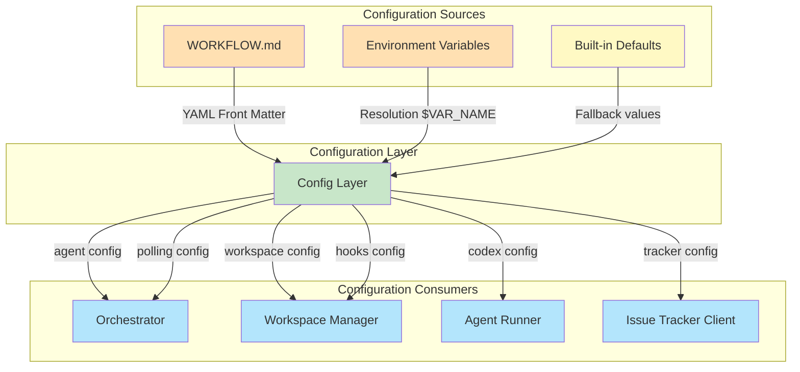
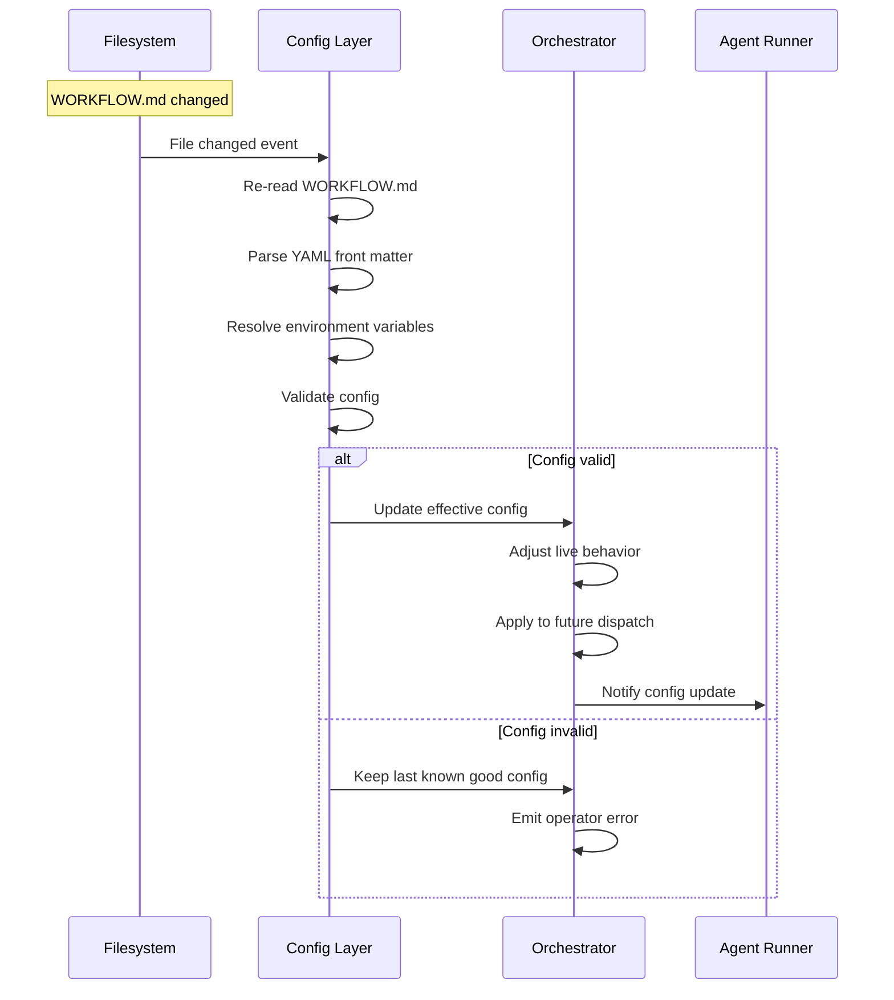

# Configuration Model

**Версия**: 1.0
**Статус**: Draft
**Последнее обновление**: 2026-04-11

---

## 1. Обзор управления конфигурацией

Configuration Model определяет формат, слои и стратегию управления конфигурацией для Symphony Service.

Конфигурация системы загружается из `WORKFLOW.md` файла, который находится в репозитории и version-controlled вместе с кодом. Это позволяет teams version-control agent prompt и runtime settings вместе с их code.



**См.**: [SPEC.md, Section 6](../../SPEC.md#6-configuration-specification)

---

## 2. Формат WORKFLOW.md

### 2.1 File Format

`WORKFLOW.md` - это Markdown файл с optional YAML front matter.

**Структура**:
```markdown
---
# YAML Front Matter (config section)
tracker:
  kind: linear
  api_key: $LINEAR_API_KEY
  project_slug: my-project
  # ... other config

polling:
  interval_ms: 30000

workspace:
  root: /tmp/symphony_workspaces

# ... more config
---

# Markdown Body (prompt section)

You are working on an issue from Linear.

## Task

{{ issue.title }}

{{ issue.description }}

## Instructions

Follow the workflow rules defined in the workflow policy.
```

### 2.2 Parsing Rules

**Parsing алгоритм** ([SPEC.md, Section 5.2](../../SPEC.md#52-file-format)):

1. Если file начинается с `---`, parse lines до следующего `---` как YAML front matter
2. Remaining lines становятся prompt body
3. Если front matter отсутствует, treat весь file как prompt body и используй empty config map
4. YAML front matter должен decode в map/object; non-map YAML это ошибка
5. Prompt body trimmed перед use

**Returned workflow object**:
```python
{
    "config": dict,           # Front matter root object
    "prompt_template": str    # Trimmed markdown body
}
```

### 2.3 Front Matter Schema

**Top-level keys** ([SPEC.md, Section 5.3](../../SPEC.md#53-front-matter-schema)):

- `tracker` - Issue tracker configuration
- `polling` - Polling configuration
- `workspace` - Workspace configuration
- `hooks` - Workspace hooks configuration
- `agent` - Agent configuration
- `codex` - Coding agent configuration

**Unknown keys** должны игнорироваться для forward compatibility.

**См.**: [SPEC.md, Section 5.3](../../SPEC.md#53-front-matter-schema)

---

## 3. Слои конфигурации

### 3.1 Configuration Layers

Конфигурация разрешается через несколько слоев с определенным приоритетом:


**Precedence** ([SPEC.md, Section 6.1](../../SPEC.md#61-source-precedence-and-resolution-semantics)):

1. **Built-in Defaults** - Lowest precedence
2. **WORKFLOW.md Config** - Overrides defaults
3. **Environment Resolution** - Highest precedence

### 3.2 Layer 1: Built-in Defaults

**Built-in defaults** предоставляются runtime implementation.

**Примеры defaults**:
- `tracker.endpoint`: `https://api.linear.app/graphql` (для `tracker.kind == "linear"`)
- `tracker.active_states`: `["Todo", "In Progress"]`
- `tracker.terminal_states`: `["Closed", "Cancelled", "Canceled", "Duplicate", "Done"]`
- `polling.interval_ms`: `30000`
- `workspace.root`: `<system-temp>/symphony_workspaces`
- `agent.max_concurrent_agents`: `10`
- `agent.max_retry_backoff_ms`: `300000`
- `codex.command`: `codex app-server`
- `codex.turn_timeout_ms`: `3600000`
- `codex.read_timeout_ms`: `5000`
- `codex.stall_timeout_ms`: `300000`
- `hooks.timeout_ms`: `60000`

**См.**: [SPEC.md, Section 6.4](../../SPEC.md#64-config-fields-summary-cheat-sheet)

### 3.3 Layer 2: WORKFLOW.md Config

**WORKFLOW.md config** загружается из YAML front matter.

**Пример**:
```yaml
tracker:
  kind: linear
  api_key: $LINEAR_API_KEY
  project_slug: my-project
  active_states:
    - Todo
    - In Progress
  terminal_states:
    - Closed
    - Cancelled

polling:
  interval_ms: 60000

workspace:
  root: /var/lib/symphony/workspaces

agent:
  max_concurrent_agents: 5
  max_retry_backoff_ms: 600000

hooks:
  after_create: |
    git clone https://github.com/myorg/myrepo.git .
  before_run: |
    git pull origin main
  timeout_ms: 120000
```

**См.**: [SPEC.md, Section 5.3](../../SPEC.md#53-front-matter-schema)

### 3.4 Layer 3: Environment Resolution

**Environment resolution** позволяет override config values через environment variables.

**Syntax**: `$VAR_NAME` внутри YAML values

**Примеры**:
```yaml
tracker:
  api_key: $LINEAR_API_KEY
  endpoint: $LINEAR_ENDPOINT  # Optional override

workspace:
  root: $WORKSPACE_ROOT

codex:
  command: $CODEX_COMMAND
```

**Resolution behavior**:
- `$VAR_NAME` заменяется на значение environment variable
- Если `$VAR_NAME` resolves в empty string, treat как missing
- Если environment variable не set, fallback на previous layer value

**Примечание**: Config values должны быть string literals или содержать `$VAR_NAME`. Complex expressions не поддерживаются.

**См.**: [SPEC.md, Section 6.1](../../SPEC.md#61-source-precedence-and-resolution-semantics)

---

## 4. Динамическая перезагрузка конфигурации

### 4.1 Dynamic Reload Requirements

**Dynamic reload required** ([SPEC.md, Section 6.2](../../SPEC.md#62-dynamic-reload-semantics)):

1. **File watching**: Software должен watch `WORKFLOW.md` для changes
2. **Re-read**: On change, re-read и re-apply workflow config и prompt template без restart
3. **Live behavior adjustment**: Attempt to adjust live behavior к new config
4. **Future dispatch**: Reloaded config applies к future dispatch, retry scheduling, reconciliation, hook execution, agent launches
5. **In-flight sessions**: Implementations не required автоматически restart in-flight agent sessions когда config changes
6. **Extensions**: Extensions, которые manage свои собственные listeners/resources (например HTTP server port change) могут require restart
7. **Defensive reload**: Implementations должны также re-validate/reload defensively во время runtime operations (например перед dispatch)
8. **Invalid reloads**: Invalid reloads не должны crash service; keep operating с last known good effective config и emit operator-visible error

### 4.2 Reloadable Config Fields

**Fully reloadable** (applies to future dispatch and operations):
- `polling.interval_ms` - Effective poll interval updated
- `tracker.active_states` - Active states для dispatch eligibility
- `tracker.terminal_states` - Terminal states для reconciliation
- `agent.max_concurrent_agents` - Global concurrency limit
- `agent.max_retry_backoff_ms` - Max retry backoff
- `agent.max_concurrent_agents_by_state` - Per-state concurrency limits
- `codex.*` - All codex settings для future agent launches
- `workspace.root` - Workspace root для future workspace creation
- `hooks.*` - Hooks для future executions
- `prompt_template` - Prompt template для future agent runs

**Partially reloadable** (may require restart):
- `tracker.endpoint` - May require new connection setup
- `tracker.api_key` - May require re-authentication
- `tracker.project_slug` - Affects candidate issue queries
- `server.port` (extension) - HTTP server port change requires restart/rebind

### 4.3 Reload Flow



**См.**: [SPEC.md, Section 6.2](../../SPEC.md#62-dynamic-reload-semantics)

---

## 5. Конфигурационная схема

### 5.1 Complete Config Schema

**Tracker Configuration** ([SPEC.md, Section 5.3.1](../../SPEC.md#531-tracker-object)):

| Field | Type | Required | Default | Description |
|-------|------|----------|---------|-------------|
| `kind` | string | Yes | - | Tracker kind (currently only `linear`) |
| `endpoint` | string | No | `https://api.linear.app/graphql` (для linear) | Tracker API endpoint |
| `api_key` | string or `$VAR` | Yes | - | API key (literal or `$VAR_NAME`) |
| `project_slug` | string | Yes (для linear) | - | Project slug для tracker |
| `active_states` | list of strings | No | `["Todo", "In Progress"]` | Active issue states для dispatch |
| `terminal_states` | list of strings | No | `["Closed", "Cancelled", "Canceled", "Duplicate", "Done"]` | Terminal issue states |

**Polling Configuration** ([SPEC.md, Section 5.3.2](../../SPEC.md#532-polling-object)):

| Field | Type | Required | Default | Description |
|-------|------|----------|---------|-------------|
| `interval_ms` | integer or string | No | `30000` | Polling interval в milliseconds |

**Workspace Configuration** ([SPEC.md, Section 5.3.3](../../SPEC.md#533-workspace-object)):

| Field | Type | Required | Default | Description |
|-------|------|----------|---------|-------------|
| `root` | path string or `$VAR` | No | `<system-temp>/symphony_workspaces` | Workspace root path |

**Hooks Configuration** ([SPEC.md, Section 5.3.4](../../SPEC.md#534-hooks-object)):

| Field | Type | Required | Default | Description |
|-------|------|----------|---------|-------------|
| `after_create` | multiline shell script | No | null | Script to run после workspace creation |
| `before_run` | multiline shell script | No | null | Script to run перед agent attempt |
| `after_run` | multiline shell script | No | null | Script to run после agent attempt |
| `before_remove` | multiline shell script | No | null | Script to run перед workspace deletion |
| `timeout_ms` | integer | No | `60000` | Hook timeout в milliseconds |

**Agent Configuration** ([SPEC.md, Section 5.3.5](../../SPEC.md#535-agent-object)):

| Field | Type | Required | Default | Description |
|-------|------|----------|---------|-------------|
| `max_concurrent_agents` | integer or string | No | `10` | Global concurrency limit |
| `max_retry_backoff_ms` | integer or string | No | `300000` | Max retry backoff в milliseconds |
| `max_concurrent_agents_by_state` | map | No | `{}` | Per-state concurrency limits |

**Codex Configuration** ([SPEC.md, Section 5.3.6](../../SPEC.md#536-codex-object)):

| Field | Type | Required | Default | Description |
|-------|------|----------|---------|-------------|
| `command` | string | No | `codex app-server` | Codex command to execute |
| `approval_policy` | Codex enum | No | Implementation-defined | Approval policy для codex |
| `thread_sandbox` | Codex enum | No | Implementation-defined | Sandbox mode для codex |
| `turn_sandbox_policy` | Codex enum | No | Implementation-defined | Sandbox policy для codex |
| `turn_timeout_ms` | integer | No | `3600000` | Turn timeout в milliseconds |
| `read_timeout_ms` | integer | No | `5000` | Read timeout в milliseconds |
| `stall_timeout_ms` | integer | No | `300000` | Stall timeout в milliseconds |

**Extensions**:

| Field | Type | Required | Default | Description |
|-------|------|----------|---------|-------------|
| `server.port` | integer | No | - | HTTP server port (optional extension) |

### 5.2 Config Types and Validation

**Types**:
- **string** - Text value
- **integer** - Numeric value
- **string or `$VAR`** - Literal string or environment variable reference
- **list of strings** - Array of strings
- **map** - Key-value pairs (state name → integer)
- **multiline shell script** - Multi-line shell script string

**Validation**:
- Type coercion: Strings to integers где применимо
- Required fields: Must be present и non-null
- Environment resolution: `$VAR_NAME` должен resolve в non-empty value
- Path expansion: `~` expanded для home directory, `$VAR` expanded
- Value ranges: Positive integers где применимо

**См.**: [SPEC.md, Section 6.3](../../SPEC.md#63-dispatch-preflight-validation)

---

## 6. Конфигурационные getters

### 6.1 Typed Getters

**Config Layer** предоставляет typed getters для всех config values.

**Пример API**:
```python
class ConfigLayer:
    def get_tracker_kind(self) -> str:
        """Get tracker kind."""

    def get_tracker_api_key(self) -> str:
        """Get tracker API key (environment resolved)."""

    def get_tracker_project_slug(self) -> str:
        """Get tracker project slug."""

    def get_tracker_active_states(self) -> List[str]:
        """Get active issue states."""

    def get_tracker_terminal_states(self) -> List[str]:
        """Get terminal issue states."""

    def get_polling_interval_ms(self) -> int:
        """Get polling interval in milliseconds."""

    def get_workspace_root(self) -> str:
        """Get workspace root path (expanded)."""

    def get_max_concurrent_agents(self) -> int:
        """Get global concurrency limit."""

    def get_max_retry_backoff_ms(self) -> int:
        """Get max retry backoff in milliseconds."""

    def get_max_concurrent_agents_by_state(self) -> Dict[str, int]:
        """Get per-state concurrency limits."""

    def get_codex_command(self) -> str:
        """Get codex command."""

    def get_codex_turn_timeout_ms(self) -> int:
        """Get codex turn timeout in milliseconds."""

    def get_codex_read_timeout_ms(self) -> int:
        """Get codex read timeout in milliseconds."""

    def get_codex_stall_timeout_ms(self) -> int:
        """Get codex stall timeout in milliseconds."""

    def get_hooks_after_create(self) -> Optional[str]:
        """Get after_create hook script."""

    def get_hooks_before_run(self) -> Optional[str]:
        """Get before_run hook script."""

    def get_hooks_after_run(self) -> Optional[str]:
        """Get after_run hook script."""

    def get_hooks_before_remove(self) -> Optional[str]:
        """Get before_remove hook script."""

    def get_hooks_timeout_ms(self) -> int:
        """Get hook timeout in milliseconds."""

    def get_server_port(self) -> Optional[int]:
        """Get HTTP server port (optional extension)."""
```

### 6.2 Path Expansion

**Path expansion rules** ([SPEC.md, Section 6.1](../../SPEC.md#61-source-precedence-and-resolution-semantics)):

- **Home expansion**: `~` expanded к user's home directory
- **Environment expansion**: `$VAR` expanded для environment-backed path values
- **Apply expansion**: Only к values intended как local filesystem paths
- **Do not rewrite**: URIs или arbitrary shell command strings

**Примеры**:
```yaml
workspace:
  root: ~/symphony_workspaces  # → /home/user/symphony_workspaces
  root: $WORKSPACE_ROOT        # → value of $WORKSPACE_ROOT environment variable
  root: /tmp/workspaces       # → /tmp/workspaces (no expansion)
```

**См.**: [SPEC.md, Section 6.1](../../SPEC.md#61-source-precedence-and-resolution-semantics)

---

## 7. Конфигурационные ошибки

### 7.1 Error Types

**File errors**:
- `missing_workflow_file` - WORKFLOW.md file не найден

**Parsing errors**:
- `workflow_parse_error` - YAML parsing error
- `workflow_front_matter_not_a_map` - Front matter не является map

**Validation errors**:
- `template_parse_error` - Template parsing error
- `template_render_error` - Template rendering error (unknown variable/filter)

**Config errors**:
- `unsupported_tracker_kind` - Tracker kind не поддерживается
- `missing_tracker_api_key` - Tracker API key отсутствует или empty
- `missing_tracker_project_slug` - Project slug отсутствует (для linear)
- `invalid_config_value` - Invalid config value

### 7.2 Error Handling

**Dispatch gating behavior** ([SPEC.md, Section 5.5](../../SPEC.md#55-workflow-validation-and-error-surface)):

- Workflow file read/YAML errors: Block new dispatches пока не fixed
- Template errors: Fail только affected run attempt
- Config validation errors: Skip dispatch для affected tick, emit operator-visible error

**Reload error handling** ([SPEC.md, Section 6.2](../../SPEC.md#62-dynamic-reload-semantics)):

- Invalid reloads: Keep operating с last known good effective config
- Emit operator-visible error
- Do not crash service

---

## 8. Configuration Best Practices

### 8.1 File Organization

**WORKFLOW.md location**:
- Default: Current process working directory
- Override: Explicit application/runtime setting
- Repository-owned: Version-controlled с code

**Config structure**:
- Logical grouping по функциональным областям
- Comments для non-obvious config values
- Use environment variables для sensitive values (API keys, secrets)

### 8.2 Sensitive Data

**Security considerations**:
- **Never commit** literal API keys или secrets в WORKFLOW.md
- **Use environment variables**: `$VAR_NAME` для sensitive values
- **Document required env vars**: В comments или README.md
- **Validate environment**: Ensure required env vars are set

**Пример**:
```yaml
tracker:
  api_key: $LINEAR_API_KEY  # Set via environment variable
```

**См.**: [SECURITY.md](SECURITY.md)

### 8.3 Configuration Validation

**Validation strategies**:
- **Startup validation**: Validate config перед starting scheduling loop
- **Per-tick validation**: Re-validate перед каждым dispatch cycle
- **Defensive validation**: Re-validate перед runtime operations
- **Error visibility**: Emit operator-visible errors для validation failures

**См.**: [SPEC.md, Section 6.3](../../SPEC.md#63-dispatch-preflight-validation)

---

## 9. Configuration Monitoring

### 9.1 Config Change Detection

**Change detection mechanisms**:
- **File watching**: Watch WORKFLOW.md для file changes
- **Inotify/FS Events**: Use OS-level file change notifications
- **Polling**: Fallback к periodic file stat checks
- **Hash verification**: Compare file hashes для true change detection

### 9.2 Config Audit Logging

**Audit logging**:
- Log config load events с timestamp
- Log config reload events с changes summary
- Log validation failures с error details
- Log environment variable resolution

**Log format**:
```
config_loaded path=WORKFLOW.md hash=abc1234
config_reloaded path=WORKFLOW.md changes="polling.interval_ms: 30000 -> 60000"
config_validation_failed field=tracker.api_key error="missing environment variable"
```

**См.**: [OBSERVABILITY.md](OBSERVABILITY.md)

---

## 10. Связь с другими документами

- **[SDD.md](SDD.md)** - System Design Document, architectural decisions
- **[CONTEXT.md](CONTEXT.md)** - System context и границы
- **[COMPONENTS.md](COMPONENTS.md)** - Component breakdown
- **[DOMAIN-MODEL.md](DOMAIN-MODEL.md)** - Domain entities
- **[ARTIFACT-MODEL.md](ARTIFACT-MODEL.md)** - Artifact lifecycle
- **[OBSERVABILITY.md](OBSERVABILITY.md)** - Observability strategy
- **[SECURITY.md](SECURITY.md)** - Security model
- **[DEPLOYMENT.md](DEPLOYMENT.md)** - Deployment strategy
- **[SPEC.md](../../SPEC.md)** - Полная техническая спецификация

---

## 11. TODO

### 11.1 Configuration Validation Rules

- [ ] Определить detailed validation rules для всех config fields
- [ ] Добавить schema validation (JSON Schema, Pydantic, etc.)
- [ ] Описать cross-field validation rules
- [ ] Добавить config value range validation

### 11.2 Configuration Migrations

- [ ] Определить migration strategy для config schema changes
- [ ] Добавить backward compatibility rules для breaking changes
- [ ] Описать deprecation process для deprecated config fields
- [ ] Добавить automated migration tools

### 11.3 Configuration Testing

- [ ] Добавить config validation tests
- [ ] Описать integration testing для different config scenarios
- [ ] Добавить performance testing для config reload
- [ ] Описать chaos testing для invalid config

### 11.4 Configuration Security

- [ ] Описать security best practices для config management
- [ ] Добавить secret management strategy
- [ ] Описать access control для config editing
- [ ] Добавить audit logging для config changes

### 11.5 Configuration Documentation

- [ ] Добавить config examples для common scenarios
- [ ] Описать config troubleshooting guide
- [ ] Добавить config migration guide для upgrades
- [ ] Описать config performance considerations
