# System Context

**Версия**: 1.0
**Статус**: Draft
**Последнее обновление**: 2026-04-11

---

## 1. Системные границы

Symphony - это **оркестратор coding agents**, который автоматизирует выполнение задач из issue tracker.

### 1.1 Внутри системы (In-Scope)

- **Polling issue tracker**: Получение задач с фиксированным интервалом
- **Workspace management**: Создание и управление изолированными workspace для каждой задачи
- **Agent orchestration**: Запуск и управление coding agent sessions
- **State management**: Авторитетное состояние orchestrator для dispatch, retries, reconciliation
- **Observability**: Structured logging и optional status surface
- **Workflow policy**: Загрузка и применение `WORKFLOW.md` из репозитория

### 1.2 Вне системы (Out-of-Scope)

- **Ticket writes**: Мутации issue tracker (state transitions, comments, PR links) выполняются coding agent через tools
- **Agent implementation**: Логика coding agent и его capabilities
- **Repository operations**: Git operations, code review, PR approval
- **CI/CD pipelines**: Build, test, deploy процессы
- **User authentication**: Аутентификация пользователей в issue tracker
- **Rich web UI**: Multi-tenant control plane или complex dashboard

---

## 2. Внешние зависимости

### 2.1 Issue Tracker (Linear)

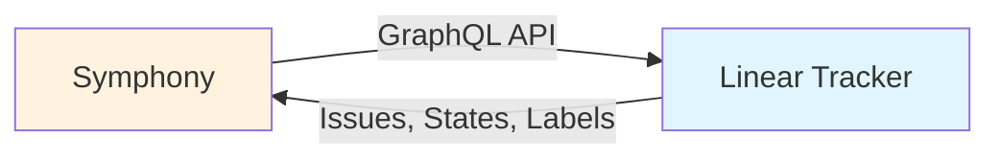

**Назначение**: Источник задач для выполнения

**Операции**:
- `fetch_candidate_issues()` - Получение issues в active states для проекта
- `fetch_issues_by_states(state_names)` - Получение issues в terminal states (для cleanup)
- `fetch_issue_states_by_ids(issue_ids)` - Получение текущих состояний для running issues (reconciliation)

**Данные**:
- Issue: id, identifier, title, description, priority, state, branch_name, url, labels, blocked_by, created_at, updated_at

**См.**: [SPEC.md, Section 11](../../SPEC.md#11-issue-tracker-integration-contract-linear-compatible), [INTEGRATIONS.md](INTEGRATIONS.md#linear-integration)

### 2.2 Coding Agent (Codex App-Server)

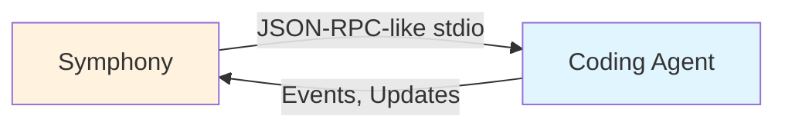

**Назначение**: Выполнение coding tasks в workspace

**Протокол**: JSON-RPC-like app-server protocol через stdio

**Операции**:
- `initialize` - Инициализация сессии
- `thread/start` - Запуск thread
- `turn/start` - Запуск turn с prompt
- `turn/completed`, `turn/failed`, `turn/cancelled` - Завершение turn

**Данные**:
- Session: thread_id, turn_id, session_id, token counts, rate limits
- Events: session_started, turn_completed, turn_failed, approval_auto_approved, notification, etc.

**См.**: [SPEC.md, Section 10](../../SPEC.md#10-agent-runner-protocol-coding-agent-integration), [INTEGRATIONS.md](INTEGRATIONS.md#agent-protocol)

### 2.3 Git (Optional)

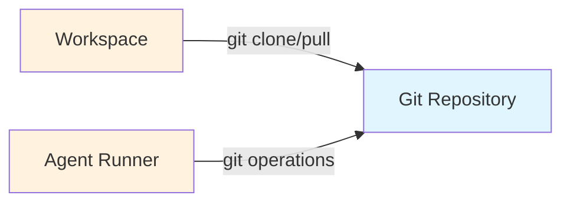

**Назначение**: Операции с репозиторием (опционально)

**Использование**:
- Workspace hooks (`after_create`, `before_run`, etc.) могут выполнять git operations
- Agent может использовать git tools для branch management

**Примечание**: Git integration не требуется спецификацией, но обычно используется в practice

**См.**: [SPEC.md, Section 9.3](../../SPEC.md#93-optional-workspace-population-implementation-defined), [INTEGRATIONS.md](INTEGRATIONS.md#git-integration)

### 2.4 CI/CD (Future)

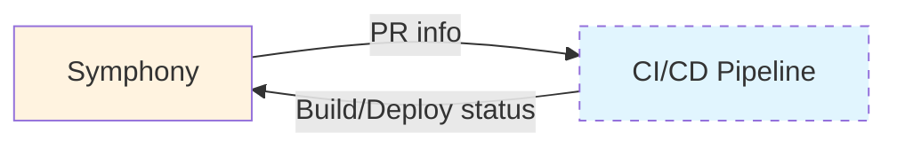

**Назначение**: Интеграция с CI/CD pipeline (future)

**Потенциал**:
- Получение статуса builds/deployments
- Triggering CI/CD на основе PR changes
- Получение результатов тестов

**Статус**: Future integration, не определено в текущей спецификации

**См.**: [INTEGRATIONS.md](INTEGRATIONS.md#ci/cd-integration-future)

---

## 3. Пользовательские роли

### 3.1 Operator

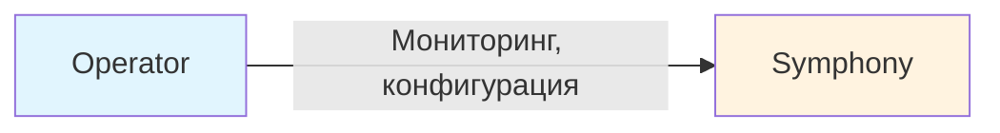

**Назначение**: Управление сервисом

**Ответственности**:
- Конфигурация `WORKFLOW.md`
- Мониторинг logs и status surface
- Управление service lifecycle (start, stop, restart)
- Debugging и troubleshooting

**Инструменты**:
- Logs (structured logs)
- Optional status surface (terminal, dashboard, HTTP API)
- CLI для управления service

### 3.2 Team Member

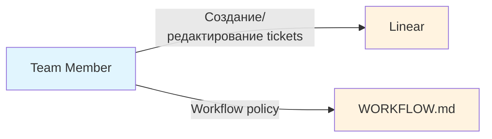

**Назначение**: Создание и управление задачами

**Ответственности**:
- Создание tickets в Linear
- Редактирование `WORKFLOW.md` (workflow policy)
- Review работы coding agent
- Approval изменений

**Инструменты**:
- Linear UI
- Git (для `WORKFLOW.md`)

### 3.3 Coding Agent

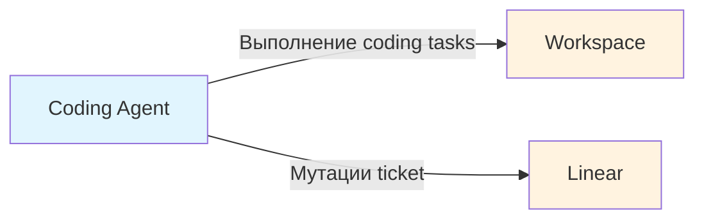

**Назначение**: Автоматическое выполнение coding tasks

**Ответственности**:
- Чтение prompt из `WORKFLOW.md`
- Выполнение coding operations в workspace
- Мутации ticket через tools (state transitions, comments, PR links)
- Соблюдение approval и sandbox policies

**Инструменты**:
- Filesystem operations
- Git tools
- Linear GraphQL (через `linear_graphql` tool)

---

## 4. Обзор потока данных

### 4.1 High-Level Data Flow

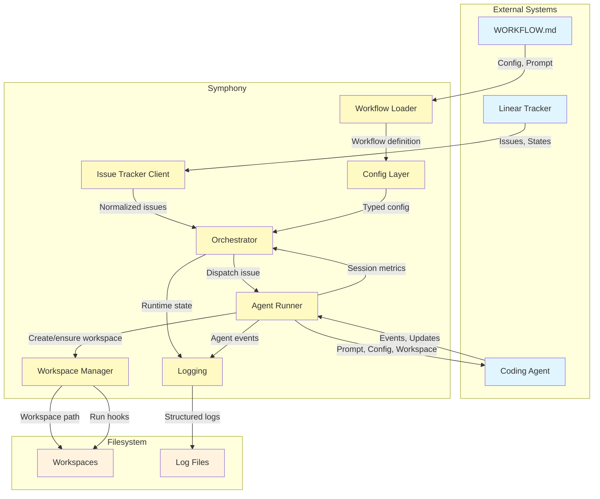

### 4.2 Детальный поток данных по компонентам

#### Issue Flow

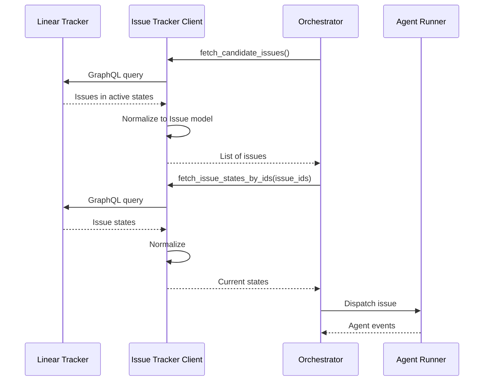

#### Agent Execution Flow

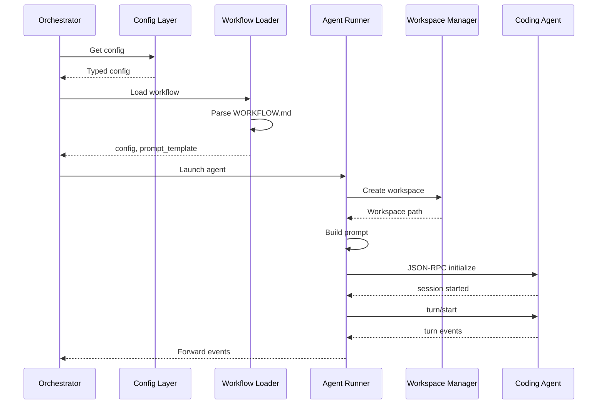

---

## 5. Потоки управления

### 5.1 Polling Loop

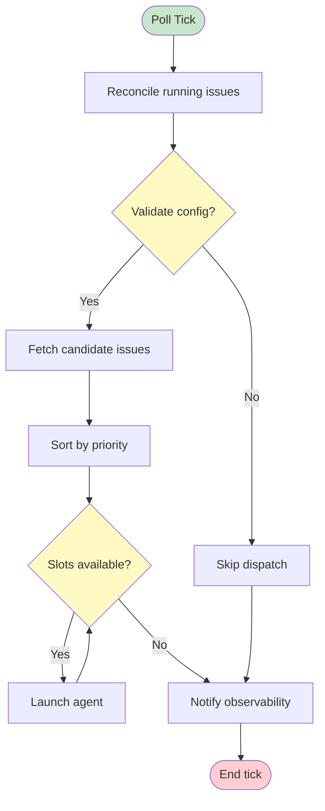

**Шаги**:
1. Reconcile running issues (stall detection, state refresh)
2. Run dispatch preflight validation
3. Fetch candidate issues from tracker
4. Sort issues by dispatch priority
5. Dispatch eligible issues while slots remain
6. Notify observability/status consumers

**См.**: [SPEC.md, Section 8.1](../../SPEC.md#81-poll-loop)

### 5.2 Issue Lifecycle

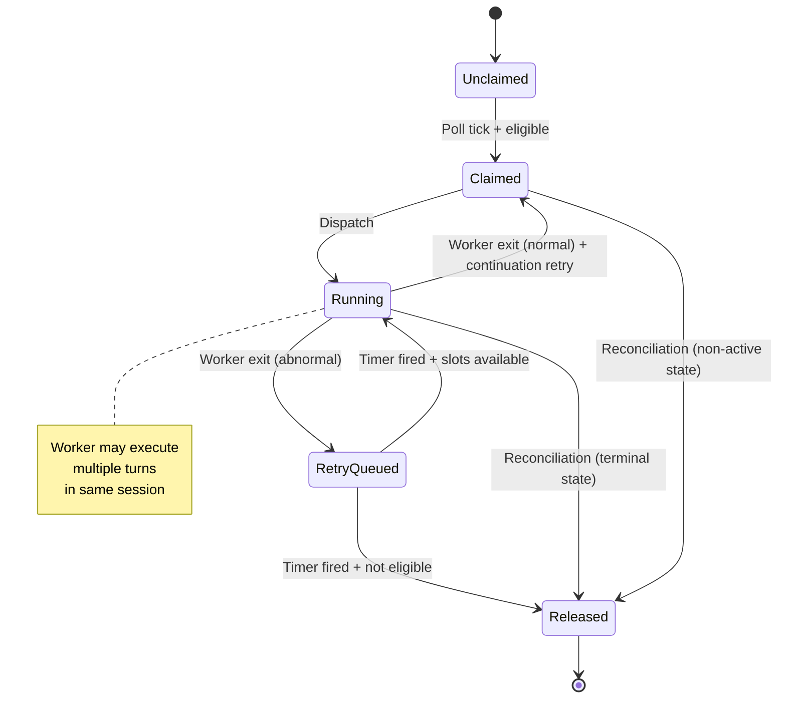

**Состояния**:
- `Unclaimed` - Issue not running, no retry scheduled
- `Claimed` - Issue reserved to prevent duplicate dispatch
- `Running` - Worker task exists
- `RetryQueued` - Worker not running, retry timer exists
- `Released` - Claim removed (terminal, non-active, missing)

**См.**: [SPEC.md, Section 7.1](../../SPEC.md#71-issue-orchestration-states)

---

## 6. Точки интеграции

| Система | Протокол | Формат данных | Частота |
|---------|----------|--------------|---------|
| Linear | GraphQL API | JSON (issues, states) | Polling (configurable) |
| Coding Agent | JSON-RPC (stdio) | Line-delimited JSON | Per-session |
| Git | CLI (hooks) | N/A | Per-run (hooks) |
| CI/CD | Future | TBD | TBD |

---

## 7. Связь с другими документами

- **[SDD.md](SDD.md)** - System Design Document, high-level overview
- **[SPEC.md](../../SPEC.md)** - Полная техническая спецификация
- **[COMPONENTS.md](COMPONENTS.md)** - Подробное описание компонентов
- **[DOMAIN-MODEL.md](DOMAIN-MODEL.md)** - Domain entities и их отношения
- **[INTEGRATIONS.md](INTEGRATIONS.md)** - Детальное описание интеграций

---

## 8. TODO

### 8.1 Детальные паттерны взаимодействия

- [ ] Добавить sequence diagrams для всех major flows
- [ ] Описать error handling patterns между компонентами
- [ ] Добавить state diagrams для entity lifecycles
- [ ] Описать retry и backoff patterns

### 8.2 Дополнительные внешние зависимости

- [ ] Описать потенциальные интеграции с notification systems
- [ ] Добавить integration с monitoring systems (Prometheus, Grafana)
- [ ] Описать integration с secret management (Vault, AWS Secrets Manager)

### 8.3 Безопасность

- [ ] Добавить диаграмму trust boundaries
- [ ] Описать authentication и authorization flows
- [ ] Добавить security considerations для всех external dependencies
