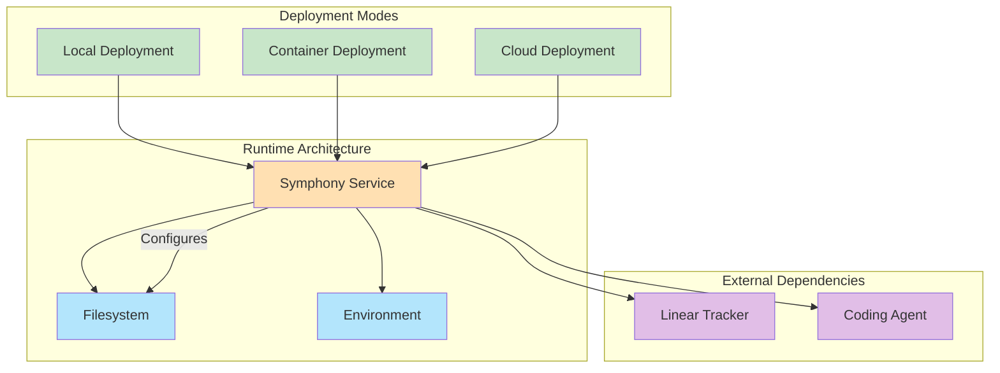
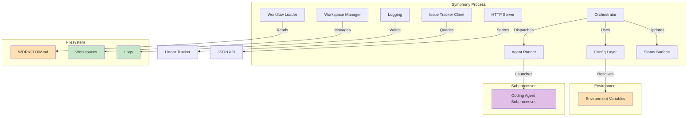
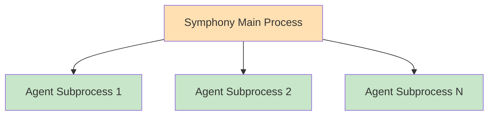
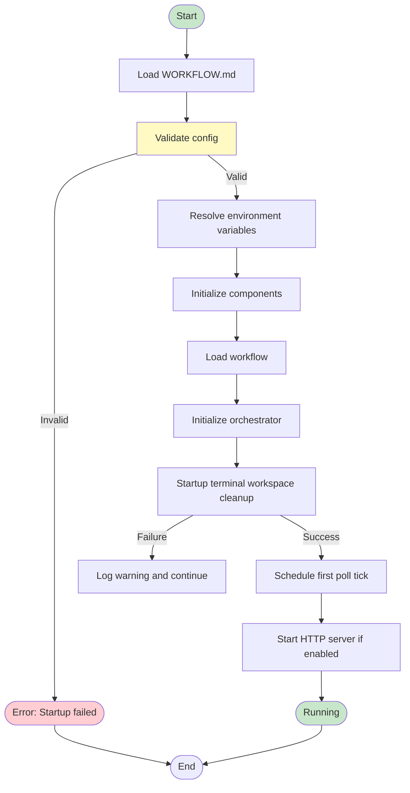
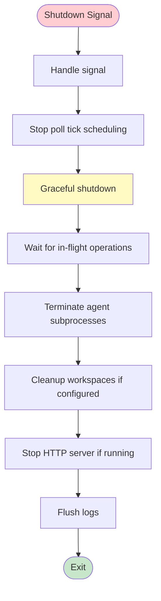

# Deployment Strategy

**Версия**: 1.0
**Статус**: Draft
**Последнее обновление**: 2026-04-11

---

## 1. Обзор стратегии развертывания

Deployment Strategy определяет runtime architecture, deployment modes, configuration management и startup/shutdown procedures для Symphony Service.



**См.**: [SPEC.md](../../SPEC.md), [COMPONENTS.md](COMPONENTS.md)

---

## 2. Runtime Architecture

### 2.1 Component Runtime Layout

**Runtime components**:



**Component relationships**:
- **Workflow Loader**: Reads `WORKFLOW.md` из filesystem
- **Config Layer**: Resolves environment variables для config values
- **Orchestrator**: Coordinates dispatch, retries, reconciliation
- **Issue Tracker Client**: Queries Linear API для issues и states
- **Workspace Manager**: Manages workspace directories и hooks
- **Agent Runner**: Launches coding agent subprocesses
- **Logging**: Writes structured logs к configured sinks
- **Status Surface**: Optional status surface (terminal, dashboard)
- **HTTP Server**: Optional HTTP server для observability API

### 2.2 Process Architecture

**Process hierarchy**:



**Process management**:
- **Main process**: Orchestrator, coordination, state management
- **Agent subprocesses**: One subprocess per active session
- **Process lifecycle**: Main process spawns и manages agent subprocesses
- **Signal handling**: Main process handles signals и forwards к subprocesses

---

## 3. Режимы развертывания

### 3.1 Local Deployment

**Characteristics**:
- **Environment**: Local development machine
- **Installation**: Direct Python package installation
- **Execution**: Direct execution через CLI
- **Configuration**: Local `WORKFLOW.md` файл
- **Dependencies**: Python runtime, coding agent executable

**Installation**:
```bash
# Clone repository
git clone https://github.com/myorg/py-symphony.git
cd py-symphony

# Install dependencies
pip install -r requirements.txt

# Install coding agent (if not already installed)
pip install codex
```

**Execution**:
```bash
# Run with default WORKFLOW.md in current directory
python -m symphony

# Run with custom WORKFLOW.md
python -m symphony --workflow-path /path/to/WORKFLOW.md

# Run with HTTP server enabled
python -m symphony --port 8080
```

**Configuration**:
```bash
# Set environment variables
export LINEAR_API_KEY="your-api-key"
export WORKSPACE_ROOT="/tmp/symphony_workspaces"

# Create WORKFLOW.md in current directory
cat > WORKFLOW.md << 'EOF'
---
tracker:
  kind: linear
  api_key: $LINEAR_API_KEY
  project_slug: my-project

polling:
  interval_ms: 30000

workspace:
  root: $WORKSPACE_ROOT

agent:
  max_concurrent_agents: 5

codex:
  command: codex app-server
---

You are working on an issue from Linear.
EOF
```

### 3.2 Container Deployment

**Characteristics**:
- **Environment**: Container runtime (Docker, Podman, etc.)
- **Installation**: Container image deployment
- **Execution**: Container execution
- **Configuration**: Mount `WORKFLOW.md` как volume, environment variables
- **Dependencies**: Container image includes Python runtime и dependencies

**Dockerfile example**:
```dockerfile
FROM python:3.11-slim

# Install system dependencies
RUN apt-get update && apt-get install -y \
    git \
    && rm -rf /var/lib/apt/lists/*

# Set working directory
WORKDIR /app

# Copy requirements и install
COPY requirements.txt .
RUN pip install --no-cache-dir -r requirements.txt

# Copy application code
COPY . .

# Create workspace directory
RUN mkdir -p /workspace

# Set environment variables
ENV WORKSPACE_ROOT=/workspace
ENV PYTHONUNBUFFERED=1

# Expose HTTP port (optional)
EXPOSE 8080

# Run application
CMD ["python", "-m", "symphony"]
```

**Build и run**:
```bash
# Build container image
docker build -t symphony:latest .

# Run container с mounted WORKFLOW.md
docker run -d \
  --name symphony \
  -v $(pwd)/WORKFLOW.md:/app/WORKFLOW.md \
  -e LINEAR_API_KEY="your-api-key" \
  -e WORKSPACE_ROOT=/workspace \
  -p 8080:8080 \
  symphony:latest
```

**Docker Compose example**:
```yaml
version: '3.8'

services:
  symphony:
    build: .
    container_name: symphony
    restart: unless-stopped
    volumes:
      - ./WORKFLOW.md:/app/WORKFLOW.md
      - ./workspaces:/workspace
      - ./logs:/var/log/symphony
    environment:
      - LINEAR_API_KEY=${LINEAR_API_KEY}
      - WORKSPACE_ROOT=/workspace
      - LOG_LEVEL=INFO
    ports:
      - "8080:8080"
    healthcheck:
      test: ["CMD", "curl", "-f", "http://localhost:8080/api/v1/health"]
      interval: 30s
      timeout: 10s
      retries: 3
      start_period: 10s
```

### 3.3 Cloud Deployment

**Characteristics**:
- **Environment**: Cloud platform (AWS, GCP, Azure, etc.)
- **Installation**: Container orchestration (Kubernetes, ECS, etc.)
- **Execution**: Containerized deployment
- **Configuration**: ConfigMaps, Secrets, environment variables
- **Dependencies**: Cloud services для storage, monitoring, etc.

**Kubernetes deployment example**:
```yaml
apiVersion: apps/v1
kind: Deployment
metadata:
  name: symphony
  labels:
    app: symphony
spec:
  replicas: 1
  selector:
    matchLabels:
      app: symphony
  template:
    metadata:
      labels:
        app: symphony
    spec:
      containers:
      - name: symphony
        image: symphony:latest
        ports:
        - containerPort: 8080
        env:
        - name: LINEAR_API_KEY
          valueFrom:
            secretKeyRef:
              name: symphony-secrets
              key: linear-api-key
        - name: WORKSPACE_ROOT
          value: /workspace
        - name: LOG_LEVEL
          value: INFO
        volumeMounts:
        - name: workflow
          mountPath: /app/WORKFLOW.md
          subPath: WORKFLOW.md
        - name: workspaces
          mountPath: /workspace
        - name: logs
          mountPath: /var/log/symphony
        livenessProbe:
          httpGet:
            path: /api/v1/health
            port: 8080
          initialDelaySeconds: 30
          periodSeconds: 10
        readinessProbe:
          httpGet:
            path: /api/v1/health
            port: 8080
          initialDelaySeconds: 5
          periodSeconds: 5
      volumes:
      - name: workflow
        configMap:
          name: workflow-config
      - name: workspaces
        emptyDir: {}
      - name: logs
        emptyDir: {}
---
apiVersion: v1
kind: ConfigMap
metadata:
  name: workflow-config
data:
  WORKFLOW.md: |
    ---
    tracker:
      kind: linear
      api_key: $LINEAR_API_KEY
      project_slug: my-project

    polling:
      interval_ms: 30000

    workspace:
      root: /workspace

    agent:
      max_concurrent_agents: 5

    codex:
      command: codex app-server
    ---

    You are working on an issue from Linear.
---
apiVersion: v1
kind: Secret
metadata:
  name: symphony-secrets
type: Opaque
stringData:
  linear-api-key: your-api-key
---
apiVersion: v1
kind: Service
metadata:
  name: symphony
spec:
  selector:
    app: symphony
  ports:
  - protocol: TCP
    port: 80
    targetPort: 8080
  type: LoadBalancer
```

---

## 4. Управление конфигурацией при развертывании

### 4.1 Configuration Management

**Configuration sources**:
- **WORKFLOW.md**: Main configuration file (YAML front matter + Markdown prompt)
- **Environment variables**: Secret и environment-specific values
- **Command-line arguments**: Runtime overrides (e.g., `--port`, `--workflow-path`)

**Configuration precedence** ([SPEC.md, Section 6.1](../../SPEC.md#61-source-precedence-and-resolution-semantics)):
1. Built-in defaults (lowest precedence)
2. WORKFLOW.md config
3. Environment resolution (highest precedence)

**См.**: [CONFIGURATION-MODEL.md](CONFIGURATION-MODEL.md)

### 4.2 Secret Management

**Secret management approaches**:

| Deployment Mode | Secret Management | Examples |
|----------------|-------------------|----------|
| Local | Environment variables | `export LINEAR_API_KEY="..."` |
| Container | Environment variables, Docker secrets | `-e LINEAR_API_KEY="..."`, Docker secrets |
| Cloud | Kubernetes Secrets, AWS Secrets Manager, etc. | Kubernetes Secret, AWS Secrets Manager |

**Best practices**:
- **Never commit secrets**: Never commit literal secrets в repository
- **Use environment variables**: Use `$VAR_NAME` syntax в config
- **Rotate secrets**: Implement secret rotation policy
- **Encrypt secrets**: Encrypt secrets at rest и in transit

**См.**: [SECURITY.md](SECURITY.md), [CONFIGURATION-MODEL.md](CONFIGURATION-MODEL.md)

### 4.3 Configuration Validation

**Validation points**:
- **Startup validation**: Validate config перед starting scheduling loop
- **Per-tick validation**: Re-validate перед каждым dispatch cycle
- **Defensive validation**: Re-validate перед runtime operations
- **Reload validation**: Validate config на reload

**Validation checks** ([SPEC.md, Section 6.3](../../SPEC.md#63-dispatch-preflight-validation)):
- Workflow file можно load и parse
- `tracker.kind` присутствует и supported
- `tracker.api_key` присутствует после `$` resolution
- `tracker.project_slug` присутствует когда required
- `codex.command` присутствует и non-empty

**См.**: [CONFIGURATION-MODEL.md](CONFIGURATION-MODEL.md)

---

## 5. Процедуры запуска и остановки

### 5.1 Startup Procedure

**Startup sequence**:



**Startup steps**:
1. **Load config**: Load `WORKFLOW.md` из filesystem
2. **Validate config**: Validate configuration (see Section 4.3)
3. **Resolve environment**: Resolve environment variables (`$VAR_NAME`)
4. **Initialize components**: Initialize all components (Workflow Loader, Config Layer, Orchestrator, etc.)
5. **Load workflow**: Parse workflow front matter и prompt template
6. **Initialize orchestrator**: Initialize orchestrator state
7. **Startup cleanup**: Perform startup terminal workspace cleanup ([SPEC.md, Section 8.6](../../SPEC.md#86-startup-terminal-workspace-cleanup))
8. **Schedule poll**: Schedule first poll tick
9. **Start HTTP server**: Start HTTP server если enabled (`--port` или `server.port`)

**См.**: [SPEC.md, Section 8.1](../../SPEC.md#81-poll-loop), [SPEC.md, Section 8.6](../../SPEC.md#86-startup-terminal-workspace-cleanup)

### 5.2 Shutdown Procedure

**Shutdown sequence**:



**Shutdown steps**:
1. **Handle signal**: Handle shutdown signals (SIGTERM, SIGINT)
2. **Stop poll**: Stop poll tick scheduling
3. **Graceful shutdown**: Allow in-flight operations чтобы complete
4. **Terminate agents**: Terminate agent subprocesses gracefully
5. **Cleanup workspaces**: Cleanup workspaces если configured
6. **Stop HTTP**: Stop HTTP server если running
7. **Flush logs**: Flush logs чтобы ensure all logs written

**Signal handling**:
- **SIGTERM**: Graceful shutdown (default)
- **SIGINT**: Graceful shutdown (Ctrl+C)
- **SIGKILL**: Immediate termination (no graceful shutdown)

### 5.3 Restart Procedure

**Restart scenarios**:
- **Graceful restart**: Stop и restart service gracefully
- **Crash restart**: Automatic restart после crash
- **Rolling restart**: Rolling update deployment (multi-instance)
- **Zero-downtime restart**: Zero-downtime deployment (multi-instance)

**Graceful restart**:
```bash
# Send SIGTERM для graceful shutdown
kill -TERM <pid>

# Wait для process чтобы exit
wait <pid>

# Restart service
python -m symphony
```

**Crash restart** (systemd example):
```ini
[Unit]
Description=Symphony Service
After=network.target

[Service]
Type=simple
User=symphony
WorkingDirectory=/opt/symphony
ExecStart=/usr/bin/python -m symphony
Restart=always
RestartSec=10
Environment=LINEAR_API_KEY=/etc/symphony/secrets/linear_api_key

[Install]
WantedBy=multi-user.target
```

---

## 6. Health Checks и Monitoring

### 6.1 Health Checks

**Health check endpoints** (optional HTTP server):

#### `GET /api/v1/health`

**Purpose**: Health check endpoint для monitoring systems

**Response**:
```json
{
  "status": "healthy",
  "uptime_seconds": 3600,
  "version": "1.0.0",
  "components": {
    "orchestrator": "healthy",
    "tracker_client": "healthy",
    "workspace_manager": "healthy",
    "agent_runner": "healthy"
  }
}
```

**Health status values**:
- `healthy` - Service healthy и operational
- `degraded` - Service operational но degraded (e.g., high error rate)
- `unhealthy` - Service unhealthy или non-functional

### 6.2 Readiness Checks

**Readiness check considerations**:
- **Config loaded**: Configuration loaded и validated
- **Components initialized**: All components initialized
- **Tracker accessible**: Issue tracker accessible
- **Workspace ready**: Workspace root accessible

**Readiness criteria**:
- Service ready чтобы handle dispatch
- Poll tick scheduled
- HTTP server ready (если enabled)

### 6.3 Startup Probes

**Startup probe considerations**:
- **Initial delay**: Delay before first probe
- **Period**: Probe frequency
- **Timeout**: Probe timeout
- **Failure threshold**: Number of failures before marking unhealthy

**Kubernetes startup probe example**:
```yaml
startupProbe:
  httpGet:
    path: /api/v1/health
    port: 8080
  initialDelaySeconds: 30
  periodSeconds: 10
  timeoutSeconds: 5
  failureThreshold: 30
```

---

## 7. Scaling и High Availability

### 7.1 Scaling Considerations

**Scaling factors**:
- **Concurrent agents**: `agent.max_concurrent_agents` limit
- **Per-state concurrency**: `agent.max_concurrent_agents_by_state` limits
- **Resource limits**: CPU, memory, disk I/O
- **Network limits**: Tracker API rate limits

**Scaling strategies**:
- **Vertical scaling**: Increase resources (CPU, memory)
- **Horizontal scaling**: Run multiple instances с shared state (future)
- **Load balancing**: Distribute issues across instances (future)

### 7.2 High Availability (Future)

**High availability considerations**:
- **Redundancy**: Multiple instances для failover
- **Shared state**: Shared state management (database, etc.)
- **Leader election**: Leader election для single orchestrator (future)
- **Graceful failover**: Graceful failover между instances

**Status**: Future enhancement, not defined в current specification

---

## 8. Deployment Best Practices

### 8.1 Local Deployment

**Best practices**:
- **Virtual environment**: Use virtual environment для Python dependencies
- **Process management**: Use process manager (systemd, supervisord) для production
- **Log rotation**: Configure log rotation чтобы avoid disk full
- **Monitoring**: Configure monitoring и alerting

### 8.2 Container Deployment

**Best practices**:
- **Minimal base image**: Use minimal base image (e.g., python:3.11-slim)
- **Multi-stage build**: Use multi-stage build для smaller images
- **Non-root user**: Run как non-root user
- **Health checks**: Configure health checks для container orchestration
- **Resource limits**: Configure resource limits (CPU, memory)
- **Log aggregation**: Configure log aggregation (stdout/stderr)

### 8.3 Cloud Deployment

**Best practices**:
- **Secrets management**: Use cloud secret management (Kubernetes Secrets, AWS Secrets Manager)
- **Configuration management**: Use ConfigMaps/environment variables для config
- **Monitoring integration**: Integrate с cloud monitoring (CloudWatch, Cloud Monitoring)
- **Log aggregation**: Use cloud log aggregation (CloudWatch Logs, Cloud Logging)
- **High availability**: Deploy across multiple availability zones
- **Disaster recovery**: Implement disaster recovery plan

---

## 9. Связь с другими документами

- **[SDD.md](SDD.md)** - System Design Document, architectural decisions
- **[CONTEXT.md](CONTEXT.md)** - System context и границы
- **[COMPONENTS.md](COMPONENTS.md)** - Component breakdown
- **[DOMAIN-MODEL.md](DOMAIN-MODEL.md)** - Domain entities
- **[ARTIFACT-MODEL.md](ARTIFACT-MODEL.md)** - Artifact lifecycle
- **[CONFIGURATION-MODEL.md](CONFIGURATION-MODEL.md)** - Configuration management
- **[OBSERVABILITY.md](OBSERVABILITY.md)** - Observability strategy
- **[SECURITY.md](SECURITY.md)** - Security model
- **[SPEC.md](../../SPEC.md)** - Полная техническая спецификация

---

## 10. TODO

### 10.1 Production Deployment Guide

- [ ] Добавить detailed production deployment guide
- [ ] Описать production configuration best practices
- [ ] Добавить production monitoring и alerting setup
- [ ] Описать production troubleshooting procedures

### 10.2 Multi-Instance Deployment

- [ ] Определить multi-instance deployment strategy
- [ ] Описать shared state management approach
- [ ] Добавить leader election mechanism
- [ ] Описify graceful failover procedure

### 10.3 Disaster Recovery

- [ ] Описать disaster recovery plan
- [ ] Добавить backup и restore procedures
- [ ] Определить RTO/RPO targets
- [ ] Описать disaster recovery testing

### 10.4 Performance Optimization

- [ ] Добавить performance tuning guide
- [ ] Описать optimization strategies для different deployment modes
- [ ] Добавить performance benchmarking
- [ ] Описать capacity planning guidelines

### 10.5 Deployment Automation

- [ ] Описать CI/CD pipeline для deployment
- [ ] Добавить automated testing перед deployment
- [ ] Описать automated rollback procedures
- [ ] Добавить deployment verification checks
