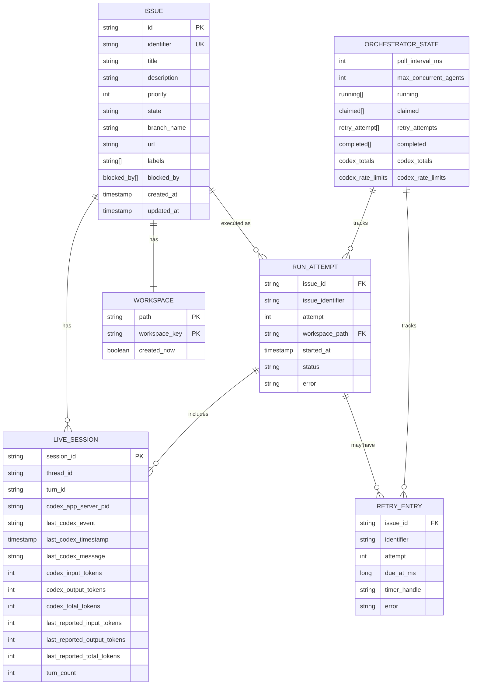
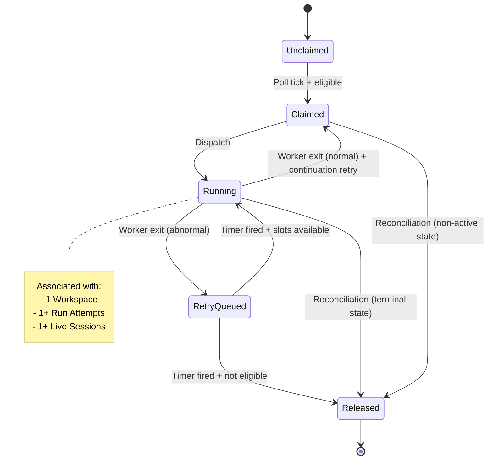
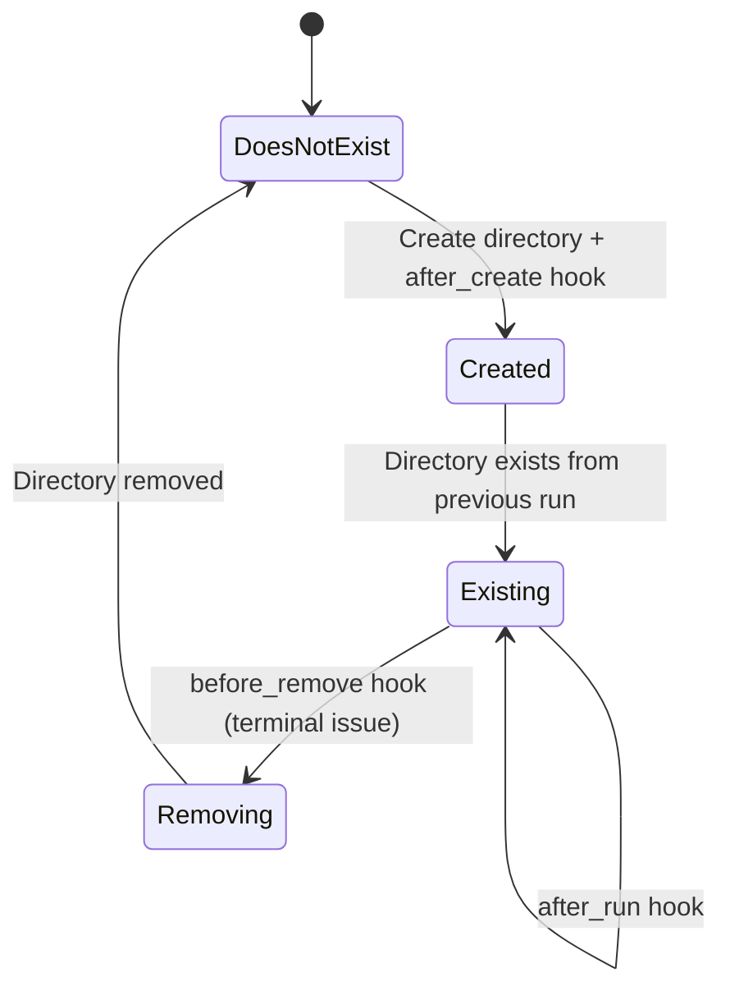
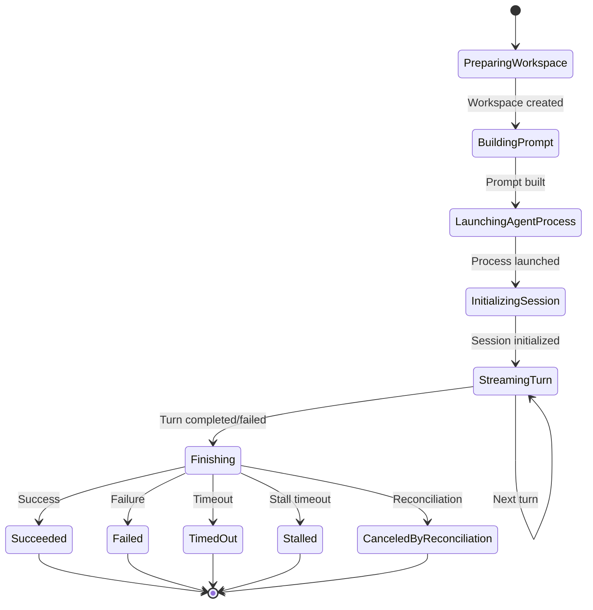
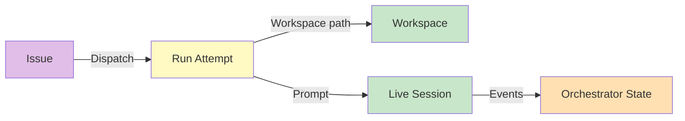
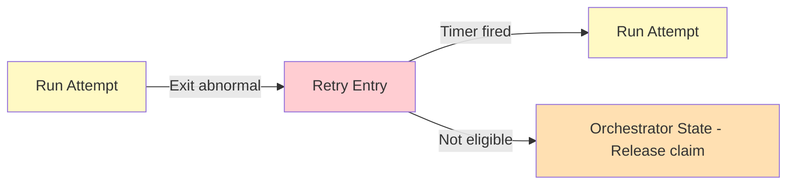

# Domain Model

**Версия**: 1.0
**Статус**: Draft
**Последнее обновление**: 2026-04-11

---

## 1. Обзор доменных сущностей

Symphony domain model определяет ключевые сущности, используемые в orchestration, prompt rendering и observability output.



---

## 2. Сущности из Issue Tracker

### 2.1 Issue

**Назначение**: Normalized issue record используемый в orchestration, prompt rendering и observability output

**Источник**: Issue Tracker Client (normalization из Linear API)

**См.**: [SPEC.md, Section 4.1.1](../../SPEC.md#411-issue)

#### Поля

| Поле | Тип | Обязательное | Описание |
|------|-----|--------------|----------|
| `id` | string | Да | Stable tracker-internal ID |
| `identifier` | string | Да | Human-readable ticket key (e.g., `ABC-123`) |
| `title` | string | Да | Заголовок задачи |
| `description` | string or null | Нет | Описание задачи |
| `priority` | integer or null | Нет | Lower numbers = higher priority в dispatch sorting |
| `state` | string | Да | Current tracker state name |
| `branch_name` | string or null | Нет | Tracker-provided branch metadata если доступно |
| `url` | string or null | Нет | URL задачи |
| `labels` | list of strings | Да | Normalized to lowercase |
| `blocked_by` | list of blocker refs | Да | Each blocker: `{id, identifier, state}` |
| `created_at` | timestamp or null | Нет | ISO-8601 timestamp создания |
| `updated_at` | timestamp or null | Нет | ISO-8601 timestamp обновления |

#### Blocker Ref Schema

```python
{
    "id": Optional[str],        # Tracker-internal blocker ID
    "identifier": Optional[str], # Human-readable blocker identifier
    "state": Optional[str]       # Current blocker state
}
```

#### Правила валидации

- `id`, `identifier`, `title`, `state` обязательны для dispatch eligibility
- `labels` нормализуются в lowercase
- `priority` integer only (non-integers становятся null)
- `blocked_by` derived из inverse relations где relation type = `blocks`

---

### 2.2 Workflow Definition

**Назначение**: Parsed `WORKFLOW.md` payload

**Источник**: Workflow Loader

**См.**: [SPEC.md, Section 4.1.2](../../SPEC.md#412-workflow-definition)

#### Поля

| Поле | Тип | Обязательное | Описание |
|------|-----|--------------|----------|
| `config` | map | Да | YAML front matter root object |
| `prompt_template` | string | Да | Markdown body после front matter, trimmed |

---

### 2.3 Service Config (Typed View)

**Назначение**: Typed runtime values derived из `WorkflowDefinition.config` плюс environment resolution

**Источник**: Config Layer

**См.**: [SPEC.md, Section 4.1.3](../../SPEC.md#413-service-config-typed-view)

#### Примеры значений

- `poll_interval_ms` - Polling interval (default: 30000)
- `workspace_root` - Workspace root path
- `active_states` - Active issue states (default: `["Todo", "In Progress"]`)
- `terminal_states` - Terminal issue states (default: `["Closed", "Cancelled", "Canceled", "Duplicate", "Done"]`)
- `max_concurrent_agents` - Global concurrency limit (default: 10)
- `max_retry_backoff_ms` - Max retry backoff (default: 300000 / 5m)
- `codex_command` - Coding agent command (default: `codex app-server`)
- Workspace hooks scripts

---

## 3. Runtime Entities

### 3.1 Workspace

**Назначение**: Filesystem workspace assigned к одному issue identifier

**Источник**: Workspace Manager

**См.**: [SPEC.md, Section 4.1.4](../../SPEC.md#414-workspace)

#### Поля (logical)

| Поле | Тип | Обязательное | Описание |
|------|-----|--------------|----------|
| `path` | string | Да | Workspace path (absolute path typically) |
| `workspace_key` | string | Да | Sanitized issue identifier |
| `created_now` | boolean | Да | Если true, directory был создан во время этого вызова |

#### Workspace Key Sanitization

- Derived из `issue.identifier`
- Replace любой character не в `[A-Za-z0-9._-]` с `_`
- Используется как directory name

#### Workspace Path

```
<workspace.root>/<workspace_key>
```

---

### 3.2 Run Attempt

**Назначение**: One execution attempt для одного issue

**Источник**: Orchestrator / Agent Runner

**См.**: [SPEC.md, Section 4.1.5](../../SPEC.md#415-run-attempt)

#### Поля (logical)

| Поле | Тип | Обязательное | Описание |
|------|-----|--------------|----------|
| `issue_id` | string | Да | Issue ID из tracker |
| `issue_identifier` | string | Да | Human-readable issue identifier |
| `attempt` | integer or null | Да | `null` для first run, `>=1` для retries/continuation |
| `workspace_path` | string | Да | Workspace path для этой попытки |
| `started_at` | timestamp | Да | Когда attempt был started |
| `status` | string | Да | Current attempt status |
| `error` | string or null | Нет | Error message если failed |

#### Attempt Status Values

- `PreparingWorkspace`
- `BuildingPrompt`
- `LaunchingAgentProcess`
- `InitializingSession`
- `StreamingTurn`
- `Finishing`
- `Succeeded`
- `Failed`
- `TimedOut`
- `Stalled`
- `CanceledByReconciliation`

**См.**: [SPEC.md, Section 7.2](../../SPEC.md#72-run-attempt-lifecycle)

---

### 3.3 Live Session (Agent Session Metadata)

**Назначение**: State tracked пока coding-agent subprocess running

**Источник**: Agent Runner / Orchestrator

**См.**: [SPEC.md, Section 4.1.6](../../SPEC.md#416-live-session-agent-session-metadata)

#### Поля

| Поле | Тип | Обязательное | Описание |
|------|-----|--------------|----------|
| `session_id` | string | Да | `<thread_id>-<turn_id>` |
| `thread_id` | string | Да | Thread ID из coding agent |
| `turn_id` | string | Да | Turn ID из coding agent |
| `codex_app_server_pid` | string or null | Нет | Subprocess PID |
| `last_codex_event` | string/enum or null | Нет | Last event type |
| `last_codex_timestamp` | timestamp or null | Нет | Last event timestamp |
| `last_codex_message` | string | Нет | Summarized payload |
| `codex_input_tokens` | integer | Да | Input tokens в этой сессии |
| `codex_output_tokens` | integer | Да | Output tokens в этой сессии |
| `codex_total_tokens` | integer | Да | Total tokens в этой сессии |
| `last_reported_input_tokens` | integer | Да | Last reported input tokens |
| `last_reported_output_tokens` | integer | Да | Last reported output tokens |
| `last_reported_total_tokens` | integer | Да | Last reported total tokens |
| `turn_count` | integer | Да | Number of coding-agent turns в текущем worker lifetime |

---

### 3.4 Retry Entry

**Назначение**: Scheduled retry state для issue

**Источник**: Orchestrator

**См.**: [SPEC.md, Section 4.1.7](../../SPEC.md#417-retry-entry)

#### Поля

| Поле | Тип | Обязательное | Описание |
|------|-----|--------------|----------|
| `issue_id` | string | Да | Issue ID |
| `identifier` | string | Да | Human-readable ID для status surfaces/logs |
| `attempt` | integer | Да | 1-based для retry queue |
| `due_at_ms` | long | Да | Monotonic clock timestamp |
| `timer_handle` | string | Нет | Runtime-specific timer reference |
| `error` | string or null | Нет | Error сообщение если retry scheduled due to error |

---

### 3.5 Orchestrator Runtime State

**Назначение**: Single authoritative in-memory state owned by orchestrator

**Источник**: Orchestrator

**См.**: [SPEC.md, Section 4.1.8](../../SPEC.md#418-orchestrator-runtime-state)

#### Поля

| Поле | Тип | Обязательное | Описание |
|------|-----|--------------|----------|
| `poll_interval_ms` | integer | Да | Current effective poll interval |
| `max_concurrent_agents` | integer | Да | Current effective global concurrency limit |
| `running` | map | Да | `issue_id -> running entry` |
| `claimed` | set | Да | Set of issue IDs reserved/running/retrying |
| `retry_attempts` | map | Да | `issue_id -> RetryEntry` |
| `completed` | set | Да | Set of issue IDs (bookkeeping only) |
| `codex_totals` | dict | Да | Aggregate tokens + runtime seconds |
| `codex_rate_limits` | dict | Да | Latest rate-limit snapshot |

#### Running Entry Structure

```python
{
    "issue_id": str,
    "issue_identifier": str,
    "started_at": timestamp,
    "session": LiveSession,  # Optional, None если session не started
    "workspace_path": str
}
```

#### Codex Totals Structure

```python
{
    "input_tokens": int,
    "output_tokens": int,
    "total_tokens": int,
    "seconds_running": float  # Aggregate runtime seconds
}
```

---

## 4. Stable Identifiers and Normalization Rules

**См.**: [SPEC.md, Section 4.2](../../SPEC.md#42-stable-identifiers-and-normalization-rules)

### 4.1 Issue ID

- **Назначение**: Tracker lookups и internal map keys
- **Формат**: Stable tracker-internal ID (например, UUID для Linear)

### 4.2 Issue Identifier

- **Назначение**: Human-readable logs и workspace naming
- **Формат**: Human-readable ticket key (например, `ABC-123`)

### 4.3 Workspace Key

- **Назначение**: Workspace directory name
- **Derivation**: Derived из `issue.identifier` заменой любого character не в `[A-Za-z0-9._-]` на `_`
- **Пример**: `ABC-123/Feature` → `ABC-123_Feature`

### 4.4 Normalized Issue State

- **Назначение**: Сравнение состояний
- **Normalization**: Compare states после `lowercase`

### 4.5 Session ID

- **Назначение**: Unique идентификатор agent session
- **Composition**: Compose из coding-agent `thread_id` и `turn_id` как `<thread_id>-<turn_id>`

---

## 5. Entity Relationships

### 5.1 Issue Lifecycle



### 5.2 Workspace State



### 5.3 Run Attempt States



---

## 6. Entity Invariants

### 6.1 Issue Invariants

- `id` is unique and stable
- `identifier` is unique within tracker
- `state` is normalized to lowercase для comparison
- `labels` are normalized to lowercase

### 6.2 Workspace Invariants

- `path` is absolute (или normalized к workspace root)
- `path` has `workspace_root` как prefix directory (safety invariant)
- `workspace_key` contains только `[A-Za-z0-9._-]`
- Workspace используется только одним issue

### 6.3 Run Attempt Invariants

- `attempt` is `null` для first run, `>=1` для retries
- `workspace_path` соответствует `workspace_key`
- `status` is terminal когда attempt completed

### 6.4 Live Session Invariants

- `session_id` is unique (`<thread_id>-<turn_id>`)
- `turn_count` increments с каждым turn
- Token totals are cumulative за session lifetime

### 6.5 Orchestrator State Invariants

- `claimed` contains `running.keys() + retry_attempts.keys()`
- `running` issues are всегда в `claimed`
- `retry_attempts` issues are всегда в `claimed`
- `completed` is bookkeeping only (не used для dispatch gating)

---

## 7. Entity Behaviors

### 7.1 Issue Dispatch Eligibility

Issue dispatch-eligible только если все true:

1. Issue имеет `id`, `identifier`, `title`, `state`
2. State в `active_states` и не в `terminal_states`
3. Issue не в `running`
4. Issue не в `claimed`
5. Global concurrency slots доступны
6. Per-state concurrency slots доступны
7. Blocker rule для `Todo` state passes (если state == "Todo", do not dispatch когда любой blocker non-terminal)

**См.**: [SPEC.md, Section 8.2](../../SPEC.md#82-candidate-selection-rules)

### 7.2 Issue Sorting Order

Стабильный sorting intent:

1. `priority` ascending (1..4 preferred; null/unknown sorts last)
2. `created_at` oldest first
3. `identifier` lexicographic tie-breaker

**См.**: [SPEC.md, Section 8.2](../../SPEC.md#82-candidate-selection-rules)

### 7.3 Retry Backoff Formula

- Normal continuation retries: fixed delay of `1000` ms
- Failure-driven retries: `delay = min(10000 * 2^(attempt - 1), max_retry_backoff_ms)`

**См.**: [SPEC.md, Section 8.4](../../SPEC.md#84-retry-and-backoff)

### 7.4 Stall Detection

Для каждого running issue:

1. Compute `elapsed_ms` since:
   - `last_codex_timestamp` если любой event был seen
   - `started_at` если нет events
2. Если `elapsed_ms > codex.stall_timeout_ms`: terminate worker и queue retry
3. Если `stall_timeout_ms <= 0`: skip stall detection

**См.**: [SPEC.md, Section 8.5](../../SPEC.md#85-active-run-reconciliation)

---

## 8. Data Flow Between Entities

### 8.1 Issue → Run Attempt Flow



### 8.2 Retry Entry Flow



---

## 9. Связь с другими документами

- **[SDD.md](SDD.md)** - System Design Document, architectural decisions
- **[CONTEXT.md](CONTEXT.md)** - System context и границы
- **[COMPONENTS.md](COMPONENTS.md)** - Component breakdown и responsibilities
- **[SPEC.md](../../SPEC.md)** - Полная техническая спецификация
- **[INTEGRATIONS.md](INTEGRATIONS.md)** - Интеграции с внешними системами

---

## 10. TODO

### 10.1 Детальные entity behaviors

- [ ] Добавить detailed state machines для всех entities
- [ ] Описать business rules для entity transitions
- [ ] Добавить validation rules для всех entity fields
- [ ] Описать error handling для entity operations

### 10.2 Additional Relationships

- [ ] Добавить отношения между Workspace и hooks
- [ ] Описать отношения между Workflow Definition и entities
- [ ] Добавить отношения между Service Config и runtime behavior

### 10.3 Entity Lifecycle

- [ ] Добавить detailed lifecycle diagrams для всех entities
- [ ] Описать creation, update, deletion workflows
- [ ] Добавить garbage collection policies для entities
- [ ] Описать cleanup и recovery strategies

### 10.4 Entity Operations

- [ ] Добавить CRUD operations для всех entities
- [ ] Описать query patterns для entity access
- [ ] Добавить bulk operations для performance optimization
- [ ] Описать indexing strategies для entity lookups
