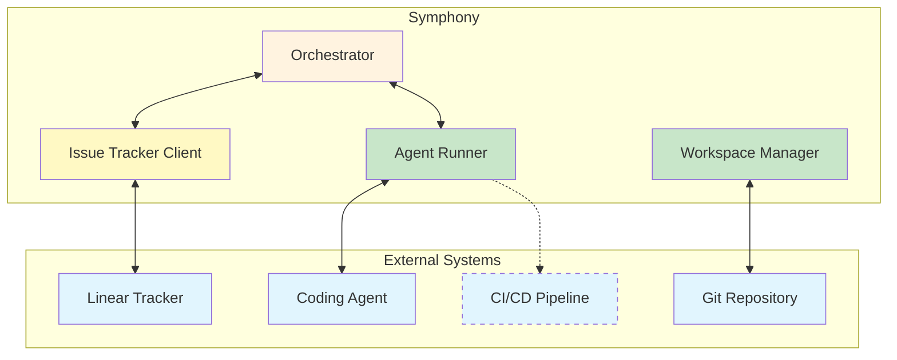

# Интеграции

**Версия**: 1.0
**Статус**: Draft
**Последнее обновление**: 2026-04-11

---

## 1. Обзор интеграций

Symphony интегрируется с несколькими внешними системами для выполнения своих функций.



---

## 2. Linear Integration

### 2.1 Обзор

**Назначение**: Issue Tracker для управления задачами

**Протокол**: GraphQL API

**См.**: [SPEC.md, Section 11](../../SPEC.md#11-issue-tracker-integration-contract-linear-compatible)

### 2.2 Требуемые операции

#### 2.2.1 `fetch_candidate_issues()`

**Назначение**: Получение issues в active states для проекта

**GraphQL Query**:
```graphql
query FetchCandidateIssues($projectSlug: String!, $after: String, $first: Int) {
  project(slugId: { eq: $projectSlug }) {
    issues(
      after: $after
      first: $first
      filter: {
        state: { type: { in: ["Todo", "In Progress"] } }
      }
      orderBy: priority
    ) {
      nodes {
        id
        identifier
        title
        description
        priority
        state { name }
        branchName
        url
        labels { nodes { name } }
        created_at
        updated_at
      }
      pageInfo {
        hasNextPage
        endCursor
      }
    }
  }
}
```

**Параметры**:
- `projectSlug`: Project slug из config
- `after`: Pagination cursor
- `first`: Page size (default: 50)

**Response**: Normalized `Issue` entities

#### 2.2.2 `fetch_issues_by_states(state_names)`

**Назначение**: Получение issues в terminal states (для startup cleanup)

**GraphQL Query**:
```graphql
query FetchTerminalIssues($projectSlug: String!, $stateNames: [String!]!) {
  project(slugId: { eq: $projectSlug }) {
    issues(
      filter: {
        state: { name: { in: $stateNames } }
      }
    ) {
      nodes {
        id
        identifier
      }
    }
  }
}
```

**Параметры**:
- `projectSlug`: Project slug из config
- `stateNames`: List of terminal state names

**Response**: Issue IDs для cleanup

#### 2.2.3 `fetch_issue_states_by_ids(issue_ids)`

**Назначение**: Получение текущих состояний для running issues (reconciliation)

**GraphQL Query**:
```graphql
query FetchIssueStates($issueIds: [ID!]!) {
  issues(ids: $issueIds) {
    nodes {
      id
      state { name type }
    }
  }
}
```

**Параметры**:
- `issueIds`: List of issue IDs из `running` map

**Response**: Current issue states для reconciliation

### 2.3 Authentication

**Header**:
```
Authorization: Bearer <api_key>
```

**Config**:
- `tracker.api_key`: Literal token или `$VAR_NAME`
- Canonical environment variable: `LINEAR_API_KEY`
- Если `$VAR_NAME` resolves в пустую строку, treat как missing

### 2.4 Нормализация

**Labels**:
```python
labels = [label.lower() for label in raw_labels]
```

**Blocked By**:
```python
blocked_by = [
    {
        "id": blocker.id,
        "identifier": blocker.identifier,
        "state": blocker.state.name if blocker.state else None
    }
    for blocker in raw_blocked_by
    if blocker.relation.type == "blocks"
]
```

**Priority**:
```python
priority = int(raw_priority) if isinstance(raw_priority, int) else None
```

**Timestamps**:
```python
created_at = parse_iso8601(raw_created_at)
updated_at = parse_iso8601(raw_updated_at)
```

### 2.5 Ошибки

| Категория | Описание | Обработка |
|-----------|----------|-----------|
| `unsupported_tracker_kind` | Tracker kind не поддерживается | Startup error |
| `missing_tracker_api_key` | API key отсутствует | Startup error |
| `missing_tracker_project_slug` | Project slug отсутствует | Startup error |
| `linear_api_request` | Transport failure | Log + skip dispatch |
| `linear_api_status` | Non-200 HTTP status | Log + skip dispatch |
| `linear_graphql_errors` | GraphQL errors в response | Log + skip dispatch |
| `linear_unknown_payload` | Unexpected payload shape | Log + skip dispatch |
| `linear_missing_end_cursor` | Pagination integrity error | Log + skip dispatch |

**См.**: [SPEC.md, Section 11.4](../../SPEC.md#114-error-handling-contract)

### 2.6 Ограничения

- **Network timeout**: 30000 ms
- **Page size**: Default 50 (pagination required)
- **Rate limiting**: Respects Linear API rate limits
- **Write operations**: Не поддерживаются orchestrator (см. Section 11.5)

### 2.7 Linear GraphQL Tool Extension

**Назначение**: Optional client-side tool для raw GraphQL queries/mutations

**Доступность**: Только когда `tracker.kind == "linear"` и valid Linear auth configured

**Input Shape**:
```json
{
  "query": "single GraphQL query or mutation document",
  "variables": {
    "optional": "graphql variables object"
  }
}
```

**Requirements**:
- `query` должен быть non-empty string
- `query` должен содержать ровно одну GraphQL operation
- `variables` optional, когда present должен быть JSON object
- Execute одну GraphQL operation на tool call
- Reuse configured Linear endpoint и auth из workflow config

**Result Semantics**:
- Transport success + no top-level GraphQL `errors` → `success=true`
- Top-level GraphQL `errors` present → `success=false`, preserve response body
- Invalid input, missing auth, transport failure → `success=false` с error payload

**См.**: [SPEC.md, Section 10.5](../../SPEC.md#105-approval-tool-calls-and-user-input-policy)

---

## 3. Agent Protocol

### 3.1 Обзор

**Назначение**: Integration с coding agent (Codex App-Server)

**Протокол**: JSON-RPC-like app-server protocol через stdio

**См.**: [SPEC.md, Section 10](../../SPEC.md#10-agent-runner-protocol-coding-agent-integration)

### 3.2 Launch Contract

**Subprocess Parameters**:
```bash
bash -lc <codex.command>
```

**Config**:
- `codex.command`: Shell command (default: `codex app-server`)
- Working directory: workspace path
- Stdout/stderr: separate streams
- Framing: line-delimited JSON-RPC messages на stdout
- Max line size: 10 MB (для safe buffering)

### 3.3 Session Startup Handshake

**Sequence**:
```json
// 1. Initialize
{"id":1,"method":"initialize","params":{"clientInfo":{"name":"symphony","version":"1.0"},"capabilities":{}}}

// 2. Initialized (notification)
{"method":"initialized","params":{}}

// 3. Thread start
{"id":2,"method":"thread/start","params":{"approvalPolicy":"<impl>","sandbox":"<impl>","cwd":"/abs/workspace"}}

// 4. Turn start
{"id":3,"method":"turn/start","params":{"threadId":"<thread-id>","input":[{"type":"text","text":"<prompt>"}],"cwd":"/abs/workspace","title":"ABC-123: Example","approvalPolicy":"<impl>","sandboxPolicy":{"type":"<impl>"}}}
```

**Response Parsing**:
```python
# Extract thread_id из thread/start response
thread_id = result["result"]["thread"]["id"]

# Extract turn_id из каждого turn/start response
turn_id = result["result"]["turn"]["id"]

# Compose session_id
session_id = f"{thread_id}-{turn_id}"
```

### 3.4 Streaming Turn Processing

**Completion Conditions**:
- `turn/completed` → success
- `turn/failed` → failure
- `turn/cancelled` → failure
- turn timeout (`turn_timeout_ms`) → failure
- subprocess exit → failure

**Continuation Processing**:
- Если worker решает продолжить после successful turn, issue другой `turn/start` на том же live `threadId`
- App-server subprocess должен оставаться alive между continuation turns

**Line Handling**:
- Read protocol messages из stdout only
- Buffer partial stdout lines пока newline arrives
- Attempt JSON parse на complete stdout lines
- Stderr не часть protocol stream (ignore или log как diagnostics)

### 3.5 Emitted Runtime Events

**Event Structure**:
```python
{
    "event": str,                    # Event type enum
    "timestamp": timestamp,          # UTC timestamp
    "codex_app_server_pid": Optional[str],  # Process PID
    "usage": Optional[dict],         # Token counts
    "payload": dict                  # Event-specific fields
}
```

**Event Types**:
- `session_started` - Session initialized
- `startup_failed` - Session initialization failed
- `turn_completed` - Turn completed successfully
- `turn_failed` - Turn failed
- `turn_cancelled` - Turn was cancelled
- `turn_ended_with_error` - Turn ended with error
- `turn_input_required` - User input required
- `approval_auto_approved` - Approval auto-approved
- `unsupported_tool_call` - Tool call not supported
- `notification` - Generic notification
- `other_message` - Other message
- `malformed` - Malformed message

### 3.6 Approval, Tool Calls, and User Input

**Policy Requirements**:
- Каждая implementation должна документировать выбранную approval, sandbox и operator-confirmation posture
- Approval requests и user-input-required events не должны оставлять run stalled indefinitely
- Implementation должна либо satisfy, surface to operator, auto-resolve, или fail run согласно documented policy

**Example High-Trust Behavior**:
- Auto-approve command execution approvals для session
- Auto-approve file-change approvals для session
- Treat user-input-required turns как hard failure

**Unsupported Tool Calls**:
- Если agent requests dynamic tool call (`item/tool/call`) что не supported, return tool failure response и continue session
- Это предотвращает session от stalling на unsupported tool execution paths

**Optional Client-Side Tools**:
- Implementation может expose ограниченный набор client-side tools к app-server session
- Current optional standardized tool: `linear_graphql` (см. Section 2.7)

**Hard Failure on User Input**:
- Если agent requests user input, fail run attempt immediately
- Detection через:
  - Explicit method (`item/tool/requestUserInput`), или
  - Turn methods/flags указывающие input is required

### 3.7 Timeouts

| Timeout | Default | Описание |
|---------|---------|----------|
| `read_timeout_ms` | 5000 | Request/response timeout во время startup и sync requests |
| `turn_timeout_ms` | 3600000 (1h) | Total turn stream timeout |
| `stall_timeout_ms` | 300000 (5m) | Enforced by orchestrator based на event inactivity |

### 3.8 Error Mapping

**Normalized Categories**:
- `codex_not_found` - Codex executable не найден
- `invalid_workspace_cwd` - Invalid workspace cwd
- `response_timeout` - Response timeout
- `turn_timeout` - Turn timeout
- `port_exit` - Process exit
- `response_error` - Response error
- `turn_failed` - Turn failed
- `turn_cancelled` - Turn cancelled
- `turn_input_required` - User input required

---

## 4. Git Integration

### 4.1 Обзор

**Назначение**: Optional workspace population через Git operations

**Статус**: Implementation-defined, не required спецификацией

**См.**: [SPEC.md, Section 9.3](../../SPEC.md#93-optional-workspace-population-implementation-defined)

### 4.2 Использование через Hooks

**Hooks** могут выполнять Git operations:

```bash
# after_create hook example
#!/bin/bash
git clone https://github.com/example/repo.git .
git checkout main
npm install
```

```bash
# before_run hook example
#!/bin/bash
git pull origin main
git checkout -b feature/${ISSUE_IDENTIFIER}
```

**Hooks**:
- `after_create` - Runs только когда workspace directory newly created
- `before_run` - Runs перед каждой agent attempt
- `after_run` - Runs после каждой agent attempt
- `before_remove` - Runs перед workspace deletion

**Execution Context**:
- Shell: `sh -lc <script>` или `bash -lc <script>` (POSIX systems)
- Working directory: workspace path
- Timeout: `hooks.timeout_ms` (default: 60000 ms)

### 4.3 Agent Git Tools

Coding agent может использовать Git tools через:
- Filesystem operations (shell commands через tool)
- Git CLI tools (если доступны в environment)

**Common Operations**:
- Branch creation/switching
- Commit operations
- Push to remote
- Status checking

### 4.4 Ограничения

- Git integration не требуется спецификацией
- Implementation-defined behavior
- Failure handling depends от hook type (fatal для `after_create`/`before_run`, logged/ignored для `after_run`/`before_remove`)

---

## 5. CI/CD Integration (Future)

### 5.1 Обзор

**Назначение**: Integration с CI/CD pipelines

**Статус**: Future integration, не определено в текущей спецификации

### 5.2 Потенциальные сценарии

#### 5.2.1 PR Status Monitoring

**Purpose**: Мониторинг статуса PRs

**Potential Features**:
- Fetch PR status из CI/CD system
- Update ticket с build/test results
- Trigger re-runs при failures

**Implementation** (future):
```python
# Potential API call
def fetch_pr_status(pr_number):
    return cicd_system.get_pr_status(pr_number)
```

#### 5.2.2 Triggering CI/CD

**Purpose**: Triggering CI/CD pipelines

**Potential Features**:
- Trigger builds/tests на основе PR changes
- Queue deployments для approved PRs
- Cancel pending builds при ticket cancellation

**Implementation** (future):
```python
# Potential API call
def trigger_build(branch, commit):
    return cicd_system.trigger_build(branch, commit)
```

#### 5.2.3 Deployment Status

**Purpose**: Получение deployment статуса

**Potential Features**:
- Fetch deployment status из CI/CD system
- Notify team о deployment outcomes
- Rollback на failures

**Implementation** (future):
```python
# Potential API call
def fetch_deployment_status(service):
    return cicd_system.get_deployment_status(service)
```

### 5.3 Integration Points

| Интеграция | Текущий статус | Future potential |
|------------|----------------|------------------|
| GitHub Actions | Not integrated | PR status, trigger builds |
| GitLab CI | Not integrated | Pipeline status, trigger pipelines |
| CircleCI | Not integrated | Build status, trigger builds |
| Jenkins | Not integrated | Job status, trigger jobs |

### 5.4 Implementation Considerations

**Future Implementation Requirements**:
- Define protocol/REST API для CI/CD systems
- Add config для CI/CD credentials
- Implement retry/backoff для transient failures
- Add observability для CI/CD integration events

**Potential Config** (future):
```yaml
cicd:
  kind: "github_actions"  # or "gitlab_ci", "circleci", etc.
  api_key: "$GITHUB_TOKEN"
  repo: "owner/repo"
```

---

## 6. Protocol Specifications

### 6.1 Linear GraphQL Protocol

**Transport**: HTTPS POST
**Content-Type**: `application/json`
**Encoding**: UTF-8

**Request Format**:
```json
{
  "query": "GraphQL query string",
  "variables": {
    "key": "value"
  }
}
```

**Response Format**:
```json
{
  "data": {
    // GraphQL data
  },
  "errors": [
    // Optional GraphQL errors
  ]
}
```

**Headers**:
```
Authorization: Bearer <token>
Content-Type: application/json
```

### 6.2 Agent JSON-RPC Protocol

**Transport**: stdio (line-delimited JSON)
**Content-Type**: JSON (implicit)
**Encoding**: UTF-8

**Request Format**:
```json
{
  "id": <integer>,
  "method": "method_name",
  "params": {
    // Method parameters
  }
}
```

**Response Format**:
```json
{
  "id": <integer>,
  "result": {
    // Result data
  }
}
```

**Notification Format**:
```json
{
  "method": "method_name",
  "params": {
    // Notification parameters
  }
}
```

---

## 7. Error Handling Strategies

### 7.1 Linear Errors

| Ошибка | Стратегия | Recovery |
|--------|-----------|----------|
| Network timeout | Log + skip dispatch | Retry на next tick |
| Auth failure | Log + skip dispatch | Requires config fix |
| Rate limit | Log + skip dispatch | Auto-retry on next tick |
| GraphQL errors | Log + skip dispatch | Retry на next tick |
| Invalid payload | Log + skip dispatch | Requires investigation |

### 7.2 Agent Errors

| Ошибка | Стратегия | Recovery |
|--------|-----------|----------|
| Process not found | Log + retry | Retry с backoff |
| Invalid cwd | Log + retry | Requires config fix |
| Timeout | Log + retry | Retry с backoff |
| Turn failure | Log + retry | Retry с backoff |
| Stall | Terminate + retry | Retry с backoff |
| User input | Log + fail | Manual intervention |

### 7.3 Git Errors (Hooks)

| Ошибка | Стратегия | Recovery |
|--------|-----------|----------|
| Clone failure | Fatal (`after_create`) | Manual intervention |
| Pull failure | Fatal (`before_run`) | Retry |
| Push failure | Logged (`after_run`) | Manual intervention |
| Checkout failure | Logged (`before_remove`) | Ignore |

---

## 8. Связь с другими документами

- **[SDD.md](SDD.md)** - System Design Document, architectural decisions
- **[CONTEXT.md](CONTEXT.md)** - System context и границы
- **[COMPONENTS.md](COMPONENTS.md)** - Component breakdown и responsibilities
- **[DOMAIN-MODEL.md](DOMAIN-MODEL.md)** - Domain entities и их отношения
- **[SPEC.md](../../SPEC.md)** - Полная техническая спецификация

---

## 9. TODO

### 9.1 Детальные спецификации протоколов

- [ ] Добавить complete GraphQL schema definitions для Linear integration
- [ ] Добавить detailed JSON-RPC protocol specification для agent integration
- [ ] Описать versioning strategy для всех протоколов
- [ ] Добавить protocol compatibility matrix между версиями

### 9.2 Дополнительные интеграции

- [ ] Добавить Jira integration specification (future)
- [ ] Добавить GitHub Issues integration specification (future)
- [ ] Описать notification system integration (Slack, email, etc.)
- [ ] Добавить monitoring system integration (Prometheus, Grafana)

### 9.3 Security

- [ ] Добавить security considerations для всех integrations
- [ ] Описать credential management strategies
- [ ] Добавить encryption requirements для sensitive data
- [ ] Описать audit logging для external system access

### 9.4 CI/CD Integration

- [ ] Define detailed CI/CD integration specification
- [ ] Добавить examples для различных CI/CD systems
- [ ] Описать webhook-based integration patterns
- [ ] Добавить retry/backoff strategies для CI/CD failures

### 9.5 Testing

- [ ] Добавить integration testing strategies для всех external systems
- [ ] Описать mocking approaches для integration tests
- [ ] Добавить contract testing для protocol compatibility
- [ ] Описать error injection testing для resilience
