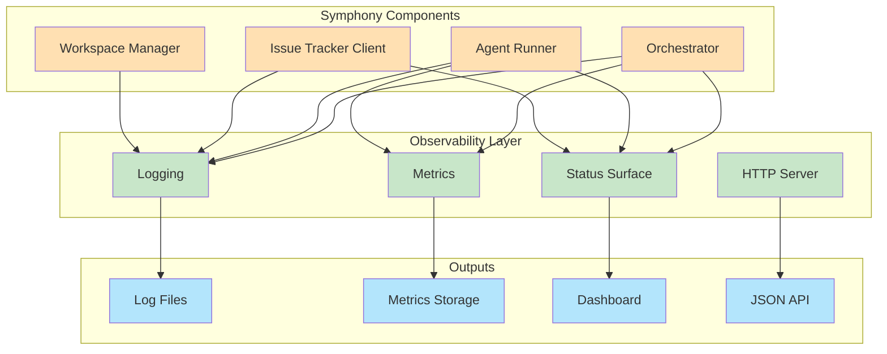
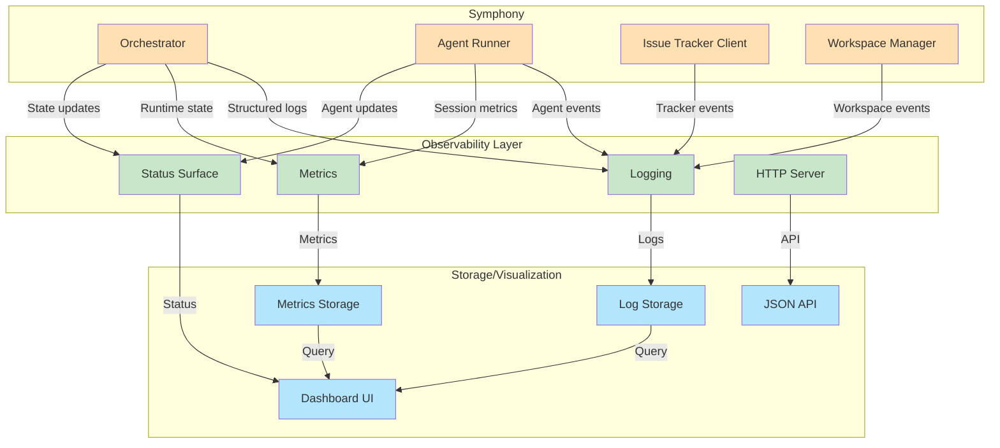

# Observability Strategy

**Версия**: 1.0
**Статус**: Draft
**Последнее обновление**: 2026-04-11

---

## 1. Обзор стратегии observability

Observability Strategy определяет требования к logging, metrics, monitoring и status surface для Symphony Service.

Observability критически важен для:
- Operating и debugging concurrent agent runs
- Understanding system health и performance
- Identifying bottlenecks и failures
- Continuous improvement системы



**См.**: [SPEC.md, Section 13](../../SPEC.md#13-logging-status-and-observability)

---

## 2. Логирование

### 2.1 Требования к логированию

**Logging conventions** ([SPEC.md, Section 13.1](../../SPEC.md#131-logging-conventions)):

**Required context fields для issue-related logs**:
- `issue_id` - Issue tracker internal ID
- `issue_identifier` - Human-readable issue key (e.g., `ABC-123`)

**Required context для coding-agent session lifecycle logs**:
- `session_id` - Session ID (`<thread_id>-<turn_id>`)

**Message formatting requirements**:
- Use stable `key=value` phrasing
- Include action outcome (`completed`, `failed`, `retrying`, etc.)
- Include concise failure reason когда присутствует
- Avoid logging large raw payloads unless necessary

**Примеры**:
```
issue_dispatched issue_id=abc123 issue_identifier=ABC-123 state=Todo
session_started issue_id=abc123 issue_identifier=ABC-123 session_id=thread123-turn456
turn_completed issue_id=abc123 issue_identifier=ABC-123 session_id=thread123-turn456 turn_count=3 input_tokens=1234 output_tokens=567
workspace_created issue_id=abc123 issue_identifier=ABC-123 workspace_path=/tmp/symphony_workspaces/ABC-123
hook_executed issue_id=abc123 issue_identifier=ABC-123 hook=before_run status=completed duration_ms=234
```

### 2.2 Log Levels

**Log levels и use cases**:

| Level | Use Case | Examples |
|-------|----------|----------|
| `ERROR` | Errors, failures, exceptions | Worker failed, config validation error, API request failed |
| `WARN` | Warnings, deprecations, recoverable issues | Retry scheduled, stall detected, config deprecated |
| `INFO` | Normal operations, significant events | Issue dispatched, session started, worker completed |
| `DEBUG` | Detailed diagnostic information | Detailed state transitions, payload details, flow tracing |

### 2.3 Log Outputs and Sinks

**Supported sinks** ([SPEC.md, Section 13.2](../../SPEC.md#132-logging-outputs-and-sinks)):

Spec не предписывает где logs должны идти. Implementations могут write к одному или нескольким sinks:

**Common sinks**:
- **stderr** - Default sink для containerized deployments
- **Files** - Log files для persistent storage
- **Remote logging** - Remote logging services (e.g., ELK, CloudWatch, Splunk)
- **Structured logging** - JSON-structured logs для parsing и analysis

**Requirements**:
- Operators должны видеть startup/validation/dispatch failures без attaching debugger
- Если configured log sink fails, service должен continue running и emit operator-visible warning через remaining sinks

### 2.4 Log Rotation and Retention

**Rotation strategy**:
- **Size-based**: Rotate когда log file достигает configured size (e.g., 100 MB)
- **Time-based**: Rotate на configured intervals (e.g., daily, hourly)
- **Compression**: Compress rotated logs (e.g., gzip)
- **Retention**: Keep configured number/period of rotated logs (e.g., 30 days)

**Пример config**:
```yaml
logging:
  level: INFO
  format: json
  sinks:
    - type: file
      path: /var/log/symphony/symphony.log
      max_size_mb: 100
      max_files: 30
      compress: true
    - type: stderr
```

---

## 3. Метрики

### 3.1 Required Metrics

**Session metrics** ([SPEC.md, Section 13.5](../../SPEC.md#135-session-metrics-and-token-accounting)):

**Token accounting rules**:
- Prefer absolute thread totals когда available (e.g., `thread/tokenUsage/updated`, `total_token_usage`)
- Ignore delta-style payloads (e.g., `last_token_usage`) для dashboard/API totals
- Extract input/output/total token counts leniently из common field names
- Для absolute totals, track deltas относительно last reported totals чтобы avoid double-counting
- Do not treat generic `usage` maps как cumulative totals если event type не defines их так
- Accumulate aggregate totals в orchestrator state

**Token metrics**:
- `input_tokens` - Aggregate input tokens для всех sessions
- `output_tokens` - Aggregate output tokens для всех sessions
- `total_tokens` - Total tokens (input + output)

**Runtime metrics**:
- `seconds_running` - Aggregate runtime seconds как of snapshot time, включая active sessions
- `sessions_active` - Number of currently active sessions
- `sessions_completed` - Number of completed sessions
- `sessions_failed` - Number of failed sessions

**Rate-limit metrics**:
- `rate_limits` - Latest rate-limit snapshot из agent events

### 3.2 Operational Metrics

**System metrics**:
- `uptime_seconds` - Service uptime в seconds
- `poll_tick_count` - Number of poll ticks executed
- `dispatch_count` - Number of issues dispatched
- `retry_count` - Number of retries scheduled
- `reconciliation_count` - Number of reconciliation runs

**Workspace metrics**:
- `workspaces_active` - Number of active workspaces
- `workspaces_created` - Total number of workspaces created
- `workspaces_cleaned` - Total number of workspaces cleaned

**Agent metrics**:
- `agent_turns_total` - Total number of agent turns executed
- `agent_turns_completed` - Number of completed turns
- `agent_turns_failed` - Number of failed turns
- `agent_turns_cancelled` - Number of cancelled turns

### 3.3 Per-Issue Metrics

**Per-issue tracking** (для debugging и analysis):
- `issue_id`, `issue_identifier` - Issue identifiers
- `turn_count` - Number of turns для issue
- `input_tokens` - Input tokens для issue
- `output_tokens` - Output tokens для issue
- `total_tokens` - Total tokens для issue
- `runtime_seconds` - Runtime seconds для issue
- `status` - Current status для issue
- `error` - Error message если failed

### 3.4 Metric Types

**Metric types**:
- **Counter** - Monotonically increasing values (e.g., dispatch_count, turn_count)
- **Gauge** - Current value (e.g., sessions_active, uptime_seconds)
- **Histogram** - Distribution of values (e.g., turn_duration_ms, dispatch_latency_ms)

**Prometheus-style metrics** (пример):
```
# Counter
symphony_dispatch_total{state="Todo"} 123
symphony_turns_total{status="completed"} 456

# Gauge
symphony_sessions_active 5
symphony_uptime_seconds 3600

# Histogram
symphony_turn_duration_ms_bucket{le="1000"} 100
symphony_turn_duration_ms_bucket{le="5000"} 250
symphony_turn_duration_ms_sum 123456
symphony_turn_duration_ms_count 300
```

---

## 4. Runtime Snapshot / Monitoring Interface

### 4.1 Snapshot API

**Runtime snapshot** ([SPEC.md, Section 13.3](../../SPEC.md#133-runtime-snapshot-monitoring-interface-optional-but-recommended)):

Если implementation exposes synchronous runtime snapshot (для dashboards или monitoring), он должен return:

```json
{
  "running": [
    {
      "issue_id": "abc123",
      "issue_identifier": "ABC-123",
      "started_at": "2026-04-11T12:00:00Z",
      "session": {
        "session_id": "thread123-turn456",
        "thread_id": "thread123",
        "turn_id": "turn456",
        "turn_count": 3,
        "codex_input_tokens": 1234,
        "codex_output_tokens": 567,
        "codex_total_tokens": 1801
      },
      "workspace_path": "/tmp/symphony_workspaces/ABC-123"
    }
  ],
  "retrying": [
    {
      "issue_id": "def456",
      "identifier": "DEF-456",
      "attempt": 2,
      "due_at_ms": 1712845200000,
      "error": "connection timeout"
    }
  ],
  "codex_totals": {
    "input_tokens": 12345,
    "output_tokens": 6789,
    "total_tokens": 19134,
    "seconds_running": 3600.5
  },
  "rate_limits": {
    "requests_remaining": 1000,
    "requests_limit": 10000,
    "tokens_remaining": 100000,
    "tokens_limit": 1000000
  }
}
```

**Recommended snapshot error modes**:
- `timeout` - Snapshot request timed out
- `unavailable` - Snapshot interface not available

### 4.2 Metrics Export

**Metrics export formats**:
- **Prometheus** - HTTP endpoint `/metrics` с Prometheus format
- **StatsD** - UDP-based StatsD protocol
- **OpenTelemetry** - OpenTelemetry protocol

**Пример Prometheus endpoint**:
```
curl http://localhost:8080/metrics
```

**Response**:
```
# HELP symphony_sessions_active Number of active agent sessions
# TYPE symphony_sessions_active gauge
symphony_sessions_active 5

# HELP symphony_turns_total Total number of agent turns
# TYPE symphony_turns_total counter
symphony_turns_total{status="completed"} 456
symphony_turns_total{status="failed"} 23
symphony_turns_total{status="cancelled"} 5
```

---

## 5. Status Surface (Optional)

### 5.1 Status Surface Overview

**Status surface** ([SPEC.md, Section 13.4](../../SPEC.md#134-optional-human-readable-status-surface)):

Human-readable status surface (terminal output, dashboard, etc.) optional и implementation-defined.

Если present, он должен:
- Draw от orchestrator state/metrics only
- Must not be required для correctness

### 5.2 Terminal Status Output

**Terminal status** (пример):
```
Symphony Status
===============

Polling: Active (interval: 30s)
Concurrency: 3/10 active agents
Uptime: 1h 23m 45s

Active Sessions (3):
  1. ABC-123 (Todo) - Running, 2 turns, 1234 tokens
  2. DEF-456 (In Progress) - Running, 1 turn, 567 tokens
  3. GHI-789 (Todo) - Running, 1 turn, 234 tokens

Retry Queue (1):
  1. JKL-012 (Todo) - Retry in 5m, attempt 2, error: connection timeout

Totals:
  Dispatched: 10
  Completed: 5
  Failed: 2
  Retried: 3
  Total Tokens: 15,234 (input: 9,123, output: 6,111)
```

### 5.3 Dashboard Requirements

**Dashboard content** ([SPEC.md, Section 13.7.1](../../SPEC.md#1371-human-readable-dashboard-)):

Если dashboard implemented, он должен depict current state системы:

**Required dashboard elements**:
- Active sessions (issue identifiers, turn counts, token counts)
- Retry queue (issue identifiers, retry delays, errors)
- Token consumption (aggregate totals, per-issue breakdown)
- Runtime totals (aggregate runtime seconds)
- Recent events (session starts, completions, failures)
- Health/error indicators (system health, error counts, warning counts)

**Optional dashboard elements**:
- Historical metrics (token usage over time, session duration distribution)
- Performance metrics (poll latency, dispatch latency)
- System metrics (CPU, memory, disk usage)
- Configuration status (current config, last reload time)

---

## 6. HTTP Server (Optional Extension)

### 6.1 HTTP Server Overview

**HTTP server** ([SPEC.md, Section 13.7](../../SPEC.md#137-optional-http-server-extension)):

Optional HTTP interface для observability и operational control.

Если implemented:
- HTTP server это extension и не required для conformance
- Implementation может serve server-rendered HTML или client-side application для dashboard
- Dashboard/API должен быть observability/control surfaces only и must not become required для orchestrator correctness

### 6.2 HTTP Server Enablement

**Enablement** ([SPEC.md, Section 13.7](../../SPEC.md#137-optional-http-server-extension)):

- Start HTTP server когда CLI `--port` argument provided
- Start HTTP server когда `server.port` present в WORKFLOW.md front matter
- `server.port` это extension configuration и intentionally not part of core front-matter schema
- Precedence: CLI `--port` overrides `server.port` когда оба present
- `server.port` должен быть integer. Positive values bind that port. `0` может быть used для ephemeral port
- Implementations должны bind loopback по default (`127.0.0.1` или host equivalent) если explicitly не configured otherwise
- Changes к HTTP listener settings (e.g., `server.port`) не нужно hot-rebind; restart-required behavior conformant

### 6.3 Human-Readable Dashboard (`/`)

**Dashboard endpoint** ([SPEC.md, Section 13.7.1](../../SPEC.md#1371-human-readable-dashboard-)):

- Host human-readable dashboard на `/`
- Returned document должен depict current state системы
- Implementation choice: server-generated HTML или client-side app что consumes JSON API ниже

**Dashboard elements**:
- Active sessions
- Retry delays
- Token consumption
- Runtime totals
- Recent events
- Health/error indicators

### 6.4 JSON REST API (`/api/v1/*`)

**JSON REST API** ([SPEC.md, Section 13.7.2](../../SPEC.md#1372-json-rest-api-apiv1)):

Provide JSON REST API под `/api/v1/*` для current runtime state и operational debugging.

**Minimum endpoints**:

#### `GET /api/v1/state`

**Purpose**: Runtime state summary

**Response**:
```json
{
  "running": [
    {
      "issue_id": "abc123",
      "issue_identifier": "ABC-123",
      "started_at": "2026-04-11T12:00:00Z",
      "session": {
        "session_id": "thread123-turn456",
        "thread_id": "thread123",
        "turn_id": "turn456",
        "turn_count": 3,
        "codex_input_tokens": 1234,
        "codex_output_tokens": 567,
        "codex_total_tokens": 1801
      },
      "workspace_path": "/tmp/symphony_workspaces/ABC-123"
    }
  ],
  "retrying": [
    {
      "issue_id": "def456",
      "identifier": "DEF-456",
      "attempt": 2,
      "due_at_ms": 1712845200000,
      "error": "connection timeout"
    }
  ],
  "codex_totals": {
    "input_tokens": 12345,
    "output_tokens": 6789,
    "total_tokens": 19134,
    "seconds_running": 3600.5
  },
  "rate_limits": {
    "requests_remaining": 1000,
    "requests_limit": 10000,
    "tokens_remaining": 100000,
    "tokens_limit": 1000000
  }
}
```

#### Optional Endpoints

- `GET /api/v1/config` - Current configuration
- `GET /api/v1/health` - Health check endpoint
- `GET /api/v1/metrics` - Metrics в Prometheus format
- `GET /api/v1/logs` - Recent logs (optional pagination)

**См.**: [SPEC.md, Section 13.7.2](../../SPEC.md#1372-json-rest-api-apiv1)

---

## 7. Observability Architecture

### 7.1 Observability Data Flow



### 7.2 Observability Stack

**Recommended observability stack**:

| Component | Recommended Tool | Purpose |
|-----------|------------------|---------|
| Logs | ELK Stack, CloudWatch Logs, Splunk | Log aggregation и analysis |
| Metrics | Prometheus + Grafana, CloudWatch Metrics | Metrics collection и visualization |
| Tracing | OpenTelemetry, Jaeger | Distributed tracing (future) |
| Dashboard | Grafana, custom web UI | Status dashboard |
| Alerting | Alertmanager, PagerDuty | Alert notifications |

---

## 8. Humanized Agent Event Summaries (Optional)

### 8.1 Event Summaries

**Humanized summaries** ([SPEC.md, Section 13.6](../../SPEC.md#136-humanized-agent-event-summaries-optional)):

Humanized summaries из raw agent protocol events optional.

Если implemented:
- Treat их как observability-only output
- Do not make orchestrator logic depend от humanized strings

**Пример summaries**:
- "Agent started session for issue ABC-123"
- "Agent completed turn 3 for issue ABC-123 (1234 input tokens, 567 output tokens)"
- "Agent failed due to timeout for issue DEF-456"
- "Agent requested approval for command execution (auto-approved)"

---

## 9. Observability Best Practices

### 9.1 Log Management

**Best practices**:
- Use structured logging (JSON format preferred)
- Include correlation IDs для tracing operations
- Log failures с sufficient context для debugging
- Avoid logging sensitive data (API keys, secrets)
- Rotate logs regularly чтобы avoid disk full issues

### 9.2 Metrics Management

**Best practices**:
- Use standard metric naming conventions
- Label metrics с useful dimensions (issue state, error type, etc.)
- Track both counters и gauges
- Include histograms для latency и duration metrics
- Avoid high-cardinality labels

### 9.3 Dashboard Design

**Best practices**:
- Design dashboard для operator workflows (monitoring, debugging, analysis)
- Use clear visual hierarchy (critical info first)
- Include relevant context (time ranges, filters)
- Provide drill-down capabilities (per-issue details)
- Update frequently (real-time or near real-time)

### 9.4 Alerting

**Recommended alerts**:
- **High error rate** - Alert если error rate выше threshold
- **Stalled sessions** - Alert если sessions stall > threshold
- **High token usage** - Alert если token usage anomaly detected
- **System health** - Alert если system health degraded

---

## 10. Связь с другими документами

- **[SDD.md](SDD.md)** - System Design Document, architectural decisions
- **[CONTEXT.md](CONTEXT.md)** - System context и границы
- **[COMPONENTS.md](COMPONENTS.md)** - Component breakdown
- **[DOMAIN-MODEL.md](DOMAIN-MODEL.md)** - Domain entities
- **[ARTIFACT-MODEL.md](ARTIFACT-MODEL.md)** - Artifact lifecycle
- **[CONFIGURATION-MODEL.md](CONFIGURATION-MODEL.md)** - Configuration management
- **[SECURITY.md](SECURITY.md)** - Security model
- **[DEPLOYMENT.md](DEPLOYMENT.md)** - Deployment strategy
- **[SPEC.md](../../SPEC.md)** - Полная техническая спецификация

---

## 11. TODO

### 11.1 Detailed Monitoring Strategy

- [ ] Определить detailed monitoring strategy для production
- [ ] Добавить SLA/SLO definitions
- [ ] Описать alerting strategy с severity levels
- [ ] Добавить on-call procedures и runbooks

### 11.2 Observability Tooling

- [ ] Описать integration с Prometheus/Grafana stack
- [ ] Добавить configuration для ELK/CloudWatch integration
- [ ] Описать OpenTelemetry integration strategy
- [ ] Добавить custom metrics export formats

### 11.3 Observability Automation

- [ ] Добавить automated anomaly detection
- [ ] Описать automated alert routing
- [ ] Добавить self-healing triggers для common issues
- [ ] Описать automated log analysis и insights

### 11.4 Observability Testing

- [ ] Добавить observability integration tests
- [ ] Опис load testing для observability systems
- [ ] Добавить chaos testing для observability resilience
- [ ] Описать observability performance benchmarks

### 11.5 Observability Documentation

- [ ] Добавить observability troubleshooting guide
- [ ] Описать dashboard customization guide
- [ ] Добавить alert tuning guide
- [ ] Описать observability cost optimization strategies
