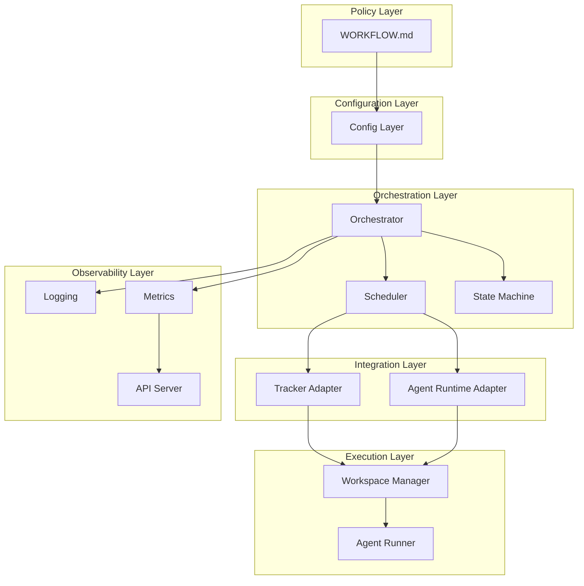
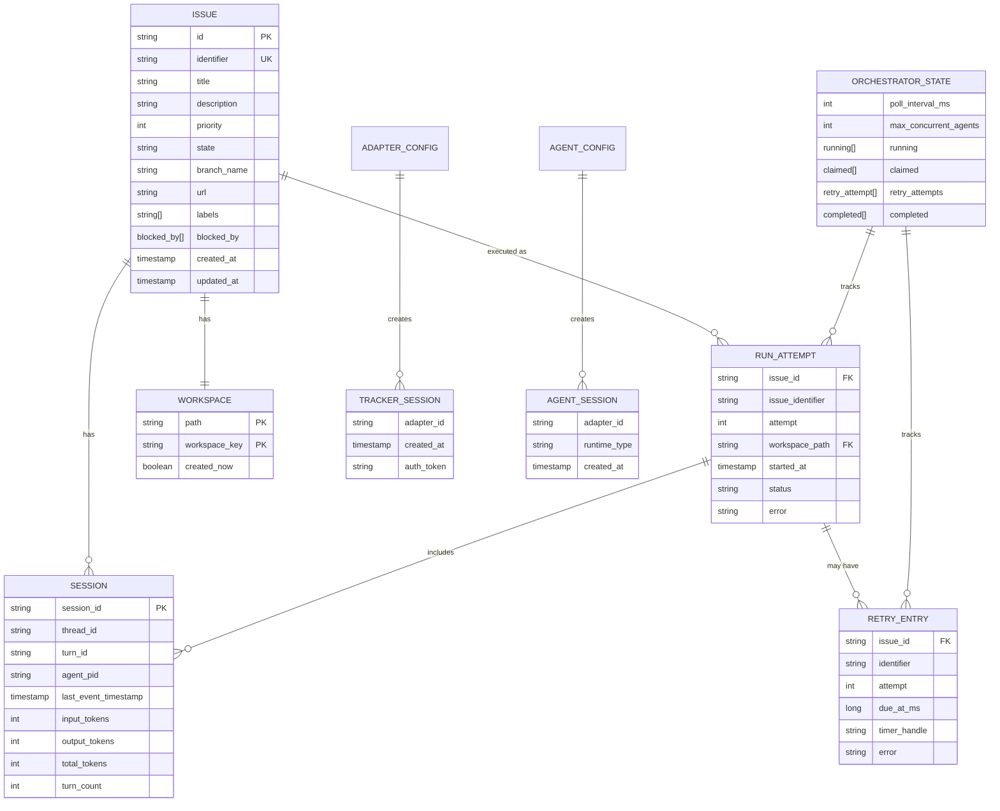
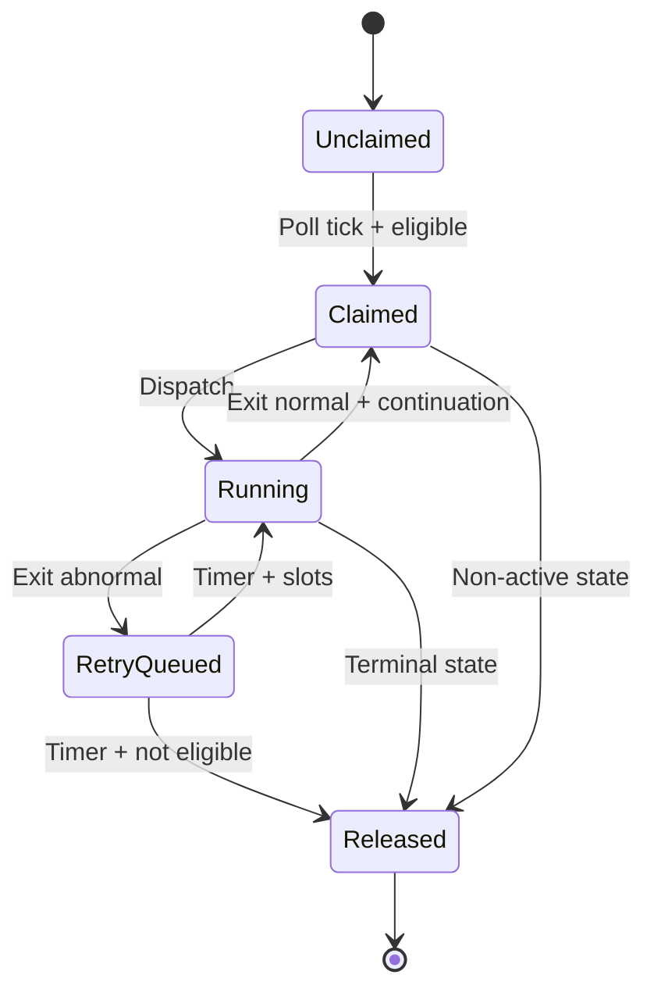
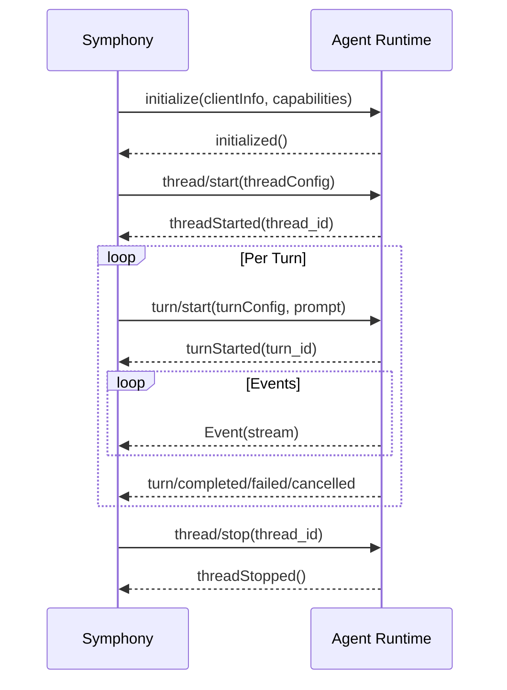
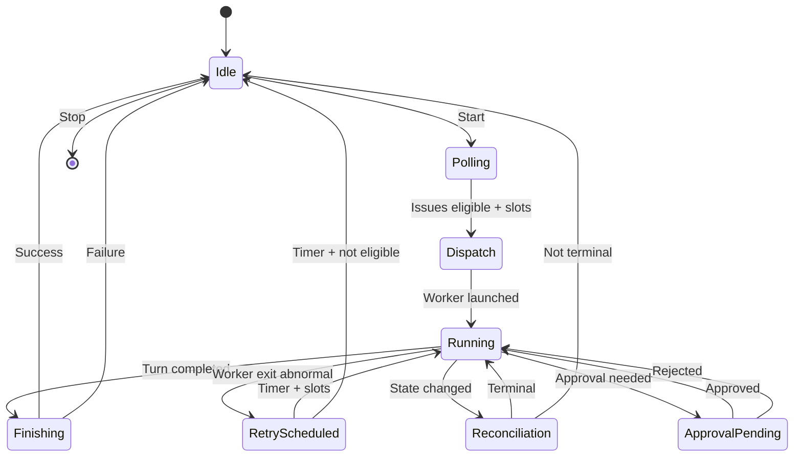
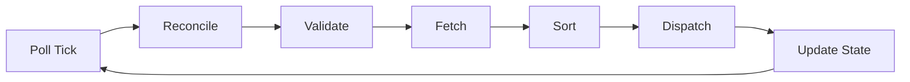
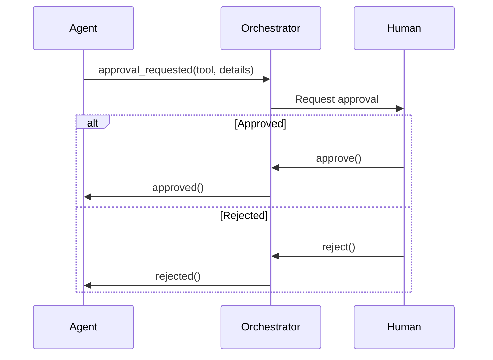
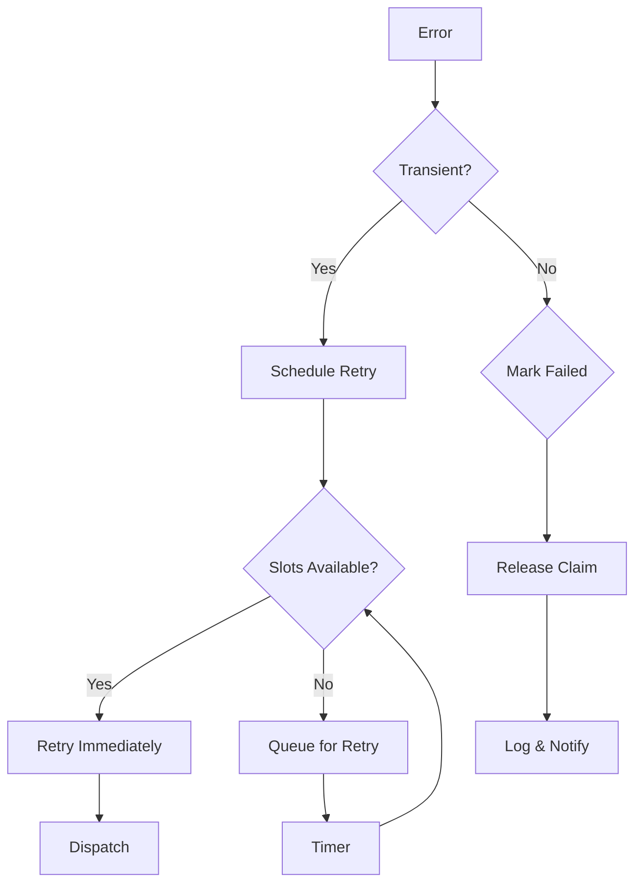
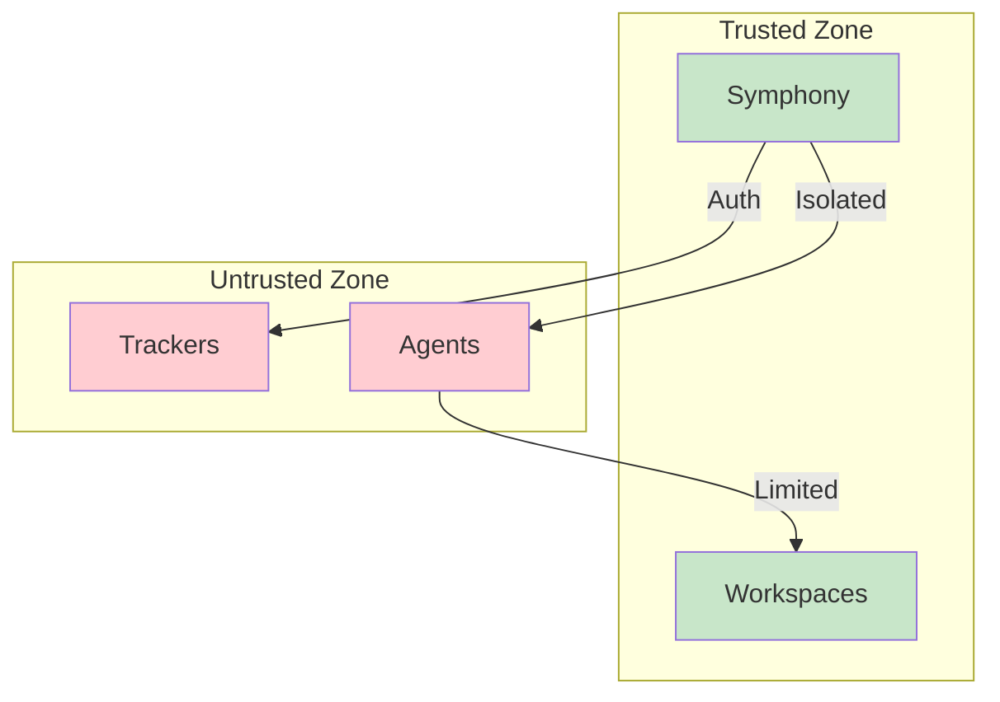

# Software Design Document (SDD)

**Symphony Orchestration Engine**

**Версия**: 2.0  
**Статус**: Draft  
**Последнее обновление**: 2026-04-12

---

## 1. Краткое описание (Executive Summary)

### 1.1 Назначение системы

Symphony — это **оркестратор-coding agents** общего назначения, который автоматизирует выполнение задач из issue tracker с поддержкой человеческого контроля и полной наблюдаемостью.

Ключевые возможности:

- **Плагабельные адаптеры трекеров**: Поддержка Linear, Jira, GitHub Issues через единый абстрактный интерфейс
- **Плагабельные агенты**: Интеграция с OpenCode, Codex, Claude Code через стандартизированный протокол
- **Декларативный движок workflow**: Состояния, переходы, approval gates определяются в конфигурации
- **Аудит и чекпоинтинг**: Полное логирование всех операций с возможностью восстановления
- **Approval gates**: Человеческое утверждение для чувствительных операций
- **Python-first реализация**: Основная реализация на Python с четким разделением слоев

### 1.2 Ключевые характеристики

| Характеристика | Описание |
|--------------|----------|
| **Архитектура** | Плагабельная, на основе адаптеров |
| **Первичный язык** | Python 3.10+ |
| **State management** | In-memory с persistence опционально |
| **Concurrency** | Bounded, настраиваемая |
| **Observability** | Structured logs, metrics, API |
| **Security** | Workspace isolation, secrets management |

### 1.3 High-Level Architecture



---

## 2. Цели и нецели (Goals and Non-Goals)

### 2.1 Цели системы

**Функциональные цели**:

1. **Polling-based dispatch**: Опрос issue tracker с настраиваемым интервалом и диспетчеризация с ограничением concurrency
2. **Single source of truth**: Единое авторитетное состояние orchestrator для dispatch, retries, reconciliation
3. **Workspace isolation**: Создание детерминированных per-issue workspaces с изоляцией
4. **Reconciliation**: Остановка активных runs при изменении состояния issue
5. **Retry с backoff**: Восстановление от transient failures с exponential backoff
6. **Workflow policy**: Загрузка runtime behavior из WORKFLOW.md
7. **Observability**: Structured logs, metrics, optional HTTP API для мониторинга
8. **Restart recovery**: Восстановление без требования persistent database
9. **Human approval**: Поддержка approval gates для чувствительных операций
10. **Pluggable adapters**: Настраиваемые адаптеры для трекеров и агентов

**Нефункциональные цели**:

- **Simplicity**: Простота развертывания и эксплуатации
- **Reliability**: Устойчивость к сбоям с детерминированным восстановлением
- **Extensibility**: Легкое добавление новых адаптеров
- **Debuggability**: Достаточная observability для отладки

### 2.2 Нецели системы

- **Rich web UI**: Multi-tenant control plane или complex dashboard (только optional status surface)
- **General-purpose workflow engine**: Полноценный движок workflow общего назначения (только orchestration tasks)
- **Built-in ticket editing**: Бизнес-логика для редактирования tickets (реализуется в agent tooling)
- **Strict sandboxing**: Строгие sandbox controls сверх workspace isolation
- **Event-driven webhook**: Только polling-based архитектура
- **Persistent database**: Требование persistent DB (только optional persistence)

### 2.3 Scope Boundaries

| Inside Scope | Outside Scope |
|-------------|--------------|
| Issue polling | Ticket mutations (agent tool) |
| Workspace management | Repository operations |
| Agent orchestration | CI/CD pipelines |
| Retry/reconciliation | User authentication |
| Approval gates | Rich web UI |
| Structured logging | Multi-tenant |

---

## 3. Доменная модель (Domain Model)

### 3.1 Core Entities



### 3.2 Entity Definitions

#### Issue

**Назначение**: Нормализованная запись issue из tracker

**Поля**:

| Поле | Тип | Обязательное | Описание |
|------|-----|--------------|----------|
| `id` | string | Да | Stable tracker ID |
| `identifier` | string | Да | Human-readable key (`ABC-123`) |
| `title` | string | Да | Заголовок задачи |
| `description` | string or null | Нет | Описание |
| `priority` | integer or null | Нет | Приоритет (lower = higher) |
| `state` | string | Да | Текущее состояние |
| `branch_name` | string or null | Нет | Branch metadata |
| `url` | string or null | Нет | URL задачи |
| `labels` | list of strings | Да | Метки (lowercase) |
| `blocked_by` | list of blocker refs | Да | Блокирующие задачи |
| `created_at` | timestamp or null | Нет | Время создания |
| `updated_at` | timestamp or null | Нет | Время обновления |

#### Workspace

**Назначение**: Файловая директория для выполнения task

**Поля**:

| Поле | Тип | Обязательное | Описание |
|------|-----|--------------|----------|
| `path` | string | Да | Абсолютный путь |
| `workspace_key` | string | Да | Sanitized identifier |
| `created_now` | boolean | Да | Создан в этом вызове |

#### Run Attempt

**Назначение**: Одна попытка выполнения для issue

**Поля**:

| Поле | Тип | Обязательное | Описание |
|------|-----|--------------|----------|
| `issue_id` | string | Да | Issue ID |
| `issue_identifier` | string | Да | Issue key |
| `attempt` | integer or null | Да | Номер попытки |
| `workspace_path` | string | Да | Workspace path |
| `started_at` | timestamp | Да | Время старта |
| `status` | string | Да | Статус попытки |
| `error` | string or null | Нет | Сообщение об ошибке |

#### Session

**Назначение**: Агентная сессия (thread + turn)

**Поля**:

| Поле | Тип | Обязательное | Описание |
|------|-----|--------------|----------|
| `session_id` | string | Да | `<thread_id>-<turn_id>` |
| `thread_id` | string | Да | Thread ID |
| `turn_id` | string | Да | Turn ID |
| `agent_pid` | string or null | Нет | PID процесса |
| `last_event_timestamp` | timestamp or null | Нет | Timestamp последнего события |
| `input_tokens` | integer | Да | Input токены |
| `output_tokens` | integer | Да | Output токены |
| `total_tokens` | integer | Да | Total токены |
| `turn_count` | integer | Да | Число turns |

#### Orchestrator State

**Назначение**: Единое авторитетное состояние в памяти

**Поля**:

| Поле | Тип | Обязательное | Описание |
|------|-----|--------------|----------|
| `poll_interval_ms` | integer | Да | Интервал polling |
| `max_concurrent_agents` | integer | Да | Лимит concurrency |
| `running` | map | Да | Running issues |
| `claimed` | set | Да | Claimed issues |
| `retry_attempts` | map | Да | Retry queue |
| `completed` | set | Да | Completed (bookkeeping) |

### 3.3 Entity Relationships



### 3.4 Invariants

- `id` issue уникален и стабилен
- `workspace_path` находится внутри `workspace_root`
- `workspace_key` содержит только `[A-Za-z0-9._-]`
- `claimed` = `running.keys() + retry_attempts.keys()`

---

## 4. Контракты адаптеров (Adapter Contracts)

### 4.1 Tracker Adapter Interface

**Назначение**: Унифицированный интерфейс для issue tracker

```python
class TrackerAdapter(ABC):
    """Abstract tracker adapter."""
    
    @abstractmethod
    def fetch_candidate_issues(
        self,
        project_slug: str,
        states: List[str]
    ) -> List[Issue]:
        """Fetch issues in active states."""
        pass
    
    @abstractmethod
    def fetch_issues_by_states(
        self,
        project_slug: str,
        states: List[str]
    ) -> List[Issue]:
        """Fetch issues by state names."""
        pass
    
    @abstractmethod
    def fetch_issue_states(
        self,
        issue_ids: List[str]
    ) -> Dict[str, str]:
        """Fetch current states for issues."""
        pass
    
    @abstractmethod
    def get_blockers(self, issue_id: str) -> List[BlockerRef]:
        """Get blockers for issue."""
        pass
```

### 4.2 Tracker Adapter Implementations

#### Linear Adapter

**Особенности**:
- GraphQL API
- Support for `linear` kind в config
- Pagination support
- Rate limiting

**См.**: [INTEGRATIONS.md](INTEGRATIONS.md#linear-integration)

#### Jira Adapter (Future)

**Особенности**:
- REST API
- Support for JQL queries
- Transition handling

#### GitHub Issues Adapter (Future)

**Особенности**:
- REST API
- Label handling
- Project cards support

### 4.3 Agent Runtime Adapter Interface

**Назначение**: Унифицированный интерфейс для CLI agent

```python
class AgentRuntimeAdapter(ABC):
    """Abstract agent runtime adapter."""
    
    @abstractmethod
    def initialize(
        self,
        config: AgentConfig,
        capabilities: Dict
    ) -> InitializationResult:
        """Initialize agent session."""
        pass
    
    @abstractmethod
    def start_thread(
        self,
        thread_config: ThreadConfig
    ) -> str:
        """Start thread, return thread_id."""
        pass
    
    @abstractmethod
    def start_turn(
        self,
        thread_id: str,
        prompt: str,
        turn_config: TurnConfig
    ) -> str:
        """Start turn, return turn_id."""
        pass
    
    @abstractmethod
    def stream_events(
        self,
        thread_id: str,
        turn_id: str
    ) -> Iterator[AgentEvent]:
        """Stream events from agent."""
        pass
    
    @abstractmethod
    def approve_tool(
        self,
        tool_call_id: str,
        approved: bool
    ) -> None:
        """Approve/reject tool call."""
        pass
    
    @abstractmethod
    def terminate(
        self,
        thread_id: str,
        turn_id: str
    ) -> None:
        """Terminate turn/thread."""
        pass
```

### 4.4 Agent Runtime Adapter Implementations

#### OpenCode Adapter

**Особенности**:
- JSON-RPC over stdio
- Thread/turn model
- Approval events
- Tool execution

#### Codex Adapter

**Особенности**:
- App-server protocol
- Event streaming
- Approval policy
- Sandbox support

#### Claude Code Adapter (Future)

**Особенности**:
- MCP protocol
- Tool calls
- Approval handling

### 4.5 Adapter Configuration

**Tracker config**:
```yaml
tracker:
  kind: "linear"  # or "jira", "github"
  endpoint: "https://api.linear.app/graphql"
  api_key: "$LINEAR_API_KEY"
  project_slug: "my-team/my-project"
  active_states:
    - "Todo"
    - "In Progress"
  terminal_states:
    - "Done"
    - "Cancelled"
```

**Agent config**:
```yaml
agent:
  runtime: "codex"  # or "opencode", "claude_code"
  command: "codex app-server"
  max_concurrent_agents: 10
  turn_timeout_ms: 3600000
  stall_timeout_ms: 300000
  approval_policy: "auto_approve"
  sandbox:
    type: "none"  # or "container", "vm"
```

---

## 5. Абстракция Agent Runtime

### 5.1 Protocol Overview



### 5.2 Protocol Messages

#### Initialization

```json
{
  "id": 1,
  "method": "initialize",
  "params": {
    "clientInfo": {"name": "symphony", "version": "2.0"},
    "capabilities": {}
  }
}
```

#### Thread Start

```json
{
  "id": 2,
  "method": "thread/start",
  "params": {
    "approvalPolicy": "auto_approve",
    "sandbox": "none",
    "cwd": "/workspace/path"
  }
}
```

#### Turn Start

```json
{
  "id": 3,
  "method": "turn/start",
  "params": {
    "threadId": "thread-123",
    "input": [{"type": "text", "text": "<prompt>"}],
    "cwd": "/workspace/path",
    "title": "ABC-123: Task title",
    "approvalPolicy": "auto_approve",
    "sandboxPolicy": {"type": "none"}
  }
}
```

### 5.3 Events

| Event | Описание |
|-------|----------|
| `session_started` | Сессия инициализирована |
| `turn_completed` | Turn завершен успешно |
| `turn_failed` | Turn завершен с ошибкой |
| `turn_cancelled` | Turn отменен |
| `approval_requested` | Требуется approval |
| `tool_called` | Инструмент вызван |
| `notification` | Уведомление |
| `malformed` | Сообщение не распознано |

### 5.4 Tool Approval

**Approval policy types**:

- `auto_approve_all` — все инструменты автоутверждаются
- `require_approval_for_dangerous` — требуется approval для опасных операций
- `require_approval_for_all` — требуется approval для всех операций

**Tool categories**:

| Category | Examples |
|----------|----------|
| `safe` | Read file, Search, List |
| `requires_approval` | Write file, Execute command |
| `dangerous` | Delete, Network, System |

---

## 6. Workflow Engine

### 6.1 State Machine Overview



### 6.2 Workflow Definition (WORKFLOW.md)

```yaml
---
# Workflow Configuration
name: default
version: "2.0"

# Tracker configuration
tracker:
  kind: linear
  polling:
    interval_ms: 30000
  active_states:
    - Todo
    - In Progress
  terminal_states:
    - Done
    - Cancelled

# Workspace configuration  
workspace:
  root: ./workspaces
  hooks:
    after_create: ./hooks/after_create.sh
    before_run: ./hooks/before_run.sh
    after_run: ./hooks/after_run.sh
    before_remove: ./hooks/before_remove.sh
    timeout_ms: 60000

# Agent configuration
agent:
  runtime: codex
  max_concurrent_agents: 10
  max_retry_backoff_ms: 300000
  turn_timeout_ms: 3600000
  stall_timeout_ms: 300000
  approval_policy: auto_approval
  command: codex app-server
  sandbox:
    type: none

# Approval gates
approval:
  enabled: true
  default_policy: auto_approve
  dangerous_tools:
    - shell_command
    - delete_file
    - network_call

# Observability
observability:
  log_level: INFO
  metrics_enabled: true
  status_surface: true
  server:
    port: 8080
---

# Prompt Template
You are an expert software developer working on issue {{issue.identifier}}: {{issue.title}}

## Context
{{issue.description}}

## Workspace
You are working in: {{workspace_path}}

## Instructions
1. Analyze the issue requirements
2. Implement the solution
3. Write tests if needed
4. Update the issue status when complete
```

### 6.3 State Transitions

| From State | To State | Trigger |
|-----------|---------|---------|
| Idle | Polling | Start orchestrator |
| Polling | Dispatch | Issues eligible + slots available |
| Dispatch | Running | Worker launched |
| Running | Finishing | Turn completed/failed |
| Running | RetryScheduled | Exit abnormal |
| Running | Reconciliation | State changed |
| RetryScheduled | Running | Timer fired + slots |
| RetryScheduled | Idle | Timer fired + not eligible |
| Finishing | Idle | Success/failure |
| Idle | Stop | Stop orchestrator |

### 6.4 Blocker Logic

**Rules**:

1. Issue в состоянии `Todo` не dispatch если любой blocker не в terminal state
2. Issue в состоянии `In Progress` dispatch несмотря на blockers
3. Terminal states определяются в конфигурации

---

## 7. State Management

### 7.1 Runtime State

**In-memory state** (primary):

```python
class OrchestratorState:
    poll_interval_ms: int
    max_concurrent_agents: int
    running: Dict[str, RunningEntry]
    claimed: Set[str]
    retry_attempts: Dict[str, RetryEntry]
    completed: Set[str]
    codex_totals: Dict[str, int]
    codex_rate_limits: Dict[str, Any]
```

**Persistence** (optional):

- Checkpoint to disk on state changes
- Restore on startup from checkpoint + tracker
- Files: `state/checkpoint/*.json`

### 7.2 State Ownership

| State | Owner | Notes |
|-------|-------|-------|
| Runtime state | Orchestrator | Single authority |
| Workspace state | Workspace Manager | Per-workspace |
| Session state | Agent Runner | Per-session |
| Tracker state | Tracker (external) | Source of truth |

### 7.3 State Transitions



### 7.4 Restart Recovery

1. **Load checkpoint** (если exists)
2. **Fetch current tracker state** для running issues
3. **Reconcile**: Terminate workers for terminal issues, keep workers for active
4. **Start poll loop**

---

## 8. Approval Model

### 8.1 Approval Types

| Type | Description | Timeout |
|------|-------------|---------|
| `auto` | Auto-approved | N/A |
| `manual` | Requires human | Configurable |
| `escalate` | Escalate to specific user | Configurable |

### 8.2 Approval Flow



### 8.3 Approval Configuration

```yaml
approval:
  enabled: true
  default_policy: auto_approve
  
  # Tool-specific overrides
  tool_policies:
    shell_command: require_approval
    delete_file: require_approval
    network_call: require_approval
    read_file: auto_approve
    write_file: auto_approve
  
  # Timeout configuration
  timeout_ms: 300000
  escalation_emails:
    - team@example.com
```

### 8.4 Approval Events

| Event | Payload |
|-------|---------|
| `approval_requested` | `{tool: str, details: dict, id: str}` |
| `approval_granted` | `{id: str}` |
| `approval_denied` | `{id: str, reason: str}` |
| `approval_timeout` | `{id: str}` |

---

## 9. Retry and Error Handling

### 9.1 Retry Strategy

**Retry types**:

1. **Normal continuation**: After successful turn, continue with prompt
2. **Failure retry**: After abnormal exit, schedule retry

**Backoff formula**:

```
delay = min(10000 * 2^(attempt - 1), max_retry_backoff_ms)
```

- Normal continuation: 1000ms fixed
- Failure: exponential backoff

### 9.2 Error Categories

| Category | Handling |
|----------|----------|
| `transient` | Retry with backoff |
| `permanent` | Mark as failed, release |
| `stall` | Terminate, retry |
| `approval_denied` | Mark as failed |

### 9.3 Error Mapping

| Error | Category | Action |
|-------|----------|--------|
| Network timeout | transient | Retry |
| API auth failure | permanent | Fail |
| Turn timeout | transient | Retry |
| Stall detected | transient | Retry |
| User input | permanent | Fail |
| Invalid config | permanent | Fail |

### 9.4 Recovery Patterns



---

## 10. Observability

### 10.1 Logging

**Structured logging** с обязательными полями:

```
timestamp=2026-04-12T12:00:00Z level=INFO 
  event=issue_dispatched 
  issue_id=abc123 issue_identifier=ABC-123
```

**Context fields**:

| Field | Required for |
|-------|--------------|
| `issue_id` | Issue operations |
| `issue_identifier` | Issue operations |
| `session_id` | Session operations |
| `attempt` | Retry operations |

**Log levels**:

- `ERROR`: Failures
- `WARN`: Warnings, retries
- `INFO`: Normal operations
- `DEBUG`: Details

**Sinks**: stderr, files, remote

### 10.2 Metrics

**Session metrics**:

- `symphony_sessions_active` (gauge)
- `symphony_sessions_completed` (counter)
- `symphony_sessions_failed` (counter)
- `symphony_input_tokens` (counter)
- `symphony_output_tokens` (counter)

**Runtime metrics**:

- `symphony_uptime_seconds` (gauge)
- `symphony_poll_ticks_total` (counter)
- `symphony_dispatch_total` (counter)
- `symphony_retry_total` (counter)

**Export formats**: Prometheus, StatsD, OpenTelemetry

### 10.3 Status Surface

**Terminal output**:

```
Symphony Status
===============
Polling: Active (interval: 30s)
Concurrency: 3/10 active agents

Active Sessions:
1. ABC-123 - Running, 2 turns
2. DEF-456 - Running, 1 turn

Retry Queue:
1. GHI-789 - Retry in 5m, attempt 2
```

### 10.4 HTTP API

**Endpoints**:

| Endpoint | Description |
|----------|-------------|
| `GET /api/v1/state` | Runtime state |
| `GET /api/v1/metrics` | Prometheus metrics |
| `GET /api/v1/health` | Health check |
| `GET /` | Dashboard (optional) |

---

## 11. Security Model

### 11.1 Workspace Invariants

**Инвариант 1**: Agent выполняется только в per-issue workspace

```python
def launch_agent(workspace_path: str, config: dict) -> Process:
    if os.getcwd() != workspace_path:
        raise SecurityError("CWD mismatch")
    return subprocess.Popen(config["command"], cwd=workspace_path)
```

**Инвариант 2**: Workspace path внутри workspace root

```python
def validate_path(workspace_path: str, workspace_root: str) -> bool:
    abs_ws = os.path.abspath(workspace_path)
    abs_root = os.path.abspath(workspace_root)
    if not abs_ws.startswith(abs_root + os.sep):
        raise SecurityError("Path outside root")
    return True
```

**Инвариант 3**: Workspace key sanitized

```python
def sanitize_key(identifier: str) -> str:
    return re.sub(r'[^A-Za-z0-9._-]', '_', identifier)
```

### 11.2 Authentication

| System | Auth |
|--------|------|
| Linear | Bearer token |
| Jira | API token |
| GitHub | Personal access token |
| Agent | None (local subprocess) |

### 11.3 Secrets Management

```yaml
# Config references secrets via $VAR
tracker:
  api_key: $LINEAR_API_KEY

# Environment
export LINEAR_API_KEY="lin_api_..."
```

**Рекомендации**:

- Use environment variables
- Never commit secrets
- Validate on startup
- Support rotation

### 11.4 Trust Boundaries



---

## 12. Deployment Model

### 12.1 Deployment Options

| Option | Description |
|--------|-------------|
| **Standalone** | Python script + CLI |
| **Docker** | Containerized |
| **Kubernetes** | Pod + deployment |
| **Systemd** | Linux service |

### 12.2 Standalone Deployment

```bash
# Install
pip install symphony

# Configure
export LINEAR_API_KEY="lin_api_..."
export WORKFLOW_PATH="./WORKFLOW.md"

# Run
symphony run ./WORKFLOW.md
```

### 12.3 Docker Deployment

```dockerfile
FROM python:3.10-slim
WORKDIR /app
COPY . .
RUN pip install .
CMD ["symphony", "run", "/app/WORKFLOW.md"]
```

### 12.4 Kubernetes Deployment

```yaml
apiVersion: apps/v1
kind: Deployment
metadata:
  name: symphony
spec:
  replicas: 1
  selector:
    matchLabels:
      app: symphony
  template:
    spec:
      containers:
      - name: symphony
        image: symphony:latest
        env:
        - name: LINEAR_API_KEY
          valueFrom:
            secretKeyRef:
              name: symphony-secrets
              key: linear-api-key
        volumeMounts:
        - name: workspace
          mountPath: /workspaces
      volumes:
      - name: workspace
        emptyDir: {}
```

### 12.5 Configuration

```yaml
# WORKFLOW.md (required)
name: default
version: "2.0"
tracker:
  kind: linear
  # ...
agent:
  runtime: codex
  # ...

# Environment (optional)
SYMPHONY_LOG_LEVEL=INFO
SYMPHONY_WORKSPACE_ROOT=/workspaces
LINEAR_API_KEY=...
```

### 12.6 Health Checks

- **Liveness**: Process alive
- **Readiness**: Tracker accessible, config valid
- **Startup**: Initial sync complete

---

## 13. Миграция с Elixir

### 13.1 Сравнение архитектур

| Aspect | Elixir (old) | Python (new) |
|--------|--------------|--------------|
| Language | Elixir/OTP | Python 3.10+ |
| State | ETS + GenServer | In-memory + optional |
| Adapters | Hardcoded Linear | Pluggable |
| Protocol | Custom | Standard |
| Observability | Logger | Structured logs |

### 13.2 Artifact Handling

**Existing workspace artifacts**:

- Located at: `<workspace.root>/<issue_key>/`
- Preserved between runs
- Can be inspected for debugging

**Migration strategy**:

1. Identify existing workspaces
2. Validate paths and contents
3. Provide read-only access for debugging
4. New issues use new runtime

### 13.3 Configuration Migration

**Old (Elixir)**:

```elixir
config :symphony,
  poll_interval: 30_000,
  max_agents: 10,
  linear: [api_key: {:system, "LINEAR_API_KEY"}]
```

**New (Python)**:

```yaml
tracker:
  kind: linear
  api_key: $LINEAR_API_KEY
  polling:
    interval_ms: 30000
    
agent:
  max_concurrent_agents: 10
```

### 13.4 Coexistence

- Run both systems simultaneously for migration period
- Use different workspace roots to avoid conflicts
- Monitor both systems during transition

---

## 14. Связь с другими документами

### 14.1 Reference Documents

- **[SPEC.md](../../SPEC.md)** — Полная техническая спецификация
- **[CONTEXT.md](CONTEXT.md)** — System context и границы
- **[COMPONENTS.md](COMPONENTS.md)** — Детальное описание компонентов
- **[DOMAIN-MODEL.md](DOMAIN-MODEL.md)** — Domain entities
- **[INTEGRATIONS.md](INTEGRATIONS.md)** — Интеграции с внешними системами
- **[SECURITY.md](SECURITY.md)** — Security model
- **[OBSERVABILITY.md](OBSERVABILITY.md)** — Observability strategy

### 14.2 Future Specifications

- **Jira Adapter**: [INTEGRATIONS.md](INTEGRATIONS.md#jira-integration-future)
- **GitHub Issues Adapter**: [INTEGRATIONS.md](INTEGRATIONS.md#github-issues-integration-future)
- **Claude Code Adapter**: [AGENT_RUNTIME.md](AGENT_RUNTIME.md#claude-code)
- **CI/CD Integration**: [INTEGRATIONS.md](INTEGRATIONS.md#cicd-integration-future)

---

## 15. Appendix

### 15.1 Glossary

| Term | Definition |
|------|------------|
| **Orchestrator** | Central coordinator |
| **Workspace** | Isolated execution directory |
| **Tracker** | Issue tracker (Linear, Jira, etc.) |
| **Agent** | CLI agent (Codex, OpenCode, etc.) |
| **Dispatch** | Launch agent for issue |
| **Reconciliation** | Sync with tracker state |
| **Checkpoint** | Persisted state snapshot |

### 15.2 Configuration Reference

**Full config schema**:

```yaml
name: string
version: string

tracker:
  kind: "linear" | "jira" | "github"
  endpoint: string
  api_key: string
  project_slug: string
  active_states: [string]
  terminal_states: [string]

workspace:
  root: string
  hooks:
    after_create: string
    before_run: string
    after_run: string
    before_remove: string
    timeout_ms: number

agent:
  runtime: "codex" | "opencode" | "claude_code"
  command: string
  max_concurrent_agents: number
  max_retry_backoff_ms: number
  turn_timeout_ms: number
  stall_timeout_ms: number
  approval_policy: string
  sandbox:
    type: string

approval:
  enabled: boolean
  default_policy: string
  tool_policies: {string: string}
  timeout_ms: number

observability:
  log_level: string
  metrics_enabled: boolean
  status_surface: boolean
  server:
    port: number
```

### 15.3 Error Codes

| Code | Description |
|------|-------------|
| `E0001` | Invalid config |
| `E0002` | Tracker unavailable |
| `E0003` | No eligible issues |
| `E0004` | Concurrency limit |
| `E0005` | Workspace error |
| `E0006` | Agent error |
| `E0007` | Timeout |
| `E0008` | Approval denied |

---

## Revision History

| Version | Date | Changes |
|---------|------|---------|
| 1.0 | 2026-04-11 | Initial Elixir-based SDD |
| 2.0 | 2026-04-12 | Python-first, pluggable architecture |

---

**End of Document**