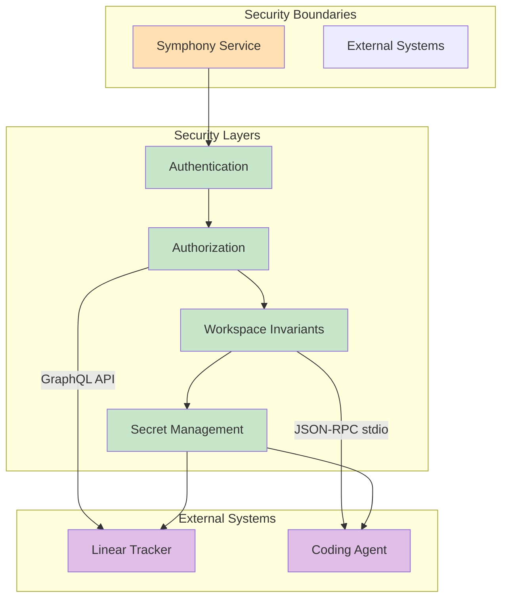
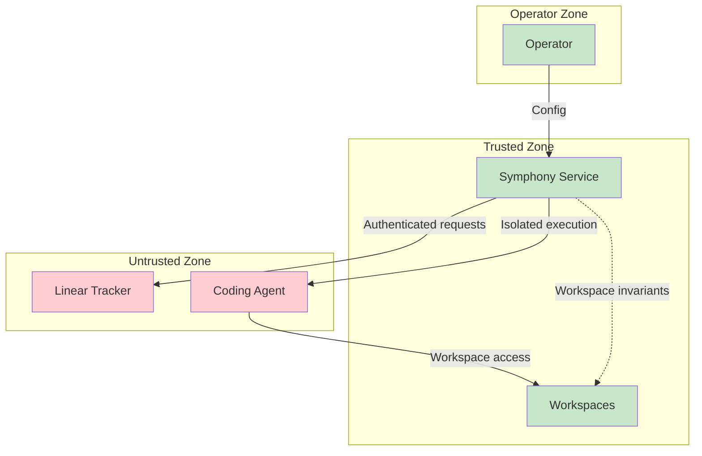
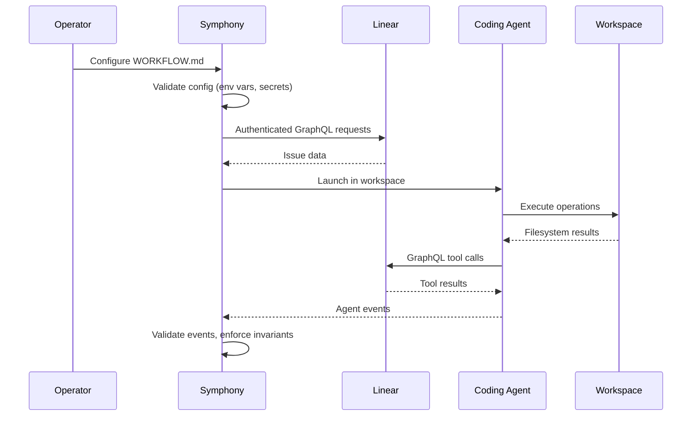

# Security Model

**Версия**: 1.0
**Статус**: Draft
**Последнее обновление**: 2026-04-11

---

## 1. Обзор модели безопасности

Security Model определяет security posture, invariants и controls для Symphony Service.

Implementations должны документировать свои trust и safety posture explicitly. Эта спецификация не требует single approval, sandbox или operator-confirmation policy; некоторые implementations могут target trusted environments с high-trust configuration, в то время как другие могут require stricter approvals или sandboxing.



**См.**: [SPEC.md, Section 1](../../SPEC.md#1-problem-statement), [SPEC.md, Section 9.5](../../SPEC.md#95-safety-invariants)

---

## 2. Workspace Invariants (3 Invariants)

### 2.1 Invariant 1: Workspace Execution

**Invariant**: Run the coding agent only in the per-issue workspace path.

**Validation** ([SPEC.md, Section 9.5](../../SPEC.md#95-safety-invariants)):
- Before launching the coding-agent subprocess, validate: `cwd == workspace_path`

**Implementation**:
```python
def launch_coding_agent(workspace_path: str, config: dict) -> Process:
    """
    Launch coding agent subprocess in workspace directory.
    """
    # Validate cwd equals workspace_path
    if os.getcwd() != workspace_path:
        raise SecurityError(
            f"Current working directory mismatch: "
            f"expected={workspace_path}, actual={os.getcwd()}"
        )

    # Launch subprocess with workspace_path as cwd
    process = subprocess.Popen(
        config["codex"]["command"],
        cwd=workspace_path,
        stdout=subprocess.PIPE,
        stderr=subprocess.PIPE
    )

    return process
```

**Purpose**: Изоляция execution контекста к specific workspace directory.

### 2.2 Invariant 2: Workspace Path Validation

**Invariant**: Workspace path must stay inside workspace root.

**Validation** ([SPEC.md, Section 9.5](../../SPEC.md#95-safety-invariants)):
- Normalize both paths к absolute
- Require `workspace_path` имеет `workspace_root` как prefix directory
- Reject any path outside workspace root

**Implementation**:
```python
def validate_workspace_path(workspace_path: str, workspace_root: str) -> bool:
    """
    Validate workspace path is inside workspace root.
    """
    # Normalize to absolute paths
    workspace_path = os.path.abspath(workspace_path)
    workspace_root = os.path.abspath(workspace_root)

    # Check workspace_path has workspace_root as prefix
    if not workspace_path.startswith(workspace_root + os.sep):
        raise SecurityError(
            f"Workspace path outside workspace root: "
            f"workspace_path={workspace_path}, workspace_root={workspace_root}"
        )

    return True
```

**Purpose**: Предотвращение path traversal attacks и execution outside designated workspace directory.

### 2.3 Invariant 3: Workspace Key Sanitization

**Invariant**: Workspace key is sanitized.

**Sanitization** ([SPEC.md, Section 9.5](../../SPEC.md#95-safety-invariants)):
- Only `[A-Za-z0-9._-]` allowed в workspace directory names
- Replace all other characters с `_`

**Implementation**:
```python
import re

def sanitize_workspace_key(identifier: str) -> str:
    """
    Sanitize issue identifier для workspace directory name.
    """
    # Replace any character not in [A-Za-z0-9._-] with _
    workspace_key = re.sub(r'[^A-Za-z0-9._-]', '_', identifier)

    return workspace_key
```

**Purpose**: Предотвращение directory name injection и filesystem errors.

**Примеры**:
- `ABC-123` → `ABC-123` (no change)
- `ABC/123` → `ABC_123` (slash replaced)
- `ABC:123` → `ABC_123` (colon replaced)
- `ABC..123` → `ABC..123` (dots allowed)

---

## 3. Аутентификация

### 3.1 Linear API Authentication

**Authentication mechanism** ([SPEC.md, Section 11.2](../../SPEC.md#112-query-semantics-linear)):

- **Protocol**: GraphQL API over HTTPS
- **Authentication**: Authorization header с API token
- **Token source**: Environment variable `$LINEAR_API_KEY` или config value

**Implementation**:
```python
import requests

class LinearClient:
    def __init__(self, endpoint: str, api_key: str):
        self.endpoint = endpoint
        self.api_key = api_key

    def _make_request(self, query: str, variables: dict) -> dict:
        """
        Make GraphQL request с authentication.
        """
        headers = {
            "Authorization": self.api_key,
            "Content-Type": "application/json"
        }

        response = requests.post(
            self.endpoint,
            json={"query": query, "variables": variables},
            headers=headers
        )

        response.raise_for_status()
        return response.json()
```

**Security considerations**:
- **Never commit** literal API keys в repository
- **Use environment variables**: `$LINEAR_API_KEY` для sensitive values
- **HTTPS only**: Always use HTTPS endpoint
- **Token rotation**: Implement token rotation policy если supported

**См.**: [CONFIGURATION-MODEL.md](CONFIGURATION-MODEL.md), [INTEGRATIONS.md](INTEGRATIONS.md#linear-integration)

### 3.2 Coding Agent Authentication

**Authentication mechanism** ([SPEC.md, Section 10](../../SPEC.md#10-agent-runner-protocol-coding-agent-integration)):

- **Protocol**: JSON-RPC-like app-server protocol over stdio
- **Authentication**: None (local subprocess execution)
- **Authorization**: Workspace invariants provide isolation

**Security considerations**:
- **Local execution**: Agent subprocess runs locally в workspace directory
- **No network authentication**: No remote authentication required
- **Process isolation**: Use OS-level process isolation
- **Resource limits**: Enforce resource limits (CPU, memory, disk)

### 3.3 HTTP Server Authentication (Optional)

**Authentication mechanism** ([SPEC.md, Section 13.7](../../SPEC.md#137-optional-http-server-extension)):

- **Protocol**: HTTP
- **Authentication**: Implementation-defined
- **Recommendation**: Bind to loopback (`127.0.0.1`) по default

**Security considerations**:
- **Network exposure**: Bind to loopback по default чтобы avoid external access
- **Authentication**: Implement authentication если exposed externally
- **TLS**: Use TLS/TLS если exposed externally
- **Authorization**: Implement authorization controls для sensitive endpoints

---

## 4. Авторизация

### 4.1 Authorization Scope

**Authorization scope** ([SPEC.md, Section 1](../../SPEC.md#1-problem-statement)):

Symphony это scheduler/runner и tracker reader. Ticket writes (state transitions, comments, PR links) typically performed coding agent через tools available в workflow/runtime environment.

**Symphony authorization scope**:
- **Read**: Read access к issue tracker (Linear)
- **Execute**: Execute access к workspaces (coding agent subprocess)
- **Write**: Write access к filesystem (workspaces, logs)

**Coding agent authorization scope**:
- **Read**: Read access к issue tracker (через `linear_graphql` tool)
- **Write**: Write access к issue tracker (через `linear_graphql` tool)
- **Execute**: Execute access к workspace (filesystem operations)

### 4.2 Linear GraphQL Tool Authorization

**Linear GraphQL tool** ([SPEC.md, Section 10.5](../../SPEC.md#105-approval-tool-calls-and-user-input-policy)):

**Tool contract**:
- **Purpose**: Execute raw GraphQL query или mutation против Linear
- **Authentication**: Reuse configured Linear endpoint и auth из active Symphony workflow/runtime config
- **Authorization**: Same authorization scope как Symphony (read/write к issue tracker)

**Implementation**:
```python
def linear_graphql_tool(query: str, variables: dict) -> dict:
    """
    Execute GraphQL query against Linear.

    Reuses configured Linear endpoint and auth.
    """
    # Get Linear config from Symphony workflow/runtime config
    endpoint = get_tracker_endpoint()
    api_key = get_tracker_api_key()

    # Execute GraphQL query
    result = execute_graphql_query(
        endpoint=endpoint,
        api_key=api_key,
        query=query,
        variables=variables
    )

    return result
```

**Security considerations**:
- **No additional auth required**: Reuses Symphony auth
- **Same scope**: Same read/write authorization как Symphony
- **Tool control**: Agent can only execute GraphQL operations через this tool
- **Query validation**: Validate query structure и content (single operation, no operationName injection)

---

## 5. Управление секретами

### 5.1 Secret Management Strategy

**Secret types**:
- **Linear API keys**: Issue tracker authentication
- **Other secrets**: Future integrations (CI/CD, notifications, etc.)

**Secret storage**:
- **Environment variables**: Primary method для secret storage
- **Never commit secrets**: Never commit literal secrets в repository
- **Config references**: Use `$VAR_NAME` syntax в config для secret references

**Пример**:
```yaml
# WORKFLOW.md
tracker:
  api_key: $LINEAR_API_KEY  # Secret reference
```

```bash
# Environment
export LINEAR_API_KEY="your-secret-api-key"
```

### 5.2 Secret Rotation

**Rotation strategy**:
- **Manual rotation**: Operator-triggered secret rotation
- **Grace period**: Support old secrets во время transition period
- **Reload on change**: Reload config когда secrets change
- **No downtime**: Avoid downtime во время secret rotation

**Implementation**:
```python
class ConfigLayer:
    def __init__(self):
        self.last_api_key = None
        self.last_api_key_change_time = None

    def get_tracker_api_key(self) -> str:
        """
        Get current API key with rotation support.
        """
        current_api_key = os.environ.get("LINEAR_API_KEY")

        # Check if API key changed
        if current_api_key != self.last_api_key:
            self.last_api_key = current_api_key
            self.last_api_key_change_time = time.time()
            logger.info("tracker_api_key_rotated")

        return current_api_key
```

### 5.3 Secret Validation

**Validation checks**:
- **Presence**: Required secrets must be present
- **Non-empty**: Secrets must not be empty strings
- **Format**: Secrets must match expected format (если applicable)
- **Expiration**: Check expiration если supported

**Implementation**:
```python
def validate_tracker_api_key() -> bool:
    """
    Validate Linear API key.
    """
    api_key = os.environ.get("LINEAR_API_KEY")

    # Check presence
    if api_key is None:
        raise SecurityError("LINEAR_API_KEY environment variable not set")

    # Check non-empty
    if not api_key:
        raise SecurityError("LINEAR_API_KEY is empty")

    # Check format (Linear API key format: lin_api_*)
    if not api_key.startswith("lin_api_"):
        raise SecurityError(f"Invalid Linear API key format: {api_key[:10]}...")

    return True
```

**См.**: [SPEC.md, Section 6.3](../../SPEC.md#63-dispatch-preflight-validation), [CONFIGURATION-MODEL.md](CONFIGURATION-MODEL.md)

---

## 6. Trust and Safety Posture

### 6.1 High-Trust Configuration

**Characteristics**:
- **Auto-approve**: Auto-approve command execution approvals для session
- **Auto-approve**: Auto-approve file-change approvals для session
- **Hard failure**: Treat user-input-required turns как hard failure
- **No sandbox**: Minimal или no sandbox controls

**Config example**:
```yaml
codex:
  approval_policy: "auto_approve_all"
  thread_sandbox: "disabled"
  turn_sandbox_policy: {"type": "disabled"}
```

**Use cases**:
- Trusted development environments
- Internal tooling
- Automated workflows с known inputs

### 6.2 Strict Configuration

**Characteristics**:
- **Require approval**: Require operator approval для sensitive operations
- **Enable sandbox**: Enable sandbox controls (e.g., container, VM)
- **Strict policy**: Strict approval и sandbox policies
- **Input blocking**: Block user-input-required turns

**Config example**:
```yaml
codex:
  approval_policy: "require_approval_for_all"
  thread_sandbox: "container"
  turn_sandbox_policy: {"type": "strict", "allow_network": false}
```

**Use cases**:
- Production environments
- Untrusted inputs
- Multi-tenant deployments

**См.**: [SPEC.md, Section 10.5](../../SPEC.md#105-approval-tool-calls-and-user-input-policy)

---

## 7. Security Boundaries

### 7.1 Trust Boundaries



**Trust boundaries**:
- **Trusted zone**: Symphony service, workspaces (controlled environment)
- **Untrusted zone**: External systems (Linear, coding agent inputs)
- **Operator zone**: Operator-managed configurations

### 7.2 Data Flow Security



**Security controls**:
- **Config validation**: Validate config на startup и reload
- **Auth enforcement**: Enforce authentication для external systems
- **Workspace isolation**: Enforce workspace invariants
- **Event validation**: Validate agent events и enforce security policies

---

## 8. Security Best Practices

### 8.1 Configuration Security

**Best practices**:
- **Never commit secrets**: Use environment variables для sensitive values
- **Validate config**: Validate config на startup и reload
- **Secure defaults**: Use secure defaults для sensitive settings
- **Least privilege**: Apply least privilege principle

**См.**: [CONFIGURATION-MODEL.md](CONFIGURATION-MODEL.md)

### 8.2 Workspace Security

**Best practices**:
- **Enforce invariants**: Enforce all 3 workspace invariants
- **Path validation**: Validate all workspace paths
- **Sanitize identifiers**: Sanitize workspace keys
- **Limit access**: Limit workspace access к designated issue

**См.**: [SPEC.md, Section 9](../../SPEC.md#9-workspace-management-and-safety)

### 8.3 Agent Security

**Best practices**:
- **Control tools**: Control which tools agent can access
- **Validate inputs**: Validate agent inputs (GraphQL queries, tool calls)
- **Enforce policies**: Enforce approval и sandbox policies
- **Resource limits**: Enforce resource limits (CPU, memory, disk)

**См.**: [SPEC.md, Section 10](../../SPEC.md#10-agent-runner-protocol-coding-agent-integration)

### 8.4 Operational Security

**Best practices**:
- **Monitor logs**: Monitor logs для security events
- **Audit access**: Audit access к sensitive resources
- **Regular updates**: Regularly update dependencies
- **Incident response**: Have incident response plan

**См.**: [OBSERVABILITY.md](OBSERVABILITY.md)

---

## 9. Security Monitoring and Auditing

### 9.1 Security Events

**Security events для logging**:
- Config validation failures
- Secret rotation events
- Workspace invariant violations
- Authentication failures
- Authorization failures
- Suspicious agent behavior

**Log format**:
```
security_event event_type=config_validation_failed field=tracker.api_key error="missing environment variable"
security_event event_type=secret_rotated secret=tracker.api_key
security_event event_type=invariant_violation invariant=workspace_path issue_id=abc123 expected=/tmp/ws/ABC-123 actual=/tmp/ws/XYZ-456
security_event event_type=auth_failure service=linear error="invalid api key"
```

### 9.2 Audit Logging

**Audit logging**:
- Log configuration changes
- Log secret access
- Log workspace operations
- Log agent tool calls

**См.**: [OBSERVABILITY.md](OBSERVABILITY.md)

---

## 10. Связь с другими документами

- **[SDD.md](SDD.md)** - System Design Document, architectural decisions
- **[CONTEXT.md](CONTEXT.md)** - System context и границы
- **[COMPONENTS.md](COMPONENTS.md)** - Component breakdown
- **[DOMAIN-MODEL.md](DOMAIN-MODEL.md)** - Domain entities
- **[ARTIFACT-MODEL.md](ARTIFACT-MODEL.md)** - Artifact lifecycle
- **[CONFIGURATION-MODEL.md](CONFIGURATION-MODEL.md)** - Configuration management
- **[OBSERVABILITY.md](OBSERVABILITY.md)** - Observability strategy
- **[DEPLOYMENT.md](DEPLOYMENT.md)** - Deployment strategy
- **[SPEC.md](../../SPEC.md)** - Полная техническая спецификация

---

## 11. TODO

### 11.1 Detailed Threat Model

- [ ] Определить detailed threat model для all attack vectors
- [ ] Добавить threat analysis для each component
- [ ] Описать mitigations для identified threats
- [ ] Добавить threat modeling process для future changes

### 11.2 Additional Security Controls

- [ ] Определить additional security controls (input validation, output encoding)
- [ ] Добавить rate limiting для API endpoints
- [ ] Описать IP whitelisting/blacklisting strategy
- [ ] Добавить DDoS protection measures

### 11.3 Security Testing

- [ ] Добавить security testing requirements (penetration testing, vulnerability scanning)
- [ ] Описать security testing process
- [ ] Добавить automated security testing (SAST, DAST)
- [ ] Описify security review process для code changes

### 11.4 Compliance and Certifications

- [ ] Определить compliance requirements (SOC 2, ISO 27001, etc.)
- [ ] Описать certification process
- [ ] Добавить compliance controls documentation
- [ ] Описать audit requirements

### 11.5 Incident Response

- [ ] Описать incident response plan
- [ ] Добавить security incident classification
- [ ] Определить incident response procedures
- [ ] Добавить post-incident review process
