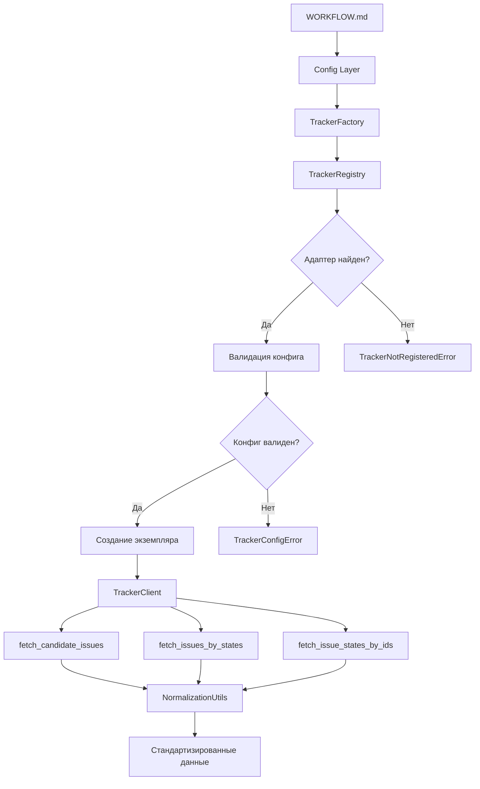

# Руководство по добавлению новых Issue Tracker адаптеров

**Версия:** 1.0  
**Дата:** 2026-04-12  
**Автор:** Documentation Writer

---

## Содержание

1. [Введение](#1-введение)
2. [Понимание архитектуры](#2-понимание-архитектуры)
3. [Создание нового адаптера](#3-создание-нового-адаптера)
4. [Примеры кода](#4-примеры-кода)
5. [Конфигурация](#5-конфигурация)
6. [Лучшие практики](#6-лучшие-практики)
7. [Тестирование](#7-тестирование)
8. [Устранение неполадок](#8-устранение-неполадок)
9. [Справочник](#9-справочник)

---

## 1. Введение

### 1.1 Назначение руководства

Данное руководство описывает процесс добавления новых адаптеров для систем отслеживания задач (issue trackers) в проект py-symphony. Руководство охватывает архитектуру, пошаговые инструкции, примеры кода и лучшие практики.

### 1.2 Предварительные требования

Перед началом работы убедитесь, что вы знакомы со следующими концепциями:

- **Python 3.8+** — основной язык разработки
- **ABC (Abstract Base Classes)** — паттерн для определения интерфейсов
- **Registry Pattern** — паттерн регистрации компонентов
- **Factory Pattern** — паттерн фабрики для создания объектов
- **REST API / GraphQL** — протоколы взаимодействия с трекерами

### 1.3 Обзор pluggable архитектуры

Py-symphony использует pluggable (подключаемую) архитектуру для поддержки различных issue tracker систем. Это позволяет добавлять новые трекеры без изменения ядра системы.

```
┌─────────────────────────────────────────────────────────────────┐
│                      WORKFLOW.md                                │
│                  (YAML front matter + prompt)                    │
└─────────────────────────────┬───────────────────────────────────┘
                              │
                              ▼
┌─────────────────────────────────────────────────────────────────┐
│                      Config Layer                               │
│              (типизированные геттеры с defaults)                │
└─────────────────────────────┬───────────────────────────────────┘
                              │
                              ▼
┌─────────────────────────────────────────────────────────────────┐
│                    TrackerFactory                               │
│         (создание адаптеров на основе конфигурации)            │
└─────────────────────────────┬───────────────────────────────────┘
                              │
              ┌───────────────┼───────────────┐
              ▼               ▼               ▼
       ┌──────────┐    ┌──────────┐    ┌──────────┐
       │ Linear   │    │   Jira   │    │  Custom  │
       │ Tracker  │    │  Tracker │    │  Tracker │
       └──────────┘    └──────────┘    └──────────┘
              │               │               │
              └───────────────┼───────────────┘
                              │
                              ▼
              ┌───────────────────────────────┐
              │     TrackerClient (ABC)      │
              │  - fetch_candidate_issues()   │
              │  - fetch_issues_by_states()   │
              │  - fetch_issue_states_by_ids()│
              └───────────────────────────────┘
```

### 1.4 Доступные компоненты

| Компонент | Путь | Назначение |
|-----------|------|------------|
| `TrackerClient` | `runtime/tracker/base.py` | Абстрактный базовый класс (интерфейс) |
| `TrackerRegistry` | `runtime/tracker/registry.py` | Регистрация адаптеров |
| `TrackerFactory` | `runtime/tracker/factory.py` | Фабрика для создания экземпляров |
| `NormalizationUtils` | `runtime/tracker/normalization.py` | Утилиты для нормализации данных |
| `LinearTracker` | `runtime/tracker/linear.py` | Адаптер для Linear (stub) |
| `JiraTracker` | `runtime/tracker/jira.py` | Адаптер для Jira (stub) |

---

## 2. Понимание архитектуры

### 2.1 TrackerClient интерфейс

Интерфейс `TrackerClient` определяет контракт, которому должен соответствовать каждый адаптер. Реализация этого интерфейса обязательна для всех трекеров.

#### Обязательные методы

```python
class TrackerClient(ABC):
    """Base tracker client interface."""
    
    @property
    def tracker_kind(self) -> str:
        """Return the tracker kind identifier (e.g., 'linear', 'jira')."""
        raise NotImplementedError

    @abstractmethod
    def fetch_candidate_issues(self) -> List[Dict[str, Any]]:
        """Fetch issues in active states that are candidates for dispatch."""
        pass

    @abstractmethod
    def fetch_issues_by_states(self, state_names: List[str]) -> List[Dict[str, Any]]:
        """Fetch issues matching the specified states."""
        pass

    @abstractmethod
    def fetch_issue_states_by_ids(self, issue_ids: List[str]) -> Dict[str, str]:
        """Fetch current states for specific issues."""
        pass
```

#### Контракт методов

| Метод | Возвращаемый тип | Описание |
|-------|-----------------|----------|
| `tracker_kind` | `str` | Идентификатор типа трекера (нижний регистр) |
| `fetch_candidate_issues()` | `List[Dict]` | Список активных задач для обработки |
| `fetch_issues_by_states()` | `List[Dict]` | Список задач по конкретным статусам |
| `fetch_issue_states_by_ids()` | `Dict[str, str]` | Маппинг ID задачи → статус |

#### Формат возвращаемых данных

Каждый метод должен возвращать словарь со следующими ключами:

```python
{
    "id": str,              # Уникальный идентификатор
    "identifier": str,      # Понятный идентификатор (номер задачи)
    "title": str,            # Заголовок/название задачи
    "state": str,            # Текущий статус (нижний регистр)
    "priority": Optional[int],  # Приоритет (0-4 или None)
    "created_at": Optional[datetime],  # Дата создания
    "labels": List[str],     # Метки/теги
    "blocked_by": List[str], # Список ID блокирующих задач
}
```

### 2.2 Паттерн Registry

`TrackerRegistry` — это singleton-реестр, который хранит соответствие между идентификатором трекера и классом адаптера.

```python
# Регистрация нового адаптера
registry = get_tracker_registry()
registry.register("github", GitHubTracker)

# Проверка регистрации
if registry.is_registered("github"):
    adapter_class = registry.get_adapter("github")

# Список всех зарегистрированных
print(registry.list_adapters())  # ['linear', 'jira', 'github']
```

### 2.3 Паттерн Factory

`TrackerFactory` отвечает за создание экземпляров адаптеров на основе конфигурации. Фабрика выполняет:

1. **Поиск адаптера** в registry по типу
2. **Валидацию конфигурации** для конкретного трекера
3. **Создание экземпляра** с переданными параметрами

```python
# Создание трекера через фабрику
config = WorkflowConfig(...)  # Загружено из WORKFLOW.md
tracker = TrackerFactory.create(config)
```

### 2.4 Слой нормализации

`NormalizationUtils` предоставляет статические методы для приведения данных к единому формату:

- `normalize_issue()` — приведение задачи к общему формату
- `normalize_state()` — нормализация названия статуса (нижний регистр)
- `_normalize_priority()` — преобразование приоритета в число (0-4)
- `_normalize_labels()` — нормализация меток (нижний регистр)
- `_parse_timestamp()` — парсинг даты в datetime

---

## 3. Создание нового адаптера

### 3.1 Шаг 1: Создание файла адаптера

Создайте новый файл в директории `runtime/tracker/`:

```bash
# Имя файла: <имя_трекера>.py
# Например: github.py, gitlab.py, azure_devops.py
```

### 3.2 Шаг 2: Реализация интерфейса TrackerClient

Создайте класс, наследующий от `TrackerClient`:

```python
"""GitHub Issues tracker adapter."""

from typing import Any, Dict, List, Optional
from datetime import datetime

from .base import TrackerClient


class GitHubTracker(TrackerClient):
    """GitHub Issues tracker adapter.
    
    Implements the TrackerClient interface for GitHub's REST API.
    """

    def __init__(self, api_key: str, owner: str, repo: str):
        """Initialize GitHub tracker adapter.

        Args:
            api_key: GitHub personal access token
            owner: Owner/organization name
            repo: Repository name
        """
        self._api_key = api_key
        self._owner = owner
        self._repo = repo
        self._base_url = "https://api.github.com"

    @property
    def tracker_kind(self) -> str:
        """Return the tracker kind identifier."""
        return "github"

    def fetch_candidate_issues(self) -> List[Dict[str, Any]]:
        """Fetch active issues from GitHub.

        Returns:
            List of issue dictionaries
        """
        # TODO: Implement
        return []

    def fetch_issues_by_states(self, state_names: List[str]) -> List[Dict[str, Any]]:
        """Fetch issues matching the specified states.

        Args:
            state_names: List of state names to filter by

        Returns:
            List of issue dictionaries
        """
        # TODO: Implement
        return []

    def fetch_issue_states_by_ids(self, issue_ids: List[str]) -> Dict[str, str]:
        """Fetch states for specific issues.

        Args:
            issue_ids: List of issue numbers

        Returns:
            Dictionary mapping issue_id -> state_name
        """
        # TODO: Implement
        return {}
```

### 3.3 Шаг 3: Регистрация адаптера

Добавьте регистрацию адаптера в `runtime/tracker/__init__.py`:

```python
"""Tracker adapters."""

from .base import TrackerClient
from .registry import get_tracker_registry, register_tracker
from .factory import TrackerFactory

from .linear import LinearTracker
from .jira import JiraTracker
from .github import GitHubTracker  # Добавьте импорт

# Register built-in adapters
register_tracker("linear", LinearTracker)
register_tracker("jira", JiraTracker)
register_tracker("github", GitHubTracker)  # Зарегистрируйте адаптер

# Export core classes
__all__ = [
    "TrackerClient",
    "TrackerFactory",
    "get_tracker_registry",
    "LinearTracker",
    "JiraTracker",
    "GitHubTracker",  # Добавьте в экспорт
]
```

### 3.4 Шаг 4: Добавление валидации конфигурации

Добавьте метод валидации в `TrackerFactory`:

```python
# В методе _validate_config() добавьте:
elif kind == "github":
    TrackerFactory._validate_github_config(config)

# Добавьте новый метод:
@staticmethod
def _validate_github_config(config: Any) -> None:
    """Validate GitHub tracker configuration.

    Args:
        config: Configuration object

    Raises:
        TrackerConfigError: If configuration is invalid
    """
    # Check API token (required)
    api_key = config.tracker_api_key
    if not api_key:
        raise TrackerConfigError(
            "GitHub tracker requires 'tracker_api_key' in config or "
            "GITHUB_TOKEN environment variable"
        )

    # Check owner (required)
    owner = config.tracker_owner
    if not owner:
        raise TrackerConfigError(
            "GitHub tracker requires 'tracker_owner' in config"
        )

    # Check repo (required)
    repo = config.tracker_repo
    if not repo:
        raise TrackerConfigError(
            "GitHub tracker requires 'tracker_repo' in config"
        )
```

### 3.5 Шаг 5: Добавление создания экземпляра

Добавьте логику создания экземпляра в метод `_instantiate_adapter()`:

```python
# Добавьте в метод _instantiate_adapter():
elif kind == "github":
    return adapter_class(
        api_key=config.tracker_api_key,
        owner=config.tracker_owner,
        repo=config.tracker_repo,
    )
```

---

## 4. Примеры кода

### 4.1 Полный пример: GitHub Issues адаптер

```python
"""GitHub Issues tracker adapter."""

import logging
from typing import Any, Dict, List, Optional
from datetime import datetime

import requests

from .base import TrackerClient
from .normalization import NormalizationUtils


logger = logging.getLogger(__name__)


class GitHubTracker(TrackerClient):
    """GitHub Issues tracker adapter.
    
    Implements the TrackerClient interface for GitHub's REST API.
    Supports GitHub Enterprise Cloud and GitHub.com.
    """

    def __init__(
        self,
        api_key: str,
        owner: str,
        repo: str,
        api_url: Optional[str] = None,
    ):
        """Initialize GitHub tracker adapter.

        Args:
            api_key: GitHub personal access token
            owner: Owner/organization name
            repo: Repository name
            api_url: Custom API URL for GitHub Enterprise
        """
        self._api_key = api_key
        self._owner = owner
        self._repo = repo
        self._base_url = api_url or "https://api.github.com"
        self._session = requests.Session()
        self._session.headers.update({
            "Authorization": f"token {api_key}",
            "Accept": "application/vnd.github.v3+json",
            "X-GitHub-Api-Version": "2022-11-28",
        })

    @property
    def tracker_kind(self) -> str:
        """Return the tracker kind identifier."""
        return "github"

    def fetch_candidate_issues(self) -> List[Dict[str, Any]]:
        """Fetch open issues that are candidates for dispatch.

        Returns:
            List of issue dictionaries with normalized keys
        """
        # Fetch open issues
        issues = self._fetch_issues(state="open")
        
        # Normalize each issue
        return [NormalizationUtils.normalize_issue(issue) for issue in issues]

    def fetch_issues_by_states(self, state_names: List[str]) -> List[Dict[str, Any]]:
        """Fetch issues matching the specified states.

        Args:
            state_names: List of state names ('open', 'closed', 'all')

        Returns:
            List of issue dictionaries
        """
        issues = []
        for state in state_names:
            issues.extend(self._fetch_issues(state=state))
        
        return [NormalizationUtils.normalize_issue(issue) for issue in issues]

    def fetch_issue_states_by_ids(self, issue_ids: List[str]) -> Dict[str, str]:
        """Fetch states for specific issues.

        Args:
            issue_ids: List of issue numbers

        Returns:
            Dictionary mapping issue_id -> state_name
        """
        result = {}
        for issue_id in issue_ids:
            try:
                response = self._session.get(
                    f"{self._base_url}/repos/{self._owner}/{self._repo}/issues/{issue_id}"
                )
                response.raise_for_status()
                issue = response.json()
                result[str(issue_id)] = issue.get("state", "unknown")
            except requests.HTTPError as e:
                logger.warning(f"Failed to fetch issue #{issue_id}: {e}")
                result[str(issue_id)] = "error"
        
        return result

    def _fetch_issues(self, state: str = "open", per_page: int = 100) -> List[Dict]:
        """Fetch issues from GitHub API.

        Args:
            state: Issue state to filter
            per_page: Number of issues per page

        Returns:
            List of raw issue dictionaries
        """
        issues = []
        page = 1
        
        while True:
            response = self._session.get(
                f"{self._base_url}/repos/{self._owner}/{self._repo}/issues",
                params={
                    "state": state,
                    "per_page": per_page,
                    "page": page,
                    "sort": "created",
                    "direction": "desc",
                },
            )
            response.raise_for_status()
            page_issues = response.json()
            
            if not page_issues:
                break
                
            issues.extend(page_issues)
            page += 1
            
            # Safety limit
            if page > 10:
                break
        
        return issues
```

### 4.2 Полный пример: GitLab адаптер

```python
"""GitLab Issue tracker adapter."""

import logging
from typing import Any, Dict, List, Optional
from datetime import datetime

import requests

from .base import TrackerClient
from .normalization import NormalizationUtils


logger = logging.getLogger(__name__)


class GitLabTracker(TrackerClient):
    """GitLab Issue tracker adapter.
    
    Implements the TrackerClient interface for GitLab's REST API.
    """

    def __init__(
        self,
        api_key: str,
        project_id: str,
        api_url: Optional[str] = None,
    ):
        """Initialize GitLab tracker adapter.

        Args:
            api_key: GitLab personal access token
            project_id: GitLab project ID or path-encoded path
            api_url: GitLab instance URL (default: gitlab.com)
        """
        self._api_key = api_key
        self._project_id = project_id
        self._base_url = (api_url or "https://gitlab.com").rstrip("/")
        self._api_url = f"{self._base_url}/api/v4"
        self._session = requests.Session()
        self._session.headers.update({
            "PRIVATE-TOKEN": api_key,
        })

    @property
    def tracker_kind(self) -> str:
        """Return the tracker kind identifier."""
        return "gitlab"

    def fetch_candidate_issues(self) -> List[Dict[str, Any]]:
        """Fetch opened issues that are candidates for dispatch.

        Returns:
            List of issue dictionaries with normalized keys
        """
        issues = self._fetch_issues(state="opened")
        return [self._normalize_issue(issue) for issue in issues]

    def fetch_issues_by_states(self, state_names: List[str]) -> List[Dict[str, Any]]:
        """Fetch issues matching the specified states.

        Args:
            state_names: List of state names ('opened', 'closed', 'all')

        Returns:
            List of issue dictionaries
        """
        issues = []
        for state in state_names:
            issues.extend(self._fetch_issues(state=state))
        
        return [self._normalize_issue(issue) for issue in issues]

    def fetch_issue_states_by_ids(self, issue_ids: List[str]) -> Dict[str, str]:
        """Fetch states for specific issues.

        Args:
            issue_ids: List of issue IIDs (internal IDs)

        Returns:
            Dictionary mapping issue_iid -> state_name
        """
        result = {}
        for iid in issue_ids:
            try:
                response = self._session.get(
                    f"{self._api_url}/projects/{self._project_id}/issues/{iid}"
                )
                response.raise_for_status()
                issue = response.json()
                result[str(iid)] = issue.get("state", "unknown")
            except requests.HTTPError as e:
                logger.warning(f"Failed to fetch issue #{iid}: {e}")
                result[str(iid)] = "error"
        
        return result

    def _fetch_issues(
        self, 
        state: str = "opened", 
        per_page: int = 100
    ) -> List[Dict]:
        """Fetch issues from GitLab API.

        Args:
            state: Issue state to filter
            per_page: Number of issues per page

        Returns:
            List of raw issue dictionaries
        """
        issues = []
        page = 1
        
        while True:
            response = self._session.get(
                f"{self._api_url}/projects/{self._project_id}/issues",
                params={
                    "state": state,
                    "per_page": per_page,
                    "page": page,
                    "order_by": "created_at",
                    "sort": "desc",
                },
            )
            response.raise_for_status()
            page_issues = response.json()
            
            if not page_issues:
                break
                
            issues.extend(page_issues)
            page += 1
            
            if page > 10:
                break
        
        return issues

    def _normalize_issue(self, raw_issue: Dict[str, Any]) -> Dict[str, Any]:
        """Normalize GitLab issue to common format.

        Args:
            raw_issue: Raw issue data from GitLab

        Returns:
            Normalized issue dictionary
        """
        return {
            "id": str(raw_issue.get("id")),
            "identifier": str(raw_issue.get("iid")),
            "title": raw_issue.get("title", ""),
            "state": raw_issue.get("state", ""),
            "priority": self._map_priority(raw_issue.get("labels", [])),
            "created_at": NormalizationUtils._parse_timestamp(
                raw_issue.get("created_at")
            ),
            "labels": raw_issue.get("labels", []),
            "blocked_by": self._get_blocked_by(raw_issue),
        }

    def _map_priority(self, labels: List[str]) -> Optional[int]:
        """Map GitLab labels to priority.

        Args:
            labels: List of issue labels

        Returns:
            Priority integer (0-4) or None
        """
        label_map = {
            "priority::critical": 1,
            "priority::high": 2,
            "priority::medium": 3,
            "priority::low": 4,
        }
        
        for label in labels:
            if label in label_map:
                return label_map[label]
        
        return None

    def _get_blocked_by(self, issue: Dict[str, Any]) -> List[str]:
        """Get blocked by issues (requires related issues API).

        Args:
            issue: Issue dictionary

        Returns:
            List of blocking issue IDs
        """
        # GitLab uses "blocked" relation
        # Requires additional API call to /issues/{iid}/related_issues
        return []
```

### 4.3 Примеры ключевых методов

#### Получение задач с пагинацией

```python
def _fetch_issues_paginated(
    self,
    endpoint: str,
    params: Optional[Dict] = None,
) -> List[Dict]:
    """Fetch all issues with automatic pagination.
    
    Args:
        endpoint: API endpoint path
        params: Query parameters
        
    Returns:
        List of all issues
    """
    issues = []
    page = 1
    params = params or {}
    params.setdefault("per_page", 100)
    
    while True:
        params["page"] = page
        response = self._session.get(endpoint, params=params)
        response.raise_for_status()
        
        page_data = response.json()
        if not page_data:
            break
            
        issues.extend(page_data)
        page += 1
        
        # Rate limit safety
        if page > 100:
            break
    
    return issues
```

#### Обработка ошибок API

```python
def _handle_api_error(self, response: requests.Response) -> None:
    """Handle API error responses.
    
    Args:
        response: Response object
        
    Raises:
        TrackerAPIError: On API errors
    """
    if response.status_code == 401:
        raise TrackerAPIError("Authentication failed. Check API key.")
    elif response.status_code == 403:
        raise TrackerAPIError(
            f"Rate limit exceeded. Reset at: {response.headers.get('X-RateLimit-Reset')}"
        )
    elif response.status_code == 404:
        raise TrackerAPIError(f"Resource not found: {response.url}")
    elif response.status_code >= 500:
        raise TrackerAPIError(f"Tracker server error: {response.status_code}")
    
    response.raise_for_status()
```

---

## 5. Конфигурация

### 5.1 WORKFLOW.md front matter

Добавьте конфигурацию трекера в YAML front matter файла WORKFLOW.md:

```yaml
---
tracker:
  kind: github           # linear, jira, github, gitlab, azure_devops
  active_states:
    - todo
    - in_progress
  api_key: ${GITHUB_TOKEN}
  owner: my-org         # GitHub: owner
  repo: my-repo         # GitHub: repository name
---

# Your workflow prompt here
```

### 5.2 Конфигурация для разных трекеров

#### Linear

```yaml
---
tracker:
  kind: linear
  active_states:
    - todo
    - in_progress
  api_key: ${LINEAR_API_KEY}
  project_slug: my-team/my-project
---
```

#### Jira

```yaml
---
tracker:
  kind: jira
  active_states:
    - "To Do"
    - "In Progress"
  api_key: ${JIRA_API_TOKEN}
  endpoint: https://company.atlassian.net
  username: user@company.com
  project_key: PROJ
---
```

#### GitHub

```yaml
---
tracker:
  kind: github
  active_states:
    - open
  api_key: ${GITHUB_TOKEN}
  owner: my-org
  repo: my-repo
---
```

#### GitLab

```yaml
---
tracker:
  kind: gitlab
  active_states:
    - opened
  api_key: ${GITLAB_TOKEN}
  project_id: 12345
  api_url: https://gitlab.com  # or custom GitLab instance
---
```

### 5.3 Переменные окружения

| Трекер | Переменная | Описание |
|--------|------------|----------|
| Linear | `LINEAR_API_KEY` | Linear API ключ |
| Jira | `JIRA_API_TOKEN` | Jira API токен |
| GitHub | `GITHUB_TOKEN` | GitHub personal access token |
| GitLab | `GITLAB_TOKEN` | GitLab personal access token |
| Azure | `AZURE_DEVOPS_TOKEN` | Azure DevOps PAT |

### 5.4 Валидация конфигурации

Фабрика выполняет валидацию при создании трекера. Примеры ошибок:

```python
# Ошибка: трекер не зарегистрирован
TrackerNotRegisteredError: Tracker kind 'unknown' is not registered. 
Available trackers: ['linear', 'jira', 'github']

# Ошибка: отсутствует обязательный параметр
TrackerConfigError: GitHub tracker requires 'tracker_owner' in config

# Ошибка: отсутствует API ключ
TrackerConfigError: Linear tracker requires 'tracker_api_key' in config 
or LINEAR_API_KEY environment variable
```

---

## 6. Лучшие практики

### 6.1 Обработка ошибок

**Правила:**

1. Всегда обрабатывайте HTTP ошибки
2. Используйте retry с экспоненциальной задержкой
3. Логируйте ошибки с контекстом
4. Выбрасывайте понятные исключения

```python
import time
import logging
from functools import wraps

logger = logging.getLogger(__name__)


def retry_on_error(max_retries: int = 3, backoff: float = 1.0):
    """Decorator for retrying failed API calls."""
    def decorator(func):
        @wraps(func)
        def wrapper(*args, **kwargs):
            last_exception = None
            for attempt in range(max_retries):
                try:
                    return func(*args, **kwargs)
                except requests.HTTPError as e:
                    last_exception = e
                    if e.response.status_code in (429, 500, 502, 503, 504):
                        wait_time = backoff * (2 ** attempt)
                        logger.warning(
                            f"Attempt {attempt + 1} failed, retrying in {wait_time}s: {e}"
                        )
                        time.sleep(wait_time)
                    else:
                        raise
            raise last_exception
        return wrapper
    return decorator
```

### 6.2 Ограничение скорости запросов (Rate Limiting)

**Стратегии:**

1. **Встроенный rate limiting API** — используйте заголовки `X-RateLimit-*`
2. **Троттлинг** — ограничение количества запросов в секунду
3. **Кэширование** — кэшируйте результаты для уменьшения запросов

```python
class RateLimiter:
    """Rate limiter using token bucket algorithm."""
    
    def __init__(self, requests_per_second: float = 1.0):
        self.rate = requests_per_second
        self.tokens = requests_per_second
        self.last_update = time.time()
    
    def acquire(self) -> None:
        """Acquire a token, waiting if necessary."""
        while True:
            now = time.time()
            elapsed = now - self.last_update
            self.tokens = min(
                self.rate, 
                self.tokens + elapsed * self.rate
            )
            self.last_update = now
            
            if self.tokens >= 1:
                self.tokens -= 1
                return
            
            wait_time = (1 - self.tokens) / self.rate
            time.sleep(wait_time)
```

### 6.3 Стратегии кэширования

```python
from functools import lru_cache
from typing import Optional
from datetime import datetime, timedelta


class IssueCache:
    """Simple cache for issue data."""
    
    def __init__(self, ttl_seconds: int = 60):
        self._cache: Dict[str, tuple] = {}
        self._ttl = ttl_seconds
    
    def get(self, key: str) -> Optional[List[Dict]]:
        """Get cached value if not expired."""
        if key in self._cache:
            value, timestamp = self._cache[key]
            if (datetime.now() - timestamp).seconds < self._ttl:
                return value
            del self._cache[key]
        return None
    
    def set(self, key: str, value: List[Dict]) -> None:
        """Set cached value with current timestamp."""
        self._cache[key] = (value, datetime.now())
    
    def invalidate(self, key: str) -> None:
        """Invalidate specific cache entry."""
        if key in self._cache:
            del self._cache[key]
```

### 6.4 Логирование и наблюдаемость

```python
import logging
from typing import Any, Dict

logger = logging.getLogger(__name__)


class ObservableTracker(TrackerClient):
    """Tracker with comprehensive logging."""
    
    def fetch_candidate_issues(self) -> List[Dict[str, Any]]:
        """Fetch candidate issues with logging."""
        logger.info("Fetching candidate issues")
        start_time = time.time()
        
        try:
            issues = self._do_fetch_candidate_issues()
            elapsed = time.time() - start_time
            
            logger.info(
                f"Fetched {len(issues)} candidate issues in {elapsed:.2f}s"
            )
            return issues
            
        except Exception as e:
            elapsed = time.time() - start_time
            logger.error(
                f"Failed to fetch candidate issues after {elapsed:.2f}s: {e}"
            )
            raise
    
    def _do_fetch_candidate_issues(self) -> List[Dict[str, Any]]:
        """Actual implementation."""
        # TODO: Implement
        return []
```

### 6.5 Тестирование подходов

**Рекомендации:**

1. Используйте `unittest.mock` для мокирования HTTP запросов
2. Создавайте фикстуры для тестовых данных
3. Тестируйте edge cases (пустые результаты, ошибки API)
4. Используйте `responses` или `requests_mock` для HTTP моков

---

## 7. Тестирование

### 7.1 Unit тесты

```python
"""Tests for GitHub tracker adapter."""

import unittest
from unittest.mock import Mock, patch, MagicMock
import responses

from runtime.tracker.github import GitHubTracker


class TestGitHubTracker(unittest.TestCase):
    """Test cases for GitHubTracker."""

    def setUp(self):
        """Set up test fixtures."""
        self.tracker = GitHubTracker(
            api_key="test_token",
            owner="test-owner",
            repo="test-repo",
        )

    def test_tracker_kind(self):
        """Test tracker kind identifier."""
        self.assertEqual(self.tracker.tracker_kind, "github")

    @responses.activate
    def test_fetch_candidate_issues_success(self):
        """Test successful fetching of candidate issues."""
        # Mock API response
        responses.add(
            responses.GET,
            "https://api.github.com/repos/test-owner/test-repo/issues",
            json=[
                {
                    "id": 1,
                    "number": 100,
                    "title": "Test Issue",
                    "state": "open",
                    "created_at": "2024-01-01T00:00:00Z",
                    "labels": [{"name": "bug"}],
                }
            ],
            status=200,
        )

        issues = self.tracker.fetch_candidate_issues()
        
        self.assertEqual(len(issues), 1)
        self.assertEqual(issues[0]["identifier"], "100")
        self.assertEqual(issues[0]["title"], "Test Issue")
        self.assertEqual(issues[0]["state"], "open")

    @responses.activate
    def test_fetch_issues_by_states(self):
        """Test fetching issues by specific states."""
        responses.add(
            responses.GET,
            "https://api.github.com/repos/test-owner/test-repo/issues",
            json=[],
            status=200,
        )

        issues = self.tracker.fetch_issues_by_states(["open", "closed"])
        self.assertEqual(len(issues), 0)

    @responses.activate
    def test_api_error_handling(self):
        """Test API error handling."""
        responses.add(
            responses.GET,
            "https://api.github.com/repos/test-owner/test-repo/issues",
            json={"message": "Not Found"},
            status=404,
        )

        with self.assertRaises(Exception):
            self.tracker.fetch_candidate_issues()


if __name__ == "__main__":
    unittest.main()
```

### 7.2 Integration тесты

```python
"""Integration tests for tracker adapters."""

import os
import unittest
from typing import Dict

from runtime.tracker import TrackerFactory


class TestTrackerIntegration(unittest.TestCase):
    """Integration tests for tracker factory."""
    
    def test_linear_tracker_creation(self):
        """Test creating Linear tracker from config."""
        config = Mock()
        config.tracker_kind = "linear"
        config.tracker_api_key = os.environ.get("LINEAR_API_KEY", "test")
        config.tracker_project_slug = "test/project"
        
        tracker = TrackerFactory.create(config)
        self.assertEqual(tracker.tracker_kind, "linear")
    
    def test_github_tracker_creation(self):
        """Test creating GitHub tracker from config."""
        config = Mock()
        config.tracker_kind = "github"
        config.tracker_api_key = "test_token"
        config.tracker_owner = "test-owner"
        config.tracker_repo = "test-repo"
        
        tracker = TrackerFactory.create(config)
        self.assertEqual(tracker.tracker_kind, "github")
    
    def test_unregistered_tracker_raises(self):
        """Test that unregistered tracker raises error."""
        config = Mock()
        config.tracker_kind = "nonexistent"
        
        with self.assertRaises(TrackerNotRegisteredError):
            TrackerFactory.create(config)
    
    def test_invalid_config_raises(self):
        """Test that invalid config raises error."""
        config = Mock()
        config.tracker_kind = "github"
        config.tracker_api_key = None
        config.tracker_owner = None
        config.tracker_repo = None
        
        with self.assertRaises(TrackerConfigError):
            TrackerFactory.create(config)


if __name__ == "__main__":
    unittest.main()
```

### 7.3 Mocking tracker APIs

```python
"""Fixtures for testing tracker adapters."""

import json
import pytest
from typing import Dict, List


@pytest.fixture
def mock_linear_issues() -> List[Dict]:
    """Mock Linear issues response."""
    return [
        {
            "id": "abc123",
            "identifier": "TEST-1",
            "title": "Implement feature X",
            "state": {"name": "Todo"},
            "priority": 2,
            "createdAt": "2024-01-01T00:00:00Z",
            "labels": {"nodes": [{"name": "enhancement"}]},
        },
        {
            "id": "def456",
            "identifier": "TEST-2",
            "title": "Fix bug Y",
            "state": {"name": "In Progress"},
            "priority": 1,
            "createdAt": "2024-01-02T00:00:00Z",
            "labels": {"nodes": [{"name": "bug"}]},
        },
    ]


@pytest.fixture
def mock_jira_issues() -> List[Dict]:
    """Mock Jira issues response."""
    return [
        {
            "id": "10001",
            "key": "PROJ-101",
            "fields": {
                "summary": "Implement feature X",
                "status": {"name": "To Do"},
                "priority": {"name": "High"},
                "created": "2024-01-01T00:00:00Z",
                "labels": ["enhancement"],
            },
        },
    ]


@pytest.fixture
def mock_github_issues() -> List[Dict]:
    """Mock GitHub issues response."""
    return [
        {
            "id": 1,
            "number": 101,
            "title": "Implement feature X",
            "state": "open",
            "created_at": "2024-01-01T00:00:00Z",
            "labels": [{"name": "enhancement"}],
        },
    ]
```

### 7.4 Настройка тестовых данных

```python
"""Test data setup for tracker testing."""

import os
from typing import Dict, List


class TestDataBuilder:
    """Builder for test data."""
    
    @staticmethod
    def linear_issue(
        id: str = "abc123",
        identifier: str = "TEST-1",
        title: str = "Test Issue",
        state: str = "Todo",
        priority: int = 2,
    ) -> Dict:
        """Create a Linear issue for testing."""
        return {
            "id": id,
            "identifier": identifier,
            "title": title,
            "state": {"name": state},
            "priority": priority,
            "createdAt": "2024-01-01T00:00:00Z",
            "labels": {"nodes": []},
            "blockers": {"nodes": []},
        }
    
    @staticmethod
    def jira_issue(
        id: str = "10001",
        key: str = "PROJ-1",
        summary: str = "Test Issue",
        status: str = "To Do",
        priority: str = "High",
    ) -> Dict:
        """Create a Jira issue for testing."""
        return {
            "id": id,
            "key": key,
            "fields": {
                "summary": summary,
                "status": {"name": status},
                "priority": {"name": priority},
                "created": "2024-01-01T00:00:00Z",
                "labels": [],
            },
        }
    
    @staticmethod
    def github_issue(
        id: int = 1,
        number: int = 1,
        title: str = "Test Issue",
        state: str = "open",
    ) -> Dict:
        """Create a GitHub issue for testing."""
        return {
            "id": id,
            "number": number,
            "title": title,
            "state": state,
            "created_at": "2024-01-01T00:00:00Z",
            "labels": [],
        }
```

---

## 8. Устранение неполадок

### 8.1 Частые проблемы

| Проблема | Причина | Решение |
|----------|---------|----------|
| `TrackerNotRegisteredError` | Адаптер не зарегистрирован | Добавьте `register_tracker()` в `__init__.py` |
| `TrackerConfigError` | Отсутствует обязательный параметр | Проверьте конфигурацию в WORKFLOW.md |
| 401 Unauthorized | Неверный API ключ | Проверьте переменную окружения |
| 403 Rate Limited | Превышен лимит запросов | Добавьте rate limiting |
| 404 Not Found | Неверный endpoint | Проверьте URL проекта/репозитория |
| Пустой результат | Нет задач в активных статусах | Проверьте `active_states` в конфиге |

### 8.2 Отладка

**Включите verbose логирование:**

```bash
export LOG_LEVEL=DEBUG
python -m runtime.main
```

**Проверьте конфигурацию:**

```python
from runtime.tracker import get_tracker_registry

# Список зарегистрированных трекеров
print(get_tracker_registry().list_adapters())

# Проверьте конкретный трекер
print(get_tracker_registry().is_registered("github"))
```

### 8.3 FAQ

**Q: Как добавить новый трекер без изменения фабрики?**

A: Используйте регистрацию напрямую:

```python
from runtime.tracker import register_tracker
from runtime.tracker.base import TrackerClient

class MyTracker(TrackerClient):
    ...

register_tracker("mytracker", MyTracker)
```

**Q: Как обрабатывать кастомные поля трекера?**

A: Используйте `NormalizationUtils.normalize_issue()` для приведения к общему формату или создайте собственный метод нормализации.

**Q: Как добавить поддержку Webhooks?**

A: Создайте отдельный модуль webhook handler. Текущая архитектура ориентирована на polling.

**Q: Как тестировать без реального API?**

A: Используйте mocking с `responses` или `requests_mock` библиотеками.

---

## 9. Справочник

### 9.1 TrackerClient интерфейс

```python
class TrackerClient(ABC):
    """Base tracker client interface."""
    
    @property
    @abstractmethod
    def tracker_kind(self) -> str:
        """Идентификатор типа трекера."""
        pass

    @abstractmethod
    def fetch_candidate_issues(self) -> List[Dict[str, Any]]:
        """Получить активные задачи для обработки."""
        pass

    @abstractmethod
    def fetch_issues_by_states(
        self, state_names: List[str]
    ) -> List[Dict[str, Any]]:
        """Получить задачи по статусам."""
        pass

    @abstractmethod
    def fetch_issue_states_by_ids(
        self, issue_ids: List[str]
    ) -> Dict[str, str]:
        """Получить статусы конкретных задач."""
        pass
```

### 9.2 NormalizationUtils методы

| Метод | Параметры | Возвращает | Описание |
|-------|-----------|------------|----------|
| `normalize_issue()` | `raw_issue: Dict` | `Dict` | Нормализует задачу |
| `normalize_state()` | `state: str` | `str` | Приводит статус к нижнему регистру |
| `_normalize_priority()` | `priority: Any` | `Optional[int]` | Приводит приоритет к 0-4 |
| `_normalize_labels()` | `labels: List[str]` | `List[str]` | Нормализует метки |
| `_parse_timestamp()` | `timestamp: Any` | `Optional[datetime]` | Парсит дату |

### 9.3 Исключения фабрики

```python
class TrackerFactoryError(Exception):
    """Базовое исключение фабрики."""
    pass

class TrackerNotRegisteredError(TrackerFactoryError):
    """Трекер не зарегистрирован."""
    pass

class TrackerConfigError(TrackerFactoryError):
    """Неверная конфигурация трекера."""
    pass
```

### 9.4 Карта приоритетов

| Значение | Linear | Jira | GitHub | GitLab |
|----------|--------|------|--------|--------|
| 0 | None | — | — | — |
| 1 | Urgent | Highest | — | priority::critical |
| 2 | High | High | — | priority::high |
| 3 | Medium | Medium | — | priority::medium |
| 4 | Low | Low/Lowest | — | priority::low |

---

## Приложение: Диаграмма архитектуры



---

## История изменений

| Версия | Дата | Автор | Описание |
|--------|------|-------|----------|
| 1.0 | 2026-04-12 | Doc Writer | Начальная версия руководства |

---

*Данное руководство является частью документации проекта py-symphony.*
