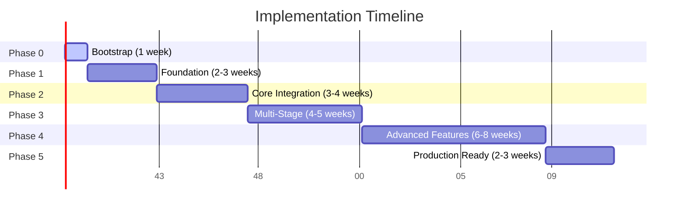
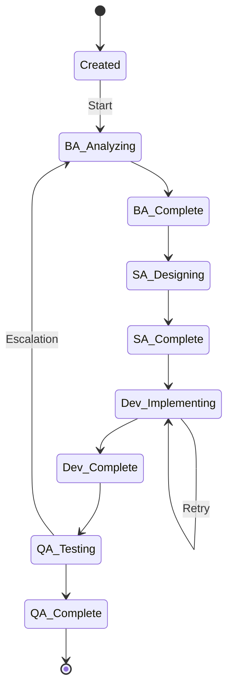

# Implementation Roadmap

**Версия:** 1.0  
**Статус:** Draft  
**Дата:** 2026-04-11  
**Автор:** Platform Architecture Team  

---

## Содержание

1. [MVP vs Target Architecture](#1-mvp-vs-target-architecture)
2. [Phased Implementation Plan](#2-phased-implementation-plan)
3. [Risks and Design Decisions](#3-risks-and-design-decisions)
4. [Assumptions](#4-assumptions)
5. [Files for Next Step](#5-files-for-next-step)

---

## 1. MVP vs Target Architecture

### 1.1 Обзор

Данный раздел описывает эволюцию платформы от минимального жизнеспособного продукта (MVP) до полнофункциональной целевой архитектуры. Понимание этой эволюции критически важно для правильного планирования ресурсов и управления рисками.

**Ключевые характеристики MVP:**
- Минимальный набор функций для проверки бизнес-гипотез
- Ограниченная интеграция с внешними системами
- Упрощённая архитектура для быстрого запуска

**Ключевые характеристики Target Architecture:**
- Полная функциональность для production использования
- Глубокая интеграция со всеми необходимыми системами
- Масштабируемая и отказоустойчивая архитектура

### 1.2 Детальное сравнение

| Компонент | MVP | Target |
|-----------|-----|--------|
| **Jira Integration** | | |
| Возможности | Только чтение статусов задач | Чтение и запись задач, создание подзадач, обновление полей |
| Workflow | Один-directional (Jira → Platform) | Bi-directional (синхронизация состояний) |
| Кеширование | Отсутствует | Полное кеширование с TTL |
| **Agent Stages** | | |
| Количество стадий | 1 (Dev) | 4 (BA, SA, Dev, QA) |
| Параллелизм | Последовательное выполнение | Параллельное выполнение с зависимостями |
| Переключение | Ручное | Автоматическое по триггерам |
| **Handoff Logic** | | |
| Механизм | Простейший HTTP POST | Асинхронная очередь сообщений |
| Retry | Отсутствует | 3 попытки с exponential backoff |
| Escalation | Отсутствует | Полная эскалация до 3 уровней |
| Logging | Базовое (stdout) | Структурированное с correlation IDs |
| **State Storage** | | |
| Тип | Локальное (файловая система) | Распределённое |
| Компоненты | JSON-файлы | Redis (Runtime) + Jira (Project State) + PostgreSQL (History) |
| Синхронизация | Отсутствует | Event-based с подтверждением |
| **Observability** | | |
| Logging | print() / stdout | Структурированный JSON (ELK Stack) |
| Metrics | Отсутствует | Prometheus + Grafana |
| Tracing | Отсутствует | Jaeger / Zipkin |
| Alerts | Отсутствует | PagerDuty / OpsGenie |
| **Security** | | |
| Authentication | Basic Auth | OAuth 2.0 / JWT |
| Authorization | Отсутствует | RBAC |
| Encryption | Нет | TLS 1.3 + At-rest encryption |
| **Scalability** | | |
| Горизонтальное масштабирование | Невозможно | Kubernetes HPA |
| Нагрузка | до 10 агентов | до 1000 агентов |

### 1.3 Визуальная диаграмма архитектуры

```
┌─────────────────────────────────────────────────────────────────────────────┐
│                            TARGET ARCHITECTURE                              │
├─────────────────────────────────────────────────────────────────────────────┤
│                                                                             │
│  ┌─────────────┐     ┌─────────────┐     ┌─────────────┐     ┌─────────┐ │
│  │     BA      │────▶│     SA      │────▶│    Dev      │────▶│   QA    │ │
│  │   Agent     │     │   Agent     │     │   Agent     │     │  Agent  │ │
│  └─────────────┘     └─────────────┘     └─────────────┘     └─────────┘ │
│        │                   │                   │                   │       │
│        └───────────────────┴───────────────────┴───────────────────┘       │
│                                    │                                       │
│                                    ▼                                       │
│                     ┌──────────────────────────────┐                     │
│                     │      Handoff Coordinator     │                     │
│                     │   (Async Message Queue)      │                     │
│                     └──────────────────────────────┘                     │
│                                    │                                       │
│           ┌───────────────────────┼───────────────────────┐               │
│           ▼                       ▼                       ▼               │
│  ┌─────────────────┐   ┌─────────────────┐   ┌─────────────────┐           │
│  │     Redis      │   │      Jira      │   │   PostgreSQL   │           │
│  │   (Runtime)   │   │ (Project State)│   │    (History)   │           │
│  └─────────────────┘   └─────────────────┘   └─────────────────┘           │
│                                                                             │
└─────────────────────────────────────────────────────────────────────────────┘

┌─────────────────────────────────────────────────────────────────────────────┐
│                               MVP ARCHITECTURE                             │
├─────────────────────────────────────────────────────────────────────────────┤
│                                                                             │
│  ┌─────────────┐                                                           │
│  │    Dev      │◀── Один агент                                             │
│  │   Agent     │                                                           │
│  └─────────────┘                                                           │
│        │                                                                   │
│        ▼                                                                   │
│                     ┌──────────────────────────┐                         │
│                     │   Basic HTTP POST         │                         │
│                     │   (No retry/escalation)   │                         │
│                     └──────────────────────────┘                         │
│                                    │                                       │
│                                    ▼                                       │
│                     ┌──────────────────────────┐                         │
│                     │   Local JSON Storage     │                         │
│                     │   (Filesystem)           │                         │
│                     └──────────────────────────┘                         │
│                                                                             │
└─────────────────────────────────────────────────────────────────────────────┘
```

---

## 2. Phased Implementation Plan

### 2.1 Timeline Overview



### 2.2 Phase 0: Bootstrap

**Продолжительность:** 1 неделя (2026-04-13 — 2026-04-19)  
**Статус:** Текущий этап  
**Цель:** Создание базовой инфраструктуры для разработки

#### Задачи Phase 0

| Задача | Описание | Ответственный | Зависимости |
|--------|----------|---------------|-------------|
| Create Build Agents | Создание 8 build-агентов для различных ролей | Platform Architect | - |
| Create Skills | Создание 12 skill-ов для специфических задач | Implementation Engineer | Create Build Agents |
| Create SDD | Software Design Document для платформы | Platform Architect | - |
| Create State Machines | Определение state machine для всех этапов | Agent Runtime Architect | - |
| Create Handoff Contracts | Контракты для передачи данных между агентами | Integration Architect | Create State Machines |
| Create Repository Structure | Определение структуры репозитория | Workflow Architect | - |
| Create This Document | Implementation Roadmap | Documentation Writer | All above |

#### Критерии приёмки Phase 0

- [x] 8 build-агентов созданы в `.opencode/agents/`
- [x] 12 skill-ов созданы в `.opencode/skills/`
- [x] SDD документ создан
- [x] State Machines документ создан
- [x] Handoff Contracts документ создан
- [x] Repository Structure документ создан
- [ ] **Этот документ** (в процессе)

### 2.3 Phase 1: Foundation

**Продолжительность:** 2-3 недели (2026-04-20 — 2026-05-10)  
**Статус:** Запланирован  
**Цель:** Создание базовой инфраструктуры платформы

#### Задачи Phase 1

| Задача | Описание | Ответственный |
|--------|----------|---------------|
| Kubernetes Setup | Настройка Kubernetes cluster | Platform Architect |
| API Gateway Implementation | Базовый API Gateway с роутингом | Implementation Engineer |
| Config Loader Implementation | Загрузка и валидация конфигурации | Implementation Engineer |
| State Store (Redis) | Базовая настройка Redis для state | Integration Architect |
| Basic Logging | Структурированное логирование | Verification Agent |
| CI/CD Pipeline | Настройка CI/CD для автоматического deploy | Workflow Architect |

#### Архитектурные решения Phase 1

```yaml
# Kubernetes Resources
- Deployment: orchestration-platform
- Service: api-gateway (LoadBalancer)
- ConfigMap: platform-config
- Secret: jira-credentials (encrypted)
- PVC: state-storage (for local fallback)

# API Gateway
- Endpoints:
  - /api/v1/health
  - /api/v1/agents
  - /api/v1/handoff
  - /api/v1/state
- Authentication: API Key (MVP)
- Rate Limiting: 100 req/min
```

#### Критерии приёмки Phase 1

- [ ] Kubernetes cluster работает и доступен
- [ ] API Gateway отвечает на health check
- [ ] Config Loader валидирует конфигурацию
- [ ] Redis подключен и хранит state
- [ ] Логи пишутся в структурированном формате
- [ ] CI/CD pipeline деплоит изменения автоматически

---

### 2.4 Phase 2: Core Integration

**Продолжительность:** 3-4 недели (2026-05-11 — 2026-06-07)  
**Статус:** Запланирован  
**Цель:** Интеграция с Jira и Git, базовый agent runtime

#### Задачи Phase 2

| Задача | Описание | Ответственный |
|--------|----------|---------------|
| Jira Integration (Read-Only) | Интеграция с Jira API (чтение статусов) | Integration Architect |
| Git Integration | Интеграция с Git для работы с репозиториями | Integration Architect |
| Basic Handoff Logic | Простейший механизм передачи между агентами | Workflow Architect |
| Agent Runtime (Minimal) | Базовый runtime для запуска агентов | Agent Runtime Architect |
| One Stage Support | Поддержка только стадии Dev | Agent Runtime Architect |

#### Интеграционная схема Phase 2

```
┌─────────────┐      ┌────────────────┐      ┌─────────────┐
│   Jira      │──────│  Platform      │──────│    Git      │
│  (REST API) │      │  (Read-Only)   │      │  (REST API) │
└─────────────┘      └────────────────┘      └─────────────┘
                            │
                            ▼
                     ┌────────────────┐
                     │  Dev Agent     │
                     │  (Single)      │
                     └────────────────┘
                            │
                            ▼
                     ┌────────────────┐
                     │  Handoff       │
                     │  (Basic POST)  │
                     └────────────────┘
```

#### Критерии приёмки Phase 2

- [ ] Jira: получение статусов задач работает
- [ ] Git: получение информации о репозитории работает
- [ ] Handoff: базовая передача данных работает
- [ ] Agent Runtime: запуск одного агента работает
- [ ] Dev stage: полный цикл выполнения работает

---

### 2.5 Phase 3: Multi-Stage

**Продолжительность:** 4-5 недель (2026-06-08 — 2026-07-12)  
**Статус:** Запланирован  
**Цель:** Поддержка всех стадий и полной логики handoff

#### Задачи Phase 3

| Задача | Описание | Ответственный |
|--------|----------|---------------|
| Multi-Stage Support | Поддержка BA, SA, Dev, QA стадий | Agent Runtime Architect |
| Full Handoff Logic | Полная логика с retry и escalation | Workflow Architect |
| Retry Mechanism | 3 попытки с exponential backoff | Implementation Engineer |
| Escalation System | 3 уровня эскалации | Verification Agent |
| State Machine Implementation | Полная реализация state machines | Agent Runtime Architect |
| Observability (Metrics) | Prometheus metrics collection | Integration Architect |
| Observability (Tracing) | Jaeger/Zipkin integration | Integration Architect |

#### State Machine Диаграмма Phase 3



#### Критерии приёмки Phase 3

- [ ] Все 4 стадии (BA, SA, Dev, QA) работают корректно
- [ ] Retry работает с exponential backoff
- [ ] Escalation достигает всех 3 уровней
- [ ] State machine правильно управляет переходами
- [ ] Metrics собираются в Prometheus
- [ ] Traces отображаются в Jaeger

---

### 2.6 Phase 4: Advanced Features

**Продолжительность:** 6-8 недель (2026-07-13 — 2026-08-30)  
**Статус:** Запланирован  
**Цель:** Расширенные функции для production-ready системы

#### Задачи Phase 4

| Задача | Описание | Ответственный |
|--------|----------|---------------|
| MCP Integration | Model Context Protocol для внешних интеграций | Integration Architect |
| Jira Integration (Read/Write) | Полная интеграция Jira (чтение и запись) | Integration Architect |
| Advanced Observability | Полная observability (dashboards, alerts) | Verification Agent |
| Security & RBAC | Role-Based Access Control | Security Architect |
| Performance Optimization | Caching, async processing, optimization | Platform Architect |
| Webhook System | Webhook для внешних уведомлений | Workflow Architect |

#### Архитектура безопасности Phase 4

```yaml
# RBAC Model
roles:
  - name: admin
    permissions:
      - read:all
      - write:all
      - delete:all
      - manage:users
  
  - name: agent
    permissions:
      - read:own_tasks
      - write:own_tasks
      - handoff:execute
  
  - name: viewer
    permissions:
      - read:all
      - write:none

# Authentication
- OAuth 2.0 with JWT tokens
- Token expiry: 1 hour
- Refresh token: 7 days
```

#### Критерии приёмки Phase 4

- [ ] MCP integration работает с внешними системами
- [ ] Jira read/write работает полностью
- [ ] Observability dashboards настроены
- [ ] RBAC работает корректно
- [ ] Performance: 1000+ concurrent agents
- [ ] Webhooks отправляют уведомления

---

### 2.7 Phase 5: Production Ready

**Продолжительность:** 2-3 недели (2026-08-31 — 2026-09-20)  
**Статус:** Запланирован  
**Цель:** Подготовка к production запуску

#### Задачи Phase 5

| Задача | Описание | Ответственный |
|--------|----------|---------------|
| Security Audit | Полный аудит безопасности | Security Architect |
| Load Testing | Нагрузочное тестирование | Verification Agent |
| Disaster Recovery | Backup и восстановление | Platform Architect |
| Documentation | Полная документация | Documentation Writer |
| Onboarding Guides | Гайды для новых пользователей | Documentation Writer |
| Runbooks | Операционные runbooks | Verification Agent |

#### Критерии приёмки Phase 5

- [ ] Security audit пройден без критических замечаний
- [ ] Load testing: система выдерживает 1000 RPS
- [ ] Disaster recovery: RTO < 1 hour, RPO < 5 min
- [ ] Documentation полная и актуальная
- [ ] Onboarding guides позволяют запустить за 30 минут
- [ ] Runbooks покрывают все основные сценарии

---

### 2.8 Сводная таблица фаз

| Фаза | Название | Длительность | Старт | Финиш | Ключевые deliverables |
|------|----------|--------------|-------|-------|----------------------|
| 0 | Bootstrap | 1 неделя | 2026-04-13 | 2026-04-19 | Build Agents, Skills, SDD, State Machines |
| 1 | Foundation | 2-3 недели | 2026-04-20 | 2026-05-10 | K8s, API Gateway, Redis, CI/CD |
| 2 | Core Integration | 3-4 недели | 2026-05-11 | 2026-06-07 | Jira (RO), Git, Basic Handoff |
| 3 | Multi-Stage | 4-5 недели | 2026-06-08 | 2026-07-12 | 4 stages, retry, escalation, observability |
| 4 | Advanced Features | 6-8 недель | 2026-07-13 | 2026-08-30 | MCP, Jira RW, RBAC, optimization |
| 5 | Production Ready | 2-3 недели | 2026-08-31 | 2026-09-20 | Security audit, load testing, docs |

**Общая длительность:** ~20-24 недели (5-6 месяцев)

---

## 3. Risks and Design Decisions

### 3.1 Risks Register

#### Таблица рисков

| ID | Риск | Вероятность | Влияние | Уровень | Стратегия митигации |
|----|------|-------------|---------|---------|---------------------|
| R1 | Jira API limitations | Medium | High | 🔴 Critical | Альтернативные методы интеграции (webhooks, direct DB access) |
| R2 | State sync issues | Medium | High | 🔴 Critical | Event-based синхронизация с retries |
| R3 | Agent complexity | High | High | 🔴 Critical | Чёткие handoff контракты, контрактное тестирование |
| R4 | Performance bottlenecks | Medium | Medium | 🟠 High | Caching, async processing, profiling |
| R5 | Security vulnerabilities | Low | High | 🟠 High | Security audit, RBAC, penetration testing |
| R6 | Kubernetes complexity | Medium | Medium | 🟡 Medium | Документация, training, managed K8s |
| R7 | Team skill gaps | Medium | Medium | 🟡 Medium | Training, pair programming, documentation |
| R8 | Timeline delays | High | Medium | 🟠 High | Buffer time, iterative delivery, MVP-first |

#### Детальное описание ключевых рисков

**R1: Jira API Limitations**
- *Описание:* Jira REST API имеет ограничения на количество запросов и некоторые операции недоступны
- *Митигация:*
  - Кеширование данных на стороне платформы
  - Использование webhooks для event-driven обновлений
  - Прямой доступ к базе данных Jira (если доступно)
  - Очередь запросов с rate limiting

**R3: Agent Complexity**
- *Описание:* Агенты становятся слишком сложными для поддержки и отладки
- *Митигация:*
  - Чёткие handoff контракты между агентами
  - Контрактное тестирование (contract testing)
  - Ограничение ответственности каждого агента
  - Комплексное логирование и трассировка

### 3.2 Design Decisions

#### Архитектурные решения

| ID | Решение | Обоснование | Tradeoffs |
|----|---------|-------------|------------|
| D1 | **State Storage: Redis + Jira + PostgreSQL** | ADR-002: Разделение state по уровням доступа и скорости | Сложность vs надёжность; требует синхронизации |
| D2 | **Communication: gRPC** | ADR-001: Высокая производительность, строгая типизация | Сложность vs производительность; требует generated code |
| D3 | **Handoff: Async Message Queue** | ADR-004: Надёжность доставки, decoupling | Надёжность vs latency; добавляет complexity |
| D4 | **Kubernetes: Managed (EKS/GKE)** | Снижение operational overhead | Cost vs control |
| D5 | **Observability: ELK + Prometheus + Jaeger** | Industry standard, integration | Cost vs flexibility; несколько инструментов |
| D6 | **Security: OAuth 2.0 + JWT** | Modern standard, stateless | Complexity vs security |

#### Детальное описание решений

**D1: State Storage Architecture**
```
┌─────────────────────────────────────────────────────┐
│                  State Layers                        │
├─────────────────────────────────────────────────────┤
│                                                      │
│  Layer 1: Runtime State (Redis)                    │
│  - Активные задачи агентов                           │
│  - Временные данные                                 │
│  - TTL: 24 часа                                     │
│  - R/W: Очень быстро                                │
│                                                      │
├─────────────────────────────────────────────────────┤
│                                                      │
│  Layer 2: Project State (Jira)                      │
│  - Статусы задач                                     │
│  - Workflow states                                  │
│  - Синхронизация с Jira                             │
│  - R/W: Средняя скорость                            │
│                                                      │
├─────────────────────────────────────────────────────┤
│                                                      │
│  Layer 3: History (PostgreSQL)                      │
│  - Архив выполненных задач                           │
│  - Аудит логи                                       │
│  - Аналитика                                        │
│  - R/W: Медленно (write-back after completion)      │
│                                                      │
└─────────────────────────────────────────────────────┘
```

**D2: Communication Protocol**
- gRPC для межсервисной коммуникации
- Protobuf для serialization
- Streaming для long-running операций
- Health checks через gRPC reflection

**D3: Handoff Implementation**
- Message queue: Apache Kafka или RabbitMQ
- Guaranteed delivery с persistent storage
- Dead letter queue для failed handoffs
- Idempotent operations для retry safety

---

## 4. Assumptions

### 4.1 Технические предположения

| ID | Предположение | Уровень уверенности | Комментарий |
|----|---------------|---------------------|-------------|
| A1 | Jira API доступен и стабилен | High | Требует valid API token |
| A2 | Git репозиторий существует и доступен | High | Требует valid credentials |
| A3 | Kubernetes cluster доступен | Medium | Может потребовать provision |
| A4 | OpenCode agents могут быть интегрированы | Medium | Требует дополнительного исследования |
| A5 | Redis доступен в инфраструктуре | High | Managed Redis или self-hosted |
| A6 | PostgreSQL доступен в инфраструктуре | High | Managed PostgreSQL или self-hosted |
| A7 | Docker registry доступен | Medium | Может использовать GHCR |

### 4.2 Организационные предположения

| ID | Предположение | Уровень уверенности | Комментарий |
|----|---------------|---------------------|-------------|
| A8 | Build-команда имеет необходимые навыки | High | Python, Kubernetes, gRPC |
| A9 | Достаточно времени для 20+ недель разработки | Medium | Зависит от приоритетов |
| A10 | Бюджет на cloud infrastructure доступен | Medium | Оценка: $2000-5000/month |
| A11 | Stakeholder поддерживает phased approach | High | MVP-first снижает риски |

### 4.3 Предположения о внешних системах

| ID | Предположение | Уровень уверенности | Комментарий |
|----|---------------|---------------------|-------------|
| A12 | Jira Cloud API rate limits не будут проблемой | Medium | Требует monitoring |
| A13 | Git provider API стабилен | High | GitHub/GitLab enterprise |
| A14 | MCP совместим с существующими системами | Low | Требует research |

---

## 5. Files for Next Step

### 5.1 Bootstrap Files (уже созданы ✅)

Эти файлы были созданы на предыдущих этапах bootstrap фазы:

#### Build Agents (16 файлов)
```
.opencode/agents/
├── build-orchestrator.md       ✅
├── verification-agent.md       ✅
├── platform-architect.md       ✅
├── test-engineer.md            ✅
├── implementation-engineer.md  ✅
├── integration-architect.md    ✅
├── agent-runtime-architect.md  ✅
├── workflow-architect.md      ✅
├── documentation-writer.md     ✅
├── researcher.md               ✅
├── task-orchestrator.md        ✅
├── code-reviewer.md            ✅
├── python-coder.md             ✅
├── opencode-plugin-reviewer.md ✅
└── opencode-plugin-js.md       ✅
```

#### Skills (24 файла)
```
.opencode/skills/
├── handoff-packaging/SKILL.md             ✅
├── security-access-model/SKILL.md         ✅
├── observability-design/SKILL.md           ✅
├── architecture-review/SKILL.md            ✅
├── test-strategy/SKILL.md                  ✅
├── implementation-planning/SKILL.md        ✅
├── coding-standards/SKILL.md              ✅
├── repo-structure-design/SKILL.md          ✅
├── integration-contract-design/SKILL.md    ✅
├── jira-lifecycle-modeling/SKILL.md        ✅
├── state-machine-design/SKILL.md          ✅
├── architecture-design/SKILL.md            ✅
├── whoami-code-reviewer/SKILL.md            ✅
├── whoami-doc-writer/SKILL.md             ✅
├── whoami-researcher/SKILL.md              ✅
├── whoami-python-coder/SKILL.md            ✅
├── push/SKILL.md                          ✅
├── pull/SKILL.md                           ✅
├── linear/SKILL.md                         ✅
├── land/SKILL.md                           ✅
├── debug/SKILL.md                          ✅
├── commit/SKILL.md                         ✅
└── opencode-plugin-docs/SKILL.md           ✅
```

#### Documentation Files (4 файла)
```
docs/
├── sdd-orchestration-platform.md   ✅
├── state-machines.md               ✅
├── handoff-contracts.md            ✅
└── repository-structure.md         ✅
```

### 5.2 Файлы для создания на следующем шаге

#### Priority 1: Главная документация (создать в Phase 0)

| Файл | Описание | Приоритет | Зависимости |
|------|----------|-----------|-------------|
| `docs/README.md` | Главная документация - index всех документов | High | Все docs/* созданы |
| `README.md` | Главный README проекта | High | docs/README.md |
| `.gitignore` | Исключение сгенерированных файлов | Medium | - |

#### Priority 2: Architecture Decision Records (создать в Phase 1)

| Файл | Описание | Приоритет | Зависимости |
|------|----------|-----------|-------------|
| `docs/architecture/adr-001-communication-protocol.md` | ADR-001: gRPC vs REST | High | - |
| `docs/architecture/adr-002-state-storage.md` | ADR-002: Redis + Jira + PostgreSQL | High | - |
| `docs/architecture/adr-003-agent-runtime.md` | ADR-003: Agent runtime architecture | High | - |
| `docs/architecture/adr-004-handoff-mechanism.md` | ADR-004: Async message queue | High | - |

#### Priority 3: Runtime Configuration (создать в Phase 1)

| Файл | Описание | Приоритет | Зависимости |
|------|----------|-----------|-------------|
| `runtime/config/config.yaml` | Основная конфигурация runtime | High | ADR documents |
| `runtime/config/agents.yaml` | Конфигурация агентов | High | ADR-003 |
| `runtime/config/integrations.yaml` | Конфигурация интеграций | High | - |

#### Priority 4: Schemas (создать в Phase 2)

| Файл | Описание | Приоритет | Зависимости |
|------|----------|-----------|-------------|
| `schemas/handoff-package.json` | JSON Schema для handoff packages | High | handoff-contracts.md |
| `schemas/agent-state.json` | JSON Schema для state агентов | High | state-machines.md |
| `schemas/api-contract.yaml` | OpenAPI спецификация | Medium | - |

#### Priority 5: Integration Documentation (создать в Phase 2)

| Файл | Описание | Приоритет | Зависимости |
|------|----------|-----------|-------------|
| `integrations/jira/README.md` | Документация Jira интеграции | High | - |
| `integrations/git/README.md` | Документация Git интеграции | High | - |
| `integrations/jira/client.py` | Python client для Jira | Medium | - |
| `integrations/git/client.py` | Python client для Git | Medium | - |

#### Priority 6: Tests (создать в Phase 2-3)

| Файл | Описание | Приоритет | Зависимости |
|------|----------|-----------|-------------|
| `tests/integration/test-handoff.py` | Интеграционные тесты handoff | High | handoff-package.json |
| `tests/unit/test-state-machine.py` | Unit тесты state machine | High | agent-state.json |
| `tests/e2e/test-full-flow.py` | E2E тесты полного flow | Medium | - |

#### Priority 7: Advanced Documentation (создать в Phase 4-5)

| Файл | Описание | Приоритет | Зависимости |
|------|----------|-----------|-------------|
| `docs/security/README.md` | Security architecture documentation | High | ADR-004 |
| `docs/observability/README.md` | Observability guide | High | - |
| `docs/deployment/README.md` | Deployment guide | High | - |
| `docs/ops/runbook.md` | Operational runbook | High | Phase 5 |

### 5.3 Структура директорий для создания

```
docs/
├── README.md                          # NEW: Главная документация
├── architecture/                      # NEW: ADR documents
│   ├── adr-001-communication-protocol.md
│   ├── adr-002-state-storage.md
│   ├── adr-003-agent-runtime.md
│   └── adr-004-handoff-mechanism.md
├── ops/                               # NEW: Operations
│   └── runbook.md
└── security/                          # NEW: Security
    └── README.md

runtime/                               # NEW: Runtime implementation
├── config/
│   ├── config.yaml
│   ├── agents.yaml
│   └── integrations.yaml
└── src/
    └── ...

integrations/                          # NEW: Integration modules
├── jira/
│   ├── README.md
│   └── client.py
└── git/
    ├── README.md
    └── client.py

schemas/                               # NEW: JSON Schemas
├── handoff-package.json
├── agent-state.json
└── api-contract.yaml

tests/                                 # NEW: Test suite
├── integration/
│   └── test-handoff.py
├── unit/
│   └── test-state-machine.py
└── e2e/
    └── test-full-flow.py

README.md                              # NEW: Главный README
.gitignore                             # NEW: Git ignore rules
```

---

## Appendix A: Связанные документы

| Документ | Описание | Статус |
|----------|----------|--------|
| [SDD](./sdd-orchestration-platform.md) | Software Design Document | ✅ Создан |
| [State Machines](./state-machines.md) | State machine definitions | ✅ Создан |
| [Handoff Contracts](./handoff-contracts.md) | Handoff contract definitions | ✅ Создан |
| [Repository Structure](./repository-structure.md) | Repository structure definition | ✅ Создан |
| [This Document](./implementation-roadmap.md) | Implementation Roadmap | 📝 Создаётся |

---

## Appendix B: Глоссарий

| Термин | Определение |
|--------|--------------|
| MVP | Minimum Viable Product - минимальный жизнеспособный продукт |
| SDD | Software Design Document - документ дизайна ПО |
| ADR | Architecture Decision Record - запись архитектурного решения |
| RBAC | Role-Based Access Control - контроль доступа на основе ролей |
| Handoff | Передача работы от одного агента другому |
| TTL | Time To Live - время жизни данных |
| RPO | Recovery Point Objective - цель точки восстановления |
| RTO | Recovery Time Objective - цель времени восстановления |

---

**Конец документа**

*Создано: 2026-04-11*  
*Обновлено: 2026-04-11*