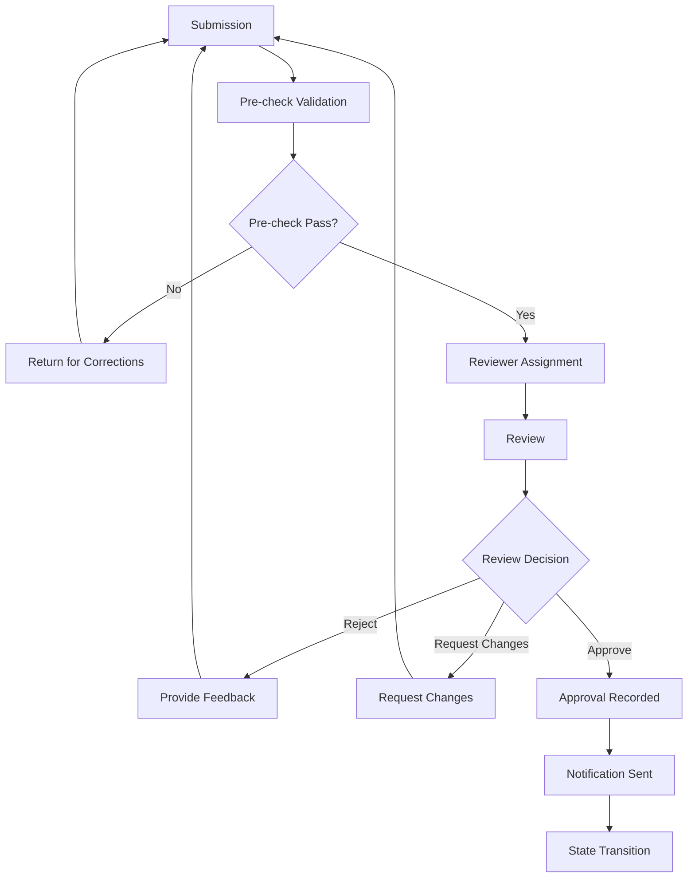
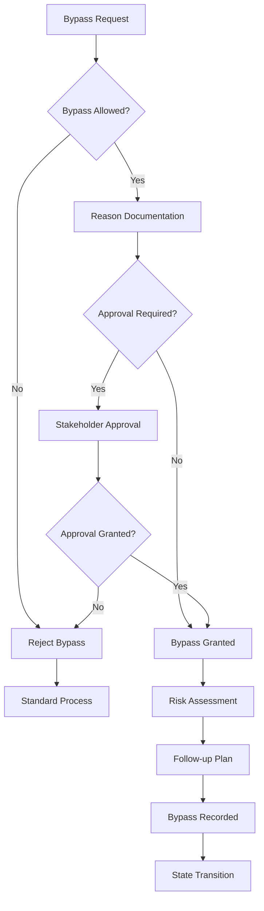

# Approval Gates

## Overview

Спецификация approval gates для платформы оркестрации. Определяет все точки одобрения, требования, approvers и условия обхода.

## Approval Gates Overview

| Gate Name | State Machine | Required For | Approver | Bypassable |
|-----------|---------------|--------------|----------|------------|
| Bootstrap Complete | Platform | Bootstrap → ArchitectureDesign | Build Orchestrator | No |
| Architecture Approved | Platform | ArchitectureDesign → Implementation | Platform Architect | No |
| Implementation Complete | Platform | Implementation → Verification | Implementation Engineer | No |
| Verification Complete | Platform | Verification → Release | Verification Agent | No |
| Release Approved | Platform | Release → [*] | Build Orchestrator | No |
| Request Classified | Build Process | RequestReceived → Classifying | Build Orchestrator | No |
| Task Assigned | Build Process | Assigning → InProgress | Assigned Agent | Yes |
| Verification Passed | Build Process | Verification → Complete | Verification Agent | No |
| Unblock Approved | Build Process | Blocked → InProgress | Build Orchestrator | Yes |

---

## Platform Approval Gates

### Gate 1: Bootstrap Complete

**Location**: Bootstrap → ArchitectureDesign

**Purpose**: Подтверждение успешной инициализации платформы.

**Requirements**:
- Repository initialized
- Base directory structure created
- CI/CD pipeline configured
- Dependencies installed
- Build Orchestrator activated
- Documentation initialized

**Approver**:
- **Primary**: Build Orchestrator
- **Secondary**: None

**Approval Criteria**:
- [ ] Repository accessible
- [ ] All directories created
- [ ] CI/CD pipeline running
- [ ] All dependencies installed
- [ ] Build Orchestrator responsive
- [ ] Documentation exists

**Bypass Conditions**: None (not bypassable)

**Bypass Approval**: N/A

---

### Gate 2: Architecture Approved

**Location**: ArchitectureDesign → Implementation

**Purpose**: Подтверждение завершенного архитектурного дизайна.

**Requirements**:
- Software Design Description (SDD) completed
- All Architecture Decision Records (ADR) created
- Security model defined
- Component specifications complete
- Integration contracts defined
- Technology stack approved
- Architecture reviewed by stakeholders

**Approver**:
- **Primary**: Platform Architect
- **Secondary**: Build Orchestrator
- **Tertiary**: Senior Architect (for critical decisions)

**Approval Criteria**:
- [ ] SDD complete and approved
- [ ] All ADR documented
- [ ] Security model comprehensive
- [ ] All components specified
- [ ] Integration contracts clear
- [ ] Technology stack approved
- [ ] Stakeholder feedback incorporated
- [ ] No critical gaps identified

**Bypass Conditions**: None (not bypassable)

**Bypass Approval**: N/A

---

### Gate 3: Implementation Complete

**Location**: Implementation → Verification

**Purpose**: Подтверждение завершенной реализации.

**Requirements**:
- All components implemented
- Unit tests written and passing
- API documentation created
- Code review completed
- Code quality checks passed
- All dependencies integrated
- No critical warnings

**Approver**:
- **Primary**: Implementation Engineer
- **Secondary**: Code Reviewer
- **Tertiary**: Build Orchestrator

**Approval Criteria**:
- [ ] All components implemented
- [ ] Unit tests passing (>90% coverage)
- [ ] API documentation complete
- [ ] Code review approved
- [ ] Code quality checks passed
- [ ] No critical warnings
- [ ] Dependencies integrated
- [ ] Integration points tested

**Bypass Conditions**: None (not bypassable)

**Bypass Approval**: N/A

---

### Gate 4: Verification Complete

**Location**: Verification → Release

**Purpose**: Подтверждение успешной верификации всех артефактов.

**Requirements**:
- Integration tests passing
- Security tests passing
- Performance tests passing
- All artifacts verified
- Quality gates passed
- Documentation complete
- No critical bugs found
- No security vulnerabilities

**Approver**:
- **Primary**: Verification Agent
- **Secondary**: Test Engineer
- **Tertiary**: Build Orchestrator

**Approval Criteria**:
- [ ] Integration tests passing (100%)
- [ ] Security tests passing (100%)
- [ ] Performance tests meeting SLA
- [ ] All artifacts verified
- [ ] Quality gates passed
- [ ] Documentation complete
- [ ] No critical bugs
- [ ] No security vulnerabilities
- [ ] All compliance checks passed

**Bypass Conditions**: None (not bypassable)

**Bypass Approval**: N/A

---

### Gate 5: Release Approved

**Location**: Release → [*]

**Purpose**: Финальное одобрение перед выпуском релиза.

**Requirements**:
- Release candidate ready
- Release notes prepared
- Deployment plan approved
- Monitoring configured
- Post-release plan defined
- Stakeholder approval obtained
- Rollback plan ready

**Approver**:
- **Primary**: Build Orchestrator
- **Secondary**: Project Manager
- **Tertiary**: Product Owner

**Approval Criteria**:
- [ ] Release candidate ready
- [ ] Release notes complete
- [ ] Deployment plan approved
- [ ] Monitoring configured
- [ ] Post-release plan defined
- [ ] Stakeholder approval obtained
- [ ] Rollback plan ready
- [ ] Communication plan prepared

**Bypass Conditions**: None (not bypassable)

**Bypass Approval**: N/A

---

## Build Process Approval Gates

### Gate 6: Request Classified

**Location**: RequestReceived → Classifying

**Purpose**: Подтверждение классификации запроса.

**Requirements**:
- Request registered in system
- Request type identified
- Priority assigned
- Initial information collected
- Build Orchestrator ready to process

**Approver**:
- **Primary**: Build Orchestrator
- **Secondary**: None

**Approval Criteria**:
- [ ] Request registered
- [ ] Type identified
- [ ] Priority assigned
- [ ] Information collected
- [ ] Build Orchestrator ready

**Bypass Conditions**: None (not bypassable)

**Bypass Approval**: N/A

---

### Gate 7: Task Assigned

**Location**: Assigning → InProgress

**Purpose**: Подтверждение назначения задачи агенту.

**Requirements**:
- Agent identified
- Context prepared
- Timeframes set
- Agent accepted task
- Resources available

**Approver**:
- **Primary**: Assigned Agent
- **Secondary**: Build Orchestrator

**Approval Criteria**:
- [ ] Agent identified
- [ ] Context prepared
- [ ] Timeframes set
- [ ] Agent accepted
- [ ] Resources available

**Bypass Conditions**:
- Emergency situation
- Agent unavailable but task critical
- Override by Build Orchestrator

**Bypass Approval**:
- Build Orchestrator can override
- Requires documented reason
- Requires notification to stakeholders

---

### Gate 8: Verification Passed

**Location**: Verification → Complete

**Purpose**: Подтверждение успешной верификации задачи.

**Requirements**:
- All checks passed
- Deliverables verified
- Feedback provided
- No critical issues
- Documentation updated

**Approver**:
- **Primary**: Verification Agent
- **Secondary**: Test Engineer

**Approval Criteria**:
- [ ] All checks passed
- [ ] Deliverables verified
- [ ] Feedback provided
- [ ] No critical issues
- [ ] Documentation updated
- [ ] Acceptance criteria met

**Bypass Conditions**:
- Minor issues that don't block progress
- Workaround available
- Stakeholder approval obtained

**Bypass Approval**:
- Build Orchestrator can bypass with stakeholder approval
- Requires documented workaround
- Requires follow-up plan

---

### Gate 9: Unblock Approved

**Location**: Blocked → InProgress

**Purpose**: Подтверждение устранения блокировки.

**Requirements**:
- Block resolved
- Resources available
- Information collected
- Agent ready to resume
- Context updated

**Approver**:
- **Primary**: Build Orchestrator
- **Secondary**: Assigned Agent

**Approval Criteria**:
- [ ] Block resolved
- [ ] Resources available
- [ ] Information collected
- [ ] Agent ready
- [ ] Context updated

**Bypass Conditions**:
- Temporary workaround available
- Partial resolution sufficient
- Emergency situation

**Bypass Approval**:
- Build Orchestrator can bypass
- Requires documented workaround
- Requires monitoring of risk

---

## Quality Gates

### Platform Quality Gates

#### Gate: Code Quality

**Location**: Implementation → Verification

**Requirements**:
- Code coverage > 90%
- No critical warnings
- All linting checks pass
- No security vulnerabilities detected
- Code complexity within limits

**Approver**: Code Reviewer, Implementation Engineer

---

#### Gate: Security Compliance

**Location**: Verification → Release

**Requirements**:
- No critical vulnerabilities
- All security tests pass
- Compliance requirements met
- Security review completed
- Penetration testing passed

**Approver**: Security Team, Verification Agent

---

#### Gate: Performance SLA

**Location**: Verification → Release

**Requirements**:
- Response time < threshold
- Throughput meets requirements
- Resource usage within limits
- No memory leaks
- Scalability verified

**Approver**: Performance Team, Test Engineer

---

### Build Process Quality Gates

#### Gate: Task Quality

**Location**: Verification → Complete

**Requirements**:
- All acceptance criteria met
- No critical issues
- Documentation complete
- Stakeholder satisfied
- No regression

**Approver**: Verification Agent, Requester

---

## Approval Process Flow

### Standard Approval Process



### Bypass Approval Process



## Approval Roles and Responsibilities

### Build Orchestrator

**Approvals**:
- Bootstrap Complete
- Request Classified
- Task Assigned (bypass)
- Unblock Approved (bypass)
- Release Approved

**Responsibilities**:
- Coordinate approval processes
- Ensure all criteria met
- Approve bypass requests
- Document decisions
- Notify stakeholders

---

### Platform Architect

**Approvals**:
- Architecture Approved

**Responsibilities**:
- Review architecture design
- Ensure SDD completeness
- Validate ADRs
- Approve technology stack
- Document architectural decisions

---

### Implementation Engineer

**Approvals**:
- Implementation Complete
- Task Assigned

**Responsibilities**:
- Review implementation
- Ensure code quality
- Validate unit tests
- Approve code review
- Document implementation

---

### Verification Agent

**Approvals**:
- Verification Complete
- Verification Passed

**Responsibilities**:
- Review all artifacts
- Validate test results
- Ensure quality gates passed
- Approve verification
- Document verification

---

### Test Engineer

**Approvals**:
- Verification Complete (secondary)
- Verification Passed (secondary)

**Responsibilities**:
- Execute test plans
- Validate test results
- Ensure performance SLA
- Support verification
- Document testing

---

## Approval History Tracking

**TODO**: Add approval history tracking

### Required Data

- Approval ID
- Gate name
- Approver ID
- Approval timestamp
- Decision (approve/reject/bypass)
- Reason for decision
- Bypass reason (if applicable)
- Supporting documents
- Comments/notes

### History Format

```json
{
  "approval_id": "unique_id",
  "gate_name": "gate_name",
  "approver_id": "agent_id",
  "timestamp": "ISO_8601_timestamp",
  "decision": "approve | reject | bypass",
  "reason": "Decision reason",
  "bypass_reason": "Bypass reason (if applicable)",
  "criteria_checklist": [
    {
      "criteria": "Criteria name",
      "status": "passed | failed | waived",
      "notes": "Notes"
    }
  ],
  "supporting_documents": [
    {
      "type": "document_type",
      "url": "document_url"
    }
  ],
  "comments": "Additional comments"
}
```

### History Storage

- Database table for approval history
- Audit log for compliance
- Export capabilities for reporting
- Retention policy: 7 years

---

## Approval Metrics

### Key Metrics

1. **Approval Rate**: Percentage of approvals vs. rejections
2. **Bypass Rate**: Percentage of bypasses
3. **Approval Time**: Average time to approval
4. **Gate Failure Rate**: Percentage of gates that fail
5. **Reviewer Efficiency**: Approval rate by reviewer

### Metrics Dashboard

```
Approval Metrics Dashboard (Last 30 Days)

Total Approvals: 150
Total Rejections: 15
Total Bypasses: 5
Approval Rate: 90.9%
Bypass Rate: 3.0%
Average Approval Time: 4.2 hours

By Gate:
- Bootstrap Complete: 5/5 (100%), 0 bypasses
- Architecture Approved: 20/22 (90.9%), 1 bypass
- Implementation Complete: 40/42 (95.2%), 2 bypasses
- Verification Complete: 50/55 (90.9%), 1 bypass
- Release Approved: 20/21 (95.2%), 1 bypass

By Approver:
- Build Orchestrator: 50/55 (90.9%), 4 bypasses
- Platform Architect: 20/22 (90.9%), 1 bypass
- Implementation Engineer: 40/42 (95.2%), 2 bypasses
- Verification Agent: 50/55 (90.9%), 1 bypass
```

## Best Practices

### For Approvers

1. **Review Thoroughly**: Всегда полностью проверять все критерии
2. **Document Decisions**: Документировать все решения
3. **Communicate Clearly**: Четко коммуницировать с автором
4. **Follow Process**: Следовать установленному процессу
5. **Escalate When Needed**: Эскалировать при необходимости

### For Requesters

1. **Prepare Thoroughly**: Тщательно готовить submission
2. **Address Feedback**: Адресовать feedback быстро
3. **Understand Criteria**: Понимать критерии одобрения
4. **Communicate Proactively**: Практивно коммуницировать
5. **Learn from Rejections**: Учиться на reject'ах

### For Bypass Requests

1. **Use Rarely**: Использовать bypass редко
2. **Document Reasons**: Документировать причины
3. **Get Approval**: Получать одобрение для bypass
4. **Plan Follow-up**: Планировать follow-up
5. **Monitor Risks**: Мониторить риски

## Related Documentation

- [Platform State Machine](./platform-state-machine.md)
- [Build Process State Machine](./build-process-state-machine.md)
- [Transition Rules](./transition-rules.md)
- [Escalation Rules](./escalation-rules.md)
- [State Machines Overview](../state-machines.md)
- [Quality Gates](../architecture/QUALITY-GATES.md)
