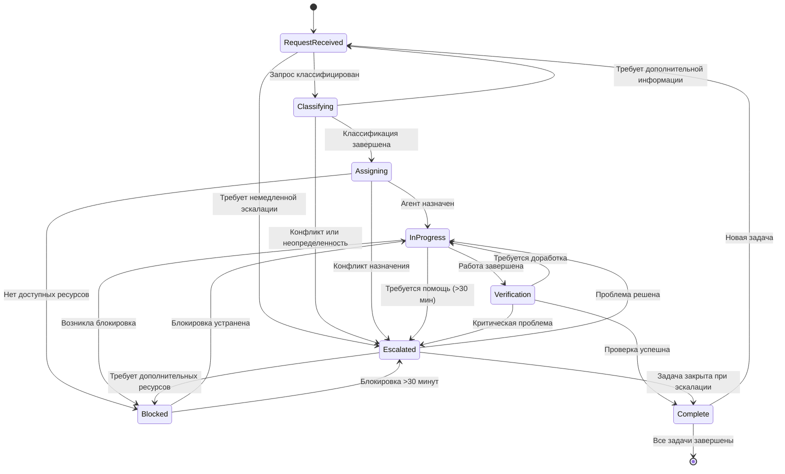

# Build Process State Machine

## Overview

State machine для управления процессом разработки Build Team. Координирует поток задач от получения запроса до завершения, включая эскалации и блокировки.

## States

### RequestReceived

**Описание**: Начальное состояние для нового запроса на разработку. Запрос зарегистрирован в системе и ожидает обработки.

**Ответственности**:
- Регистрация запроса
- Первичная классификация
- Проверка полноты информации
- Назначение приоритета

**Entry Conditions**:
- Новый запрос поступил от пользователя или другого агента
- Build Orchestrator активен
- Request queue доступен

**Exit Conditions**:
- Запрос классифицирован
- Тип запроса определен
- Назначен приоритет

**Agent Assignments**:
- Build Orchestrator: Координация и первичная обработка

**Handoff Points**:
- → Classifying: Когда запрос готов к классификации

### Classifying

**Описание**: Классификация запроса по типу (архитектура, реализация, интеграция, верификация, тестирование) и определение необходимых ресурсов.

**Ответственности**:
- Детальный анализ запроса
- Определение типа задачи
- Оценка сложности
- Определение необходимых агентов

**Entry Conditions**:
- RequestReceived завершен
- Build Orchestrator назначен
- Дополнительная информация собрана (если требуется)

**Exit Conditions**:
- Тип задачи определен
- Необходимые агенты идентифицированы
- Оценка сложности завершена

**Agent Assignments**:
- Build Orchestrator: Анализ и классификация

**Handoff Points**:
- → Assigning: Когда классификация завершена
- → Escalated: Если запрос требует эскалации

### Assigning

**Описание**: Назначение задачи соответствующему агенту или команде агентов.

**Ответственности**:
- Выбор подходящего агента
- Назначение задачи
- Передача контекста
- Установка временных рамок

**Entry Conditions**:
- Classifying завершен
- Тип задачи определен
- Необходимые агенты идентифицированы

**Exit Conditions**:
- Агент назначен
- Контекст передан
- Временные рамки установлены

**Agent Assignments**:
- Build Orchestrator: Назначение и координация

**Handoff Points**:
- → InProgress: Когда агент принял задачу
- → Blocked: Если нет доступных ресурсов

### InProgress

**Описание**: Активная работа над задачей назначенным агентом.

**Ответственности**:
- Выполнение задачи
- Регулярное обновление статуса
- Запрос уточнений при необходимости
- Подготовка результатов

**Entry Conditions**:
- Assigning завершен
- Агент принял задачу
- Контекст получен

**Exit Conditions**:
- Задача завершена
- Результаты подготовлены
- Статус обновлен

**Agent Assignments**:
- Platform Architect: Архитектурные задачи
- Workflow Architect: Задачи по рабочим процессам
- Implementation Engineer: Задачи по реализации
- Integration Architect: Задачи по интеграциям
- Test Engineer: Задачи по тестированию
- Verification Agent: Задачи по верификации

**Handoff Points**:
- → Verification: Когда работа завершена и требует проверки
- → Blocked: Если возникла блокировка
- → Escalated: Если требуется эскалация

### Verification

**Описание**: Проверка результатов выполнения задачи.

**Ответственности**:
- Проверка артефактов
- Code review
- Тестирование результатов
- Одобрение или отклонение

**Entry Conditions**:
- InProgress завершен
- Результаты подготовлены
- Требуется проверка

**Exit Conditions**:
- Проверка завершена
- Результат либо одобрен, либо отклонен
- Feedback предоставлен

**Agent Assignments**:
- Verification Agent: Верификация артефактов
- Test Engineer: Тестирование

**Handoff Points**:
- → Complete: Если проверка успешна
- → InProgress: Если требуется доработка
- → Escalated: Если обнаружена критическая проблема

### Complete

**Описание**: Задача успешно завершена и закрыта.

**Ответственности**:
- Финализация задачи
- Обновление документации
- Архивирование результатов
- Уведомление заинтересованных сторон

**Entry Conditions**:
- Verification завершена успешно
- Результаты одобрены
- Все требования выполнены

**Exit Conditions**:
- Задача закрыта
- Документация обновлена
- Заинтересованные стороны уведомлены

**Agent Assignments**:
- Build Orchestrator: Финализация и закрытие

**Handoff Points**:
- → RequestReceived: Для новых задач

### Blocked

**Описание**: Задача заблокирована и требует вмешательства.

**Ответственности**:
- Идентификация причины блокировки
- Уведомление Build Orchestrator
- Предоставление контекста для разблокировки
- Мониторинг ситуации

**Entry Conditions**:
- Возникла блокировка в любом состоянии
- Ресурсы недоступны
- Требуется дополнительная информация

**Exit Conditions**:
- Блокировка устранена
- Ресурсы доступны
- Дополнительная информация получена

**Agent Assignments**:
- Build Orchestrator: Координация разблокировки
- Любой агент: Сообщение о блокировке

**Handoff Points**:
- → InProgress: Когда блокировка устранена
- → Escalated: Если блокировка длится более 30 минут

### Escalated

**Описание**: Задача эскалирована к человеческому специалисту или старшему агенту.

**Ответственности**:
- Подготовка контекста для эскалации
- Передача информации эскалированному ресурсу
- Мониторинг решения
- Обратная передача после решения

**Entry Conditions**:
- Критическая проблема
- Длительная блокировка (>30 минут)
- Конфликт между агентами
- Нарушение сроков

**Exit Conditions**:
- Проблема решена
- Контекст обновлен
- Задача готова к продолжению

**Agent Assignments**:
- Build Orchestrator: Координация эскалации
- Human Expert: Решение проблемы

**Handoff Points**:
- → InProgress: Когда проблема решена
- → Complete: Если эскалация привела к закрытию

## State Diagram

## Transitions

### RequestReceived → Classifying

**Trigger**: Запрос готов к классификации

**Preconditions**:
- Запрос зарегистрирован
- Первичная информация собрана
- Приоритет назначен

**Postconditions**:
- Тип запроса определен
- Необходимые агенты идентифицированы

**TODO**: Add detailed transition triggers

### Classifying → Assigning

**Trigger**: Классификация завершена

**Preconditions**:
- Тип задачи определен
- Необходимые агенты идентифицированы
- Оценка сложности завершена

**Postconditions**:
- Агент выбран для назначения
- Контекст подготовлен

**TODO**: Add detailed transition triggers

### Assigning → InProgress

**Trigger**: Агент принял задачу

**Preconditions**:
- Агент назначен
- Контекст передан
- Временные рамки установлены

**Postconditions**:
- Агент начал работу
- Статус обновлен

**TODO**: Add detailed transition triggers

### InProgress → Verification

**Trigger**: Работа над задачей завершена

**Preconditions**:
- Результаты подготовлены
- Требуется проверка
- Статус обновлен

**Postconditions**:
- Проверка инициирована
- Результаты переданы Verification Agent

**TODO**: Add detailed transition triggers

### Verification → Complete

**Trigger**: Проверка успешна

**Preconditions**:
- Все проверки пройдены
- Результаты одобрены
- Feedback предоставлен

**Postconditions**:
- Задача закрыта
- Документация обновлена

**TODO**: Add detailed transition triggers

### Blocked → InProgress

**Trigger**: Блокировка устранена

**Preconditions**:
- Причина блокировки решена
- Ресурсы доступны
- Дополнительная информация получена

**Postconditions**:
- Работа возобновлена
- Статус обновлен

**TODO**: Add detailed transition triggers

### Escalated → InProgress

**Trigger**: Проблема решена

**Preconditions**:
- Эскалация завершена
- Решение реализовано
- Контекст обновлен

**Postconditions**:
- Работа возобновлена
- Статус обновлен

**TODO**: Add detailed transition triggers

## Agent Workflow Reference

### Build Orchestrator

- **States**: RequestReceived, Classifying, Assigning, Verification, Complete, Blocked, Escalated
- **Responsibilities**: Координация, классификация, назначение, эскалация
- **Handoffs**: Все агенты

### Platform Architect

- **States**: InProgress
- **Responsibilities**: Архитектурное проектирование
- **Handoffs**: Build Orchestrator

### Workflow Architect

- **States**: InProgress
- **Responsibilities**: Дизайн рабочих процессов
- **Handoffs**: Build Orchestrator

### Implementation Engineer

- **States**: InProgress
- **Responsibilities**: Реализация компонентов
- **Handoffs**: Build Orchestrator

### Integration Architect

- **States**: InProgress
- **Responsibilities**: Проектирование интеграций
- **Handoffs**: Build Orchestrator

### Test Engineer

- **States**: InProgress, Verification
- **Responsibilities**: Тестирование
- **Handoffs**: Build Orchestrator, Verification Agent

### Verification Agent

- **States**: Verification
- **Responsibilities**: Верификация артефактов
- **Handoffs**: Build Orchestrator

## Related Documentation

- [State Machines Overview](../state-machines.md)
- [Platform State Machine](./platform-state-machine.md)
- [Transition Rules](./transition-rules.md)
- [Escalation Rules](./escalation-rules.md)
- [Approval Gates](./approval-gates.md)
- [Build Team Documentation](../reports/build-team-package-final-report.md)
