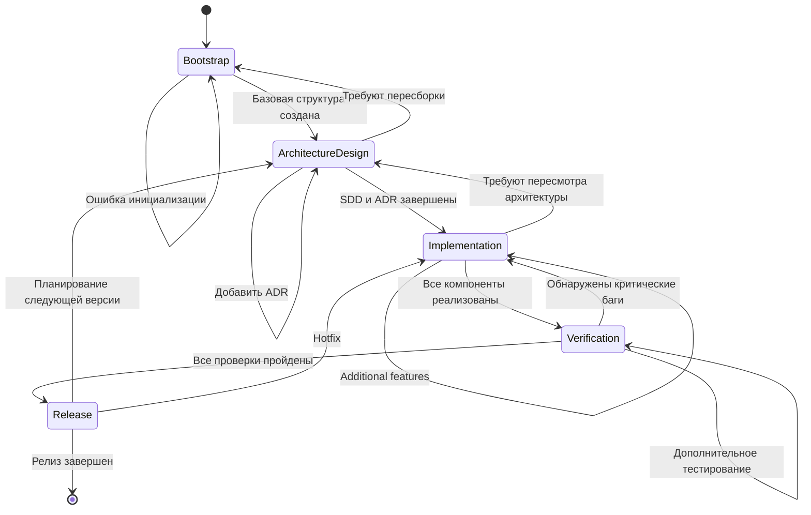

# Platform State Machine

## Overview

State machine для управления процессом разработки платформы оркестрации. Определяет жизненный цикл платформы от инициализации до релиза.

## States

### Bootstrap

**Описание**: Начальное состояние платформы. Инициализация базовой структуры и подготовка к разработке.

**Ответственности**:
- Инициализация репозитория
- Создание базовой директории структуры
- Настройка CI/CD пайплайнов
- Подготовка документации

**Entry Conditions**:
- Новый проект создан
- Repository initialized
- Build Orchestrator активирован

**Exit Conditions**:
- Базовая структура создана
- CI/CD настроен
- Repository доступен для команды

**TODO**: Добавить state-specific error handling

### ArchitectureDesign

**Описание**: Проектирование архитектуры платформы. Определение компонентов, интерфейсов и связей.

**Ответственности**:
- Создание Software Design Description (SDD)
- Определение компонентной модели
- Проектирование архитектуры безопасности
- Документирование архитектурных решений (ADR)

**Entry Conditions**:
- Bootstrap завершен
- Требования собраны и документированы
- Platform Architect назначен

**Exit Conditions**:
- SDD завершен и утвержден
- Все ADR созданы
- Модель безопасности определена
- Компоненты специфицированы

**TODO**: Добавить state-specific error handling

### Implementation

**Описание**: Реализация компонентов платформы согласно спроектированной архитектуре.

**Ответственности**:
- Реализация компонентов
- Разработка интеграций
- Написание unit tests
- Создание документации API

**Entry Conditions**:
- ArchitectureDesign завершен
- Implementation Engineer назначен
- Технический стек определен

**Exit Conditions**:
- Все компоненты реализованы
- Unit tests написаны и пройдены
- API документация создана
- Код review прошел

**TODO**: Добавить state-specific error handling

### Verification

**Описание**: Верификация реализованных компонентов и системы в целом.

**Ответственности**:
- Верификация артефактов
- Integration testing
- Security testing
- Performance testing

**Entry Conditions**:
- Implementation завершен
- Verification Agent назначен
- Test Engineer назначен
- Все unit tests пройдены

**Exit Conditions**:
- Integration tests пройдены
- Security tests пройдены
- Performance tests пройдены
- Все артефакты верифицированы
- Quality gates пройдены

**TODO**: Добавить state-specific error handling

### Release

**Описание**: Подготовка и выпуск релиза платформы.

**Ответственности**:
- Подготовка release notes
- Тестирование release candidate
- Деплой в production
- Мониторинг после релиза

**Entry Conditions**:
- Verification завершен
- Все quality gates пройдены
- Release candidate готов
- Build Orchestrator одобрил релиз

**Exit Conditions**:
- Релиз выпущен в production
- Release notes опубликованы
- Мониторинг настроен
- Post-release review проведен

**TODO**: Добавить state-specific error handling

## State Diagram

## Transitions

### Bootstrap → ArchitectureDesign

**Trigger**: Базовая структура создана и CI/CD настроен

**Preconditions**:
- Repository инициализирован
- Базовая директория структура создана
- CI/CD пайплайн настроен
- Build Orchestrator активирован

**Postconditions**:
- Platform Architect назначен
- Требования собраны
- Переход к проектированию архитектуры

**Agents Involved**:
- Build Orchestrator: Координация
- Platform Architect: Проектирование

### ArchitectureDesign → Implementation

**Trigger**: SDD завершен и все ADR созданы

**Preconditions**:
- SDD утвержден
- Все ADR задокументированы
- Модель безопасности определена
- Компоненты специфицированы

**Postconditions**:
- Implementation Engineer назначен
- Технический стек определен
- Начало реализации

**Agents Involved**:
- Build Orchestrator: Координация
- Platform Architect: Передача спецификаций
- Implementation Engineer: Реализация

### Implementation → Verification

**Trigger**: Все компоненты реализованы и unit tests пройдены

**Preconditions**:
- Все компоненты реализованы
- Unit tests написаны и пройдены
- API документация создана
- Code review пройден

**Postconditions**:
- Verification Agent назначен
- Test Engineer назначен
- Начало верификации

**Agents Involved**:
- Build Orchestrator: Координация
- Implementation Engineer: Передача кода
- Verification Agent: Верификация
- Test Engineer: Тестирование

### Verification → Release

**Trigger**: Все проверки пройдены и quality gates выполнены

**Preconditions**:
- Integration tests пройдены
- Security tests пройдены
- Performance tests пройдены
- Все артефакты верифицированы
- Quality gates пройдены

**Postconditions**:
- Release candidate готов
- Build Orchestrator одобрил релиз
- Подготовка к выпуску

**Agents Involved**:
- Build Orchestrator: Одобрение
- Verification Agent: Подтверждение качества
- Test Engineer: Финальное тестирование

### Release → [*]

**Trigger**: Релиз выпущен и post-release review проведен

**Preconditions**:
- Релиз выпущен в production
- Release notes опубликованы
- Мониторинг настроен
- Post-release review проведен

**Postconditions**:
- Цикл разработки завершен
- Подготовка к следующему циклу

**Agents Involved**:
- Build Orchestrator: Координация
- Все агенты: Post-release review

## Error Handling

### Common Error Patterns

1. **Initialization Failure**: Bootstrap → Bootstrap
2. **Architecture Mismatch**: ArchitectureDesign → Bootstrap
3. **Critical Bugs**: Verification → Implementation
4. **Release Issues**: Release → Implementation (hotfix)

### Recovery Strategies

- Rollback к предыдущему состоянию
- Повторение состояния с исправлениями
- Эскалация к человеческому специалисту

## Related Documentation

- [State Machines Overview](../state-machines.md)
- [Build Process State Machine](./build-process-state-machine.md)
- [Transition Rules](./transition-rules.md)
- [Escalation Rules](./escalation-rules.md)
- [Approval Gates](./approval-gates.md)
- [Architecture Design Documentation](../architecture/SDD.md)
- [Component Model](../architecture/COMPONENTS.md)
