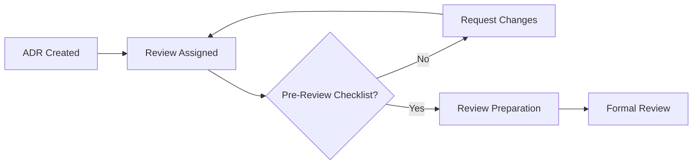
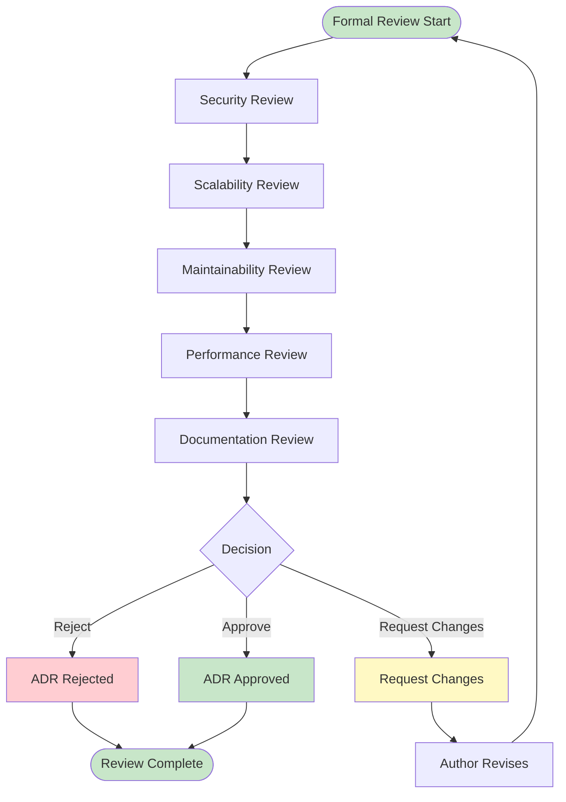
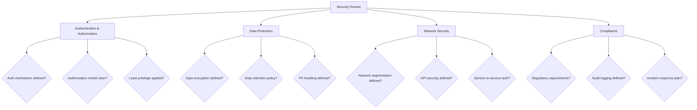
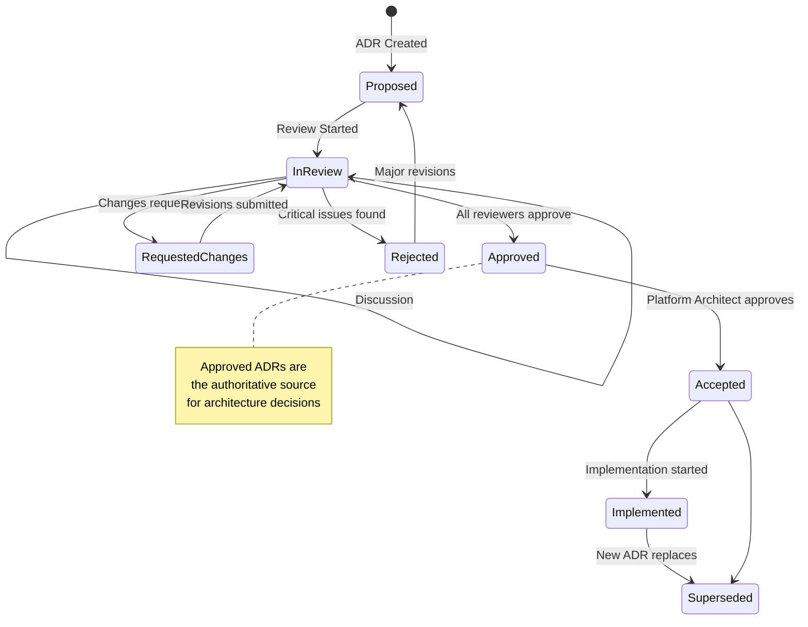

# Architecture Review Workflow

**Версия**: 1.0
**Статус**: Draft
**Последнее обновление**: 2026-04-12

---

## Overview

Architecture Review Workflow определяет процесс обзора и одобрения архитектурных решений. Этот процесс обеспечивает качество архитектуры, соответствие требованиям и готовность к реализации.

**Цель**: Гарантировать, что все архитектурные решения:
- Соответствуют бизнес-требованиям
- Технически обоснованы
- Безопасны и масштабируемы
- Поддерживаемы и поддерживают team velocity
- Задокументированы в ADR

**См.**: [Architecture Approved Gate](../docs/state-machines/approval-gates.md#gate-2-architecture-approved), [Build Team Workflow](./build-team-workflow.md)

---

## Триггеры обзора

### Review Triggers

**Automatic Triggers**:
- Создание нового ADR
- Изменение существующего ADR
- Изменение в критических компонентах
- Изменение security model
- Изменение integration contracts

**Manual Triggers**:
- Request от stakeholder
- Request от Implementation Engineer
- Request от Verification Agent
- Request от Test Engineer
- Request от Build Orchestrator

**Scheduled Reviews**:
- Quarterly architecture review
- Major release review
- Post-incident architecture review

---

## Entry Conditions

### Pre-Review Checklist

Перед началом архитектурного обзора:

**Documentation Requirements**:
- [ ] ADR создан в стандартном формате
- [ ] Context и problem четко определены
- [ ] Рассмотрены альтернативные решения
- [ ] Consequences задокументированы
- [ ] Технические детали объяснены
- [ ] Diagramы включены (если применимо)

**Stakeholder Requirements**:
- [ ] Stakeholders идентифицированы
- [ ] Stakeholders уведомлены о review
- [ ] Feedback собран от ключевых stakeholders
- [ ] Questions от stakeholders задокументированы

**Technical Requirements**:
- [ ] Концепт технически выполним
- [ ] Dependencies идентифицированы
- [ ] Risks оценены
- [ ] Proof-of-concept выполнен (если требуется)
- [ ] Performance implications оценены

**Process Requirements**:
- [ ] ADR готов к review (status: Proposed)
- [ ] Reviewer(s) назначены
- [ ] Review scheduled
- [ ] Review criteria определены

---

## Review Process

### Phase 1: Pre-Review Preparation

**Responsibility**: Platform Architect, Agent Runtime Architect

**Activities**:
1. Изучение ADR
2. Проверка соответствия SPEC.md
3. Подготовка вопросов
4. Идентификация concerns
5. Подготовка suggestions

**Output**:
- Prepared questions list
- Identified concerns
- Initial feedback notes



---

### Phase 2: Formal Review

**Responsibility**: Platform Architect, Agent Runtime Architect, Senior Architect

**Activities**:
1. Structured review по критериям
2. Вопросы к автору
3. Discussion concerns
4. Evaluation alternatives
5. Recommendation

**Output**:
- Review feedback document
- Decision (Approve/Reject/Request Changes)
- Action items (если есть)



---

### Phase 3: Decision

**Responsibility**: Platform Architect (primary), Senior Architect (appeals)

**Possible Decisions**:

**Approve**:
- Все критерии выполнены
- Minor improvements могут быть сделаны позже
- Ready for implementation

**Request Changes**:
- Некоторые критерии не выполнены
- Require clarifications
- Require minor modifications
- Ready for re-review

**Reject**:
- Критические проблемы
- Fundamental flaws
- Non-compliance с требованиями
- Require major revisions

---

## Review Checklist

### Security Review

**Critical Security Requirements**:



**Checklist**:
- [ ] Authentication mechanism defined
- [ ] Authorization model clear and documented
- [ ] Least privilege principle applied
- [ ] Data encryption defined (at rest, in transit)
- [ ] Data retention policy defined
- [ ] PII (Personally Identifiable Information) handling defined
- [ ] Network segmentation defined
- [ ] API security defined (authentication, rate limiting, etc.)
- [ ] Service-to-service authentication defined
- [ ] Regulatory compliance requirements addressed
- [ ] Audit logging defined
- [ ] Incident response plan defined
- [ ] Secrets management strategy defined
- [ ] Input validation defined
- [ ] Output encoding defined

**См.**: [Security Model](../docs/architecture/SECURITY.md)

---

### Scalability Review

**Scalability Requirements**:

**Checklist**:
- [ ] Horizontal scaling strategy defined
- [ ] Vertical scaling strategy defined
- [ ] Load balancing strategy defined
- [ ] Caching strategy defined
- [ ] Database scaling strategy defined
- [ ] Performance targets defined (throughput, latency)
- [ ] Capacity planning defined
- [ ] Auto-scaling thresholds defined
- [ ] Backpressure handling defined
- [ ] Circuit breaker pattern considered
- [ ] Rate limiting defined
- [ ] Sharding strategy defined (if applicable)
- [ ] Partitioning strategy defined (if applicable)
- [ ] Resource limits defined
- [ ] Performance testing plan defined

**См.**: [OBSERVABILITY.md](../docs/architecture/OBSERVABILITY.md)

---

### Maintainability Review

**Maintainability Requirements**:

**Checklist**:
- [ ] Code organization clear
- [ ] Module boundaries defined
- [ ] Coupling minimized
- [ ] Cohesion maximized
- [ ] Design patterns applied appropriately
- [ ] Naming conventions defined
- [ ] Documentation strategy defined
- [ ] Testing strategy defined
- [ ] Dependency management strategy defined
- [ ] Error handling strategy defined
- [ ] Logging strategy defined
- [ ] Monitoring strategy defined
- [ ] Deployment strategy defined
- [ ] Versioning strategy defined
- [ ] Deprecation policy defined
- [ ] Migration strategy defined

**См.**: [CODING STANDARDS](../docs/architecture/CODING-STANDARDS.md)

---

### Performance Review

**Performance Requirements**:

**Checklist**:
- [ ] Performance targets defined (latency, throughput)
- [ ] Performance measurement strategy defined
- [ ] Performance testing plan defined
- [ ] Bottlenecks identified
- [ ] Optimization strategy defined
- [ ] Caching strategy considered
- [ ] Database optimization considered
- [ ] Network optimization considered
- [ ] Resource usage optimized
- [ ] Memory usage optimized
- [ ] CPU usage optimized
- [ ] I/O operations optimized
- [ ] Background jobs considered
- [ ] Asynchronous operations considered
- [ ] Connection pooling defined
- [ ] Query optimization defined

**См.**: [OBSERVABILITY.md](../docs/architecture/OBSERVABILITY.md)

---

### Documentation Review

**Documentation Requirements**:

**Checklist**:
- [ ] ADR follows standard format
- [ ] Context clearly explained
- [ ] Problem clearly stated
- [ ] Alternatives thoroughly explored
- [ ] Consequences documented
- [ ] Technical details clear
- [ ] Diagrams included (if applicable)
- [ ] References to SPEC.md included
- [ ] References to other ADR included
- [ ] Implementation notes included
- [ ] Migration notes included (if applicable)
- [ ] Rollback plan included (if applicable)
- [ ] Testing notes included
- [ ] Security considerations documented
- [ ] Performance implications documented

---

## Review Participants and Roles

### Primary Reviewers

**Platform Architect**:
- Lead reviewer для platform architecture
- Responsible за final decision
- Approves ADR для platform changes

**Agent Runtime Architect**:
- Lead reviewer для runtime architecture
- Responsible за final decision
- Approves ADR для runtime changes

**Integration Architect**:
- Reviewer для integration-related ADR
- Focus на integration contracts и APIs
- Approves integration-related decisions

**Workflow Architect**:
- Reviewer для workflow-related ADR
- Focus на agent coordination и workflows
- Approves workflow-related decisions

### Secondary Reviewers

**Implementation Engineer**:
- Reviewer для implementation feasibility
- Focus на implementation complexity
- Provides feedback от implementation perspective

**Verification Agent**:
- Reviewer для verification implications
- Focus на testing и verification
- Provides feedback от verification perspective

**Test Engineer**:
- Reviewer для testing implications
- Focus на testability и testing strategy
- Provides feedback от testing perspective

### Stakeholders

**Product Owner**:
- Business requirements validation
- Acceptance criteria validation
- Priority validation

**Security Team**:
- Security implications validation
- Compliance requirements validation
- Risk assessment

**Operations Team**:
- Deployment implications validation
- Monitoring implications validation
- Maintenance implications validation

---

## Approval Process

### Approval Flow



### Approval Criteria

**Approval Requirements**:
- [ ] All primary reviewers approved
- [ ] All critical concerns addressed
- [ ] All critical questions answered
- [ ] Security concerns resolved
- [ ] Scalability concerns resolved
- [ ] Maintainability concerns resolved
- [ ] Performance concerns resolved
- [ ] Documentation complete
- [ ] No blockers remaining

**Bypass Approval**:
- Emergency situations only
- Requires documented justification
- Requires Senior Architect approval
- Requires follow-up review

---

## Feedback and Iteration Cycle

### Feedback Format

**Positive Feedback**:
```
## Positive Feedback

**ADR**: ADR-XXX: [Title]
**Reviewer**: [Name]
**Date**: [Date]

**Strengths**:
- [ ] Strength 1
- [ ] Strength 2

**Suggestions for Future**:
- [ ] Suggestion 1
- [ ] Suggestion 2

**Conclusion**: Approve
```

**Change Request**:
```
## Change Request

**ADR**: ADR-XXX: [Title]
**Reviewer**: [Name]
**Date**: [Date]

**Critical Issues**:
1. [Issue 1]: [description]
2. [Issue 2]: [description]

**High Priority Issues**:
1. [Issue 1]: [description]

**Suggestions**:
1. [Suggestion 1]: [description]

**Questions**:
1. [Question 1]: [description]

**Action Items**:
- [ ] [Action item 1]
- [ ] [Action item 2]

**Deadline**: [Date]

**Conclusion**: Request Changes
```

**Rejection**:
```
## Rejection

**ADR**: ADR-XXX: [Title]
**Reviewer**: [Name]
**Date**: [Date]

**Critical Issues** (Must Fix):
1. [Issue 1]: [description]
2. [Issue 2]: [description]

**Fundamental Flaws**:
1. [Flaw 1]: [description]

**Alternatives to Consider**:
1. [Alternative 1]: [description]

**Conclusion**: Reject - Major revisions required
```

---

### Iteration Process

**Author Responsibilities**:
- Address all feedback
- Answer all questions
- Update ADR accordingly
- Resubmit for review
- Respond to each feedback item

**Reviewer Responsibilities**:
- Provide clear, actionable feedback
- Respond to author questions
- Re-review revised ADR
- Maintain constructive tone
- Follow up on action items

**Build Orchestrator Responsibilities**:
- Coordinate review process
- Track review timelines
- Follow up on overdue reviews
- Facilitate discussion
- Monitor iteration count

---

## Review Timeline

### Standard Review Timeline

**Preparation**: 1-2 hours
**Formal Review**: 2-4 hours
**Decision**: Immediate (after review)
**Author Revision**: 1-2 days (if changes requested)
**Re-review**: 1-2 hours

**Total Time**: 1-3 days (average)

### Expedited Review Timeline

**Use Cases**: Emergency, critical bug fix, security issue

**Preparation**: 30 minutes
**Formal Review**: 1 hour
**Decision**: Immediate
**Author Revision**: 4 hours (if changes requested)
**Re-review**: 30 minutes

**Total Time**: 4-8 hours

### Overdue Handling

**Overdue Threshold**: 5 days from review assignment

**Actions**:
- Send reminder to reviewer
- Escalate to Build Orchestrator
- Escalate to Senior Architect (if critical)
- Reassign reviewer (if necessary)

---

## Review Outcomes

### Approved

**Outcome**: ADR approved for implementation

**Next Steps**:
1. Update ADR status to "Accepted"
2. Notify stakeholders
3. Handoff to Implementation Engineer
4. Update architecture documentation

**Tracking**:
- Approved by: [Reviewer(s)]
- Approved date: [Date]
- Approval gate: Architecture Approved

---

### Requested Changes

**Outcome**: ADR requires revisions

**Next Steps**:
1. Author updates ADR
2. Author resubmits for review
3. Reviewer(s) re-review
4. Repeat until approved or rejected

**Tracking**:
- Number of iterations: [Count]
- Current iteration: [Number]
- Last revision date: [Date]

---

### Rejected

**Outcome**: ADR rejected

**Next Steps**:
1. Author creates new ADR with major revisions
2. Or abandons current approach
3. Or selects alternative solution

**Tracking**:
- Rejected by: [Reviewer(s)]
- Rejection reason: [Reason]
- Rejection date: [Date]

---

## Documentation

### Review Records

**Required Documentation**:
- Review date
- Reviewer(s)
- Review decision
- Feedback provided
- Action items (if any)
- Follow-up actions (if any)

**Storage**:
- In ADR comments
- In architecture review log
- In project documentation

**Retention**:
- Retain for lifetime of ADR
- Archive when ADR superseded

---

## TODO: Review Criteria Details

### Security Review Details

- [ ] Add detailed security threat model
- [ ] Add security testing requirements
- [ ] Add security monitoring requirements
- [ ] Add incident response procedures
- [ ] Add security audit checklist

### Scalability Review Details

- [ ] Add detailed scalability metrics
- [ ] Add capacity planning procedures
- [ ] Add performance testing procedures
- [ ] Add load testing requirements
- [ ] Add auto-scaling procedures

### Maintainability Review Details

- [ ] Add detailed code quality metrics
- [ ] Add code review procedures
- [ ] Add refactoring guidelines
- [ ] Add documentation standards
- [ ] Add knowledge transfer procedures

### Performance Review Details

- [ ] Add detailed performance metrics
- [ ] Add performance testing procedures
- [ ] Add optimization guidelines
- [ ] Add monitoring procedures
- [ ] Add incident response procedures

### Documentation Review Details

- [ ] Add ADR template with examples
- [ ] Add documentation standards
- [ ] Add diagram guidelines
- [ ] Add documentation review procedures
- [ ] Add documentation maintenance procedures

---

## Related Documentation

- [Architecture Approved Gate](../docs/state-machines/approval-gates.md#gate-2-architecture-approved)
- [Build Team Workflow](./build-team-workflow.md)
- [Platform Architect Role](../agents/platform-architect/ROLE.md)
- [Security Model](../docs/architecture/SECURITY.md)
- [OBSERVABILITY.md](../docs/architecture/OBSERVABILITY.md)
- [COMPONENTS.md](../docs/architecture/COMPONENTS.md)
- [SDD.md](../docs/architecture/SDD.md)
