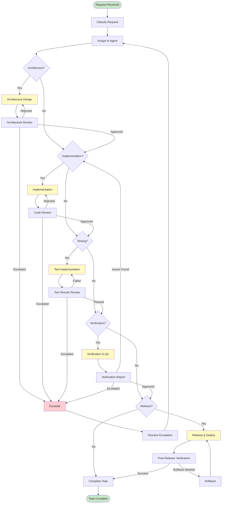
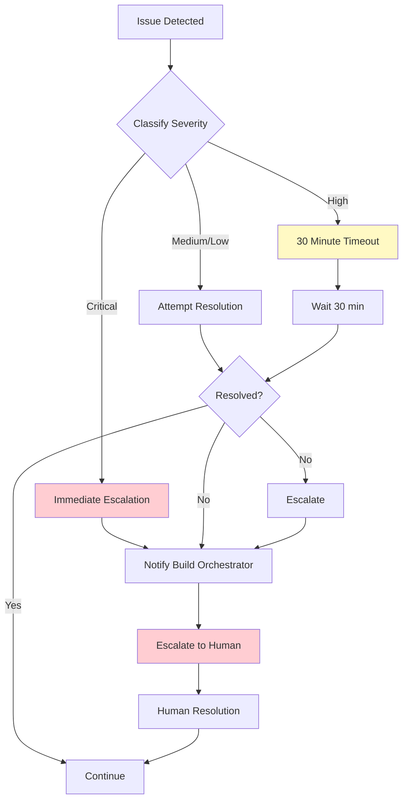

# Build Team Workflow

**Версия**: 1.0
**Статус**: Draft
**Последнее обновление**: 2026-04-12

---

## Overview

Build Team Workflow определяет координацию между агентами для выполнения задач от получения запроса до финального релиза. Этот workflow управляет полным циклом разработки через 4 основных этапа: Architecture, Implementation, Verification, Release.

**См.**: [Build Process State Machine](../docs/state-machines/build-process-state-machine.md), [Build Orchestrator](../agents/build-orchestrator/WORKFLOW.md)

---

## Общий процесс

### High-Level Flow

---

## Stage 1: Architecture

### Stage Overview

Architecture stage охватывает проектирование системы и создание Architecture Decision Records (ADR).

### Responsibilities

**Primary Agent**: Platform Architect, Agent Runtime Architect

**Tasks**:
- Анализ требований
- Проектирование архитектуры
- Создание ADR
- Review архитектуры
- Одобрение ADR

### Handoff Points

**Entry**:
- Request classified as architecture task
- Requirements gathered
- Stakeholders identified

**Exit**:
- ADR created and approved
- Architecture design documented
- Ready for implementation

**Handoff to**: Implementation Engineer

### Quality Gates

- [ ] SDD (Software Design Description) completed
- [ ] All ADR created and approved
- [ ] Security model defined
- [ ] Component specifications complete
- [ ] Integration contracts defined
- [ ] Technology stack approved
- [ ] Architecture reviewed by stakeholders

**См.**: [Architecture Approved Gate](../docs/state-machines/approval-gates.md#gate-2-architecture-approved)

---

## Stage 2: Implementation

### Stage Overview

Implementation stage охватывает разработку кода на основе утвержденной архитектуры.

### Responsibilities

**Primary Agent**: Implementation Engineer

**Tasks**:
- Изучение ADR и спецификаций
- Проектирование кода
- Написание кода
- Написание тестов
- Документирование
- Code review

### Handoff Points

**Entry**:
- ADR approved
- Architecture design complete
- Requirements clear

**Exit**:
- Code implemented
- Tests passing
- Documentation complete
- Code review approved

**Handoff to**: Test Engineer, Verification Agent

### Quality Gates

- [ ] All components implemented
- [ ] Unit tests written and passing
- [ ] API documentation created
- [ ] Code review completed
- [ ] Code quality checks passed
- [ ] All dependencies integrated
- [ ] No critical warnings
- [ ] Test coverage > 80%

**См.**: [Implementation Complete Gate](../docs/state-machines/approval-gates.md#gate-3-implementation-complete)

---

## Stage 3: Verification

### Stage Overview

Verification stage охватывает проверку всех артефактов на соответствие требованиям.

### Responsibilities

**Primary Agents**: Verification Agent, Test Engineer

**Tasks**:
- Verification артефактов
- Integration testing
- Security testing
- Performance testing
- Code quality checks
- Documentation review

### Handoff Points

**Entry**:
- Implementation complete
- Code review approved
- Tests passing

**Exit**:
- All verifications passed
- Quality gates passed
- Documentation verified
- Ready for release

**Handoff to**: Build Orchestrator (for release)

### Quality Gates

- [ ] Integration tests passing (100%)
- [ ] Security tests passing (100%)
- [ ] Performance tests meeting SLA
- [ ] All artifacts verified
- [ ] Quality gates passed
- [ ] Documentation complete
- [ ] No critical bugs found
- [ ] No security vulnerabilities
- [ ] All compliance checks passed

**См.**: [Verification Complete Gate](../docs/state-machines/approval-gates.md#gate-4-verification-complete)

---

## Stage 4: Release

### Stage Overview

Release stage охватывает развертывание и мониторинг релиза.

### Responsibilities

**Primary Agent**: Build Orchestrator

**Tasks**:
- Release preparation
- Release approval
- Deployment
- Post-release verification
- Rollback при необходимости

### Handoff Points

**Entry**:
- Verification complete
- All quality gates passed
- Stakeholder approval obtained

**Exit**:
- Release deployed
- Post-release verification successful
- Monitoring configured
- Task complete

**Handoff to**: Complete

### Quality Gates

- [ ] Release candidate ready
- [ ] Release notes prepared
- [ ] Deployment plan approved
- [ ] Monitoring configured
- [ ] Post-release plan defined
- [ ] Stakeholder approval obtained
- [ ] Rollback plan ready
- [ ] Communication plan prepared

**См.**: [Release Approved Gate](../docs/state-machines/approval-gates.md#gate-5-release-approved)

---

## Agent Responsibilities по этапам

### Build Orchestrator

**Role**: Координация всех этапов

**Stages**: Все

**Responsibilities**:
- Классификация запросов
- Назначение агентов
- Координация handoffs
- Эскалация проблем
- Финальное одобрение релиза
- Мониторинг прогресса

**См.**: [Build Orchestrator Workflow](../agents/build-orchestrator/WORKFLOW.md)

---

### Platform Architect

**Role**: Архитектурное проектирование

**Stages**: Architecture

**Responsibilities**:
- Анализ требований
- Проектирование архитектуры платформы
- Создание ADR для архитектурных решений
- Review и одобрение ADR
- Валидация соответствия SPEC.md

**См.**: [Platform Architect Role](../agents/platform-architect/ROLE.md)

---

### Agent Runtime Architect

**Role**: Архитектура runtime

**Stages**: Architecture

**Responsibilities**:
- Проектирование runtime архитектуры
- Создание ADR для runtime решений
- Review runtime components
- Валидация performance требований

**См.**: [Agent Runtime Architect Role](../agents/agent-runtime-architect/ROLE.md)

---

### Integration Architect

**Role**: Интеграционное проектирование

**Stages**: Architecture

**Responsibilities**:
- Проектирование интеграций
- Определение контрактов интеграции
- Создание ADR для интеграций
- Review интеграционных контрактов

**См.**: [Integration Architect Role](../agents/integration-architect/ROLE.md)

---

### Workflow Architect

**Role**: Проектирование рабочих процессов

**Stages**: Architecture

**Responsibilities**:
- Проектирование workflow
- Определение agent responsibilities
- Создание ADR для workflow решений
- Review workflow implementations

**См.**: [Workflow Architect Role](../agents/workflow-architect/ROLE.md)

---

### Implementation Engineer

**Role**: Реализация кода

**Stages**: Implementation

**Responsibilities**:
- Изучение ADR и спецификаций
- Проектирование кода
- Написание кода
- Написание тестов
- Документирование
- Code review

**См.**: [Implementation Engineer Workflow](../agents/implementation-engineer/WORKFLOW.md)

---

### Test Engineer

**Role**: Тестирование

**Stages**: Implementation, Verification

**Responsibilities**:
- Написание тестов
- Execution тестов
- Test coverage analysis
- Integration testing
- Performance testing

**См.**: [Test Engineer Workflow](../agents/test-engineer/WORKFLOW.md)

---

### Verification Agent

**Role**: Верификация

**Stages**: Verification

**Responsibilities**:
- Verification артефактов
- Code quality checks
- Security verification
- Documentation review
- Создание verification отчетов

**См.**: [Verification Agent Workflow](../agents/verification-agent/WORKFLOW.md)

---

## Handoff Points

### Architecture → Implementation

**Trigger**: Architecture Approved Gate passed

**Artifacts**:
- Approved ADR
- SDD
- Component specifications
- Integration contracts
- Technology stack decisions

**Verification**:
- [ ] ADR approved by Platform Architect
- [ ] SDD complete
- [ ] All components specified
- [ ] Integration contracts defined
- [ ] Technology stack approved

**См.**: [Architecture Approved Gate](../docs/state-machines/approval-gates.md#gate-2-architecture-approved)

---

### Implementation → Verification

**Trigger**: Implementation Complete Gate passed

**Artifacts**:
- Implemented code
- Unit tests (passing)
- Integration tests (passing)
- Documentation
- Code review approval

**Verification**:
- [ ] All components implemented
- [ ] Unit tests passing
- [ ] Code review approved
- [ ] Documentation complete
- [ ] Test coverage > 80%

**См.**: [Implementation Complete Gate](../docs/state-machines/approval-gates.md#gate-3-implementation-complete)

---

### Verification → Release

**Trigger**: Verification Complete Gate passed

**Artifacts**:
- Verified artifacts
- Test results (all passing)
- Security audit report
- Performance test results
- Verification report

**Verification**:
- [ ] All verifications passed
- [ ] Quality gates passed
- [ ] No critical issues
- [ ] Documentation verified
- [ ] All compliance checks passed

**См.**: [Verification Complete Gate](../docs/state-machines/approval-gates.md#gate-4-verification-complete)

---

### Release → Complete

**Trigger**: Release Approved Gate passed

**Artifacts**:
- Release candidate
- Release notes
- Deployment documentation
- Monitoring configuration
- Rollback plan

**Verification**:
- [ ] Release deployed successfully
- [ ] Post-release verification passed
- [ ] Monitoring configured
- [ ] Stakeholders notified
- [ ] No rollbacks needed

**См.**: [Release Approved Gate](../docs/state-machines/approval-gates.md#gate-5-release-approved)

---

## Quality Gates

### Architecture Quality Gates

- [ ] SDD complete and approved
- [ ] All ADR documented
- [ ] Security model comprehensive
- [ ] All components specified
- [ ] Integration contracts clear
- [ ] Technology stack approved
- [ ] Stakeholder feedback incorporated
- [ ] No critical gaps identified

---

### Implementation Quality Gates

- [ ] All components implemented
- [ ] Unit tests passing (>90% coverage)
- [ ] API documentation complete
- [ ] Code review approved
- [ ] Code quality checks passed
- [ ] No critical warnings
- [ ] Dependencies integrated
- [ ] Integration points tested

---

### Verification Quality Gates

- [ ] Integration tests passing (100%)
- [ ] Security tests passing (100%)
- [ ] Performance tests meeting SLA
- [ ] All artifacts verified
- [ ] Quality gates passed
- [ ] Documentation complete
- [ ] No critical bugs
- [ ] No security vulnerabilities
- [ ] All compliance checks passed

---

### Release Quality Gates

- [ ] Release candidate ready
- [ ] Release notes complete
- [ ] Deployment plan approved
- [ ] Monitoring configured
- [ ] Post-release plan defined
- [ ] Stakeholder approval obtained
- [ ] Rollback plan ready
- [ ] Communication plan prepared

---

## Escalation Process

### Escalation Triggers

**Architecture Stage**:
- Непосильное архитектурное решение
- Конфликт между архитекторами
- Отсутствие stakeholder consensus
- Critical gaps в требованиях

**Implementation Stage**:
- Невозможность реализации ADR
- Несоответствие ADR спецификациям
- Technical blockers
- Длительные тайм-ауты (>4 часа)

**Verification Stage**:
- Critical security vulnerability
- Несоответствие критериям качества
- Невозможность верификации
- Discrepancies в документации

**Release Stage**:
- Deployment failure
- Post-release verification failure
- Критические проблемы в production
- Rollback failure

### Escalation Process Flow

**См.**: [Escalation Rules](../docs/state-machines/escalation-rules.md)

---

## TODO: Stage-Specific Details

### Architecture Stage

- [ ] Add detailed architecture review checklist
- [ ] Add ADR template guidelines
- [ ] Add architecture patterns reference
- [ ] Add technology stack selection criteria
- [ ] Add integration contract templates

### Implementation Stage

- [ ] Add detailed code review checklist
- [ ] Add implementation best practices
- [ ] Add code standards reference
- [ ] Add testing guidelines
- [ ] Add documentation standards

### Verification Stage

- [ ] Add detailed verification checklist
- [ ] Add security verification procedures
- [ ] Add performance testing guidelines
- [ ] Add quality metrics definitions
- [ ] Add bug classification criteria

### Release Stage

- [ ] Add release automation procedures
- [ ] Add deployment strategies
- [ ] Add monitoring setup procedures
- [ ] Add rollback procedures
- [ ] Add communication templates

---

## Related Documentation

- [Build Process State Machine](../docs/state-machines/build-process-state-machine.md)
- [Platform State Machine](../docs/state-machines/platform-state-machine.md)
- [Approval Gates](../docs/state-machines/approval-gates.md)
- [Escalation Rules](../docs/state-machines/escalation-rules.md)
- [Architecture Review Workflow](./architecture-review-workflow.md)
- [Implementation Workflow](./implementation-workflow.md)
- [Verification Workflow](./verification-workflow.md)
- [Release Bootstrap Workflow](./release-bootstrap-workflow.md)
- [Build Orchestrator Workflow](../agents/build-orchestrator/WORKFLOW.md)
