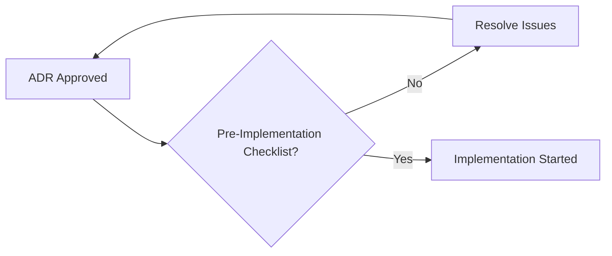
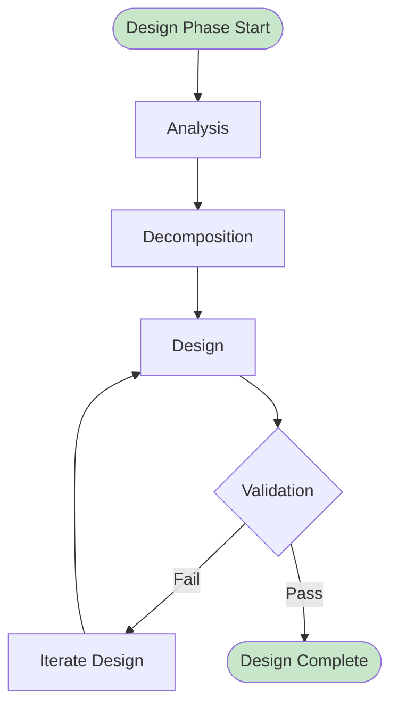
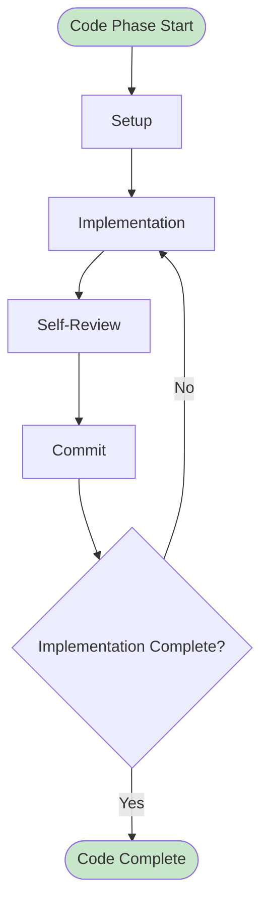
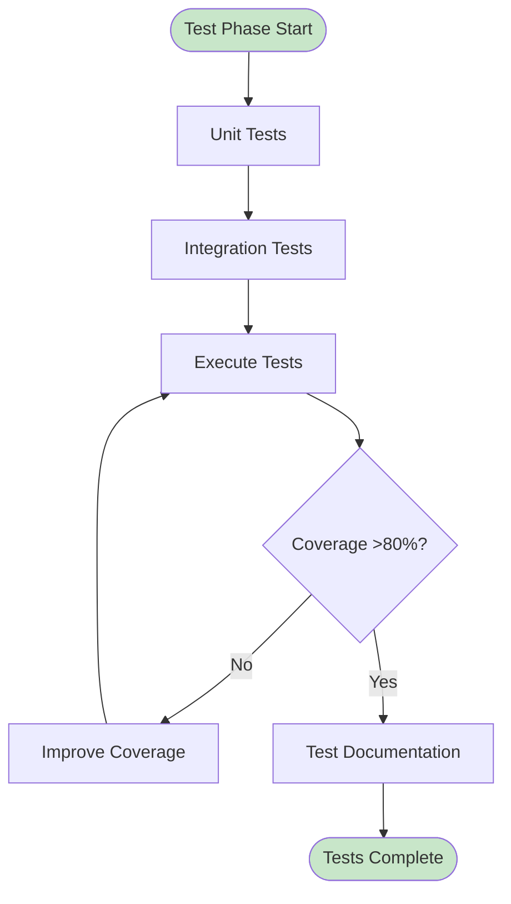
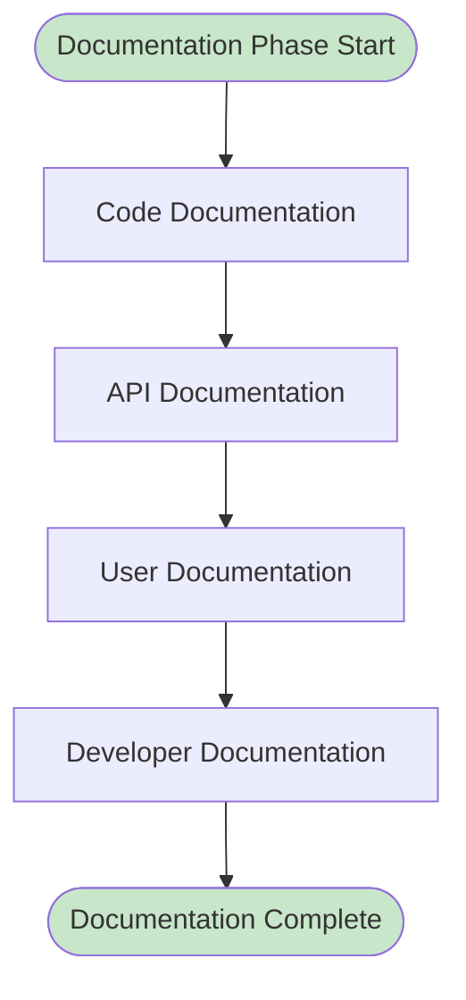

# Implementation Workflow

**Версия**: 1.0
**Статус**: Draft
**Последнее обновление**: 2026-04-12

---

## Overview

Implementation Workflow определяет процесс реализации утвержденной архитектуры. Этот процесс охватывает весь цикл разработки от изучения спецификаций до подготовки к верификации.

**Цель**: Гарантировать, что реализация:
- Соответствует утвержденным ADR
- Соответствует code standards
- Полностью протестирована
- Документирована
- Готова к верификации

**См.**: [Implementation Complete Gate](../docs/state-machines/approval-gates.md#gate-3-implementation-complete), [Implementation Engineer Workflow](../agents/implementation-engineer/WORKFLOW.md)

---

## Entry Conditions

### Pre-Implementation Checklist

Перед началом реализации:

**Architecture Requirements**:
- [ ] ADR approved and status: Accepted
- [ ] Architecture design reviewed
- [ ] Architecture questions answered
- [ ] Architecture concerns resolved
- [ ] No open architecture blockers

**Requirements Clarity**:
- [ ] Functional requirements clear
- [ ] Non-functional requirements defined
- [ ] Acceptance criteria defined
- [ ] Edge cases identified
- [ ] Dependencies identified

**Technical Readiness**:
- [ ] Technology stack approved
- [ ] Dependencies available
- [ ] Development environment ready
- [ ] CI/CD configured
- [ ] Code standards defined

**Planning**:
- [ ] Implementation plan created
- [ ] Tasks broken down
- [ ] Estimates provided
- [ ] Dependencies mapped
- [ ] Timeline defined



---

## Development Stages

### Stage 1: Design Phase

**Responsibility**: Implementation Engineer

**Duration**: 1-4 hours (depending on complexity)

**Activities**:

1. **Analysis**:
   - Изучение ADR
   - Изучение SPEC.md
   - Изучение существующего кода
   - Изучение integration contracts
   - Изучение API спецификаций

2. **Decomposition**:
   - Разбивка на модули
   - Разбивка на функции
   - Разбивка на классы
   - Определение dependencies
   - Определение interfaces

3. **Design**:
   - Проектирование структуры данных
   - Проектирование APIs
   - Проектирование database schemas (если применимо)
   - Проектирование error handling
   - Проектирование logging

4. **Validation**:
   - Проверка feasibility
   - Проверка alignment с ADR
   - Проверка alignment с code standards
   - Проверка complexity
   - Проверка risks

**Output**:
- Implementation design document
- Code structure plan
- API definitions
- Database schema (если применимо)
- Implementation timeline



---

### Stage 2: Code Phase

**Responsibility**: Implementation Engineer

**Duration**: 4-16 hours (depending on complexity)

**Activities**:

1. **Setup**:
   - Create feature branch
   - Setup development environment
   - Install dependencies
   - Configure linters
   - Run baseline tests

2. **Implementation**:
   - Написание кода по design
   - Применение code standards
   - Применение design patterns
   - Error handling implementation
   - Logging implementation

3. **Self-Review**:
   - Code self-review
   - Linter fixes
   - Type checking
   - Formatting fixes
   - Documentation updates

4. **Commit**:
   - Incremental commits
   - Descriptive commit messages
   - Code organization
   - Branch hygiene

**Output**:
- Implemented code
- Lint-free code
- Type-checked code
- Formatted code
- Commit history



---

### Stage 3: Test Phase

**Responsibility**: Implementation Engineer, Test Engineer

**Duration**: 4-12 hours (depending on complexity)

**Activities**:

1. **Unit Testing**:
   - Написание unit tests для всех функций
   - Написание unit tests для всех классов
   - Тестирование edge cases
   - Тестирование error paths
   - Mocking external dependencies

2. **Integration Testing**:
   - Написание integration tests
   - Тестирование integration points
   - Тестирование APIs
   - Тестирование database operations (если применимо)
   - Тестирование external services

3. **Test Execution**:
   - Run all tests
   - Analyze test coverage
   - Fix failing tests
   - Improve coverage
   - Verify test quality

4. **Test Documentation**:
   - Document test scenarios
   - Document test data
   - Document test setup
   - Document test assertions
   - Document test maintenance

**Output**:
- Unit tests (comprehensive)
- Integration tests (comprehensive)
- Test results (all passing)
- Test coverage (>80%)
- Test documentation



---

### Stage 4: Documentation Phase

**Responsibility**: Implementation Engineer

**Duration**: 2-6 hours (depending on complexity)

**Activities**:

1. **Code Documentation**:
   - Docstrings для всех public functions
   - Docstrings для всех public classes
   - Docstrings для всех public methods
   - Inline comments для сложной логики
   - Type hints для всех функций

2. **API Documentation**:
   - API endpoint documentation (если применимо)
   - Request/response schemas (если применимо)
   - Example requests (если применимо)
   - Example responses (если применимо)
   - Error codes (если применимо)

3. **User Documentation**:
   - README updates (если применимо)
   - Usage examples (если применимо)
   - Migration guides (если применимо)
   - Troubleshooting guides (если применимо)
   - FAQ updates (если применимо)

4. **Developer Documentation**:
   - Architecture overview (если применимо)
   - Design decisions (если применимо)
   - Development setup (если применимо)
   - Testing instructions (если применимо)
   - Deployment instructions (если применимо)

**Output**:
- Complete docstrings
- Type hints
- API documentation (если применимо)
- User documentation (если применимо)
- Developer documentation (если применимо)



---

## Code Review Process

### Review Trigger

**When to Request Review**:
- [ ] Implementation complete
- [ ] All tests passing
- [ ] Test coverage > 80%
- [ ] Documentation complete
- [ ] Lint-free code
- [ ] Type-checked code

### Reviewers

**Primary Reviewer**: Implementation Engineer (self-review)

**Secondary Reviewer**: Code Reviewer
- Code quality review
- Code standards review
- Security review (basic)
- Performance review (basic)

**Tertiary Reviewer**: Platform Architect (if architecture changes)
- Architecture alignment review
- ADR compliance review

### Review Checklist

**Functionality**:
- [ ] Implementation matches ADR
- [ ] All requirements met
- [ ] Acceptance criteria met
- [ ] Edge cases handled
- [ ] Error handling complete

**Code Quality**:
- [ ] Code follows PEP 8
- [ ] Code is readable
- [ ] Code is maintainable
- [ ] Code is efficient
- [ ] Code is testable

**Testing**:
- [ ] Tests comprehensive
- [ ] Tests passing
- [ ] Test coverage > 80%
- [ ] Test quality good
- [ ] Tests maintainable

**Documentation**:
- [ ] Docstrings complete
- [ ] Type hints complete
- [ ] README updated
- [ ] Examples clear
- [ ] No outdated docs

**Security**:
- [ ] Input validation present
- [ ] Output encoding present
- [ ] No hardcoded secrets
- [ ] No SQL injection vulnerabilities
- [ ] No XSS vulnerabilities (если применимо)

**Performance**:
- [ ] No obvious bottlenecks
- [ ] No unnecessary loops
- [ ] Efficient algorithms
- [ ] Efficient data structures
- [ ] Proper caching (если применимо)

### Review Feedback

**Approval**:
```
✅ Code Review Approved

**ADR**: ADR-XXX
**Reviewer**: [Name]
**Date**: [Date]

**Strengths**:
- [ ] Strength 1
- [ ] Strength 2

**Minor Suggestions**:
- [ ] Suggestion 1 (optional)
- [ ] Suggestion 2 (optional)

**Conclusion**: Approve for verification
```

**Changes Requested**:
```
⚠️ Changes Requested

**ADR**: ADR-XXX
**Reviewer**: [Name]
**Date**: [Date]

**Must Fix**:
1. [Issue 1]: [description]
2. [Issue 2]: [description]

**Should Fix**:
1. [Issue 1]: [description]

**Nice to Have**:
1. [Issue 1]: [description]

**Deadline**: [Date]

**Conclusion**: Request changes before verification
```

---

## Integration Test Requirements

### Integration Test Scenarios

**Required Scenarios**:
- [ ] Happy path (successful execution)
- [ ] Error handling (expected errors)
- [ ] Edge cases (boundary conditions)
- [ ] Performance (within SLA)
- [ ] Concurrency (если применимо)

### Integration Test Environment

**Environment Setup**:
- [ ] Test environment configured
- [ ] Test data prepared
- [ ] Test services running
- [ ] Test databases available
- [ ] Test APIs accessible

### Integration Test Execution

**Execution Process**:
1. Prepare test environment
2. Load test data
3. Run integration tests
4. Collect results
5. Analyze failures
6. Fix issues
7. Re-run tests
8. Document results

**Success Criteria**:
- All integration tests passing
- No data corruption
- No race conditions
- Performance within SLA
- No memory leaks

---

## Delivery Criteria

### Implementation Complete Checklist

**Code**:
- [ ] All components implemented
- [ ] Code follows ADR
- [ ] Code follows standards
- [ ] Code is lint-free
- [ ] Code is type-checked

**Tests**:
- [ ] Unit tests complete
- [ ] Integration tests complete
- [ ] All tests passing
- [ ] Test coverage > 80%
- [ ] Test quality verified

**Documentation**:
- [ ] Docstrings complete
- [ ] Type hints complete
- [ ] README updated
- [ ] API docs complete (если применимо)
- [ ] No outdated docs

**Code Review**:
- [ ] Self-review complete
- [ ] Peer review complete
- [ ] All feedback addressed
- [ ] Review approved

**Quality**:
- [ ] No critical warnings
- [ ] No high severity issues
- [ ] Security verified
- [ ] Performance verified
- [ ] No regressions

**Delivery**:
- [ ] Pull request created
- [ ] PR description complete
- [ ] CI/CD passing
- [ ] Ready for verification

**См.**: [Implementation Complete Gate](../docs/state-machines/approval-gates.md#gate-3-implementation-complete)

---

## Handoff to Verification

### Handoff Package

**Required Artifacts**:
- ADR (reference)
- Implementation code
- Test code
- Test results
- Documentation
- Pull request
- CI/CD results

### Handoff Message

```
## Handoff: Implementation Complete

**ADR**: ADR-XXX: [Title]
**Agent**: Implementation Engineer
**Date**: [Date]

**Implementation**:
- [ ] All components implemented ✅
- [ ] Code follows ADR ✅
- [ ] Code follows standards ✅
- [ ] Code is lint-free ✅
- [ ] Code is type-checked ✅

**Tests**:
- [ ] Unit tests complete ✅
- [ ] Integration tests complete ✅
- [ ] All tests passing ✅
- [ ] Test coverage: XX% (target: >80%) ✅

**Documentation**:
- [ ] Docstrings complete ✅
- [ ] Type hints complete ✅
- [ ] README updated ✅
- [ ] API docs complete ✅

**Code Review**:
- [ ] Self-review complete ✅
- [ ] Peer review complete ✅
- [ ] All feedback addressed ✅
- [ ] Review approved ✅

**Quality**:
- [ ] No critical warnings ✅
- [ ] No high severity issues ✅
- [ ] Security verified ✅
- [ ] Performance verified ✅
- [ ] No regressions ✅

**Artifacts**:
- ADR: [link]
- Code: [link]
- Tests: [link]
- Documentation: [link]
- Pull Request: #[number]

**Next**: Verification by Verification Agent
```

---

## Timeline

### Standard Timeline

**Design Phase**: 1-4 hours
**Code Phase**: 4-16 hours
**Test Phase**: 4-12 hours
**Documentation Phase**: 2-6 hours
**Code Review**: 2-4 hours

**Total**: 13-42 hours (average: 20-30 hours)

### Expedited Timeline

**Design Phase**: 30 minutes - 1 hour
**Code Phase**: 2-4 hours
**Test Phase**: 2-4 hours
**Documentation Phase**: 1-2 hours
**Code Review**: 30 minutes - 1 hour

**Total**: 6-12 hours (emergency/critical)

---

## TODO: Implementation Best Practices

### Design Best Practices

- [ ] Add detailed design patterns guide
- [ ] Add SOLID principles guide
- [ ] Add DRY principles guide
- [ ] Add KISS principles guide
- [ ] Add YAGNI principles guide

### Code Best Practices

- [ ] Add detailed code style guide
- [ ] Add error handling patterns
- [ ] Add logging patterns
- [ ] Add naming conventions
- [ ] Add code organization patterns

### Test Best Practices

- [ ] Add detailed testing guide
- [ ] Add test design patterns
- [ ] Add mocking guidelines
- [ ] Add test data management
- [ ] Add test maintenance guidelines

### Documentation Best Practices

- [ ] Add detailed documentation guide
- [ ] Add docstring templates
- [ ] Add API documentation patterns
- [ ] Add README templates
- [ ] Add changelog templates

### Code Review Best Practices

- [ ] Add detailed review guidelines
- [ ] Add review checklists
- [ ] Add feedback templates
- [ ] Add review etiquette
- [ ] Add review timeline guidelines

---

## Related Documentation

- [Implementation Complete Gate](../docs/state-machines/approval-gates.md#gate-3-implementation-complete)
- [Build Team Workflow](./build-team-workflow.md)
- [Implementation Engineer Workflow](../agents/implementation-engineer/WORKFLOW.md)
- [Architecture Review Workflow](./architecture-review-workflow.md)
- [Verification Workflow](./verification-workflow.md)
- [CODE STANDARDS](../docs/architecture/CODE-STANDARDS.md)
- [Security Model](../docs/architecture/SECURITY.md)
