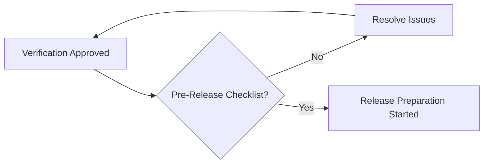
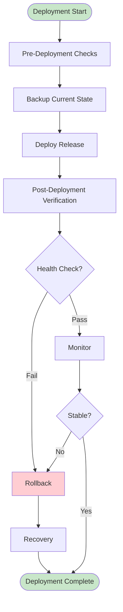
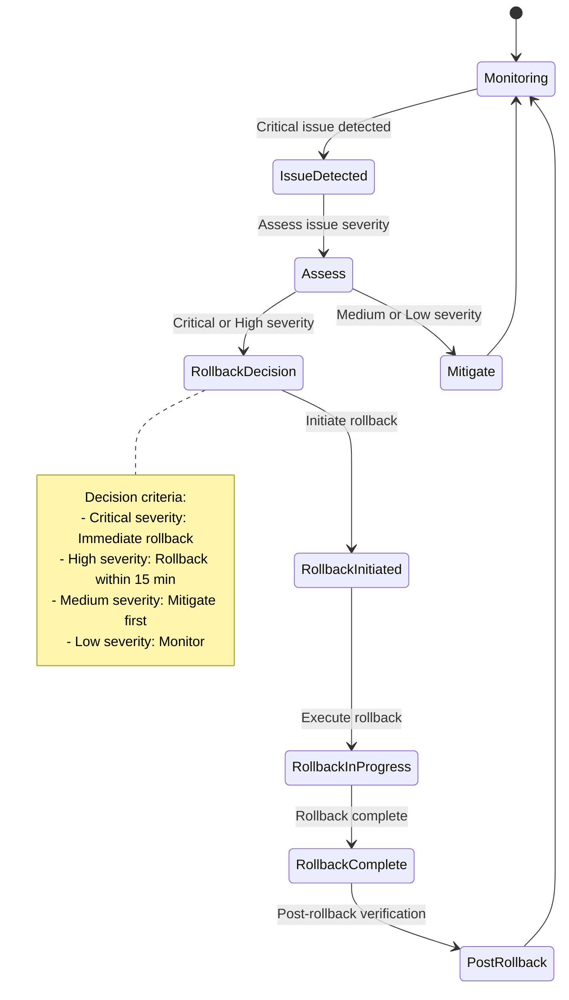

# Release Bootstrap Workflow

**Версия**: 1.0
**Статус**: Draft
**Последнее обновление**: 2026-04-12

---

## Overview

Release Bootstrap Workflow определяет процесс подготовки и выполнения релиза, а также начальной загрузки (bootstrap) платформы. Этот процесс охватывает все этапы от подготовки релиза до post-release верификации.

**Цель**: Гарантировать, что релиз:
- Полностью протестирован и проверен
- Документирован и готов к деплою
- Развернут безопасно и корректно
- Мониторы и observability настроены
- Rollback plan готов и протестирован
- Post-release верификация успешна

**См.**: [Release Approved Gate](../docs/state-machines/approval-gates.md#gate-5-release-approved), [Deployment](../docs/architecture/DEPLOYMENT.md)

---

## Release Preparation

### Pre-Release Checklist

Перед началом подготовки релиза:

**Verification Complete**:
- [ ] Verification approved
- [ ] All quality gates passed
- [ ] All tests passing (100%)
- [ ] No critical findings
- [ ] No high findings

**Artifacts Ready**:
- [ ] Release candidate ready
- [ ] Build artifacts available
- [ ] Documentation complete
- [ ] Test results available
- [ ] Verification report approved

**Stakeholder Approval**:
- [ ] Product Owner approval obtained
- [ ] Platform Architect approval obtained
- [ ] Security Team approval obtained
- [ ] Operations Team approval obtained
- [ ] All stakeholders notified

**Planning**:
- [ ] Release plan created
- [ ] Deployment plan created
- [ ] Rollback plan created
- [ ] Communication plan created
- [ ] Release date scheduled

---

## Release Checklist

### Documentation Checklist

**Release Notes**:
- [ ] Release version defined
- [ ] Release summary created
- [ ] New features listed
- [ ] Bug fixes listed
- [ ] Breaking changes documented
- [ ] Migration guide created (если применимо)
- [ ] Upgrade instructions created (если применимо)

**Documentation**:
- [ ] README updated
- [ ] API documentation updated (если применимо)
- [ ] Architecture documentation updated
- [ ] Deployment documentation updated
- [ ] Troubleshooting guide updated
- [ ] FAQ updated

**Communication**:
- [ ] Release announcement prepared
- [ ] Stakeholders notification plan
- [ ] User communication plan
- [ ] Support team notification
- [ ] Incident response team notification

---

### Testing Checklist

**Pre-Deployment Testing**:
- [ ] Smoke tests passing
- [ ] Integration tests passing (100%)
- [ ] E2E tests passing (100%)
- [ ] Performance tests passing
- [ ] Security tests passing

**Test Coverage**:
- [ ] Unit tests passing (100%)
- [ ] Integration tests passing (100%)
- [ ] E2E tests passing (100%)
- [ ] Security tests passing (100%)
- [ ] Performance tests meeting SLA

**Test Environments**:
- [ ] Staging environment tested
- [ ] Production-like environment tested
- [ ] Test data prepared
- [ ] Test scenarios validated
- [ ] Test results documented

---

### Security Checklist

**Security Verification**:
- [ ] No critical vulnerabilities
- [ ] No high severity vulnerabilities
- [ ] Security scan passed
- [ ] Dependency scan passed
- [ ] Secrets scan passed

**Compliance**:
- [ ] Regulatory requirements met
- [ ] Audit logging configured
- [ ] Data protection verified
- [ ] Access control verified
- [ ] Incident response plan ready

**Security Configuration**:
- [ ] Authentication configured
- [ ] Authorization configured
- [ ] Encryption configured (at rest)
- [ ] Encryption configured (in transit)
- [ ] Security monitoring configured

---

### Performance Checklist

**Performance Testing**:
- [ ] Load testing completed
- [ ] Stress testing completed
- [ ] Performance benchmarking completed
- [ ] Resource usage analyzed
- [ ] Memory leak testing completed

**Performance Targets**:
- [ ] Latency within SLA
- [ ] Throughput within SLA
- [ ] Resource usage within limits
- [ ] No bottlenecks identified
- [ ] No hotspots identified

**Performance Monitoring**:
- [ ] Monitoring configured
- [ ] Alerting configured
- [ ] Dashboards configured
- [ ] SLOs defined
- [ ] SLIs measured

---

## Release Approval Gates

### Gate 1: Release Preparation Complete

**Requirements**:
- [ ] Release candidate ready
- [ ] Release notes complete
- [ ] Documentation complete
- [ ] All stakeholders approved
- [ ] Release plan approved

**Approver**: Build Orchestrator

**См.**: [Release Approved Gate](../docs/state-machines/approval-gates.md#gate-5-release-approved)

---

### Gate 2: Deployment Plan Approved

**Requirements**:
- [ ] Deployment strategy defined
- [ ] Deployment steps documented
- [ ] Rollback plan ready
- [ ] Rollback tested
- [ ] Operations team approved

**Approver**: Build Orchestrator, Operations Team

---

### Gate 3: Pre-Deployment Tests Passed

**Requirements**:
- [ ] Smoke tests passing
- [ ] Integration tests passing (100%)
- [ ] E2E tests passing (100%)
- [ ] Performance tests passing
- [ ] Security tests passing

**Approver**: Test Engineer, Verification Agent

---

### Gate 4: Release Approved

**Requirements**:
- [ ] Release preparation complete
- [ ] Deployment plan approved
- [ ] Pre-deployment tests passed
- [ ] All quality gates passed
- [ ] Final approval obtained

**Approver**: Build Orchestrator

**См.**: [Release Approved Gate](../docs/state-machines/approval-gates.md#gate-5-release-approved)

---

## Release Deployment Steps

### Deployment Strategy

### Step-by-Step Deployment

**Step 1: Pre-Deployment Checks** (5-10 minutes)
1. Verify all systems operational
2. Verify backup available
3. Verify monitoring operational
4. Verify communication channels open
5. Verify rollback plan ready

**Step 2: Backup Current State** (5-15 minutes)
1. Backup configuration
2. Backup data (если применимо)
3. Backup deployment state
4. Document current state
5. Store backup securely

**Step 3: Deploy Release** (10-30 minutes)
1. Deploy to staging (если еще не развернуто)
2. Run smoke tests на staging
3. Deploy to production (blue/green или canary)
4. Verify deployment successful
5. Record deployment metrics

**Step 4: Post-Deployment Verification** (10-20 минут)
1. Run smoke tests на production
2. Run health checks
3. Verify monitoring operational
4. Verify logging operational
5. Verify observability operational

**Step 5: Monitor** (1-2 hours)
1. Monitor for errors
2. Monitor for anomalies
3. Monitor performance
4. Monitor user feedback
5. Monitor system health

**Step 6: Stabilization** (24-48 часов)
1. Continued monitoring
2. Issue resolution
3. Performance optimization (если нужно)
4. Documentation updates (если нужно)
5. Stakeholder communication

---

### Deployment Strategies

**Blue/Green Deployment**:
- Zero downtime deployment
- Immediate rollback capability
- Production-like testing
- Gradual traffic shifting

**Canary Deployment**:
- Gradual rollout
- Risk mitigation
- Early issue detection
- Gradual rollback

**Rolling Deployment**:
- Incremental updates
- Reduced blast radius
- Gradual rollback
- Simple implementation

**Choose strategy based on**:
- System complexity
- Risk tolerance
- Downtime tolerance
- Resource availability

---

## Post-Release Verification

### Verification Activities

**Immediate Verification** (0-30 минут):
1. Health checks
2. Smoke tests
3. Basic functionality tests
4. Error monitoring
5. Performance monitoring

**Short-Term Verification** (1-2 часа):
1. Integration tests
2. E2E tests
3. User scenario tests
4. Performance validation
5. Security validation

**Long-Term Verification** (24-48 часов):
1. Continuous monitoring
2. User feedback collection
3. Performance analysis
4. Error analysis
5. Stability validation

### Verification Checklist

**Health Checks**:
- [ ] All services operational
- [ ] All endpoints responsive
- [ ] All integrations working
- [ ] No critical errors
- [ ] No performance degradation

**Functional Verification**:
- [ ] Basic functionality working
- [ ] User scenarios working
- [ ] Business processes working
- [ ] Data flows correct
- [ ] No regressions

**Performance Verification**:
- [ ] Latency within SLA
- [ ] Throughput within SLA
- [ ] Resource usage normal
- [ ] No bottlenecks
- [ ] No hotspots

**Security Verification**:
- [ ] Authentication working
- [ ] Authorization working
- [ ] No vulnerabilities
- [ ] No security incidents
- [ ] Audit logging operational

---

## Rollback Procedures

### Rollback Triggers

**Critical Issues**:
- System downtime
- Data corruption
- Security breach
- Critical functionality broken

**High Severity Issues**:
- Performance degradation > 50%
- Error rate > 25%
- Data integrity issues
- Major functionality broken

**User Impact**:
- User complaints > threshold
- Revenue impact > threshold
- Compliance violation
- SLA breach

### Rollback Process

### Rollback Steps

**Step 1: Decision** (5 минут)
1. Assess issue severity
2. Assess impact
3. Consult stakeholders
4. Make rollback decision
5. Notify stakeholders

**Step 2: Preparation** (5 минут)
1. Verify backup available
2. Verify rollback steps
3. Prepare communication
4. Prepare monitoring
5. Alert incident response team

**Step 3: Execution** (10-30 минут)
1. Stop new deployments
2. Execute rollback steps
3. Verify rollback successful
4. Restore from backup (если нужно)
5. Restart services (если нужно)

**Step 4: Verification** (10-20 минут)
1. Health checks
2. Smoke tests
3. Integration tests
4. Data integrity checks
5. System health validation

**Step 5: Stabilization** (1-2 часа)
1. Monitor system
2. Resolve issues
3. Communicate with stakeholders
4. Document incident
5. Update processes

---

## Post-Release Activities

### Stabilization Period

**Monitoring** (24-48 часов):
- Continuous monitoring
- Alerting enabled
- On-call standby
- Regular health checks
- Performance monitoring

**Issue Resolution**:
- Quick issue identification
- Rapid response
- Effective resolution
- Documentation
- Process improvement

**Communication**:
- Regular stakeholder updates
- User notifications (если нужно)
- Support team coordination
- Incident communication (если применимо)
- Post-incident analysis (если применимо)

---

### Post-Release Review

**Activities**:
1. Release retrospective
2. Lessons learned
3. Process improvement
4. Documentation update
5. Next release planning

**Review Questions**:
- What went well?
- What didn't go well?
- What can we improve?
- What should we stop doing?
- What should we start doing?

**Output**:
- Release retrospective document
- Lessons learned document
- Process improvements
- Updated documentation
- Next release plan

---

## Bootstrap Process

### Bootstrap Overview

Bootstrap process - это начальная загрузка платформы, которая выполняется один раз при первом развертывании.

**См.**: [Bootstrap Complete Gate](../docs/state-machines/approval-gates.md#gate-1-bootstrap-complete)

---

### Bootstrap Steps

**Step 1: Initialization** (5-10 минут)
1. Initialize repository
2. Create directory structure
3. Initialize configuration
4. Setup CI/CD pipeline
5. Initialize documentation

**Step 2: Dependencies** (10-20 минут)
1. Install dependencies
2. Configure dependencies
3. Verify dependencies
4. Document dependencies
5. Setup dependency management

**Step 3: Configuration** (10-20 минут)
1. Configure environment
2. Configure services
3. Configure monitoring
4. Configure logging
5. Configure security

**Step 4: Deployment** (20-40 минут)
1. Deploy components
2. Configure networking
3. Configure storage
4. Configure authentication
5. Configure authorization

**Step 5: Verification** (10-20 минут)
1. Verify all components running
2. Verify all integrations working
3. Verify monitoring operational
4. Verify logging operational
5. Verify security configured

**Step 6: Finalization** (5-10 минут)
1. Document deployment
2. Archive bootstrap artifacts
3. Notify stakeholders
4. Handoff to operations
5. Bootstrap complete

---

### Bootstrap Checklist

**Initialization**:
- [ ] Repository initialized
- [ ] Directory structure created
- [ ] Configuration initialized
- [ ] CI/CD pipeline configured
- [ ] Documentation initialized

**Dependencies**:
- [ ] Dependencies installed
- [ ] Dependencies configured
- [ ] Dependencies verified
- [ ] Dependencies documented
- [ ] Dependency management setup

**Configuration**:
- [ ] Environment configured
- [ ] Services configured
- [ ] Monitoring configured
- [ ] Logging configured
- [ ] Security configured

**Deployment**:
- [ ] Components deployed
- [ ] Networking configured
- [ ] Storage configured
- [ ] Authentication configured
- [ ] Authorization configured

**Verification**:
- [ ] All components running
- [ ] All integrations working
- [ ] Monitoring operational
- [ ] Logging operational
- [ ] Security configured

---

## Communication Plan

### Pre-Release Communication

**Stakeholders**:
- Notify 1 week before release
- Provide release notes
- Provide timeline
- Provide risk assessment
- Gather feedback

**Operations**:
- Notify 3 days before release
- Provide deployment plan
- Provide rollback plan
- Provide contact information
- Coordinate schedules

**Support**:
- Notify 3 days before release
- Provide release notes
- Provide known issues
- Provide escalation paths
- Prepare resources

---

### During Release Communication

**Status Updates**:
- Every 15-30 минут
- Progress updates
- Issue alerts
- Resolution updates
- Completion notifications

**Channels**:
- Slack channel
- Email updates
- Status page (если применимо)
- Incident response (если применимо)
- Direct contact (если критично)

---

### Post-Release Communication

**Announcements**:
- Release complete announcement
- Release notes published
- Known issues communicated
- Upgrade instructions published
- Support resources available

**Follow-up**:
- User feedback collection
- Issue tracking
- Performance monitoring
- Incident response (если применимо)
- Next release planning

---

## TODO: Release Automation

### Automation Opportunities

- [ ] Automated release preparation
- [ ] Automated testing pipeline
- [ ] Automated deployment
- [ ] Automated rollback
- [ ] Automated monitoring setup
- [ ] Automated notification
- [ ] Automated documentation generation
- [ ] Automated release notes generation
- [ ] Automated rollback testing
- [ ] Automated post-release verification

### CI/CD Integration

- [ ] Integrate with CI/CD pipeline
- [ ] Automate quality gates
- [ ] Automate security scanning
- [ ] Automate performance testing
- [ ] Automate deployment
- [ ] Automate rollback
- [ ] Automate monitoring
- [ ] Automate notification

### Monitoring and Alerting

- [ ] Define release metrics
- [ ] Define release alerts
- [ ] Define rollback alerts
- [ ] Define performance alerts
- [ ] Define security alerts
- [ ] Define custom dashboards
- [ ] Define incident response procedures
- [ ] Define escalation paths

---

## Timeline

### Standard Timeline

**Release Preparation**: 4-8 часов
**Deployment**: 10-30 минут
**Post-Release Verification**: 1-2 часа
**Stabilization Period**: 24-48 часов
**Post-Release Review**: 2-4 часа

**Total**: 28-62 часов (average: 36-48 часов)

### Emergency Timeline

**Release Preparation**: 1-2 часа
**Deployment**: 5-15 минут
**Post-Release Verification**: 30 минут
**Stabilization Period**: 2-4 часа
**Post-Release Review**: 1 час

**Total**: 4-7 часов

### Bootstrap Timeline

**Bootstrap Process**: 1-2 часа (one-time)

---

## Related Documentation

- [Release Approved Gate](../docs/state-machines/approval-gates.md#gate-5-release-approved)
- [Bootstrap Complete Gate](../docs/state-machines/approval-gates.md#gate-1-bootstrap-complete)
- [Build Team Workflow](./build-team-workflow.md)
- [Deployment](../docs/architecture/DEPLOYMENT.md)
- [Security Model](../docs/architecture/SECURITY.md)
- [OBSERVABILITY.md](../docs/architecture/OBSERVABILITY.md)
- [Platform State Machine](../docs/state-machines/platform-state-machine.md)
