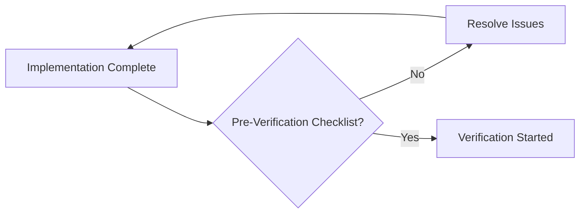
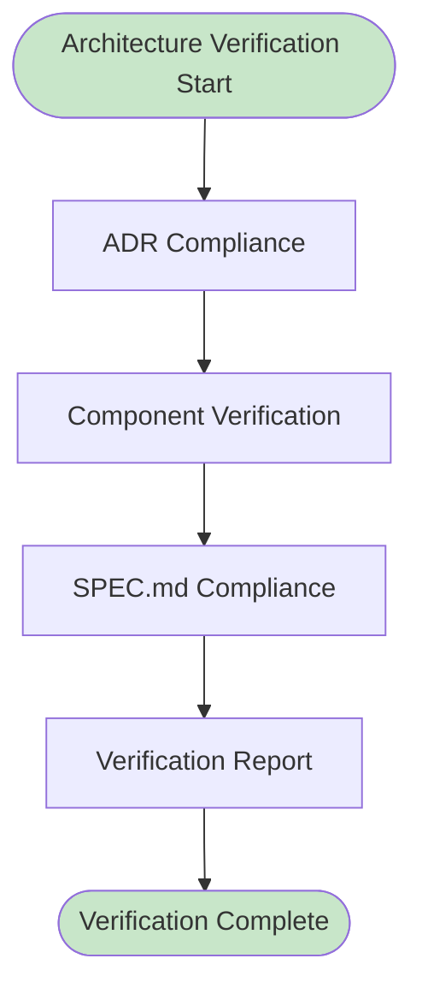
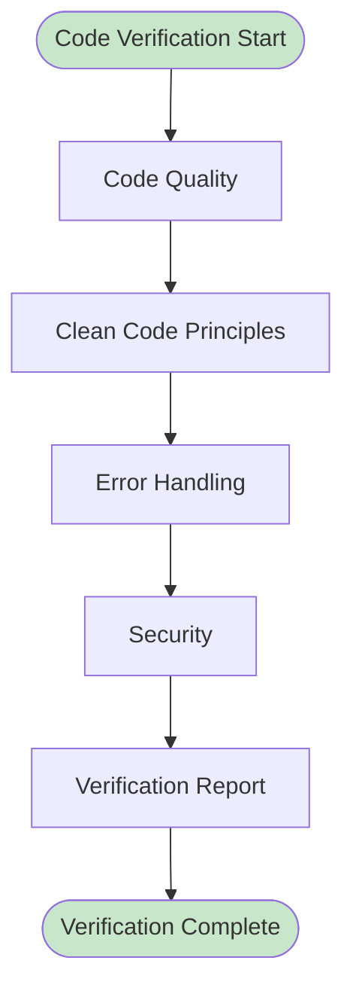
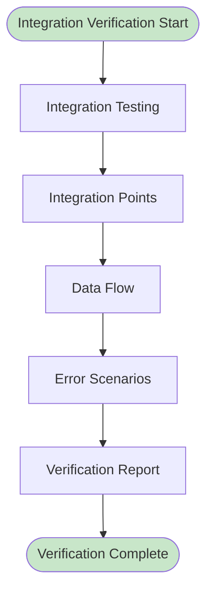
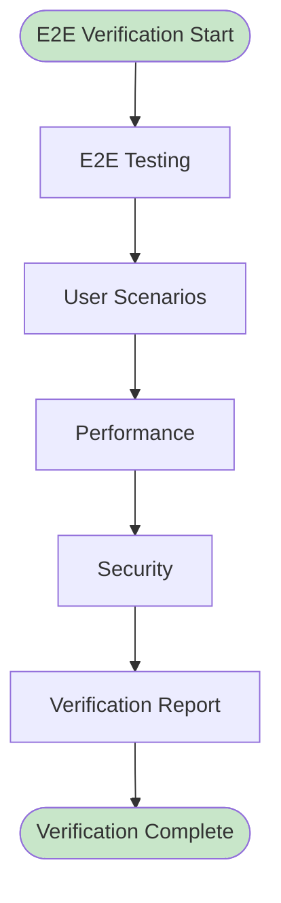

# Verification Workflow

**Версия**: 1.0
**Статус**: Draft
**Последнее обновление**: 2026-04-12

---

## Overview

Verification Workflow определяет процесс проверки качества и соответствия реализации требованиям. Этот процесс охватывает все типы верификации: архитектурная, кодовая, интеграционная, e2e.

**Цель**: Гарантировать, что реализация:
- Соответствует утвержденным ADR
- Соответствует SPEC.md
- Соответствует code standards
- Безопасна и не содержит уязвимостей
- Производительная и соответствует SLA
- Полностью протестирована и документирована

**См.**: [Verification Complete Gate](../docs/state-machines/approval-gates.md#gate-4-verification-complete), [Verification Agent Workflow](../agents/verification-agent/WORKFLOW.md)

---

## Entry Conditions

### Pre-Verification Checklist

Перед началом верификации:

**Implementation Requirements**:
- [ ] Implementation complete
- [ ] Code review approved
- [ ] All tests passing
- [ ] Test coverage > 80%
- [ ] Documentation complete

**Artifacts Ready**:
- [ ] ADR approved and available
- [ ] Implementation code available
- [ ] Test code available
- [ ] Test results available
- [ ] Documentation available

**CI/CD Status**:
- [ ] CI/CD pipeline passing
- [ ] Build successful
- [ ] Unit tests passing
- [ ] Integration tests passing
- [ ] Code quality checks passing

**Verification Readiness**:
- [ ] Verification Agent available
- [ ] Verification plan created
- [ ] Verification environment ready
- [ ] Verification tools available
- [ ] Verification criteria defined



---

## Verification Types

### Type 1: Architecture Verification

**Purpose**: Проверить соответствие архитектуры ADR

**Responsibility**: Verification Agent

**Activities**:

1. **ADR Compliance**:
   - Проверить что все ADR requirements реализованы
   - Проверить что architecture patterns применены
   - Проверить что design patterns соблюдены
   - Проверить что layers separation соблюдена
   - Проверить что dependencies правильные

2. **Component Verification**:
   - Проверить что все components реализованы
   - Проверить что interfaces соблюдены
   - Проверить что contracts соблюдены
   - Проверить что integration points корректны
   - Проверить что data flows корректны

3. **SPEC.md Compliance**:
   - Проверить что SPEC.md requirements реализованы
   - Проверить что constraints соблюдены
   - Проверить что non-functional requirements выполнены
   - Проверить что security requirements соблюдены
   - Проверить что performance requirements соблюдены

**Checklist**:
- [ ] All ADR requirements implemented
- [ ] Architecture patterns applied
- [ ] Design patterns followed
- [ ] Layers separation maintained
- [ ] Dependencies correct
- [ ] Components implemented
- [ ] Interfaces respected
- [ ] Contracts honored
- [ ] SPEC.md requirements met
- [ ] Non-functional requirements met

**Output**:
- Architecture verification report
- Findings (if any)
- Recommendations (if any)



---

### Type 2: Code Verification

**Purpose**: Проверить качество кода и соответствие стандартам

**Responsibility**: Verification Agent

**Activities**:

1. **Code Quality**:
   - Проверить PEP 8 compliance
   - Проверить type hints completeness
   - Проверить docstrings completeness
   - Проверить code readability
   - Проверить code maintainability

2. **Clean Code Principles**:
   - Проверить DRY (Don't Repeat Yourself)
   - Проверить SRP (Single Responsibility Principle)
   - Проверить SOLID principles
   - Проверить KISS (Keep It Simple, Stupid)
   - Проверить YAGNI (You Aren't Gonna Need It)

3. **Error Handling**:
   - Проверить что все errors обработаны
   - Проверить что custom exceptions определены
   - Проверить что error messages информативны
   - Проверить что errors логируются
   - Проверить что error recovery реализован

4. **Security**:
   - Проверить input validation
   - Проверить output encoding
   - Проверить SQL injection prevention
   - Проверить XSS prevention (если применимо)
   - Проверить что нет hardcoded secrets

**Checklist**:
- [ ] PEP 8 compliant
- [ ] Type hints complete
- [ ] Docstrings complete
- [ ] Code readable
- [ ] Code maintainable
- [ ] DRY followed
- [ ] SRP followed
- [ ] SOLID followed
- [ ] Error handling complete
- [ ] Security verified

**Output**:
- Code verification report
- Findings (if any)
- Recommendations (if any)



---

### Type 3: Integration Verification

**Purpose**: Проверить интеграцию между компонентами

**Responsibility**: Verification Agent, Test Engineer

**Activities**:

1. **Integration Testing**:
   - Выполнить integration tests
   - Проверить что все integration tests passing
   - Проверить что нет data corruption
   - Проверить что нет race conditions
   - Проверить что performance within SLA

2. **Integration Points**:
   - Проверить все integration points
   - Проверить что APIs работают корректно
   - Проверить что database operations корректны
   - Проверить что external services работают корректно
   - Проверить что message passing корректен

3. **Data Flow**:
   - Проверить что data flows корректны
   - Проверить что нет data loss
   - Проверить что нет data corruption
   - Проверить что data consistency соблюдена
   - Проверить что data integrity соблюдена

4. **Error Scenarios**:
   - Проверить error handling в integration points
   - Проверить graceful degradation
   - Проверить recovery mechanisms
   - Проверить retry logic
   - Проверить circuit breakers (если применимо)

**Checklist**:
- [ ] Integration tests passing (100%)
- [ ] Integration points verified
- [ ] Data flows correct
- [ ] No data corruption
- [ ] No race conditions
- [ ] Performance within SLA
- [ ] Error handling verified
- [ ] Recovery mechanisms verified

**Output**:
- Integration verification report
- Test results
- Findings (if any)
- Recommendations (if any)



---

### Type 4: E2E Verification

**Purpose**: Проверить полный поток от начала до конца

**Responsibility**: Verification Agent, Test Engineer

**Activities**:

1. **E2E Testing**:
   - Выполнить E2E tests
   - Проверить что все E2E scenarios работают
   - Проверить что user journeys работают
   - Проверить что business processes работают
   - Проверить что data flows end-to-end

2. **User Scenarios**:
   - Проверить все user scenarios
   - Проверить что user requirements выполнены
   - Проверить что acceptance criteria выполнены
   - Проверить что edge cases обработаны
   - Проверить что error scenarios обработаны

3. **Performance**:
   - Выполнить performance tests
   - Проверить что latency within SLA
   - Проверить что throughput within SLA
   - Проверить что resource usage within limits
   - Проверить что нет memory leaks

4. **Security**:
   - Выполнить security tests
   - Проверить что нет vulnerabilities
   - Проверить что authorization работает
   - Проверить что authentication работает
   - Проверить что audit logging работает

**Checklist**:
- [ ] E2E tests passing (100%)
- [ ] User scenarios verified
- [ ] Business processes verified
- [ ] Performance within SLA
- [ ] No vulnerabilities
- [ ] Authentication verified
- [ ] Authorization verified
- [ ] Audit logging verified

**Output**:
- E2E verification report
- Test results
- Findings (if any)
- Recommendations (if any)



---

## Verification Tools and Techniques

### Automated Tools

**Code Quality Tools**:
- **Linter**: flake8, pylint, mypy
- **Formatter**: black, isort
- **Type Checker**: mypy
- **Complexity Analyzer**: radon, mccabe

**Testing Tools**:
- **Unit Testing**: pytest, unittest
- **Integration Testing**: pytest, testcontainers
- **E2E Testing**: pytest, selenium, playwright
- **Mocking**: unittest.mock, pytest-mock

**Security Tools**:
- **Vulnerability Scanning**: bandit, safety
- **Dependency Scanning**: pip-audit, snyk
- **Secret Scanning**: truffleHog, gitleaks
- **Static Analysis**: semgrep, sonarqube

**Performance Tools**:
- **Load Testing**: locust, k6
- **Profiling**: cProfile, py-spy
- **Monitoring**: prometheus, grafana
- **APM**: datadog, new relic

### Manual Techniques

**Code Review**:
- Manual review по checklist
- Peer review
- Architect review (если применимо)
- Security review (если применимо)

**Testing**:
- Exploratory testing
- Ad-hoc testing
- Manual testing для edge cases
- UAT (User Acceptance Testing)

**Documentation Review**:
- Manual review документации
- Validation примеров
- Validation templates
- Validation accuracy

---

## Issue Reporting and Tracking

### Issue Classification

**Critical**:
- Security vulnerability
- Data loss potential
- System crash potential
- Regulatory compliance violation

**High**:
- Significant functionality missing
- Major performance degradation
- Data corruption potential
- Major security issue

**Medium**:
- Minor functionality missing
- Moderate performance degradation
- Minor data integrity issue
- Minor security issue

**Low**:
- Cosmetic issue
- Documentation issue
- Minor improvement opportunity
- Nitpick

### Issue Reporting Format

```
## Issue: [Title]

**Severity**: [Critical/High/Medium/Low]
**Type**: [Architecture/Code/Integration/E2E/Security/Performance]
**Location**: [File:Line or Component]
**ADR**: ADR-XXX (if applicable)
**Found By**: [Verification Agent or Test Engineer]
**Date**: [Date]

**Description**:
[Detailed description of the issue]

**Evidence**:
[Code snippets, test results, screenshots, etc.]

**Impact**:
[How this issue affects the system]

**Reproduction**:
[Steps to reproduce, if applicable]

**Suggestion**:
[Suggested fix or approach]

**Priority**: [P0/P1/P2/P3]
**Assignee**: [Name or TBA]
**Deadline**: [Date]
```

### Issue Tracking

**Tracking System**:
- Linear (или другой issue tracker)
- Labels: severity, type, verification-status
- Priority assignment
- Owner assignment
- Deadline tracking

**Workflow**:
```
Open → In Progress → Fixed → Verified → Closed
                     ↓
                   Blocked → Escalated
```

---

## Verification Approval Criteria

### Overall Approval

**Approval Requirements**:
- [ ] All verification types completed
- [ ] All critical findings resolved
- [ ] All high findings resolved
- [ ] Medium findings documented
- [ ] Quality gates passed
- [ ] All tests passing (100%)
- [ ] No critical vulnerabilities
- [ ] Performance within SLA

**См.**: [Verification Complete Gate](../docs/state-machines/approval-gates.md#gate-4-verification-complete)

---

### Type-Specific Approval

**Architecture Verification**:
- [ ] All ADR requirements implemented
- [ ] Architecture patterns applied
- [ ] SPEC.md compliance verified
- [ ] No architecture gaps identified

**Code Verification**:
- [ ] Code quality standards met
- [ ] Clean code principles followed
- [ ] Error handling complete
- [ ] Security verified

**Integration Verification**:
- [ ] Integration tests passing (100%)
- [ ] Integration points verified
- [ ] Data flows correct
- [ ] Error scenarios verified

**E2E Verification**:
- [ ] E2E tests passing (100%)
- [ ] User scenarios verified
- [ ] Performance within SLA
- [ ] No vulnerabilities

---

### Quality Gates

**Code Quality Gate**:
- [ ] Code coverage > 90%
- [ ] No critical warnings
- [ ] All linting checks pass
- [ ] No security vulnerabilities
- [ ] Code complexity within limits

**Security Gate**:
- [ ] No critical vulnerabilities
- [ ] All security tests pass
- [ ] Compliance requirements met
- [ ] Security review completed
- [ ] Penetration testing passed

**Performance Gate**:
- [ ] Response time < threshold
- [ ] Throughput meets requirements
- [ ] Resource usage within limits
- [ ] No memory leaks
- [ ] Scalability verified

**Documentation Gate**:
- [ ] All docstrings complete
- [ ] All public APIs documented
- [ ] Examples provided
- [ ] README updated
- [ ] No outdated documentation

---

## Handoff to Release

### Handoff Package

**Required Artifacts**:
- Verification report (approved)
- Test results (all passing)
- Security audit report
- Performance test results
- Documentation review report
- Issue tracking report

### Handoff Message

```
## Handoff: Verification Complete

**ADR**: ADR-XXX: [Title]
**Agent**: Verification Agent
**Date**: [Date]

**Architecture Verification**:
- [ ] ADR requirements implemented ✅
- [ ] Architecture patterns applied ✅
- [ ] SPEC.md compliance verified ✅
- [ ] No architecture gaps ✅

**Code Verification**:
- [ ] Code quality standards met ✅
- [ ] Clean code principles followed ✅
- [ ] Error handling complete ✅
- [ ] Security verified ✅

**Integration Verification**:
- [ ] Integration tests passing (100%) ✅
- [ ] Integration points verified ✅
- [ ] Data flows correct ✅
- [ ] Error scenarios verified ✅

**E2E Verification**:
- [ ] E2E tests passing (100%) ✅
- [ ] User scenarios verified ✅
- [ ] Performance within SLA ✅
- [ ] No vulnerabilities ✅

**Quality Gates**:
- [ ] Code quality gate passed ✅
- [ ] Security gate passed ✅
- [ ] Performance gate passed ✅
- [ ] Documentation gate passed ✅

**Artifacts**:
- Verification report: [link]
- Test results: [link]
- Security audit: [link]
- Performance results: [link]
- Issue tracking: [link]

**Findings**:
- Critical: 0
- High: 0
- Medium: X
- Low: Y

**Next**: Release by Build Orchestrator
```

---

## Timeline

### Standard Timeline

**Architecture Verification**: 2-4 hours
**Code Verification**: 2-4 hours
**Integration Verification**: 4-8 hours
**E2E Verification**: 4-8 hours
**Reporting**: 1-2 hours

**Total**: 13-26 hours (average: 18-20 hours)

### Expedited Timeline

**Architecture Verification**: 1 hour
**Code Verification**: 1 hour
**Integration Verification**: 2-3 hours
**E2E Verification**: 2-3 hours
**Reporting**: 30 minutes

**Total**: 6-8 hours (emergency/critical)

---

## TODO: Verification Test Cases

### Architecture Test Cases

- [ ] Add detailed architecture test cases
- [ ] Add ADR compliance test cases
- [ ] Add SPEC.md compliance test cases
- [ ] Add component interaction test cases
- [ ] Add data flow test cases

### Code Test Cases

- [ ] Add detailed code quality test cases
- [ ] Add PEP 8 compliance test cases
- [ ] Add type hint test cases
- [ ] Add error handling test cases
- [ ] Add security test cases

### Integration Test Cases

- [ ] Add detailed integration test cases
- [ ] Add API integration test cases
- [ ] Add database integration test cases
- [ ] Add external service test cases
- [ ] Add message passing test cases

### E2E Test Cases

- [ ] Add detailed E2E test cases
- [ ] Add user scenario test cases
- [ ] Add business process test cases
- [ ] Add performance test cases
- [ ] Add security test cases

---

## Related Documentation

- [Verification Complete Gate](../docs/state-machines/approval-gates.md#gate-4-verification-complete)
- [Build Team Workflow](./build-team-workflow.md)
- [Verification Agent Workflow](../agents/verification-agent/WORKFLOW.md)
- [Implementation Workflow](./implementation-workflow.md)
- [Architecture Review Workflow](./architecture-review-workflow.md)
- [Release Bootstrap Workflow](./release-bootstrap-workflow.md)
- [Security Model](../docs/architecture/SECURITY.md)
- [OBSERVABILITY.md](../docs/architecture/OBSERVABILITY.md)
